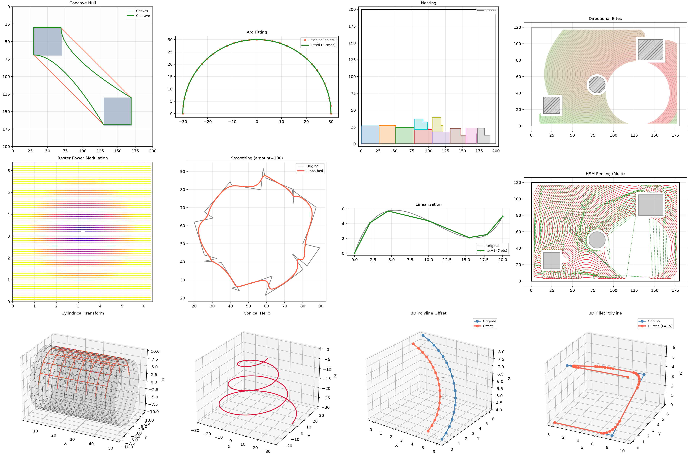

# raygeo

[](https://pypi.org/project/raygeo/)
[](https://github.com/barebaric/raygeo/actions/workflows/ci.yml)

A high-performance 2D/3D geometry library for Python, built in Rust with PyO3.

raygeo provides vector path construction, polygon boolean operations, curve
fitting, path transformations, and geometric queries — all backed by a native
Rust extension.



*Concave hull, arc fitting, nesting, directional bites, raster power modulation, smoothing, linearization, HSM peeling, cylindrical transform, conical helix, 3D polyline offset, and 3D fillet polyline*

## Installation

```
pip install raygeo
```

Requires Python 3.10+ and a compatible platform (Linux, Windows, macOS Intel,
or macOS Apple Silicon). Pre-compiled wheels are available on
[PyPI](https://pypi.org/project/raygeo/).

## Quick Start

### Building Paths

The `Geometry` class is the core abstraction. It stores a vector path as a
sequence of move, line, arc, and cubic Bezier commands. All mutating methods
return `self` for chaining:

```python
from raygeo.geo import Geometry

# Create a 10x10 square
g = Geometry()
g.move_to(0, 0)
g.line_to(10, 0)
g.line_to(10, 10)
g.line_to(0, 10)
g.close_path()

print(g.area())    # 100.0
print(g.rect())    # (0.0, 0.0, 10.0, 10.0)
print(g.is_closed())  # True
```

Builder methods can be chained:

```python
g = Geometry()
g.move_to(0, 0).line_to(10, 0).line_to(10, 10).line_to(0, 10).close_path()
```

You can also create paths from point lists:

```python
triangle = Geometry.from_points([(0, 0), (10, 0), (5, 8.66)])
```

### Arcs and Bezier Curves

```python
g = Geometry()
g.move_to(0, 0)
g.arc_to(10, 0, i=5, j=0, clockwise=False)  # semicircular arc
g.close_path()

# Bezier curves
g2 = Geometry()
g2.move_to(0, 0)
g2.bezier_to(10, 0, c1x=3, c1y=5, c2x=7, c2y=5)

# Convert arcs to Bezier curves (for non-uniform scaling)
g3 = Geometry()
g3.move_to(0, 0)
g3.arc_to_as_bezier(10, 0, i=5, j=0)
g3.upgrade_to_scalable()
```

### Path Analysis

```python
print(g.distance())       # total path length
print(g.area())           # signed enclosed area
print(g.rect())           # bounding box (x_min, y_min, x_max, y_max)
print(g.is_closed())      # path closure check
print(g.segments())       # split into sub-paths

# Find closest point on path
result = g.find_closest_point(5, 5)  # (segment_index, t, (x, y)) or None

# Point and tangent at parameter t on a segment
point = g.get_point_at(segment_index=0, t=0.5)
tangent = g.get_tangent_at(segment_index=0, t=0.5)
```

### Transformations

All transformation methods mutate the geometry in place and return `self`,
allowing chaining. Use `.copy()` first if you need to preserve the original:

```python
import numpy as np
from raygeo.geo import Geometry

g = Geometry.from_points([(0, 0), (10, 0), (10, 10), (0, 10)])

# Offset (grow/shrink) — mutates in place
g.grow(1.0)   # offset outward by 1 unit (each side moves by the amount)
print(g.area())  # 144.0 — 12×12

# Use .copy() to preserve the original
original = Geometry.from_points([(0, 0), (10, 0), (10, 10), (0, 10)])
shrunk = original.copy()
shrunk.grow(-1.0)  # offset inward by 1 unit

# Affine transform (4x4 matrix) — mutates in place
matrix = [
    [1, 0, 0, 5],  # translate x by 5
    [0, 1, 0, 3],  # translate y by 3
    [0, 0, 1, 0],
    [0, 0, 0, 1],
]
g.transform(matrix)

# Map geometry into a frame — mutates in place
g.map_to_frame(
    origin=(0, 0),
    p_width=(100, 0),
    p_height=(0, 100),
)

g.flip_x()  # negate all x coordinates
g.flip_y()  # negate all y coordinates

# Chaining is possible since all methods return self
g2 = Geometry.from_points([(0, 0), (10, 0), (10, 10), (0, 10)])
g2.transform(matrix).flip_x().grow(1.0)
```

### Contour Operations

All contour methods mutate the geometry in place and return `self`:

```python
# Split into separate closed contours (returns list, does not mutate)
contours = g.split_into_contours()

# Split into disconnected components (returns list, does not mutate)
components = g.split_into_components()

# Separate holes from solids (returns tuple, does not mutate)
inner, outer = g.split_inner_and_outer_contours()

# Normalize winding orders — mutates in place
g.normalize_winding_orders()

# Filter to only external contours — mutates in place
g.filter_to_external_contours()

# Remove shared edges between sub-paths — mutates in place
g.remove_inner_edges()
```

### Polygon Operations

The `geo.shape.polygon` submodule provides polygon-specific operations powered by Clipper2:

```python
from raygeo.geo import Geometry
from raygeo.geo.shape.polygon import (
    get_polygon_area,
    get_polygon_bounds,
    offset_polygon,
    get_polygons_union,
    get_polygons_intersection,
    get_polygons_difference,
    is_point_inside_polygon,
    polygons_intersect,
    get_polygon_convex_hull,
)

square = [(0, 0), (10, 0), (10, 10), (0, 10)]
circle_approx = [(5 + 5 * math.cos(a), 5 + 5 * math.sin(a))
                 for a in [i * math.pi / 20 for i in range(40)]]

get_polygon_area(square)                # 100.0
get_polygon_bounds(square)              # (0.0, 0.0, 10.0, 10.0)
is_point_inside_polygon((5, 5), square) # True

# Boolean operations
union = get_polygons_union([square, circle_approx])
intersection = get_polygons_intersection(square, circle_approx)
difference = get_polygons_difference(square, circle_approx)

# Offset
inflated = offset_polygon(square, 2.0)

# NumPy variants are also available (suffixed with _numpy)
import numpy as np
sq_np = np.array(square)
get_polygon_area(sq_np)  # also works with numpy arrays
```

### Curve Fitting

All fitting methods mutate the geometry in place and return `self`:

```python
from raygeo.geo import Geometry

# Simplify a path
g.simplify(tolerance=0.1)

# Convert curves to line segments
g.linearize(tolerance=0.01)

# Fit arcs and beziers to linear data
g.fit_arcs(tolerance=0.5)
g.fit_curves(tolerance=0.5, beziers=True, arcs=True)

# Convert geometry to polygons (returns list, does not mutate)
polygons = g.to_polygons(tolerance=0.01)
```

### Self-Intersection Detection

```python
g.has_self_intersections()          # check for self-intersections
g.intersects_with(other_geometry)   # check intersection with another geometry
g.encloses(other_geometry)          # check if this fully encloses another
```

### Serialization

```python
# Serialize to dict (JSON-safe)
data = g.to_dict()

# Deserialize from dict
g2 = Geometry.from_dict(data)

# Pickle support (via __reduce_ex__)
import pickle
g3 = pickle.loads(pickle.dumps(g))
```

## Documentation

Full API reference documentation is generated from the source type stubs.
Run `make docs` to build it locally — this produces Markdown pages in
`docs/api/` with inline visual examples.

The docs are also published online with the
[RayForge Developer Docs](https://rayforge.org/docs/developer/raygeo-api/raygeo).

## Development

### Prerequisites

- [Rust toolchain](https://rustup.rs) (latest stable)
- Python 3.10+
- [maturin](https://www.maturin.rs) (`pip install maturin`)
- Node.js (only needed for `make lint-python`, which runs pyright via npx)

### Quick Start

```bash
# Create and activate a virtual environment (Unix)
python -m venv .venv
source .venv/bin/activate   # on Windows: .venv\Scripts\activate

# Install build tool and build the extension
pip install maturin pytest
make dev                   # builds Rust extension and installs into venv

# Run tests
make test

# Full check (lint + test)
make check
```

### Available Make Targets

| Target        | Description                                |
| ------------- | ------------------------------------------ |
| `make dev`    | Build and install into the active venv     |
| `make build`  | Build release wheel to `dist/`             |
| `make test`   | Run pytest                                 |
| `make lint`   | Lint Rust + Python (including pyright)     |
| `make format` | Auto-format Rust + Python                  |
| `make check`  | Lint + test                                |
| `make stubs`  | Regenerate `.pyi` type stubs               |
| `make docs`   | Build API docs with inline visual examples |
| `make visual` | Launch Streamlit visual test playground    |

### Visual Testing

The `make visual` target launches an interactive Streamlit playground
with real-time plots for geometry construction, polygon booleans, curve
fitting, image processing, SVG parsing, tab operations, overscan, lead-
in/out, merging, rasterization, concave hull, and nesting.

```bash
pip install -e ".[visual]"
make visual
```

See [Visual Testing](visual-testing.md) for a full walkthrough of every
page and its controls.

## License

MIT
