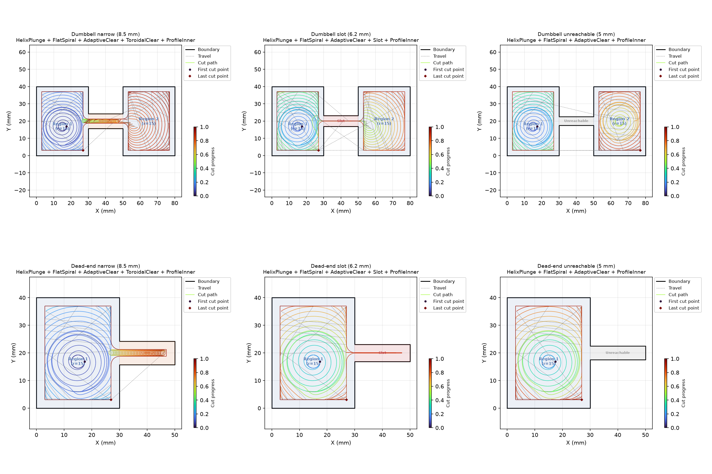

## Functions

### `build_clearing_workplan()`

```python
build_clearing_workplan(
    pocket_boundary: Sequence[tuple[float, float]],
    islands: Sequence[Sequence[tuple[float, float]]] | None = None,
    tool_radius: float = 3,
    step_over: float = 2,
    step_length: float = 0.6,
    target_z: float = -5,
    safe_z: float = 2,
    wall_margin: float = 0,
    safe_margin: float = 1,
    stock_to_leave: float = 0,
    plunge_pitch: float = 1,
    angular_step: float = 0.1,
    area_tolerance: float = 1,
    max_deflection_deg: float = 30,
    finishing: bool = False,
) -> list[dict]
```

Build a clearing workplan for the given pocket.

Produces entry steps for the largest wide region, an AdaptiveClear step covering the whole pocket,
narrow-passage-specific steps (ToroidalClear or Slot) for each classified passage, and an optional
ProfileInner finishing pass.

Combine with **raygeo.cnc.machining.plan.Workplan** to turn the steps into a toolpath.

| Parameter            | Type                                                         | Description                                                   |
| -------------------- | ------------------------------------------------------------ | ------------------------------------------------------------- |
| `pocket_boundary`    | `Sequence[tuple[float, float]]`                              | Outer boundary as [(x, y), ...].                              |
| `islands`            | `Sequence[Sequence[tuple[float, float]]] &#124; None = None` | List of island polygons (default None).                       |
| `tool_radius`        | `float = 3`                                                  | Tool radius in mm (default 3.0).                              |
| `step_over`          | `float = 2`                                                  | Radial step-over (default 2.0).                               |
| `step_length`        | `float = 0.6`                                                | Forward step length (default 0.6).                            |
| `target_z`           | `float = -5`                                                 | Target cutting depth (default -5.0).                          |
| `safe_z`             | `float = 2`                                                  | Safe Z height (default 2.0).                                  |
| `wall_margin`        | `float = 0`                                                  | Wall margin (default 0.0).                                    |
| `safe_margin`        | `float = 1`                                                  | Safety margin from tool edge (default 1.0).                   |
| `stock_to_leave`     | `float = 0`                                                  | Stock to leave for finishing (default 0.0).                   |
| `plunge_pitch`       | `float = 1`                                                  | Helix pitch per revolution (default 1.0).                     |
| `angular_step`       | `float = 0.1`                                                | Angular step in radians (default 0.1).                        |
| `area_tolerance`     | `float = 1`                                                  | Convergence area tolerance (default 1.0).                     |
| `max_deflection_deg` | `float = 30`                                                 | Max deflection per step in degrees (default 30.0).            |
| `finishing`          | `bool = False`                                               | Whether to add a ProfileInner finishing pass (default False). |
| _Returns_            | `list[dict]`                                                 | List of WorkplanStep dicts with a "kind" key.                 |



*Clearing workplan: narrow passage (ToroidalClear), slot (Slot), dual-entry dumbbell (Unreachable).*
