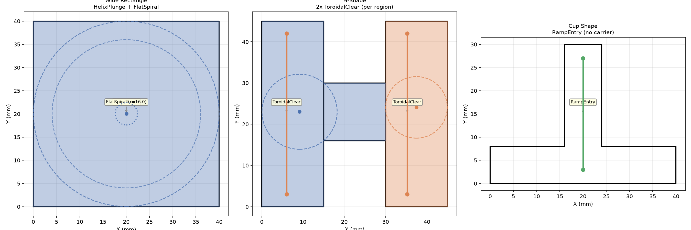

## Functions

### `build_entry_workplan()`

```python
build_entry_workplan(
    pocket_boundary: Sequence[tuple[float, float]],
    islands: Sequence[Sequence[tuple[float, float]]] | None = None,
    tool_radius: float = 3,
    step_over: float = 2,
    safe_z: float = 2,
    target_z: float = -5,
    plunge_pitch: float = 1,
    safe_margin: float = 1,
    angular_step: float = 0.1,
) -> list[dict]
```

Build an entry workplan for a pocket.

Uses feature detection to determine the best entry strategy per disconnected wide sub-region:
helix+spiral (if r_max >= 2xD), toroidal ramp (if find_ramp_carrier succeeds), or zigzag ramp (last
resort).

| Parameter         | Type                                                         | Description                                   |
| ----------------- | ------------------------------------------------------------ | --------------------------------------------- |
| `pocket_boundary` | `Sequence[tuple[float, float]]`                              | Outer boundary as [(x, y), ...].              |
| `islands`         | `Sequence[Sequence[tuple[float, float]]] &#124; None = None` | List of island polygons (default None).       |
| `tool_radius`     | `float = 3`                                                  | Tool radius in mm (default 3.0).              |
| `step_over`       | `float = 2`                                                  | Radial step-over (default 2.0).               |
| `safe_z`          | `float = 2`                                                  | Safe Z height (default 2.0).                  |
| `target_z`        | `float = -5`                                                 | Target cutting depth (default -5.0).          |
| `plunge_pitch`    | `float = 1`                                                  | Helix pitch per revolution (default 1.0).     |
| `safe_margin`     | `float = 1`                                                  | Safety margin from tool edge (default 1.0).   |
| `angular_step`    | `float = 0.1`                                                | Angular step in radians (default 0.1).        |
| _Returns_         | `list[dict]`                                                 | List of WorkplanStep dicts with a "kind" key. |



*Entry workplan for 3 shapes: rectangle (Helix+FlatSpiral), H-shape (ToroidalClear), cup
(RampEntry).*
