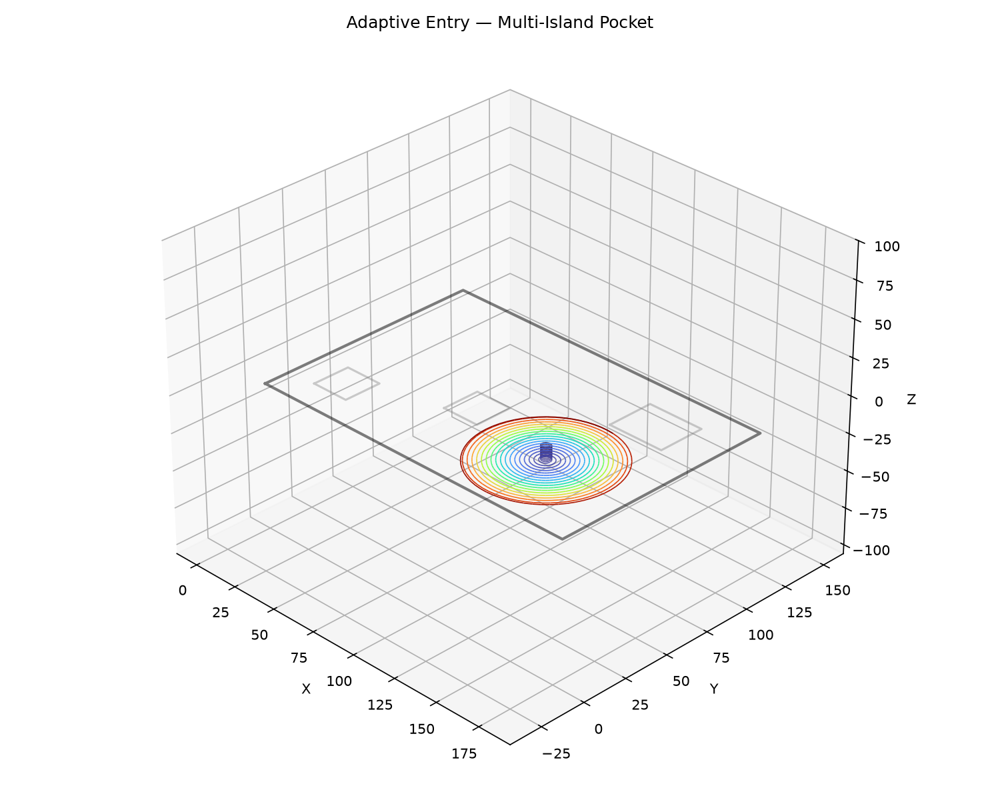
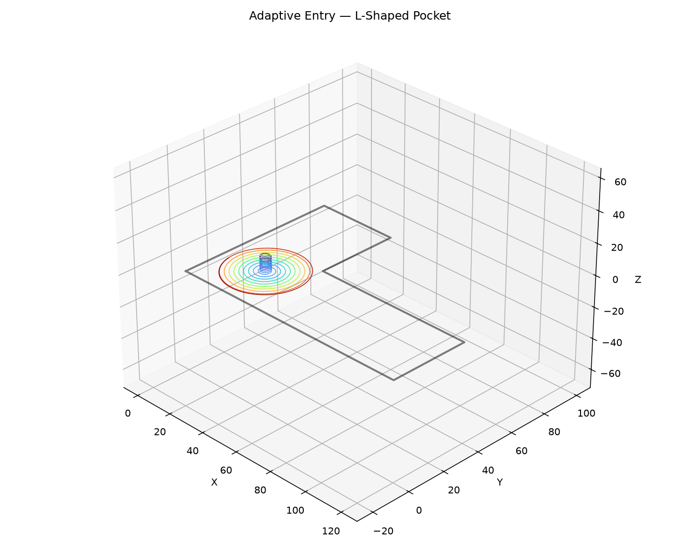
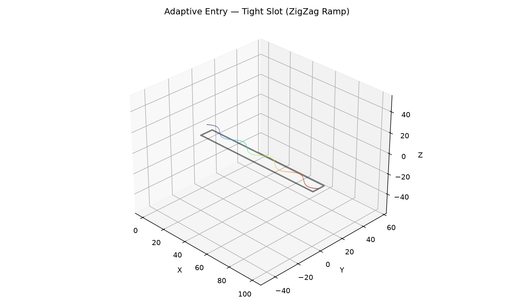
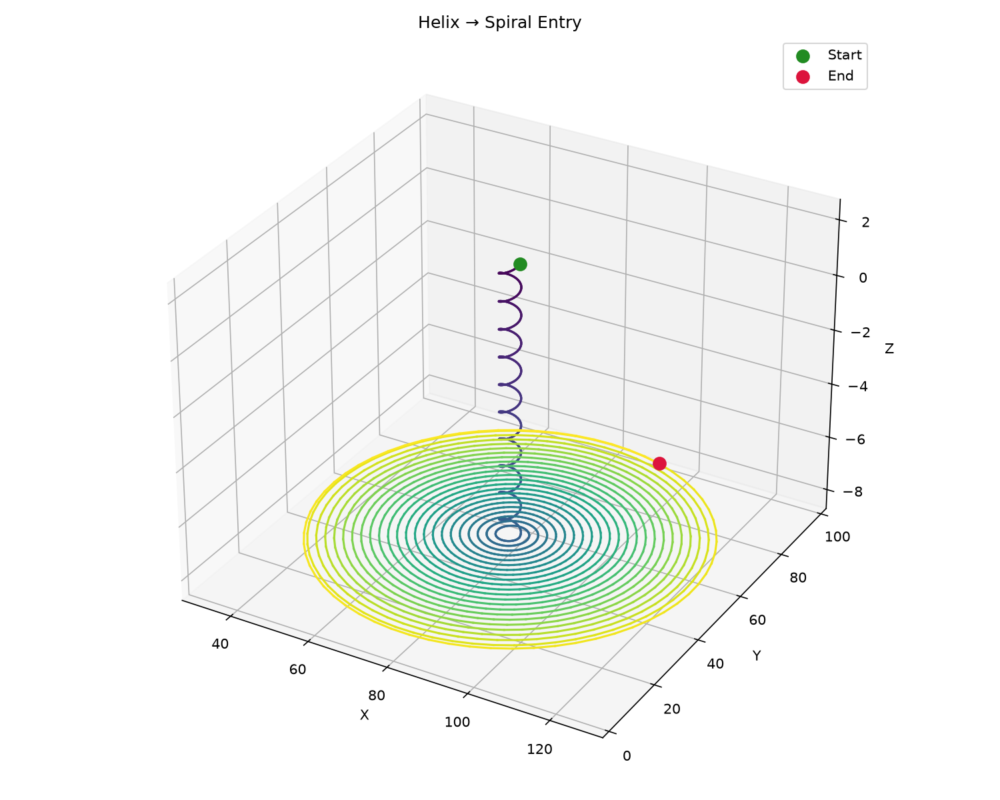

## Functions

### `adaptive_entry()`

```python
adaptive_entry(
    pocket_boundary: Sequence[tuple[float, float]],
    islands: Sequence[Sequence[tuple[float, float]]] = [],
    tool_radius: float = 3,
    step_over: float = 2,
    safe_z: float = 2,
    target_z: float = -5,
    plunge_pitch: float = 1,
    safe_margin: float = 1,
    angular_step: float = 0.1,
    cut_feed_rate: int = 1200,
    cut_power: float = 1,
) -> ops.assembly.result.AssemblyResult
```

Fast central clearing entry.

Finds the optimal entry pole using `find_largest_circle`, then generates either a helix->spiral
(wide area) or zigzag ramp (tight slot).

| Parameter         | Type                                           | Description                                              |
| ----------------- | ---------------------------------------------- | -------------------------------------------------------- |
| `pocket_boundary` | `Sequence[tuple[float, float]]`                | Outer boundary of the pocket.                            |
| `islands`         | `Sequence[Sequence[tuple[float, float]]] = []` | List of island (hole) polygons (default []).             |
| `tool_radius`     | `float = 3`                                    | Tool radius in mm (default 3.0).                         |
| `step_over`       | `float = 2`                                    | Radial step-over per spiral revolution (default 2.0).    |
| `safe_z`          | `float = 2`                                    | Safe (retract) Z height (default 2.0).                   |
| `target_z`        | `float = -5`                                   | Target cutting depth (default -5.0).                     |
| `plunge_pitch`    | `float = 1`                                    | Vertical descent per helix revolution (default 1.0).     |
| `safe_margin`     | `float = 1`                                    | Extra margin from tool edge to boundary (default 1.0).   |
| `angular_step`    | `float = 0.1`                                  | Angular step in radians for path vertices (default 0.1). |
| `cut_feed_rate`   | `int = 1200`                                   | Feed rate for the entry path (default 1200).             |
| `cut_power`       | `float = 1`                                    | Laser power for the entry path (0.0-1.0, default 1.0).   |
| _Returns_         | `ops.assembly.result.AssemblyResult`           | An **AssemblyResult** with the entry toolpath.           |



*Adaptive clearing — Helix → Spiral in a pocket with three islands*



*Adaptive clearing — Helix → Spiral in an L-shaped pocket*



*Adaptive clearing — ZigZag Ramp in a tight slot*

### `detect_entry_method()`

```python
detect_entry_method(
    r_max: float,
    tool_radius: float,
    safe_margin: float = 0,
) -> str
```

Classify a pocket by its largest inscribed circle radius.

Returns `"helix_spiral"`, `"toroid"`, `"ramp"`, or `"none"`.

| Parameter     | Type        | Description                                  |
| ------------- | ----------- | -------------------------------------------- |
| `r_max`       | `float`     | Radius of the largest inscribed circle (mm). |
| `tool_radius` | `float`     | Tool radius (mm).                            |
| `safe_margin` | `float = 0` | Safety margin (mm, default 0).               |
| _Returns_     | `str`       | Entry method name.                           |

### `generate_helix_spiral()`

```python
generate_helix_spiral(
    entry_pt: tuple[float, float],
    r_max: float,
    tool_radius: float = 3,
    step_over: float = 2,
    safe_z: float = 2,
    target_z: float = -5,
    plunge_pitch: float = 1,
    safe_margin: float = 1,
    angular_step: float = 0.1,
    state: ops.state.State | None = None,
) -> ops.assembly.result.AssemblyResult
```

Build a helix→spiral entry sequence.

Chains a helical plunge with a flat Archimedean spiral + smoothing circular pass. Useful when you
already know the entry point and max radius (e.g. from `find_largest_circle`).

| Parameter      | Type                                 | Description                                            |
| -------------- | ------------------------------------ | ------------------------------------------------------ |
| `entry_pt`     | `tuple[float, float]`                | `(x, y)` entry point (pocket center).                  |
| `r_max`        | `float`                              | Max inscribed circle radius (mm).                      |
| `tool_radius`  | `float = 3`                          | Tool radius in mm (default 3.0).                       |
| `step_over`    | `float = 2`                          | Radial step-over per spiral revolution (default 2.0).  |
| `safe_z`       | `float = 2`                          | Safe (retract) Z height (default 2.0).                 |
| `target_z`     | `float = -5`                         | Target cutting depth (default -5.0).                   |
| `plunge_pitch` | `float = 1`                          | Vertical descent per helix revolution (default 1.0).   |
| `safe_margin`  | `float = 1`                          | Extra margin from tool edge to boundary (default 1.0). |
| `angular_step` | `float = 0.1`                        | Angular step in radians (default 0.1).                 |
| `state`        | `ops.state.State &#124; None = None` | Optional machine state to apply before the path.       |
| _Returns_      | `ops.assembly.result.AssemblyResult` | An **AssemblyResult**.                                 |



*Helix → Spiral: helical plunge then Archimedean spiral*
