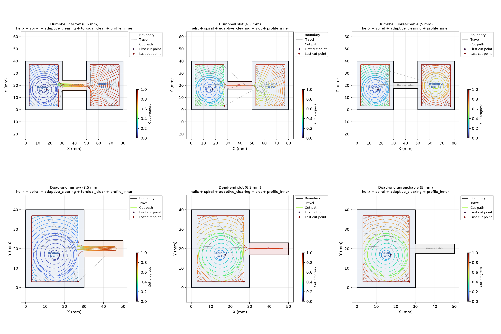

CNC clearing plan builder.

Produces a **~raygeo.cnc.plan.Plan** organised as a BFS traversal of the pocket's region/passage
graph.

## Functions

### `plan_clearing()`

```python
plan_clearing(
    part: part.Part,
    face_id: str = '',
    tool_radius: float = 3.0,
    step_over: float = 2.0,
    step_length: float = 0.6,
    target_z: float = -5.0,
    safe_z: float = 2.0,
    wall_margin: float = 0.0,
    safe_margin: float = 1.0,
    stock_to_leave: float = 0.0,
    plunge_pitch: float = 1.0,
    angular_step: float = 0.1,
    area_tolerance: float = 1.0,
    max_deflection_deg: float = 30.0,
    finishing: bool = False,
) -> plan.Plan
```

| Parameter            | Type           | Description |
| -------------------- | -------------- | ----------- |
| `part`               | `part.Part`    |             |
| `face_id`            | `str = ''`     |             |
| `tool_radius`        | `float = 3.0`  |             |
| `step_over`          | `float = 2.0`  |             |
| `step_length`        | `float = 0.6`  |             |
| `target_z`           | `float = -5.0` |             |
| `safe_z`             | `float = 2.0`  |             |
| `wall_margin`        | `float = 0.0`  |             |
| `safe_margin`        | `float = 1.0`  |             |
| `stock_to_leave`     | `float = 0.0`  |             |
| `plunge_pitch`       | `float = 1.0`  |             |
| `angular_step`       | `float = 0.1`  |             |
| `area_tolerance`     | `float = 1.0`  |             |
| `max_deflection_deg` | `float = 30.0` |             |
| `finishing`          | `bool = False` |             |
| _Returns_            | `plan.Plan`    |             |



*Clearing workplan: narrow passage (ToroidalClear), slot (Slot), dual-entry dumbbell (Unreachable).*
