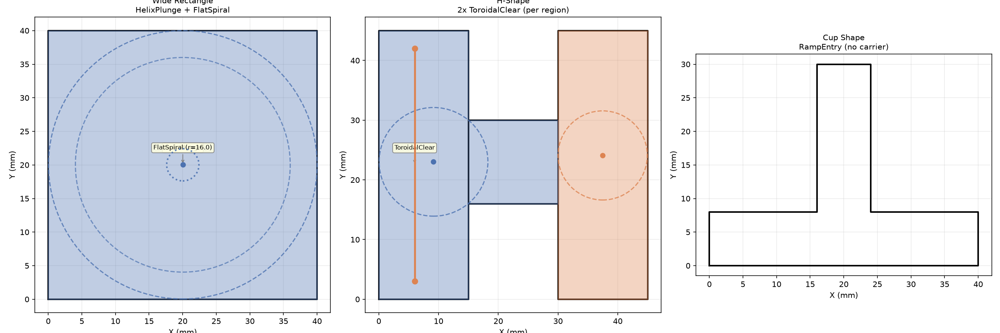

CNC entry strategy orchestration.

Plan entry moves to a pocket entry point using the most efficient assembler (helix, spiral, ramp or
toroidal-clear).

## Functions

### `plan_entry()`

```python
plan_entry(
    region_polygon: Sequence[tuple[float, float]],
    entry_point: tuple[float, float],
    r_max: float,
    islands: Optional[Sequence[Sequence[tuple[float, float]]]] = None,
    tool_radius: float = 3.0,
    step_over: float = 2.0,
    safe_z: float = 2.0,
    target_z: float = -5.0,
    plunge_pitch: float = 1.0,
    safe_margin: float = 1.0,
    angular_step: float = 0.1,
) -> list[plan.PlanStep]
```

| Parameter        | Type                                                       | Description |
| ---------------- | ---------------------------------------------------------- | ----------- |
| `region_polygon` | `Sequence[tuple[float, float]]`                            |             |
| `entry_point`    | `tuple[float, float]`                                      |             |
| `r_max`          | `float`                                                    |             |
| `islands`        | `Optional[Sequence[Sequence[tuple[float, float]]]] = None` |             |
| `tool_radius`    | `float = 3.0`                                              |             |
| `step_over`      | `float = 2.0`                                              |             |
| `safe_z`         | `float = 2.0`                                              |             |
| `target_z`       | `float = -5.0`                                             |             |
| `plunge_pitch`   | `float = 1.0`                                              |             |
| `safe_margin`    | `float = 1.0`                                              |             |
| `angular_step`   | `float = 0.1`                                              |             |
| _Returns_        | `list[plan.PlanStep]`                                      |             |



*Entry workplan: rectangle (Helix+FlatSpiral), H-shape (ToroidalClear), cup (RampEntry).*
