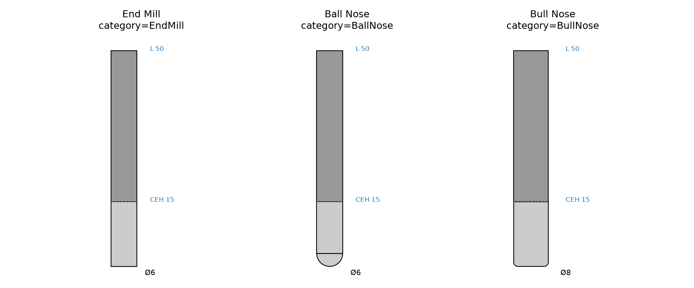

*Side profiles of the three common cutting-tool categories, built as ToolModel parameter bags.* CNC
tool model.

Provides ToolModel (a parametric geometry parameter bag), the ToolCategory enum (type-safe tool
classification for compatibility checks), the ToolMaterial enum, and the Tool composite. All types
are implemented in Rust and consumed by the CNC layer's signatures.

## Tool

A physical cutting tool.

Combines a parametric **ToolModel** (measurements), a **ToolCategory** (type-safe classification), a
**ToolMaterial**, and setup parameters::

```
tool = Tool(
    label="6mm EM",
    category=ToolCategory.EndMill,
    model=ToolModel(diameter=6.0, ...),
    material=ToolMaterial.Carbide,
    stickout=15.0,
)
```

### `category`

```python
category: ToolCategory
```

### `coating`

```python
coating: Optional[str]
```

### `label`

```python
label: str
```

### `material`

```python
material: ToolMaterial
```

### `model`

```python
model: ToolModel
```

The tool's parametric geometry model.

### `stickout`

```python
stickout: float
```

### `default_stickout()`

```python
default_stickout() -> float
```

Default stickout = cutting edge height + 3 mm safety.

| Parameter | Type    | Description |
| --------- | ------- | ----------- |
| _Returns_ | `float` |             |

### `diameter()`

```python
diameter() -> float
```

Cutting diameter (mm).

| Parameter | Type    | Description |
| --------- | ------- | ----------- |
| _Returns_ | `float` |             |

## ToolCategory

Type-safe classification of a tool, for operation-compatibility checks (e.g. chamfering requires
`Chamfer`/`Vbit`, slotting rejects `Probe`).

**Values:**

- `BallNose`
- `BullNose`
- `Chamfer`
- `Dovetail`
- `Drill`
- `EndMill`
- `Probe`
- `Reamer`
- `SlittingSaw`
- `Tap`
- `ThreadMill`
- `Vbit`

## ToolMaterial

Tool substrate material.

**Values:**

- `CBN`
- `Carbide`
- `Ceramic`
- `Diamond`
- `HSS`
- `HSSE`

## ToolModel

Parametric model describing a tool's geometry.

A single, hierarchy-free class: a bag of named parameters. Construct with keyword arguments for each
parameter::

```
model = ToolModel(
    diameter=6.0,
    shank_diameter=6.0,
    cutting_edge_height=15.0,
    flute_count=3.0,
    overall_length=50.0,
)
```

The type-safe tool *classification* (end-mill vs. probe vs. ...) lives on **Tool** as the
**ToolCategory** enum; a `ToolModel` only carries measurements. New geometries are created by
constructing a `ToolModel` with new parameters -- no raygeo change required.

### `corner_radius()`

```python
corner_radius() -> float
```

Corner radius (mm); `0.0` if unspecified.

| Parameter | Type    | Description |
| --------- | ------- | ----------- |
| _Returns_ | `float` |             |

### `cutting_edge_height()`

```python
cutting_edge_height() -> float
```

Cutting-edge height (mm); `0.0` if unspecified.

| Parameter | Type    | Description |
| --------- | ------- | ----------- |
| _Returns_ | `float` |             |

### `diameter()`

```python
diameter() -> float
```

Cutting diameter (mm); `0.0` if unspecified.

| Parameter | Type    | Description |
| --------- | ------- | ----------- |
| _Returns_ | `float` |             |

### `get_parameter()`

```python
get_parameter(name: str) -> Optional[float]
```

Read a named parameter, or `None` if absent.

| Parameter | Type              | Description |
| --------- | ----------------- | ----------- |
| `name`    | `str`             |             |
| _Returns_ | `Optional[float]` |             |

### `get_parameters()`

```python
get_parameters() -> dict[str, float]
```

All parameters as a `{name: value}` dict.

| Parameter | Type               | Description |
| --------- | ------------------ | ----------- |
| _Returns_ | `dict[str, float]` |             |
