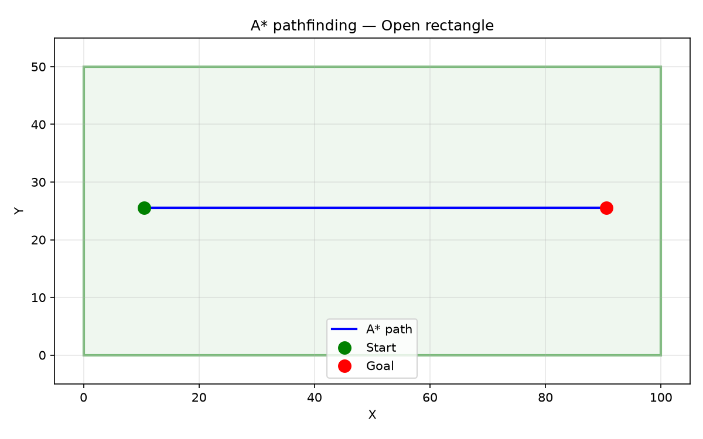
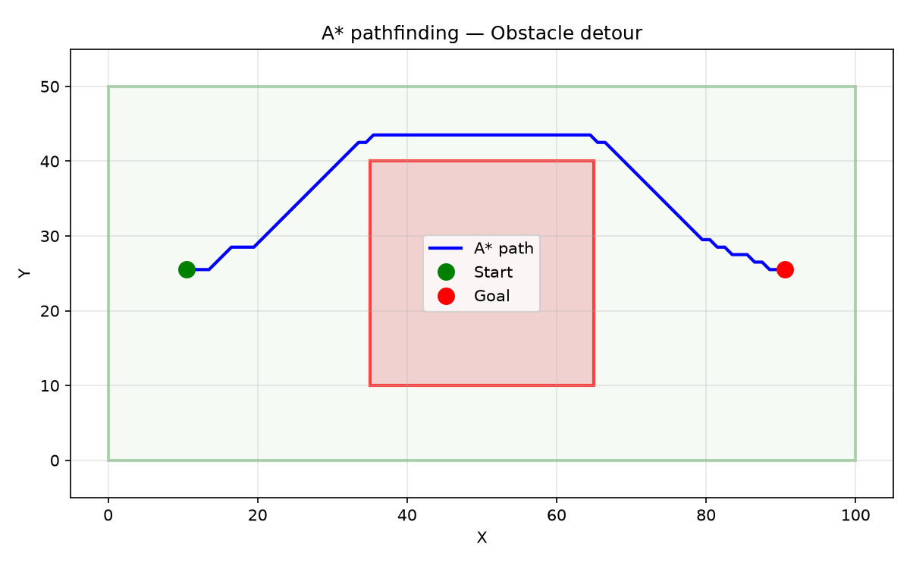
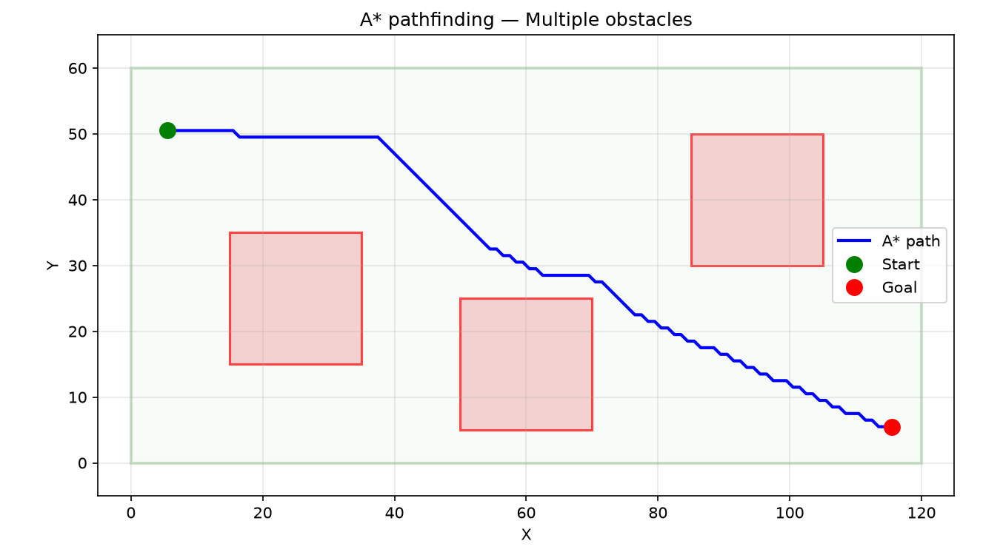

_A_ pathfinding in an open rectangle — the shortest path is a straight line from start to goal\*

## AStarPath

### `length`

```python
length: float
```

### `visited`

```python
visited: int
```

### `waypoints`

```python
waypoints: list[tuple[float, float]]
```

## Functions

### `find_path()`

```python
find_path(
    from_: tuple[float, float],
    to: tuple[float, float],
    free_space: Sequence[Sequence[tuple[float, float]]],
    obstacles: Sequence[Sequence[tuple[float, float]]] = [],
    obstacle_margin: float = 0,
    cell_size: float = 1,
) -> AStarPath | None
```

Find a path from _from\__ to _to_ inside _free_space_, avoiding _obstacles_.

The walkable area is rasterised at _cell_size_ resolution. Obstacles are dilated by
_obstacle_margin_ before pathfinding.

| Parameter         | Type                                           | Description                                                   |
| ----------------- | ---------------------------------------------- | ------------------------------------------------------------- |
| `from_`           | `tuple[float, float]`                          | Start point (x, y).                                           |
| `to`              | `tuple[float, float]`                          | Goal point (x, y).                                            |
| `free_space`      | `Sequence[Sequence[tuple[float, float]]]`      | Polygons defining the walkable region.                        |
| `obstacles`       | `Sequence[Sequence[tuple[float, float]]] = []` | Polygons defining forbidden zones (default []).               |
| `obstacle_margin` | `float = 0`                                    | Radius by which obstacles are expanded (default 0).           |
| `cell_size`       | `float = 1`                                    | Raster grid resolution (default 1.0).                         |
| _Returns_         | `AStarPath &#124; None`                        | AStarPath with waypoints, visited count, and length, or None. |



_A_ finds a path around a central obstacle when the direct route is blocked\*



_A_ threading a path between multiple disconnected obstacles — the algorithm explores the free cells
and finds an optimal route\*
