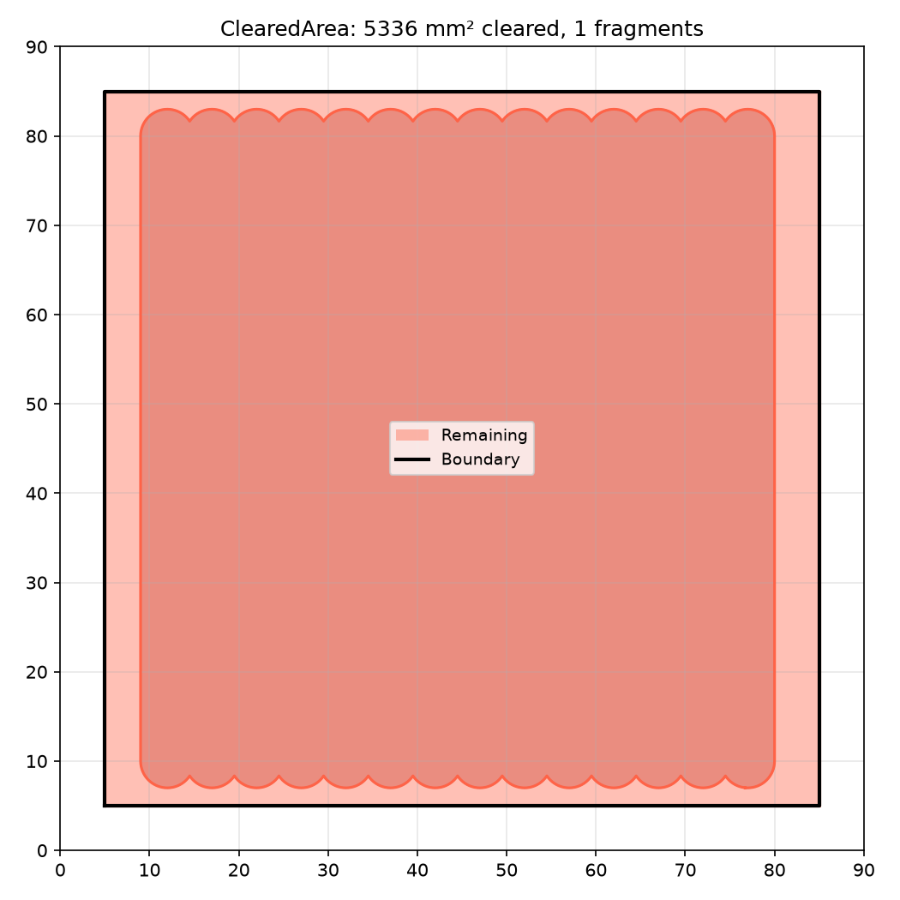
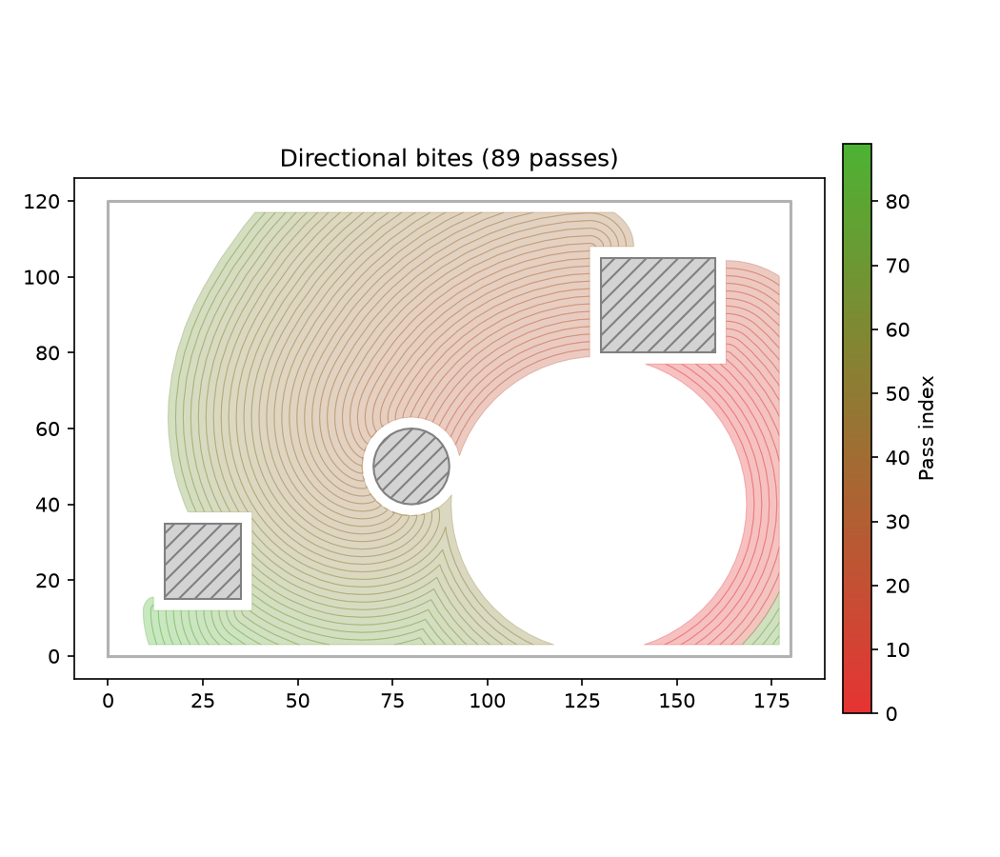

_ClearedArea tracking a simulated raster toolpath — cleared fragments shown in blue, remaining area
in red_ Incremental cleared-area tracker for adaptive clearing.

Maintains a union of tool-swept polygons and provides a spatial-indexed windowed query for efficient
engagement computation.

## ClearedArea

### `add_cleared_polygons()`

```python
add_cleared_polygons(polygons: Sequence[Sequence[tuple[float, float]]]) -> None
```

| Parameter    | Type                                      | Description                                       |
| ------------ | ----------------------------------------- | ------------------------------------------------- |
| `polygons`   | `Sequence[Sequence[tuple[float, float]]]` |                                                   |
| _Returns_    | `None`                                    |                                                   |
| _Complexity_ |                                           | O(n) where n = total vertices across all polygons |


_ClearedArea with bulk polygon insertion via `add_cleared_polygons` — cleared region in blue,
remaining area in red_

### `all_bites()`

```python
all_bites(
    step_over: float,
    valid_area: Sequence[Sequence[tuple[float, float]]],
    simplify_tol: float,
) -> list[list[list[tuple[float, float]]]]
```

Iteratively call **bites** + **incorporate** until the valid area is fully cleared.

Returns all passes, each pass being a list of bite polygons. The cleared area is fully cleared after
this call.

| Parameter      | Type                                      | Description                                            |
| -------------- | ----------------------------------------- | ------------------------------------------------------ |
| `step_over`    | `float`                                   | lateral step-over in mm                                |
| `valid_area`   | `Sequence[Sequence[tuple[float, float]]]` | list of polygons defining the valid tool-centre region |
| `simplify_tol` | `float`                                   | tolerance in mm for frontier simplification            |
| _Returns_      | `list[list[list[tuple[float, float]]]]`   |                                                        |
| _Complexity_   |                                           | O(k n log n) where k = number of passes                |

### `bite_in_direction()`

```python
bite_in_direction(
    step_over: float,
    valid_area: Sequence[Sequence[tuple[float, float]]],
    simplify_tol: float,
    target: tuple[float, float],
    max_angle: float,
) -> list[list[tuple[float, float]]]
```

Like **bites** but filters to only the bites whose centroid lies within _max_angle_ radians of the
direction from the current cleared region's centre toward _target_. useful for steering the clearing
direction along a MAT branch.

| Parameter      | Type                                      | Description                                            |
| -------------- | ----------------------------------------- | ------------------------------------------------------ |
| `step_over`    | `float`                                   | lateral step-over in mm                                |
| `valid_area`   | `Sequence[Sequence[tuple[float, float]]]` | list of polygons defining the valid tool-centre region |
| `simplify_tol` | `float`                                   | tolerance in mm for frontier simplification            |
| `target`       | `tuple[float, float]`                     | (x, y) target point to steer toward                    |
| `max_angle`    | `float`                                   | maximum deviation from the target direction (radians)  |
| _Returns_      | `list[list[tuple[float, float]]]`         |                                                        |
| _Complexity_   |                                           | O(n log n)                                             |



_Directional bites coloured by pass order (first = dark, later = pale)_

### `bites()`

```python
bites(
    step_over: float,
    valid_area: Sequence[Sequence[tuple[float, float]]],
    simplify_tol: float,
) -> list[list[tuple[float, float]]]
```

Compute the "bites" — new material reachable by expanding the current frontier outward by step_over,
clipping to valid_area, and subtracting already-cleared portions.

| Parameter      | Type                                      | Description                                            |
| -------------- | ----------------------------------------- | ------------------------------------------------------ |
| `step_over`    | `float`                                   | lateral step-over in mm                                |
| `valid_area`   | `Sequence[Sequence[tuple[float, float]]]` | list of polygons defining the valid tool-centre region |
| `simplify_tol` | `float`                                   | tolerance in mm for frontier simplification            |
| _Returns_      | `list[list[tuple[float, float]]]`         |                                                        |
| _Complexity_   |                                           | O(n log n)                                             |


_`bites` computes the expansible material — the crescent-shaped regions of uncut material reachable
by expanding the frontier by `step_over`._

### `expand()`

```python
expand(path: Sequence[tuple[float, float]], radius: float) -> None
```

| Parameter    | Type                            | Description                          |
| ------------ | ------------------------------- | ------------------------------------ |
| `path`       | `Sequence[tuple[float, float]]` |                                      |
| `radius`     | `float`                         |                                      |
| _Returns_    | `None`                          |                                      |
| _Complexity_ |                                 | O(n) where n = number of path points |

### `fragments()`

```python
fragments() -> list[list[tuple[float, float]]]
```

Return the union of all polygons currently tracked as cleared.

Each fragment is a closed polygon (list of `(x, y)` vertices) representing an area that has already
been cut. The fragment set grows as `incorporate` or `add_cleared_polygons` are called.

This is useful for determining which parts of a bite polygon lie outside the cleared area (i.e. the
cutting arc), for example when used with **raygeo.ops.assembly.hsm.find_cutting_arc**.

| Parameter    | Type                              | Description                        |
| ------------ | --------------------------------- | ---------------------------------- |
| _Returns_    | `list[list[tuple[float, float]]]` |                                    |
| _Complexity_ |                                   | O(m) where m = number of fragments |

### `frontier()`

```python
frontier(simplify_tol: float) -> list[list[tuple[float, float]]]
```

Return a unioned, simplified snapshot of the current outer boundary.

| Parameter      | Type                              | Description                                 |
| -------------- | --------------------------------- | ------------------------------------------- |
| `simplify_tol` | `float`                           | tolerance in mm for polyline simplification |
| _Returns_      | `list[list[tuple[float, float]]]` |                                             |
| _Complexity_   |                                   | O(n log n)                                  |


_`frontier` returns the outer boundary of the cleared area after merging overlapping fragments —
shown in crimson._

### `incorporate()`

```python
incorporate(
    polygons: Sequence[Sequence[tuple[float, float]]],
) -> list[list[tuple[float, float]]]
```

Add polygons, returning only the newly-added portion. Faster than add_cleared_polygons when inputs
don't overlap existing fragments (skips the full union). O(n) when inputs are disjoint from existing
fragments

| Parameter    | Type                                      | Description                                |
| ------------ | ----------------------------------------- | ------------------------------------------ |
| `polygons`   | `Sequence[Sequence[tuple[float, float]]]` |                                            |
| _Returns_    | `list[list[tuple[float, float]]]`         |                                            |
| _Complexity_ |                                           | O(n log n) worst case when union required, |


_`incorporate` adds polygons to the cleared state while returning only the newly-covered region
(shown in green)._

### `query_window()`

```python
query_window(
    bbox: tuple[float, float, float, float],
) -> list[list[tuple[float, float]]]
```

| Parameter    | Type                                | Description                                                 |
| ------------ | ----------------------------------- | ----------------------------------------------------------- |
| `bbox`       | `tuple[float, float, float, float]` |                                                             |
| _Returns_    | `list[list[tuple[float, float]]]`   |                                                             |
| _Complexity_ |                                     | O(m + k) where m = number of fragments, k = output vertices |

### `remaining()`

```python
remaining(
    bounds: Sequence[Sequence[tuple[float, float]]],
) -> list[list[tuple[float, float]]]
```

| Parameter    | Type                                      | Description                                        |
| ------------ | ----------------------------------------- | -------------------------------------------------- |
| `bounds`     | `Sequence[Sequence[tuple[float, float]]]` |                                                    |
| _Returns_    | `list[list[tuple[float, float]]]`         |                                                    |
| _Complexity_ |                                           | O(n \* m) where n = bounds vertices, m = fragments |

### `remaining_in_inset()`

```python
remaining_in_inset(
    boundary: Sequence[tuple[float, float]],
    obstacles: Optional[Sequence[Sequence[tuple[float, float]]]] = None,
    radius: float = 3.0,
) -> list[list[tuple[float, float]]]
```

Compute the inset region of _boundary_ by _radius_ (excluding _obstacles_), then return the portions
of that region not covered by stored fragments, together with the original obstacle polygons.

| Parameter    | Type                                                       | Description                                                                      |
| ------------ | ---------------------------------------------------------- | -------------------------------------------------------------------------------- |
| `boundary`   | `Sequence[tuple[float, float]]`                            | Outer boundary polygon.                                                          |
| `obstacles`  | `Optional[Sequence[Sequence[tuple[float, float]]]] = None` | Obstacle (hole) polygons to exclude.                                             |
| `radius`     | `float = 3.0`                                              | Inset distance applied to _boundary_ and _obstacles_.                            |
| _Returns_    | `list[list[tuple[float, float]]]`                          | List of polygons — the obstacles plus the uncovered portion of the inset region. |
| _Complexity_ |                                                            | O(n log n) for the inset and difference operations.                              |

### `total_area()`

```python
total_area() -> float
```

| Parameter    | Type    | Description |
| ------------ | ------- | ----------- |
| _Returns_    | `float` |             |
| _Complexity_ |         | O(1)        |
