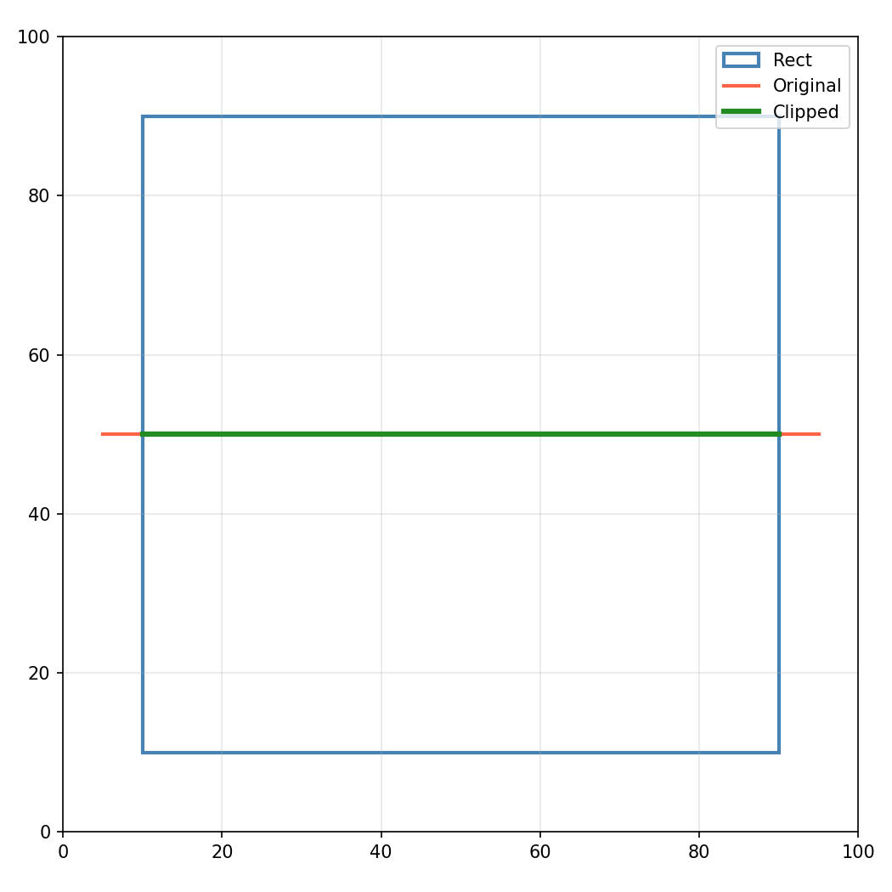
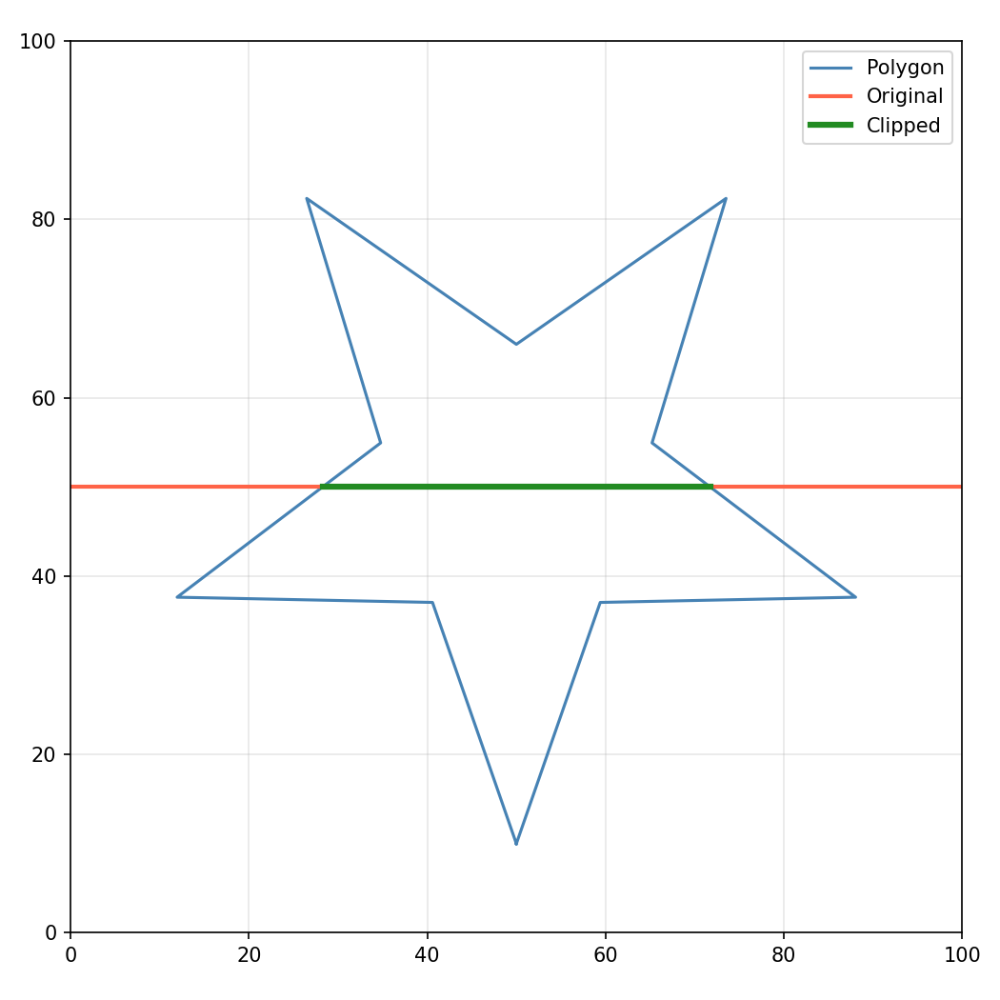
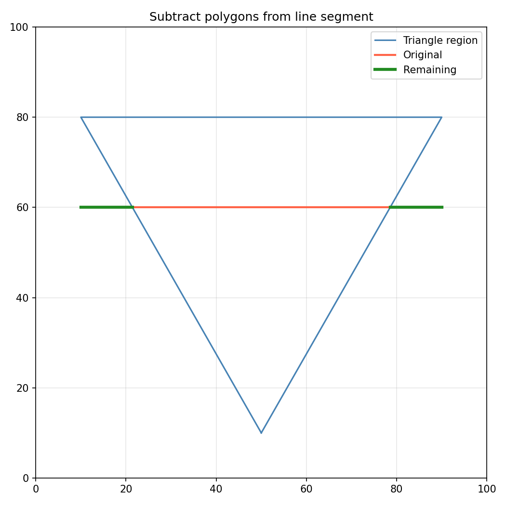

_Line clipped to rectangle_

_Line clipped to polygon_

_Subtract polygon from line_

Line and polygon clipping operations.

Provides functions for clipping line segments against rectangles and polygon regions, as well as
converting between float and Clipper integer coordinate systems.

## Functions

### `clip_line_segment_with_polygons()`

`clip_line_segment_with_polygons(p1: types.Point3D, p2: types.Point3D, regions: collections.abc.Sequence[collections.abc.Sequence[types.Point]]) -> list[tuple[types.Point3D, types.Point3D]]`

Clip line segments that fall within polygon regions.

**Returns:** List of clipped segments.

| Parameter | Type                                                              | Description                      |
| --------- | ----------------------------------------------------------------- | -------------------------------- |
| `p1`      | `types.Point3D`                                                   | Start point of the line segment. |
| `p2`      | `types.Point3D`                                                   | End point of the line segment.   |
| `regions` | `collections.abc.Sequence[collections.abc.Sequence[types.Point]]` | Polygon regions to clip against. |
| _Returns_ | `list[tuple[types.Point3D, types.Point3D]]`                       |                                  |

### `clip_line_segment_with_rect()`

`clip_line_segment_with_rect(p1: types.Point3D, p2: types.Point3D, rect: types.Rect) -> Optional[tuple[types.Point3D, types.Point3D]]`

Clip a line segment with a rectangle.

**Returns:** Clipped segment or None if fully outside.

| Parameter | Type                                            | Description                                      |
| --------- | ----------------------------------------------- | ------------------------------------------------ |
| `p1`      | `types.Point3D`                                 | Start point of the line segment.                 |
| `p2`      | `types.Point3D`                                 | End point of the line segment.                   |
| `rect`    | `types.Rect`                                    | Clipping rectangle (x_min, y_min, x_max, y_max). |
| _Returns_ | `Optional[tuple[types.Point3D, types.Point3D]]` |                                                  |

### `from_clipper()`

`from_clipper(polygon: list[tuple[int, int]]) -> list[tuple[float, float]]`

Convert a polygon from Clipper coordinates.

**Returns:** Polygon with float coordinates.

| Parameter | Type                        | Description                   |
| --------- | --------------------------- | ----------------------------- |
| `polygon` | `list[tuple[int, int]]`     | Integer polygon from Clipper. |
| _Returns_ | `list[tuple[float, float]]` |                               |

### `subtract_polygons_from_line_segment()`

`subtract_polygons_from_line_segment(p1: types.Point3D, p2: types.Point3D, regions: collections.abc.Sequence[collections.abc.Sequence[types.Point]]) -> list[tuple[types.Point3D, types.Point3D]]`

Subtract polygon regions from a line segment.

**Returns:** List of remaining segments after subtraction.

| Parameter | Type                                                              | Description                          |
| --------- | ----------------------------------------------------------------- | ------------------------------------ |
| `p1`      | `types.Point3D`                                                   | Start point of the line segment.     |
| `p2`      | `types.Point3D`                                                   | End point of the line segment.       |
| `regions` | `collections.abc.Sequence[collections.abc.Sequence[types.Point]]` | List of polygon regions to subtract. |
| _Returns_ | `list[tuple[types.Point3D, types.Point3D]]`                       |                                      |

### `to_clipper()`

`to_clipper(polygon: types.Polygon) -> list[tuple[int, int]]`

Convert a polygon to Clipper coordinates.

**Returns:** Polygon with integer coordinates for Clipper.

| Parameter | Type                    | Description                               |
| --------- | ----------------------- | ----------------------------------------- |
| `polygon` | `types.Polygon`         | Input polygon as a list of (x, y) points. |
| _Returns_ | `list[tuple[int, int]]` |                                           |
