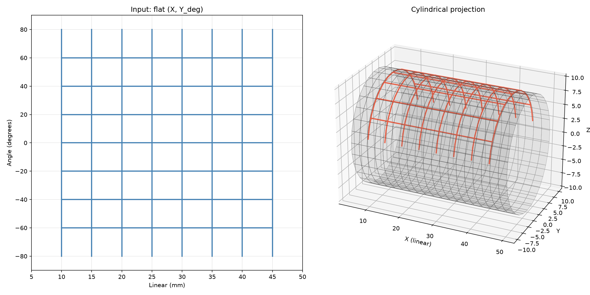

## Functions

### `transform_to_cylinder()`

```python
transform_to_cylinder(
    verts: numpy.NDArray[numpy.float32],
    diameter: float,
    colors: numpy.NDArray[numpy.float32] | None = None,
    degrees_input: bool = False,
    radial_offset: float = 0,
) -> tuple[numpy.NDArray[numpy.float32], numpy.NDArray[numpy.float32] | None, numpy.NDArray[numpy.int32]]
```

Transform flat vertex pairs to cylindrical coordinates.

The input has angular values on axis 1 (Y) and linear position on axis 0 (X). The output maps to:

```
X = linear position along cylinder
Y = r * sin(theta)
Z = r * cos(theta)
```

Line segments are subdivided as needed to follow the cylinder surface instead of cutting through the
interior.

| Parameter       | Type                                                                                                        | Description                                                                                                                                |
| --------------- | ----------------------------------------------------------------------------------------------------------- | ------------------------------------------------------------------------------------------------------------------------------------------ |
| `verts`         | `numpy.NDArray[numpy.float32]`                                                                              | Float32 array of shape (N, 3) with X, Y, Z per vertex. Vertices are in pairs (line segments for GL_LINES).                                 |
| `diameter`      | `float`                                                                                                     | Cylinder diameter in mm.                                                                                                                   |
| `colors`        | `numpy.NDArray[numpy.float32] &#124; None = None`                                                           | Optional float32 array of shape (N, 4) RGBA colors.                                                                                        |
| `degrees_input` | `bool = False`                                                                                              | If True, Y values are in degrees and converted directly. If False (default), they are in motor units (mu) and converted via mu_to_degrees. |
| `radial_offset` | `float = 0`                                                                                                 | Outward radial offset (mm) applied to every vertex. Used to lift overlay lines off the cylinder surface to avoid Z-fighting.               |
| _Returns_       | `tuple[numpy.NDArray[numpy.float32], numpy.NDArray[numpy.float32] &#124; None, numpy.NDArray[numpy.int32]]` | Tuple of (transformed_vertices, expanded_colors, cum_subs). cum_subs is a cumulative subdivision count array.                              |
| _Complexity_    |                                                                                                             | O(N * subdivisions)                                                                                                                        |



*Flat vertex pairs wrapped onto a cylinder surface*
