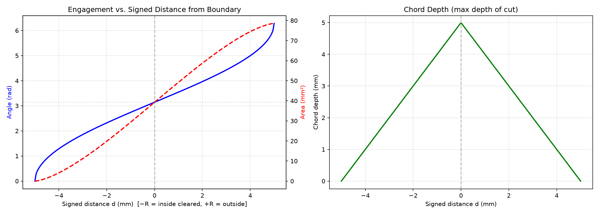
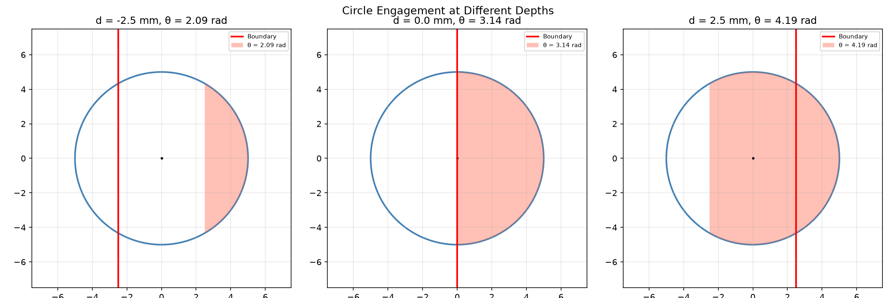
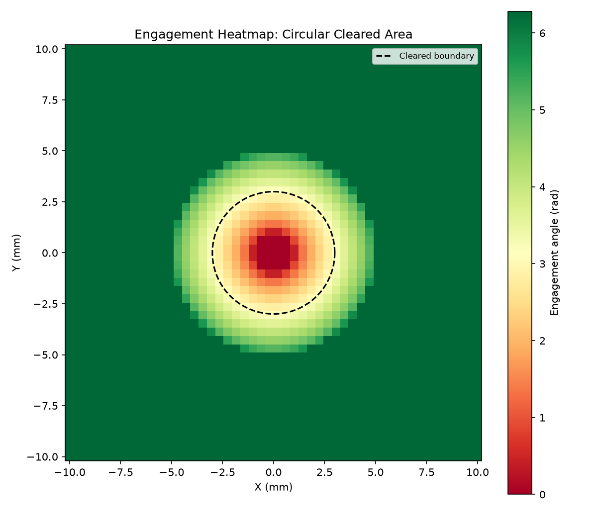
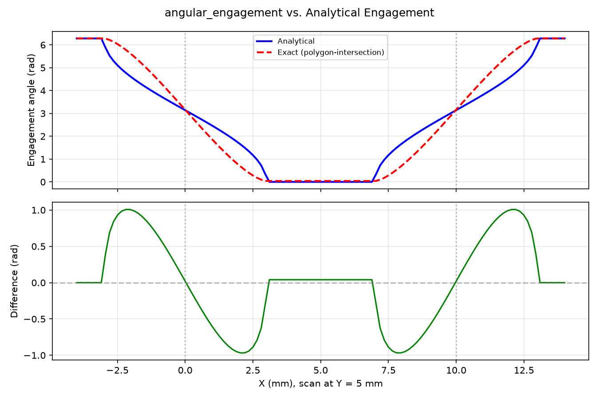
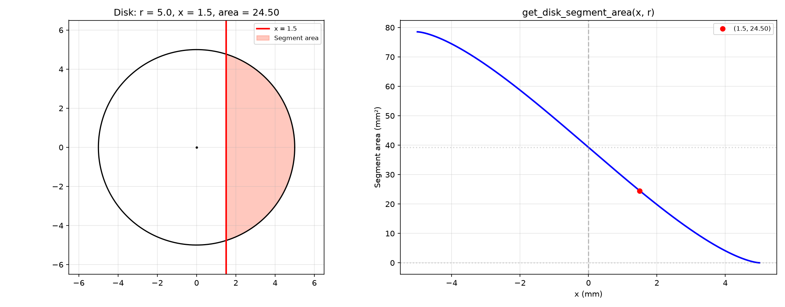
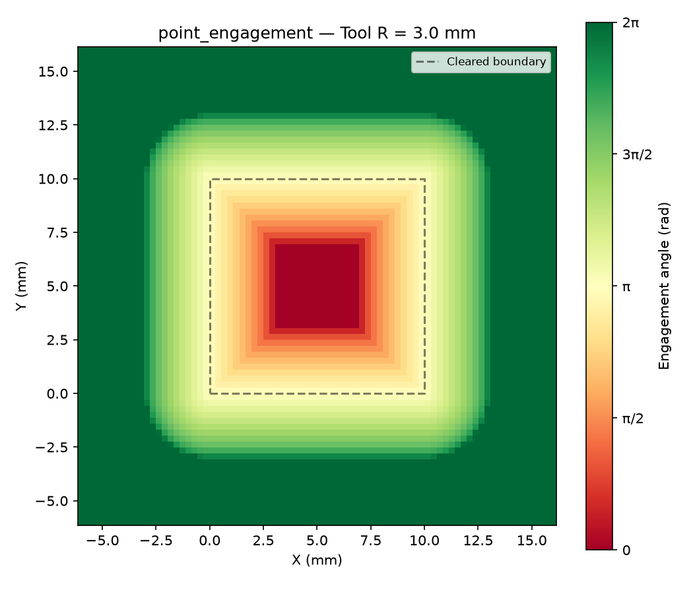

*Engagement angle, area, and chord depth as a function of signed distance from the cleared
boundary.* Circle-boundary overlap (engagement) metrics.

## Functions

### `compute_engagement()`

```python
compute_engagement(
    d_to_boundary: float,
    radius: float,
) -> tuple[float, float, float]
```

Compute engagement angle, area, and chord depth.

| Parameter       | Type                         | Description                                                                                   |
| --------------- | ---------------------------- | --------------------------------------------------------------------------------------------- |
| `d_to_boundary` | `float`                      | Signed distance from the point to the nearest boundary (mm). Positive = outside the boundary. |
| `radius`        | `float`                      | Disk radius (mm).                                                                             |
| _Returns_       | `tuple[float, float, float]` | `(angle_rad, area, chord_depth)`.                                                             |



*Circle at three signed distances from the boundary. Shaded red arc is the contact arc
(engagement).*



*Engagement heatmap around a circular cleared area. Green = low, red = high engagement.*

### `get_angular_engagement()`

```python
get_angular_engagement(
    center: tuple[float, float],
    radius: float,
    fragments: list[list[tuple[float, float]]],
) -> float
```

Angular engagement (exact circle–polygon intersection).

Returns uncleared angular extent in `[0, 2π]`.

| Parameter   | Type                              | Description                           |
| ----------- | --------------------------------- | ------------------------------------- |
| `center`    | `tuple[float, float]`             | Disk centre `(x, y)`.                 |
| `radius`    | `float`                           | Disk radius (mm).                     |
| `fragments` | `list[list[tuple[float, float]]]` | List of polygons (cleared fragments). |
| _Returns_   | `float`                           | Angular engagement in radians.        |



*Comparison of exact polygon-intersection engagement vs analytical signed-distance estimate*

### `get_disk_segment_area()`

```python
get_disk_segment_area(x: float, r: float) -> float
```

Area under 2\*sqrt(r²-x²) from x to r.

Equivalent to the area of the circular segment to the right of the vertical line at `x` for a disk
of radius `r` centred at the origin.

| Parameter | Type    | Description                   |
| --------- | ------- | ----------------------------- |
| `x`       | `float` | Left boundary of the segment. |
| `r`       | `float` | Disk radius.                  |
| _Returns_ | `float` | Area of the circular segment. |



*Left: shaded disk segment right of an offset; right: segment area vs offset from `-r` to `+r`*

### `get_point_engagement()`

```python
get_point_engagement(
    center: tuple[float, float],
    radius: float,
    fragments: list[list[tuple[float, float]]],
) -> tuple[float, float, float]
```

Engagement angle, area, and chord depth at a disk centre.

| Parameter   | Type                              | Description                           |
| ----------- | --------------------------------- | ------------------------------------- |
| `center`    | `tuple[float, float]`             | Disk centre `(x, y)`.                 |
| `radius`    | `float`                           | Disk radius (mm).                     |
| `fragments` | `list[list[tuple[float, float]]]` | List of polygons (cleared fragments). |
| _Returns_   | `tuple[float, float, float]`      | `(angle_rad, area, chord_depth)`.     |



*Engagement angle field around a square cleared area for a disk of given radius.*
