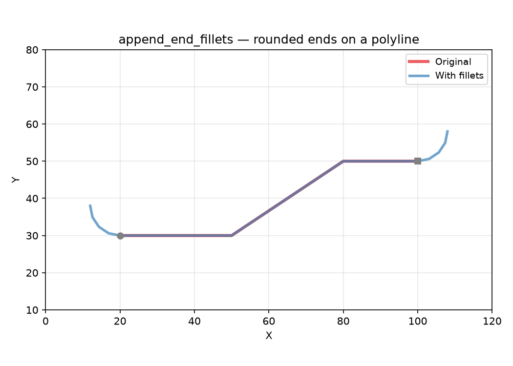
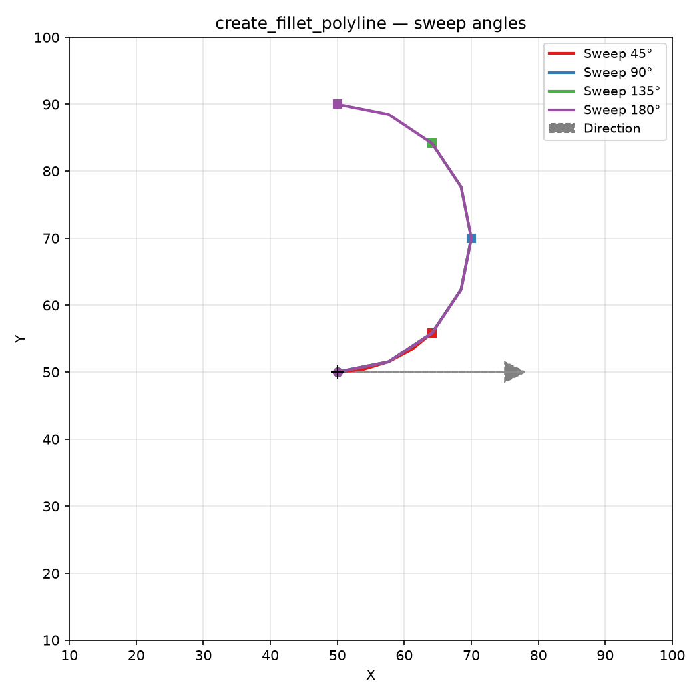
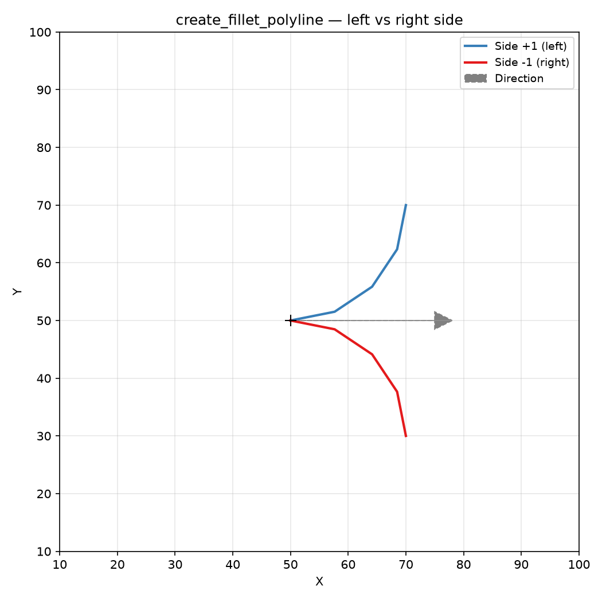
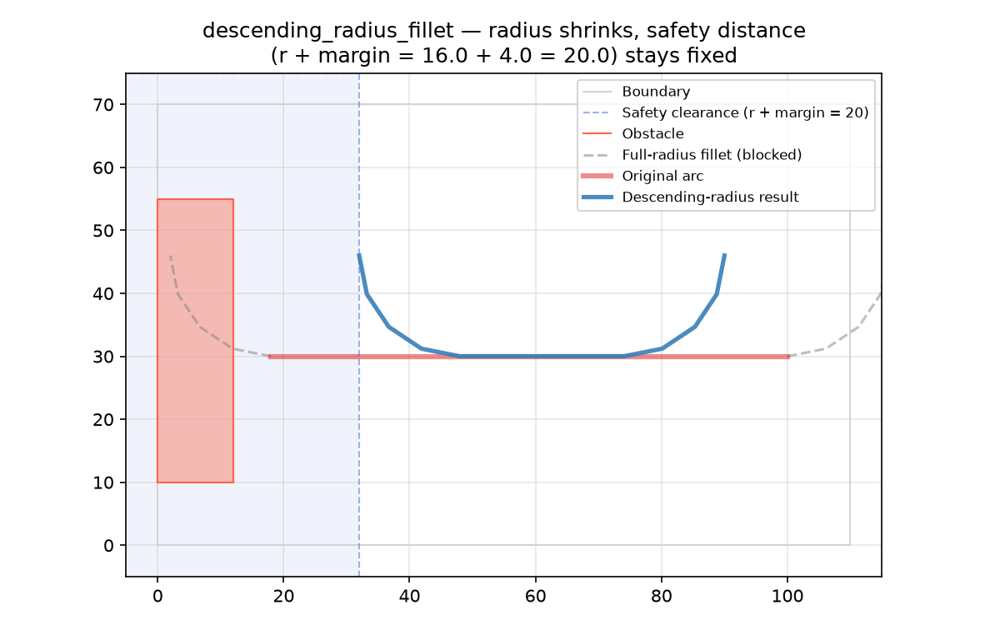
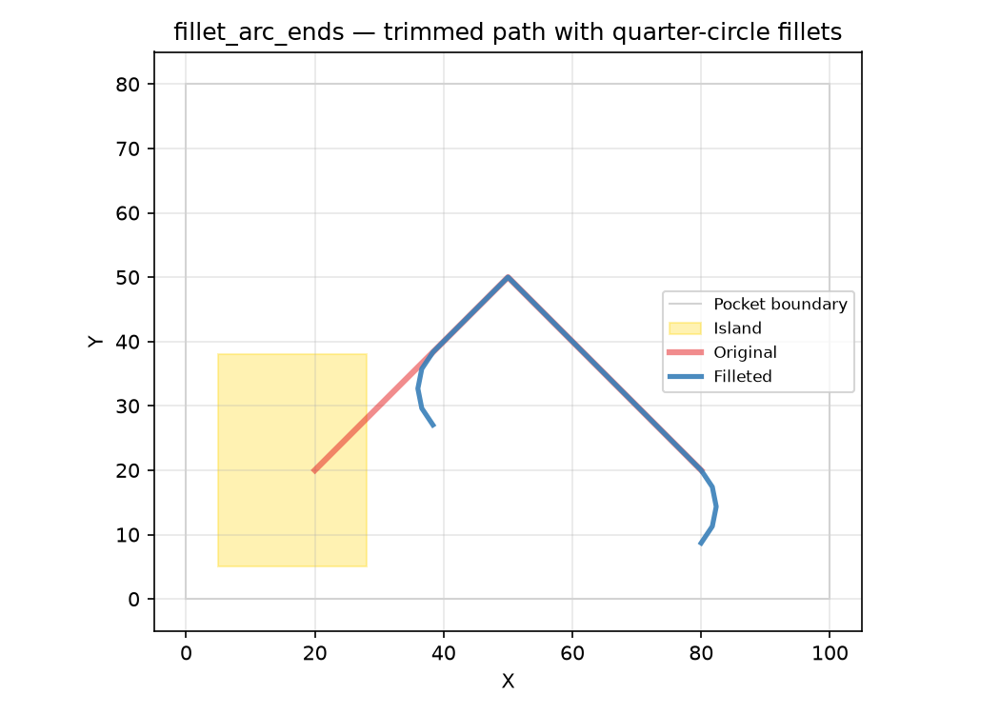
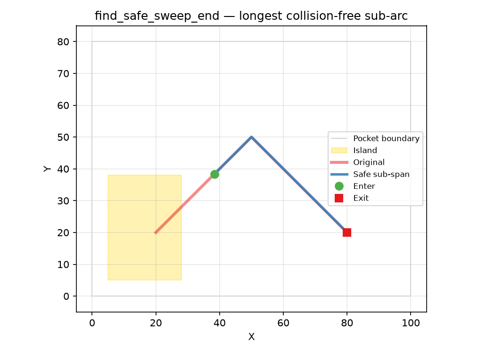
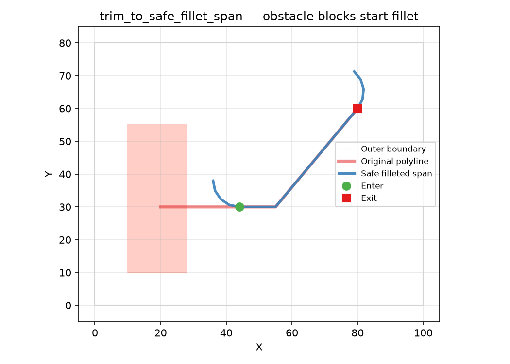
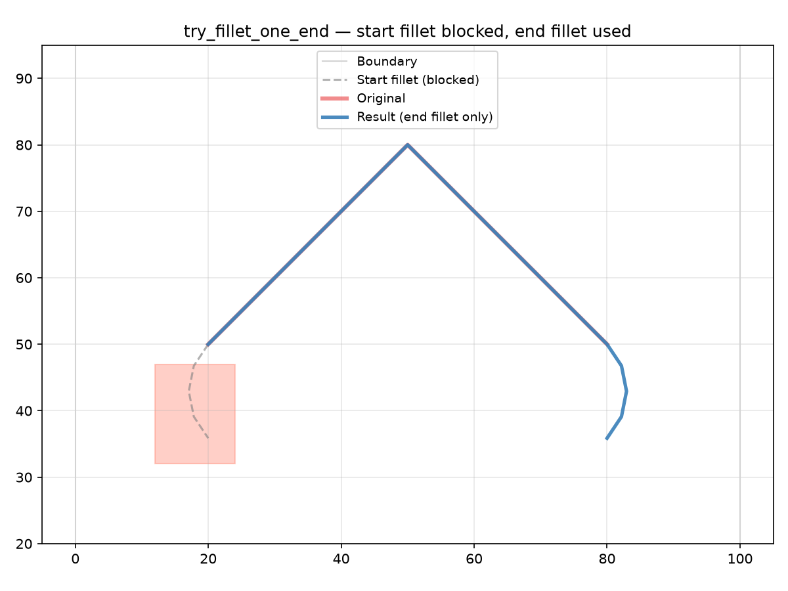

Pure-geometry fillet operations.

Domain-neutral utilities for creating circular fillet arcs, appending them to polylines, and
trimming to safe spans.

- `create_fillet_polyline` — circular arc tangent to a direction.
- `append_end_fillets` — fillet both ends of an open polyline.
- `trim_to_safe_fillet_span` — longest sub-span whose end fillets avoid obstacles.
- `descending_radius_fillet` — try fillets at descending radii until one fits.

## Functions

### `append_end_fillets()`

```python
append_end_fillets(
    polyline: Sequence[tuple[float, float]],
    radius: float,
    sweep_angle: float,
    start_side: float,
    end_side: float,
) -> list[tuple[float, float]]
```

Append fillet arcs to both ends of an open polyline.

A reversed fillet is added at the start (using *start_side*) and a forward fillet at the end (using
*end_side*), producing a smooth rounded path.

| Parameter     | Type                            | Description                                           |
| ------------- | ------------------------------- | ----------------------------------------------------- |
| `polyline`    | `Sequence[tuple[float, float]]` | Input open polyline.                                  |
| `radius`      | `float`                         | Fillet radius.                                        |
| `sweep_angle` | `float`                         | Arc sweep angle in radians.                           |
| `start_side`  | `float`                         | Offset side for the start fillet (+1 left, -1 right). |
| `end_side`    | `float`                         | Offset side for the end fillet (+1 left, -1 right).   |
| _Returns_     | `list[tuple[float, float]]`     | Full polyline with fillets.                           |



*`append_end_fillets` rounds both ends of an open polyline with reversed-start / forward-end fillet
arcs*

### `create_fillet_polyline()`

```python
create_fillet_polyline(
    p: tuple[float, float],
    dir: tuple[float, float],
    radius: float,
    sweep_angle: float,
    side: float,
    reverse: bool,
) -> tuple[tuple[float, float], list[tuple[float, float]]]
```

Create a circular fillet arc tangent to *dir* at *p*.

`side` selects the offset side (+1 = left of *dir*, -1 = right). When `reverse` is `True` the arc
curls back opposite to *dir*.

| Parameter     | Type                                                    | Description                                            |
| ------------- | ------------------------------------------------------- | ------------------------------------------------------ |
| `p`           | `tuple[float, float]`                                   | Start point (x, y).                                    |
| `dir`         | `tuple[float, float]`                                   | Tangent direction vector (dx, dy).                     |
| `radius`      | `float`                                                 | Fillet radius.                                         |
| `sweep_angle` | `float`                                                 | Arc sweep angle in radians.                            |
| `side`        | `float`                                                 | Offset side (+1 left, -1 right).                       |
| `reverse`     | `bool`                                                  | Whether the arc is reversed.                           |
| _Returns_     | `tuple[tuple[float, float], list[tuple[float, float]]]` | `(center, polyline)` — arc centre and fillet vertices. |



*`create_fillet_polyline` generates circular fillet arcs of arbitrary sweep angle, tangent to a
direction at a point*



*`create_fillet_polyline` with `side=+1` (left) and `side=-1` (right) of the direction vector*

### `descending_radius_fillet()`

```python
descending_radius_fillet(
    arc: Sequence[tuple[float, float]],
    outer_boundary: Sequence[tuple[float, float]],
    inner_obstacles: Sequence[Sequence[tuple[float, float]]] = [],
    radius: float = 3,
    margin: float = 0,
) -> list[tuple[float, float]]
```

Try fillets at descending radii until one fits.

Starts at *radius* and halves until either both (or one) end fillet fits, or the radius drops below
0.1; returns the filleted arc, or an empty list if none fits.

The safety distance (`radius + margin`) stays fixed as the fillet radius shrinks, so the tool
clearance remains constant.

| Parameter         | Type                                           | Description                                  |
| ----------------- | ---------------------------------------------- | -------------------------------------------- |
| `arc`             | `Sequence[tuple[float, float]]`                | Cutting arc vertices (open polyline).        |
| `outer_boundary`  | `Sequence[tuple[float, float]]`                | Outer boundary polygon.                      |
| `inner_obstacles` | `Sequence[Sequence[tuple[float, float]]] = []` | List of obstacle polygons (default []).      |
| `radius`          | `float = 3`                                    | Initial fillet radius in mm (default 3.0).   |
| `margin`          | `float = 0`                                    | Extra clearance past tangency (default 0.0). |
| _Returns_         | `list[tuple[float, float]]`                    | Filleted arc or empty list.                  |



*`descending_radius_fillet` halves the fillet radius until both ends fit, while keeping the safety
distance (`radius + margin`) fixed*

### `fillet_arc_ends()`

```python
fillet_arc_ends(
    arc: Sequence[tuple[float, float]],
    pocket_boundary: Sequence[tuple[float, float]],
    islands: Sequence[Sequence[tuple[float, float]]] = [],
    tool_radius: float = 3,
    wall_margin: float = 0,
) -> list[tuple[float, float]]
```

Round both ends of a cutting arc with quarter-circle fillets.

The arc is trimmed to the longest sub-arc whose tool sweep (arc + end fillets of *tool_radius*) does
not collide with *pocket_boundary* or *islands*. A 90° fillet of *tool_radius* is then appended at
each end.

| Parameter         | Type                                           | Description                                  |
| ----------------- | ---------------------------------------------- | -------------------------------------------- |
| `arc`             | `Sequence[tuple[float, float]]`                | Cutting arc vertices (open polyline).        |
| `pocket_boundary` | `Sequence[tuple[float, float]]`                | Outer boundary of the pocket.                |
| `islands`         | `Sequence[Sequence[tuple[float, float]]] = []` | List of island (hole) polygons (default []). |
| `tool_radius`     | `float = 3`                                    | Tool / fillet radius in mm (default 3.0).    |
| `wall_margin`     | `float = 0`                                    | Extra clearance past tangency (default 0.0). |
| _Returns_         | `list[tuple[float, float]]`                    | Filleted arc as an open polyline.            |



*`fillet_arc_ends` trims the arc to the longest safe sub-arc and appends quarter-circle fillets at
each end*

### `find_safe_sweep_end()`

```python
find_safe_sweep_end(
    arc: Sequence[tuple[float, float]],
    pocket_boundary: Sequence[tuple[float, float]],
    islands: Sequence[Sequence[tuple[float, float]]] = [],
    tool_radius: float = 3,
    wall_margin: float = 0,
) -> tuple[tuple[float, float], tuple[float, float]] | None
```

Find the longest safe sub-arc by iterative sweep shortening.

Returns the two points `(enter, exit)` delimiting the longest sub-arc of *arc* whose tool sweep (arc
\+ end fillets of *tool_radius*) does not collide with *pocket_boundary* or *islands*. Shortens from
each end until the sweep is clear. Returns `None` when no usable safe sub-arc remains.

| Parameter         | Type                                                          | Description                                  |
| ----------------- | ------------------------------------------------------------- | -------------------------------------------- |
| `arc`             | `Sequence[tuple[float, float]]`                               | Cutting arc vertices (open polyline).        |
| `pocket_boundary` | `Sequence[tuple[float, float]]`                               | Outer boundary of the pocket.                |
| `islands`         | `Sequence[Sequence[tuple[float, float]]] = []`                | List of island (hole) polygons (default []). |
| `tool_radius`     | `float = 3`                                                   | Tool radius in mm (default 3.0).             |
| `wall_margin`     | `float = 0`                                                   | Extra clearance past tangency (default 0.0). |
| _Returns_         | `tuple[tuple[float, float], tuple[float, float]] &#124; None` | `(enter, exit)` or `None`.                   |



*`find_safe_sweep_end` returns the `(enter, exit)` points delimiting the longest sub-arc whose tool
sweep avoids islands*

### `trim_to_safe_fillet_span()`

```python
trim_to_safe_fillet_span(
    polyline: Sequence[tuple[float, float]],
    outer_boundary: Sequence[tuple[float, float]],
    inner_obstacles: Sequence[Sequence[tuple[float, float]]] = [],
    radius: float = 3,
    margin: float = 0,
) -> tuple[tuple[float, float], tuple[float, float]] | None
```

Find the longest sub-span whose end fillets avoid obstacles.

Shortens from each end until the sweep is clear. Returns `(enter, exit)` or `None`.

| Parameter         | Type                                                          | Description                                  |
| ----------------- | ------------------------------------------------------------- | -------------------------------------------- |
| `polyline`        | `Sequence[tuple[float, float]]`                               | Open polyline to trim.                       |
| `outer_boundary`  | `Sequence[tuple[float, float]]`                               | Outer boundary polygon.                      |
| `inner_obstacles` | `Sequence[Sequence[tuple[float, float]]] = []`                | List of obstacle polygons (default []).      |
| `radius`          | `float = 3`                                                   | Fillet radius (default 3.0).                 |
| `margin`          | `float = 0`                                                   | Extra clearance past tangency (default 0.0). |
| _Returns_         | `tuple[tuple[float, float], tuple[float, float]] &#124; None` | `(enter, exit)` or `None`.                   |



*`trim_to_safe_fillet_span` finds the longest sub-span whose end fillets do not collide with
obstacles (red)*

### `try_fillet_one_end()`

```python
try_fillet_one_end(
    arc: Sequence[tuple[float, float]],
    outer_boundary: Sequence[tuple[float, float]],
    inner_obstacles: Sequence[Sequence[tuple[float, float]]] = [],
    radius: float = 3,
    margin: float = 0,
) -> list[tuple[float, float]]
```

Try a fillet at just one end of an arc when both ends don't fit.

Tests the enter (start) fillet first, then the exit (end) fillet, and returns the first that does
not collide with the boundary or obstacles. Falls back to the original arc if neither fits.

| Parameter         | Type                                           | Description                                           |
| ----------------- | ---------------------------------------------- | ----------------------------------------------------- |
| `arc`             | `Sequence[tuple[float, float]]`                | Cutting arc vertices (open polyline).                 |
| `outer_boundary`  | `Sequence[tuple[float, float]]`                | Outer boundary polygon.                               |
| `inner_obstacles` | `Sequence[Sequence[tuple[float, float]]] = []` | List of obstacle polygons (default []).               |
| `radius`          | `float = 3`                                    | Fillet radius (default 3.0).                          |
| `margin`          | `float = 0`                                    | Extra clearance past tangency (default 0.0).          |
| _Returns_         | `list[tuple[float, float]]`                    | Arc with optional single-end fillet, or original arc. |



*`try_fillet_one_end` tests the start fillet first; when it collides with the obstacle (red), falls
back to the end fillet*
