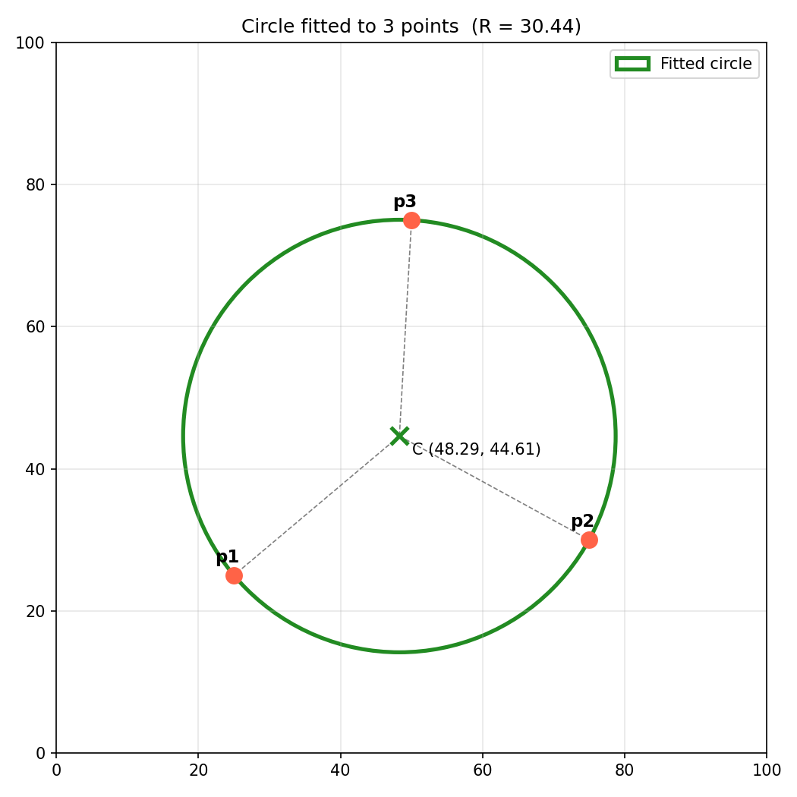
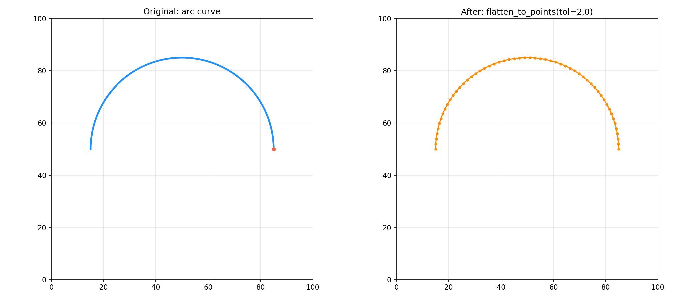
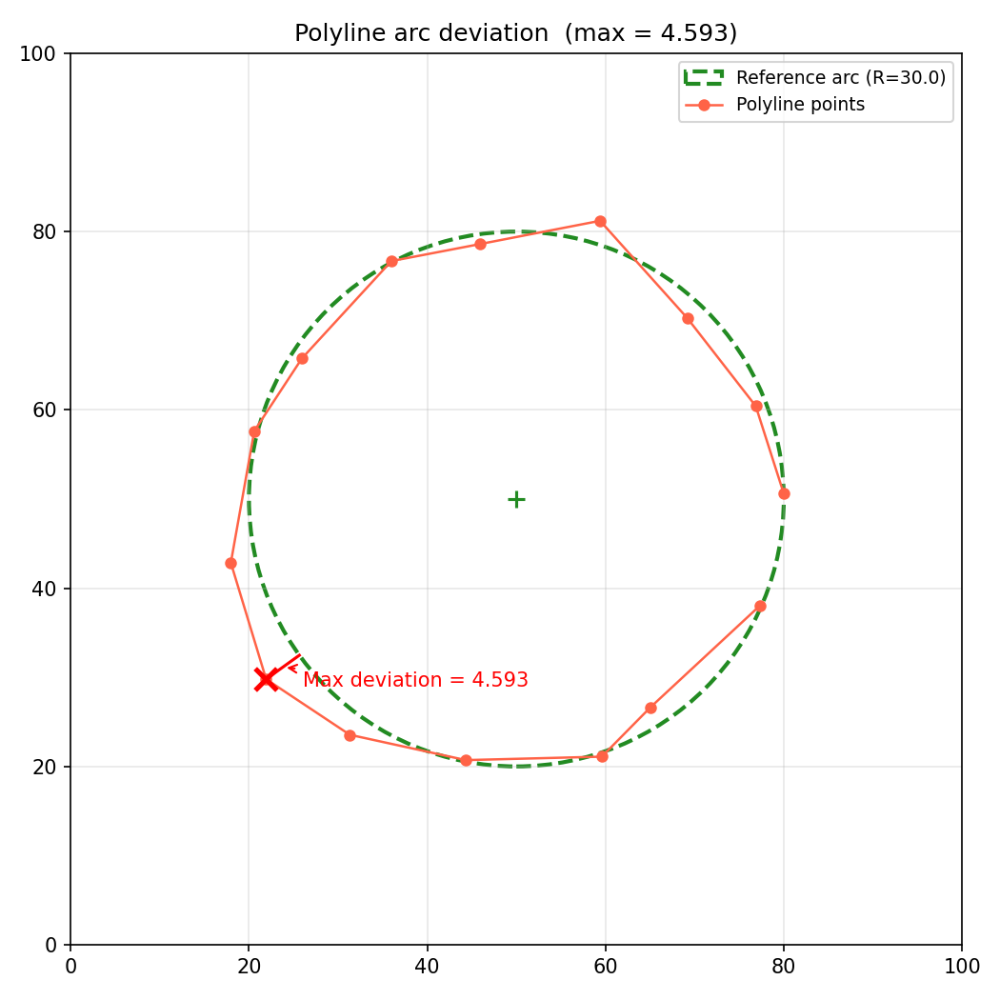
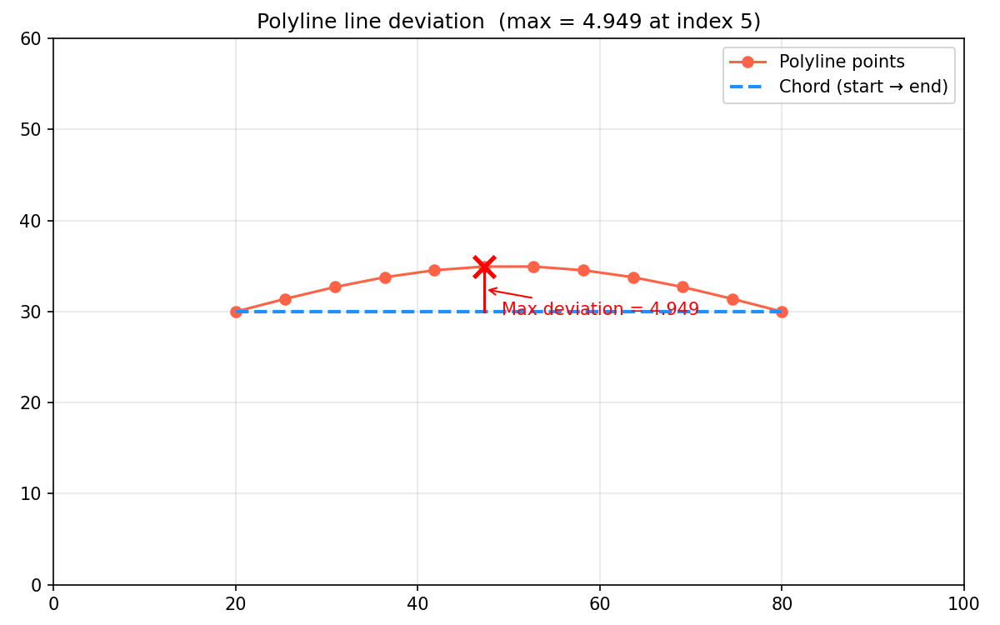
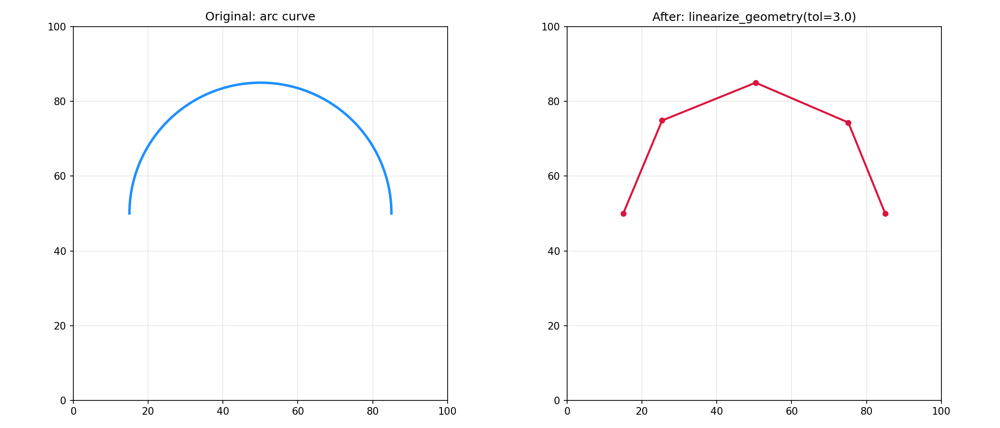
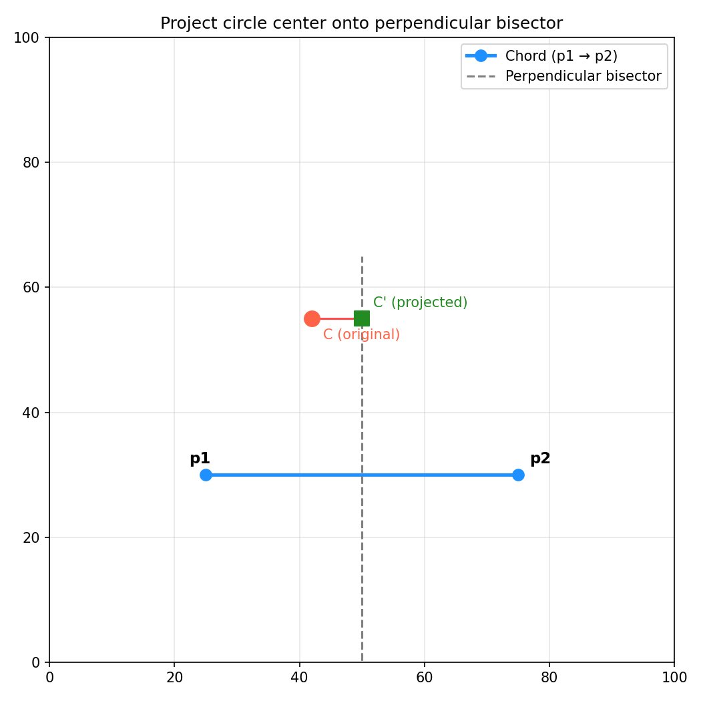

Curve and primitive fitting algorithms.

Provides functions for fitting arcs, lines, circles, and beziers to point sequences. Includes
recursive fitting with primitives, polyline linearization, and evaluating fitting quality (line and
arc deviation).

## Functions

### `are_points_collinear()`

```python
are_points_collinear(
    points: Sequence[types.Point3D],
    tolerance: float = 1e-06,
) -> bool
```

Check if three or more points are collinear within tolerance.

| Parameter    | Type                      | Description                   |
| ------------ | ------------------------- | ----------------------------- |
| `points`     | `Sequence[types.Point3D]` | Sequence of 3D points.        |
| `tolerance`  | `float = 1e-06`           | Collinearity tolerance.       |
| _Returns_    | `bool`                    | True if points are collinear. |
| _Complexity_ |                           | O(n) time, O(1) space         |

### `fit_circle_to_3_points()`

```python
fit_circle_to_3_points(
    p1: types.Point2DOr3D,
    p2: types.Point2DOr3D,
    p3: types.Point2DOr3D,
) -> Optional[tuple[types.Point, float]]
```

Fit a circle to three points.

| Parameter    | Type                                  | Description                        |
| ------------ | ------------------------------------- | ---------------------------------- |
| `p1`         | `types.Point2DOr3D`                   | First point (x, y) or (x, y, z).   |
| `p2`         | `types.Point2DOr3D`                   | Second point (x, y) or (x, y, z).  |
| `p3`         | `types.Point2DOr3D`                   | Third point (x, y) or (x, y, z).   |
| _Returns_    | `Optional[tuple[types.Point, float]]` | Tuple of (center, radius) or None. |
| _Complexity_ |                                       | O(1) time, O(1) space              |



_Circle fitted to three points_

### `fit_circle_to_points()`

```python
fit_circle_to_points(
    points: Sequence[types.Point3D],
) -> Optional[tuple[types.Point, float, float]]
```

Fit a circle to a set of points.

| Parameter    | Type                                         | Description                               |
| ------------ | -------------------------------------------- | ----------------------------------------- |
| `points`     | `Sequence[types.Point3D]`                    | Sequence of 3D points to fit.             |
| _Returns_    | `Optional[tuple[types.Point, float, float]]` | Tuple of (center, radius, error) or None. |
| _Complexity_ |                                              | O(n) time, O(1) space                     |


_Circle fitted to points_

### `fit_points_recursive()`

```python
fit_points_recursive(
    points: Sequence[types.Point3D],
    tolerance: float,
    start_idx: int,
    end_idx: int,
) -> geo.Geometry
```

Recursively fit points with line and arc primitives.

| Parameter    | Type                      | Description                         |
| ------------ | ------------------------- | ----------------------------------- |
| `points`     | `Sequence[types.Point3D]` | Sequence of 3D points to fit.       |
| `tolerance`  | `float`                   | Fitting tolerance.                  |
| `start_idx`  | `int`                     | Start index in the points array.    |
| `end_idx`    | `int`                     | End index in the points array.      |
| _Returns_    | `geo.Geometry`            | Geometry of fitted commands.        |
| _Complexity_ |                           | O(n log n) average time, O(n) space |

### `fit_points_with_primitives()`

```python
fit_points_with_primitives(
    points: Sequence[types.Point3D],
    tolerance: float,
) -> geo.Geometry
```

Fit a polyline of points with arc and line primitives.

| Parameter    | Type                      | Description                         |
| ------------ | ------------------------- | ----------------------------------- |
| `points`     | `Sequence[types.Point3D]` | Sequence of 3D points to fit.       |
| `tolerance`  | `float`                   | Fitting tolerance.                  |
| _Returns_    | `geo.Geometry`            | Geometry of fitted commands.        |
| _Complexity_ |                           | O(n log n) average time, O(n) space |


_Fitted primitives_

### `flatten_to_points()`

```python
flatten_to_points(
    geometry: geo.Geometry,
    tolerance: float,
) -> list[list[types.Point3D]]
```

Flatten curves into linear segments.

| Parameter    | Type                        | Description                                                                                   |
| ------------ | --------------------------- | --------------------------------------------------------------------------------------------- |
| `geometry`   | `geo.Geometry`              | Geometry to flatten.                                                                          |
| `tolerance`  | `float`                     | Flattening tolerance.                                                                         |
| _Returns_    | `list[list[types.Point3D]]` | List of flattened point segments.                                                             |
| _Complexity_ |                             | O(n + m) time, O(m) space where n is the number of commands and m the number of output points |



_Arc curve flattened to dense line segments_

### `get_polyline_arc_deviation()`

```python
get_polyline_arc_deviation(
    points: Sequence[types.Point3D],
    center: types.Point,
    radius: float,
) -> float
```

Get the maximum arc deviation for a set of points.

| Parameter    | Type                      | Description                     |
| ------------ | ------------------------- | ------------------------------- |
| `points`     | `Sequence[types.Point3D]` | Sequence of 3D points.          |
| `center`     | `types.Point`             | Arc center (x, y).              |
| `radius`     | `float`                   | Arc radius.                     |
| _Returns_    | `float`                   | Maximum deviation from the arc. |
| _Complexity_ |                           | O(n) time, O(1) space           |



_Maximum deviation from a reference arc_

### `get_polyline_line_deviation()`

```python
get_polyline_line_deviation(
    points: Sequence[types.Point3D],
    start: int,
    end: int,
) -> tuple[float, int]
```

Get the maximum line deviation for a segment of a polyline.

| Parameter    | Type                      | Description                             |
| ------------ | ------------------------- | --------------------------------------- |
| `points`     | `Sequence[types.Point3D]` | Sequence of 3D points.                  |
| `start`      | `int`                     | Start index.                            |
| `end`        | `int`                     | End index.                              |
| _Returns_    | `tuple[float, int]`       | Tuple of (max_deviation, index_of_max). |
| _Complexity_ |                           | O(n) time, O(1) space                   |



_Maximum deviation from a chord_

### `linearize_geometry()`

```python
linearize_geometry(geometry: geo.Geometry, tolerance: float) -> geo.Geometry
```

Linearize geometry data into line segments.

| Parameter    | Type           | Description                                                                                     |
| ------------ | -------------- | ----------------------------------------------------------------------------------------------- |
| `geometry`   | `geo.Geometry` | Geometry to linearize.                                                                          |
| `tolerance`  | `float`        | Linearization tolerance.                                                                        |
| _Returns_    | `geo.Geometry` | Linearized Geometry.                                                                            |
| _Complexity_ |                | O(n + m) time, O(m) space where n is the number of commands and m the number of output segments |



_Arc curve linearized with RDP simplification_

### `project_circle_center_to_bisector()`

```python
project_circle_center_to_bisector(
    p1: types.Point2DOr3D,
    p2: types.Point2DOr3D,
    center: types.Point,
) -> types.Point
```

Project a circle center onto the perpendicular bisector of two points.

| Parameter    | Type                | Description                       |
| ------------ | ------------------- | --------------------------------- |
| `p1`         | `types.Point2DOr3D` | First point (x, y) or (x, y, z).  |
| `p2`         | `types.Point2DOr3D` | Second point (x, y) or (x, y, z). |
| `center`     | `types.Point`       | Circle center to project.         |
| _Returns_    | `types.Point`       | Projected center point (x, y).    |
| _Complexity_ |                     | O(1) time, O(1) space             |



_Circle center projected onto the perpendicular bisector_
