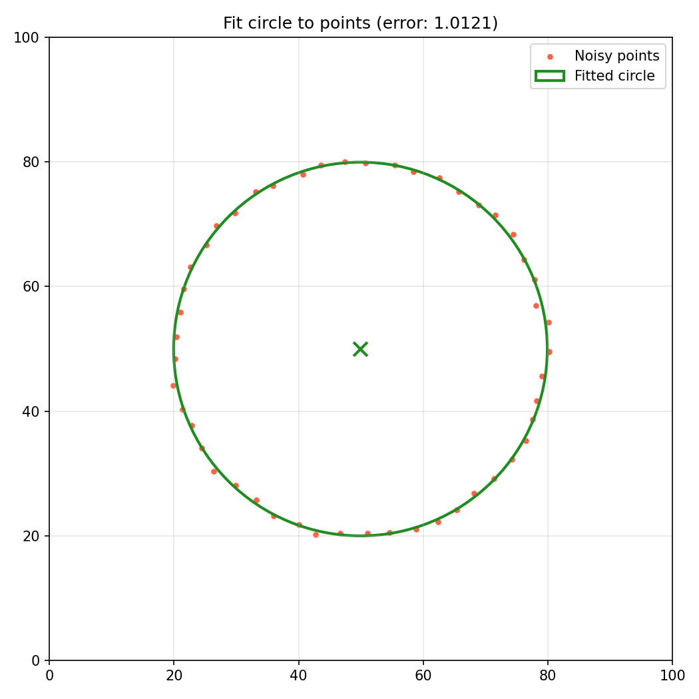
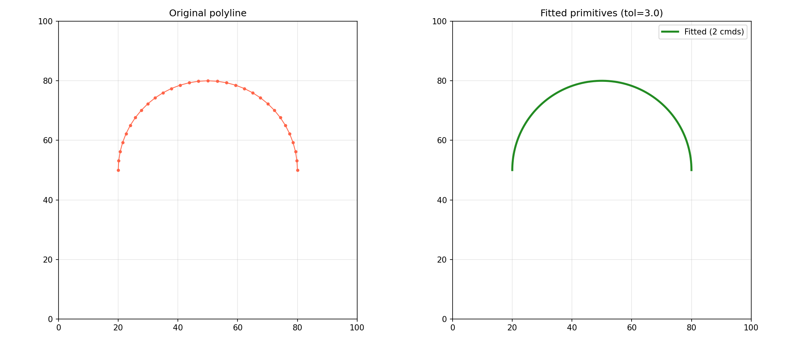

_Circle fitted to points_

_Fitted primitives_

Curve and primitive fitting algorithms.

Provides functions for fitting arcs, lines, circles, and beziers to point sequences. Includes
recursive fitting with primitives, polyline linearization, and evaluating fitting quality (line and
arc deviation).

## Functions

### `are_points_collinear()`

`are_points_collinear(points: collections.abc.Sequence[types.Point3D], tolerance: float = 1e-06) -> bool`

Check if three or more points are collinear within tolerance.

**Returns:** True if points are collinear.

| Parameter   | Type                                      | Description             |
| ----------- | ----------------------------------------- | ----------------------- |
| `points`    | `collections.abc.Sequence[types.Point3D]` | Sequence of 3D points.  |
| `tolerance` | `float = 1e-06`                           | Collinearity tolerance. |
| _Returns_   | `bool`                                    |                         |

### `create_arc_cmd()`

`create_arc_cmd(end: types.Point3D, center: types.Point, start: types.Point3D) -> geo.Arc`

Create an arc command.

**Returns:** An Arc command.

| Parameter | Type            | Description             |
| --------- | --------------- | ----------------------- |
| `end`     | `types.Point3D` | End point (x, y, z).    |
| `center`  | `types.Point`   | Center offset (dx, dy). |
| `start`   | `types.Point3D` | Start point (x, y, z).  |
| _Returns_ | `geo.Arc`       |                         |

### `create_line_cmd()`

`create_line_cmd(end_point: types.Point3D) -> geo.Line`

Create a line command from an end point.

**Returns:** A Line command.

| Parameter   | Type            | Description          |
| ----------- | --------------- | -------------------- |
| `end_point` | `types.Point3D` | End point (x, y, z). |
| _Returns_   | `geo.Line`      |                      |

### `fit_circle_to_3_points()`

`fit_circle_to_3_points(p1: types.Point2DOr3D, p2: types.Point2DOr3D, p3: types.Point2DOr3D) -> Optional[tuple[types.Point, float]]`

Fit a circle to three points.

**Returns:** Tuple of (center, radius) or None.

| Parameter | Type                                  | Description                       |
| --------- | ------------------------------------- | --------------------------------- |
| `p1`      | `types.Point2DOr3D`                   | First point (x, y) or (x, y, z).  |
| `p2`      | `types.Point2DOr3D`                   | Second point (x, y) or (x, y, z). |
| `p3`      | `types.Point2DOr3D`                   | Third point (x, y) or (x, y, z).  |
| _Returns_ | `Optional[tuple[types.Point, float]]` |                                   |

### `fit_circle_to_points()`

`fit_circle_to_points(points: collections.abc.Sequence[types.Point3D]) -> Optional[tuple[types.Point, float, float]]`

Fit a circle to a set of points.

**Returns:** Tuple of (center, radius, error) or None.

| Parameter | Type                                         | Description                   |
| --------- | -------------------------------------------- | ----------------------------- |
| `points`  | `collections.abc.Sequence[types.Point3D]`    | Sequence of 3D points to fit. |
| _Returns_ | `Optional[tuple[types.Point, float, float]]` |                               |

### `fit_points_recursive()`

`fit_points_recursive(points: collections.abc.Sequence[types.Point3D], tolerance: float, start_idx: int, end_idx: int) -> geo.Geometry`

Recursively fit points with line and arc primitives.

**Returns:** Geometry of fitted commands.

| Parameter   | Type                                      | Description                      |
| ----------- | ----------------------------------------- | -------------------------------- |
| `points`    | `collections.abc.Sequence[types.Point3D]` | Sequence of 3D points to fit.    |
| `tolerance` | `float`                                   | Fitting tolerance.               |
| `start_idx` | `int`                                     | Start index in the points array. |
| `end_idx`   | `int`                                     | End index in the points array.   |
| _Returns_   | `geo.Geometry`                            |                                  |

### `fit_points_with_primitives()`

`fit_points_with_primitives(points: collections.abc.Sequence[types.Point3D], tolerance: float) -> geo.Geometry`

Fit a polyline of points with arc and line primitives.

**Returns:** Geometry of fitted commands.

| Parameter   | Type                                      | Description                   |
| ----------- | ----------------------------------------- | ----------------------------- |
| `points`    | `collections.abc.Sequence[types.Point3D]` | Sequence of 3D points to fit. |
| `tolerance` | `float`                                   | Fitting tolerance.            |
| _Returns_   | `geo.Geometry`                            |                               |

### `flatten_to_points()`

`flatten_to_points(geometry: geo.Geometry, tolerance: float) -> list[list[types.Point3D]]`

Flatten curves into linear segments.

**Returns:** List of flattened point segments.

| Parameter   | Type                        | Description           |
| ----------- | --------------------------- | --------------------- |
| `geometry`  | `geo.Geometry`              | Geometry to flatten.  |
| `tolerance` | `float`                     | Flattening tolerance. |
| _Returns_   | `list[list[types.Point3D]]` |                       |

### `get_polyline_arc_deviation()`

`get_polyline_arc_deviation(points: collections.abc.Sequence[types.Point3D], center: types.Point, radius: float) -> float`

Get the maximum arc deviation for a set of points.

**Returns:** Maximum deviation from the arc.

| Parameter | Type                                      | Description            |
| --------- | ----------------------------------------- | ---------------------- |
| `points`  | `collections.abc.Sequence[types.Point3D]` | Sequence of 3D points. |
| `center`  | `types.Point`                             | Arc center (x, y).     |
| `radius`  | `float`                                   | Arc radius.            |
| _Returns_ | `float`                                   |                        |

### `get_polyline_line_deviation()`

`get_polyline_line_deviation(points: collections.abc.Sequence[types.Point3D], start: int, end: int) -> tuple[float, int]`

Get the maximum line deviation for a segment of a polyline.

**Returns:** Tuple of (max_deviation, index_of_max).

| Parameter | Type                                      | Description            |
| --------- | ----------------------------------------- | ---------------------- |
| `points`  | `collections.abc.Sequence[types.Point3D]` | Sequence of 3D points. |
| `start`   | `int`                                     | Start index.           |
| `end`     | `int`                                     | End index.             |
| _Returns_ | `tuple[float, int]`                       |                        |

### `linearize_geometry()`

`linearize_geometry(geometry: geo.Geometry, tolerance: float) -> geo.Geometry`

Linearize geometry data into line segments.

**Returns:** Linearized Geometry.

| Parameter   | Type           | Description              |
| ----------- | -------------- | ------------------------ |
| `geometry`  | `geo.Geometry` | Geometry to linearize.   |
| `tolerance` | `float`        | Linearization tolerance. |
| _Returns_   | `geo.Geometry` |                          |

### `project_circle_center_to_bisector()`

`project_circle_center_to_bisector(p1: types.Point2DOr3D, p2: types.Point2DOr3D, center: types.Point) -> types.Point`

Project a circle center onto the perpendicular bisector of two points.

**Returns:** Projected center point (x, y).

| Parameter | Type                | Description                       |
| --------- | ------------------- | --------------------------------- |
| `p1`      | `types.Point2DOr3D` | First point (x, y) or (x, y, z).  |
| `p2`      | `types.Point2DOr3D` | Second point (x, y) or (x, y, z). |
| `center`  | `types.Point`       | Circle center to project.         |
| _Returns_ | `types.Point`       |                                   |
