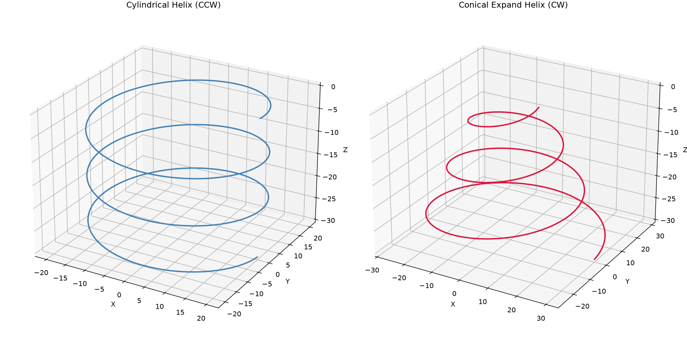

Helical and conical helical path generation.

Provides generation of 3D helical polylines (cylindrical or conical) with configurable direction
(CW/CCW), pitch, and expansion/reduction.

## HelixDirection

## Functions

### `generate_helix_3d()`

```python
generate_helix_3d(
    center: tuple[float, float],
    start_radius: float,
    end_radius: float,
    z_start: float,
    z_end: float,
    pitch: float,
    direction: HelixDirection,
    angular_step: float = 0.1,
    min_revolutions: int | None = None,
) -> list[tuple[float, float, float]]
```

Generate a 3D helical polyline.

| Parameter         | Type                               | Description                                                |
| ----------------- | ---------------------------------- | ---------------------------------------------------------- |
| `center`          | `tuple[float, float]`              | Center (x, y) of the helix.                                |
| `start_radius`    | `float`                            | Starting radius at z_start.                                |
| `end_radius`      | `float`                            | Ending radius at z_end.                                    |
| `z_start`         | `float`                            | Starting Z height.                                         |
| `z_end`           | `float`                            | Ending Z height (must be lower than z_start).              |
| `pitch`           | `float`                            | Z descent per full revolution.                             |
| `direction`       | `HelixDirection`                   | CW or CCW revolution.                                      |
| `angular_step`    | `float = 0.1`                      | Angular step in radians per vertex (default 0.1).          |
| `min_revolutions` | `int &#124; None = None`           | Minimum number of revolutions (optional).                  |
| _Returns_         | `list[tuple[float, float, float]]` | List of (x, y, z) points approximating the helix.          |
| _Complexity_      |                                    | O(n) time, O(n) space where n = total_angle / angular_step |



*Cylindrical (CCW) and conical-expand (CW) helical paths*
