_Adaptive clearing — Helix → Spiral in a pocket with three islands_

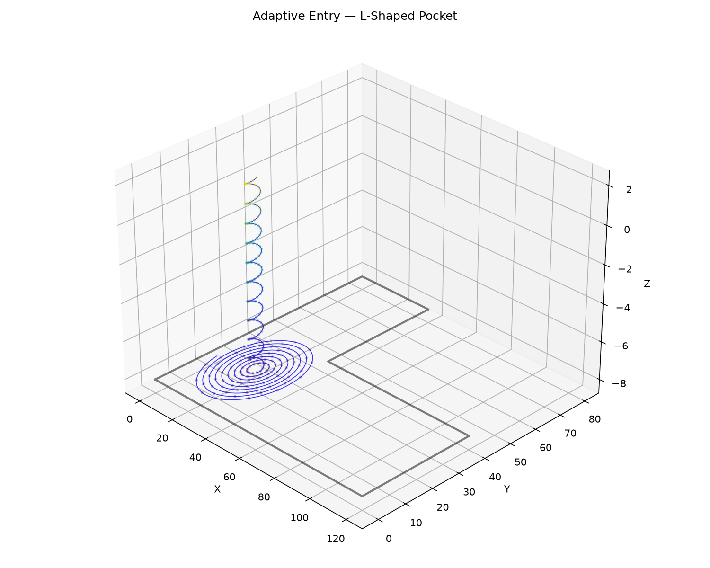

_Adaptive clearing — Helix → Spiral in an L-shaped pocket_


_Adaptive clearing — ZigZag Ramp in a tight slot_ HSM (High-Speed Machining) adaptive clearing.

- `adaptive_entry` — find the optimal entry pole, then helix + spiral (wide area) or zigzag ramp
  (tight slot).
- `adaptive_wavefronts` — inside-out expansion loop: each iteration expands the cleared boundary
  outward by `step_over`, clips to the valid tool area, applies a minimum-curvature filter, and
  updates the cleared state until convergence.
- `adaptive_peeling` — inside-out D-biting (peeling): each iteration expands the cleared boundary,
  clips to the valid tool area, computes crescent-shaped `bites`, and traces the full perimeter of
  each bite before incorporating it into the cleared state.

## Functions

### `adaptive_entry()`

```python
adaptive_entry(
    pocket_boundary: Sequence[tuple[float, float]],
    islands: Sequence[Sequence[tuple[float, float]]] = [],
    tool_radius: float = 3,
    step_over: float = 2,
    safe_z: float = 2,
    target_z: float = -5,
    plunge_pitch: float = 1,
    safe_margin: float = 1,
    angular_step: float = 0.1,
) -> tuple[list[tuple[float, float, float]], list[list[tuple[float, float]]]]
```

Fast central clearing entry.

Finds the optimal entry pole using `find_largest_circle`, then generates either a helix->spiral
(wide area) or zigzag ramp (tight slot).

The returned _cleared_polygons_ should be inserted into a `ClearedArea` via `add_cleared_polygons`.

             `find_largest_circle` where m is the polygon vertex count.

| Parameter         | Type                                                                       | Description                                                                                                                                                                                |
| ----------------- | -------------------------------------------------------------------------- | ------------------------------------------------------------------------------------------------------------------------------------------------------------------------------------------ |
| `pocket_boundary` | `Sequence[tuple[float, float]]`                                            | Outer boundary of the pocket.                                                                                                                                                              |
| `islands`         | `Sequence[Sequence[tuple[float, float]]] = []`                             | List of island (hole) polygons (default []).                                                                                                                                               |
| `tool_radius`     | `float = 3`                                                                | Tool radius in mm (default 3.0).                                                                                                                                                           |
| `step_over`       | `float = 2`                                                                | Radial step-over per spiral revolution (default 2.0).                                                                                                                                      |
| `safe_z`          | `float = 2`                                                                | Safe (retract) Z height (default 2.0).                                                                                                                                                     |
| `target_z`        | `float = -5`                                                               | Target cutting depth (default -5.0).                                                                                                                                                       |
| `plunge_pitch`    | `float = 1`                                                                | Vertical descent per helix revolution (default 1.0).                                                                                                                                       |
| `safe_margin`     | `float = 1`                                                                | Extra margin from tool edge to boundary (default 1.0).                                                                                                                                     |
| `angular_step`    | `float = 0.1`                                                              | Angular step in radians for path vertices (default 0.1).                                                                                                                                   |
| _Returns_         | `tuple[list[tuple[float, float, float]], list[list[tuple[float, float]]]]` | `(toolpath, cleared_polygons)` where \*toolpath\* is a list of (x, y, z) points and \*cleared_polygons\* is a list of polygons (each a list of (x, y) points) to add to the `ClearedArea`. |
| _Complexity_      |                                                                            | O(n) for the spiral/helix generation, O(m log m) for                                                                                                                                       |

### `adaptive_peeling()`

```python
adaptive_peeling(
    cleared: geo.algo.cleared_area.ClearedArea,
    pocket_boundary: Sequence[tuple[float, float]],
    islands: Sequence[Sequence[tuple[float, float]]] = [],
    tool_radius: float = 3,
    step_over: float = 2,
    z: float = 0,
    safe_z: float | None = None,
    area_tolerance: float = 1,
    wall_margin: float = 0,
) -> list[tuple[float, float, float]]
```

Inside-out adaptive peeling (D-biting).

Starting from the _cleared_ state, each iteration expands the cleared boundary outward by
_step_over_, clips to the valid tool area, computes crescent-shaped "bites", and generates a D-cut
for each bite. The individual passes are linked into a single continuous toolpath: each cutting arc
at _z_ followed by a travel segment at _safe_z_ to the next cut. The Medial Axis of the pocket is
used to route travel around obstacles.

| Parameter         | Type                                           | Description                                                                                                                                     |
| ----------------- | ---------------------------------------------- | ----------------------------------------------------------------------------------------------------------------------------------------------- |
| `cleared`         | `geo.algo.cleared_area.ClearedArea`            | `ClearedArea` instance (mutated in place).                                                                                                      |
| `pocket_boundary` | `Sequence[tuple[float, float]]`                | Outer boundary of the pocket.                                                                                                                   |
| `islands`         | `Sequence[Sequence[tuple[float, float]]] = []` | List of island (hole) polygons (default []).                                                                                                    |
| `tool_radius`     | `float = 3`                                    | Tool radius in mm (default 3.0).                                                                                                                |
| `step_over`       | `float = 2`                                    | Radial expansion per iteration (default 2.0).                                                                                                   |
| `z`               | `float = 0`                                    | Cutting Z height (default 0.0).                                                                                                                 |
| `safe_z`          | `float &#124; None = None`                     | Retract Z height for travel segments (defaults to _z_, meaning no lift).                                                                        |
| `area_tolerance`  | `float = 1`                                    | Minimum area increase to continue (default 1.0).                                                                                                |
| `wall_margin`     | `float = 0`                                    | Extra clearance (mm) kept between the tool sweep and the pocket wall / islands when trimming cutting arcs. `0.0` allows tangency (default 0.0). |
| _Returns_         | `list[tuple[float, float, float]]`             | Single continuous toolpath `list[(x, y, z)]` with cutting arcs at \*z\* and travel at \*safe_z\*.                                               |

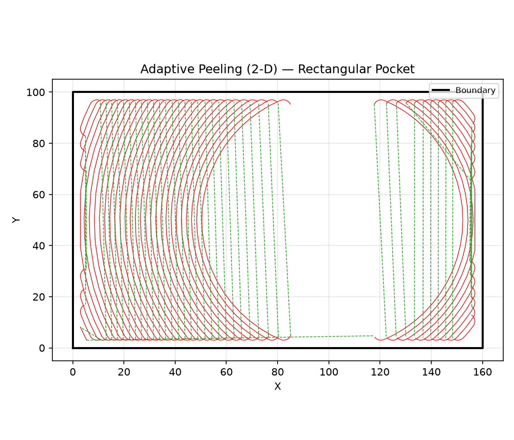

_Adaptive peeling (D-biting) in a rectangular pocket — outer (cutting) arc at depth and inner
(return) arc at lift Z form the characteristic D-shape_

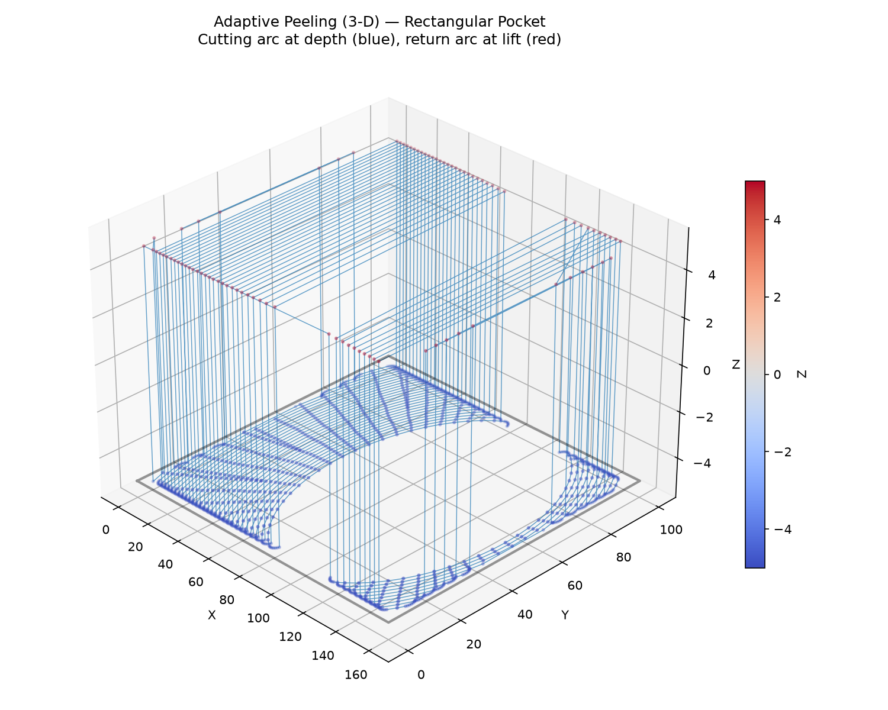

_Adaptive peeling (D-biting) in a rectangular pocket — 3-D view with colour by Z: the cutting arc at
depth (blue) and the return arc at lift (red)_

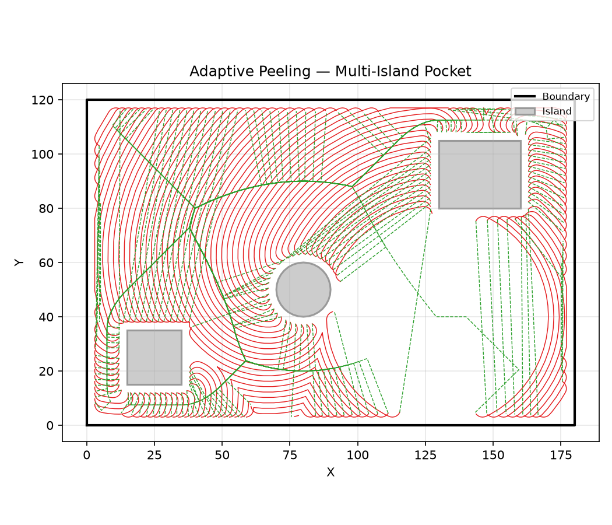

_Adaptive peeling (D-biting) in a pocket with three islands_

### `adaptive_wavefronts()`

```python
adaptive_wavefronts(
    cleared: geo.algo.cleared_area.ClearedArea,
    pocket_boundary: Sequence[tuple[float, float]],
    islands: Sequence[Sequence[tuple[float, float]]] = [],
    tool_radius: float = 3,
    step_over: float = 2,
    z: float = 0,
    area_tolerance: float = 1,
) -> list[list[tuple[float, float, float]]]
```

Inside-out adaptive wavefronts.

Starting from the _cleared_ state, each iteration expands the cleared boundary outward by
_step_over_, clips to the valid tool area (pocket boundary offset inward by _tool_radius_, with
islands excluded), and adds the result back to _cleared_. The loop terminates when the newly added
area drops below _area_tolerance_.

    vertices, m = cleared fragments, p = polygon vertices

| Parameter         | Type                                           | Description                                                   |
| ----------------- | ---------------------------------------------- | ------------------------------------------------------------- |
| `cleared`         | `geo.algo.cleared_area.ClearedArea`            | `ClearedArea` instance (mutated in place).                    |
| `pocket_boundary` | `Sequence[tuple[float, float]]`                | Outer boundary of the pocket.                                 |
| `islands`         | `Sequence[Sequence[tuple[float, float]]] = []` | List of island (hole) polygons (default []).                  |
| `tool_radius`     | `float = 3`                                    | Tool radius in mm (default 3.0).                              |
| `step_over`       | `float = 2`                                    | Radial expansion per iteration (default 2.0).                 |
| `z`               | `float = 0`                                    | Z height for generated toolpath points (default 0.0).         |
| `area_tolerance`  | `float = 1`                                    | Minimum area increase to continue (default 1.0).              |
| _Returns_         | `list[list[tuple[float, float, float]]]`       | List of toolpaths — one `list[(x, y, z)]` per iteration.      |
| _Complexity_      |                                                | O(i \* (n \* m + p log p)) where i = iterations, n = boundary |

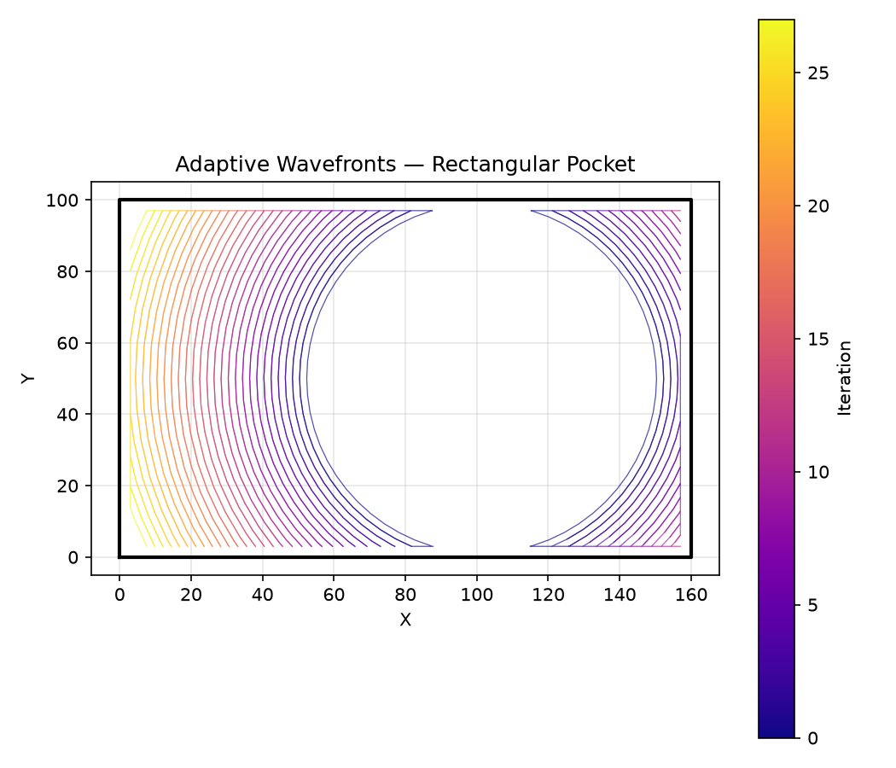

_Adaptive wavefronts expanding outward from the initial cleared disk (blue) to fill the pocket
boundary (black)_

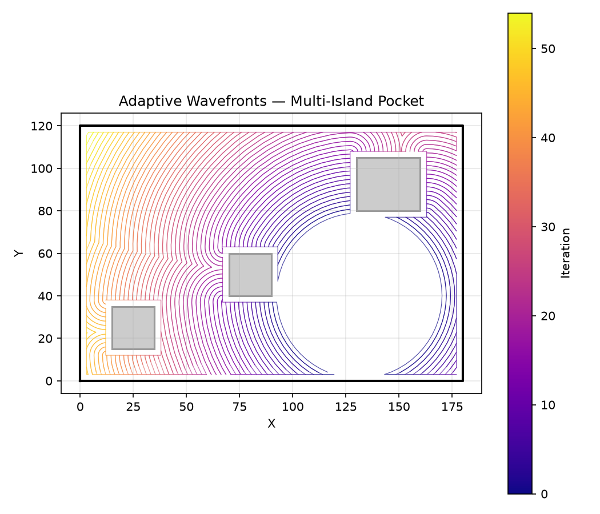

_Adaptive wavefronts in a pocket with three islands — contours wrap around each island as they
expand_

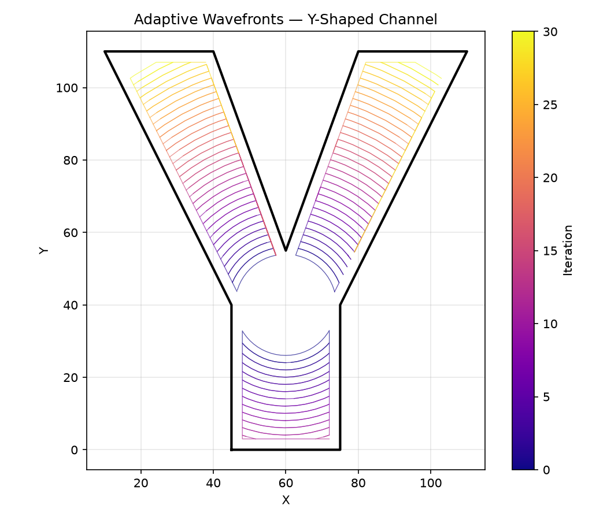

_Adaptive wavefronts in a Y-shaped channel — contours split and propagate along each branch_

### `fillet_arc_ends()`

```python
fillet_arc_ends(
    arc: Sequence[tuple[float, float]],
    pocket_boundary: Sequence[tuple[float, float]],
    islands: Sequence[Sequence[tuple[float, float]]] = [],
    tool_radius: float = 3,
    wall_margin: float = 0,
) -> list[tuple[float, float]]
```

Round both ends of a cutting arc with quarter-circle fillets.

The arc is trimmed to the longest sub-arc whose tool sweep (arc + end fillets of _tool_radius_) does
not collide with _pocket_boundary_ or _islands_. A 90° fillet of _tool_radius_ is then appended at
each end.

| Parameter         | Type                                           | Description                                  |
| ----------------- | ---------------------------------------------- | -------------------------------------------- |
| `arc`             | `Sequence[tuple[float, float]]`                | Cutting arc vertices (open polyline).        |
| `pocket_boundary` | `Sequence[tuple[float, float]]`                | Outer boundary of the pocket.                |
| `islands`         | `Sequence[Sequence[tuple[float, float]]] = []` | List of island (hole) polygons (default []). |
| `tool_radius`     | `float = 3`                                    | Tool / fillet radius in mm (default 3.0).    |
| `wall_margin`     | `float = 0`                                    | Extra clearance past tangency (default 0.0). |
| _Returns_         | `list[tuple[float, float]]`                    | Filleted arc as an open polyline.            |

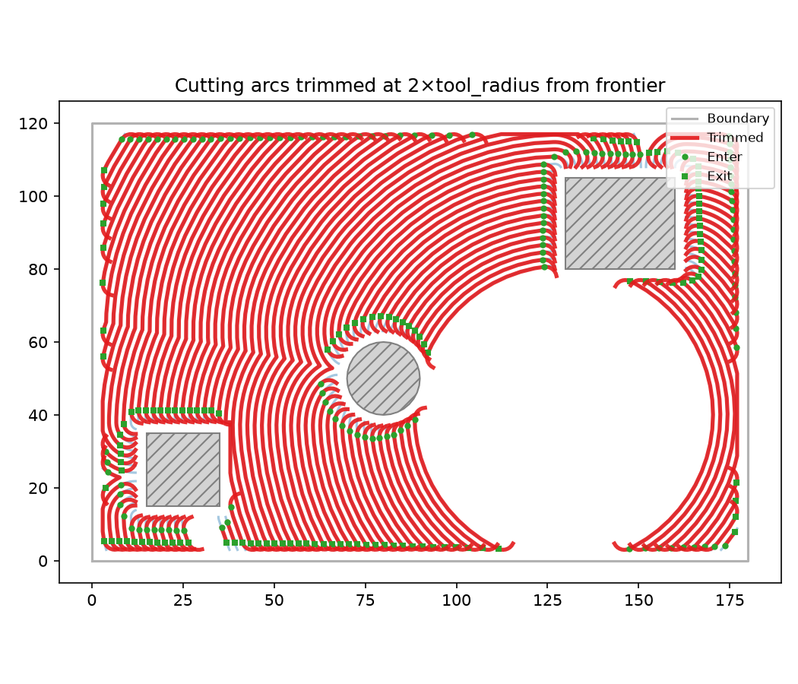

_Cutting arcs (blue) with their ends rounded (red) to flow tangentially into the frontier_

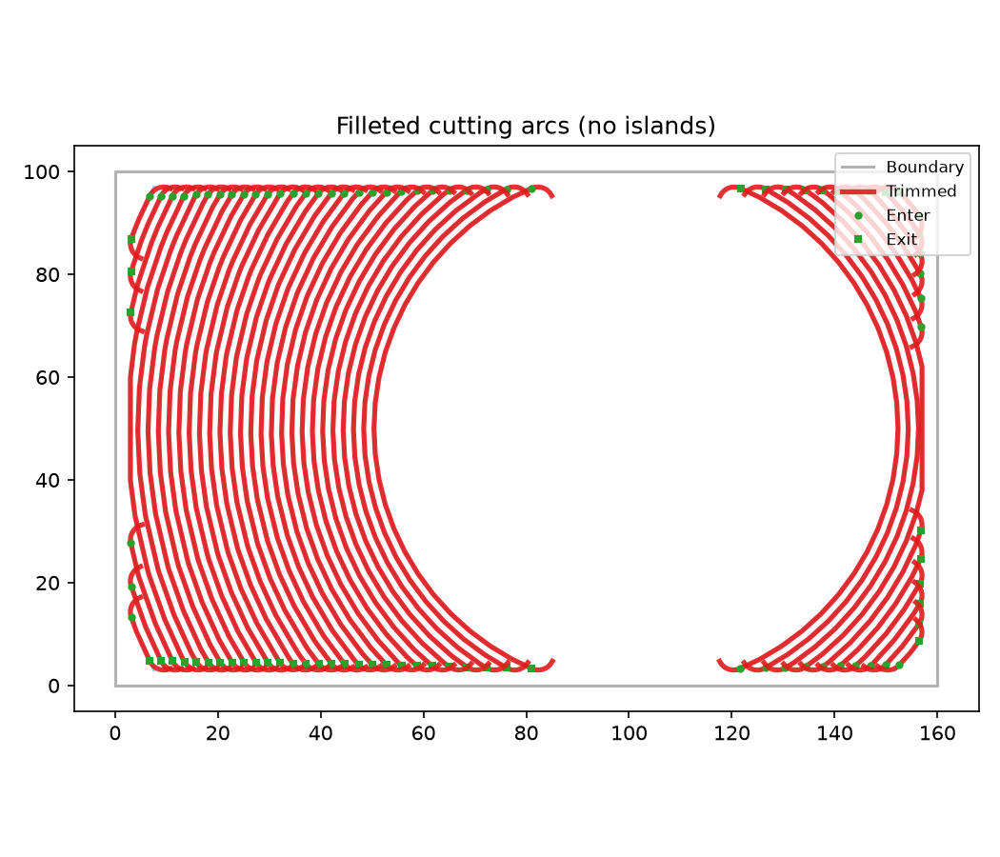

_Filleted cutting arcs without islands_

### `find_cutting_arc()`

```python
find_cutting_arc(
    bite: Sequence[tuple[float, float]],
    cleared_fragments: Sequence[Sequence[tuple[float, float]]],
) -> list[tuple[float, float]] | None
```

Extract the cutting arc (outer) vertices from a bite polygon.

The cutting arc is the longest contiguous run of bite vertices that lie _outside_ all cleared
fragments.

| Parameter           | Type                                      | Description                                      |
| ------------------- | ----------------------------------------- | ------------------------------------------------ |
| `bite`              | `Sequence[tuple[float, float]]`           | Bite polygon vertices.                           |
| `cleared_fragments` | `Sequence[Sequence[tuple[float, float]]]` | List of cleared-area polygons.                   |
| _Returns_           | `list[tuple[float, float]] &#124; None`   | The cutting arc polyline, or None if degenerate. |


_Bite polygons from the first peeling iteration with the cutting arc (outer edge) highlighted in red
— the cleared area is shown in blue_

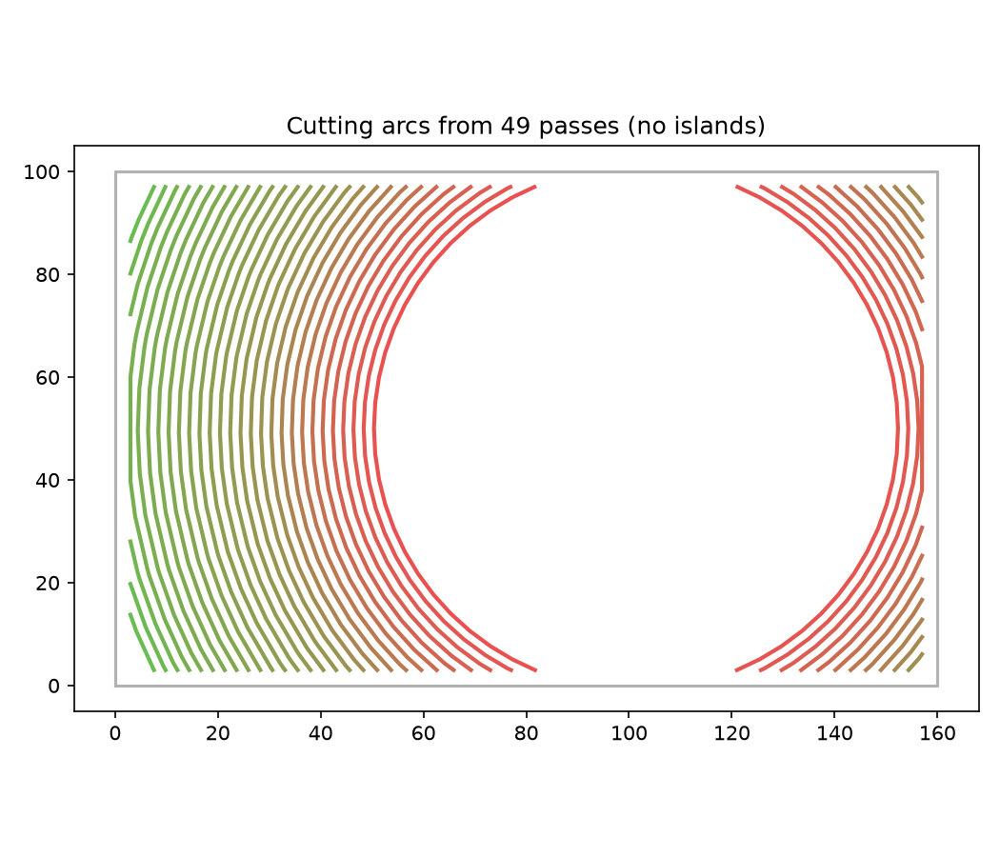

_Cutting arcs from passes without islands_

### `find_safe_sweep_end()`

```python
find_safe_sweep_end(
    arc: Sequence[tuple[float, float]],
    pocket_boundary: Sequence[tuple[float, float]],
    islands: Sequence[Sequence[tuple[float, float]]] = [],
    tool_radius: float = 3,
    wall_margin: float = 0,
) -> tuple[tuple[float, float], tuple[float, float]] | None
```

Find the longest safe sub-arc by iterative sweep shortening.

Returns the two points `(enter, exit)` delimiting the longest sub-arc of _arc_ whose tool sweep
(arc + end fillets of _tool_radius_) does not collide with _pocket_boundary_ or _islands_. Shortens
from each end until the sweep is clear. Returns `None` when no usable safe sub-arc remains.

| Parameter         | Type                                                          | Description                                  |
| ----------------- | ------------------------------------------------------------- | -------------------------------------------- |
| `arc`             | `Sequence[tuple[float, float]]`                               | Cutting arc vertices (open polyline).        |
| `pocket_boundary` | `Sequence[tuple[float, float]]`                               | Outer boundary of the pocket.                |
| `islands`         | `Sequence[Sequence[tuple[float, float]]] = []`                | List of island (hole) polygons (default []). |
| `tool_radius`     | `float = 3`                                                   | Tool radius in mm (default 3.0).             |
| `wall_margin`     | `float = 0`                                                   | Extra clearance past tangency (default 0.0). |
| _Returns_         | `tuple[tuple[float, float], tuple[float, float]] &#124; None` |                                              |

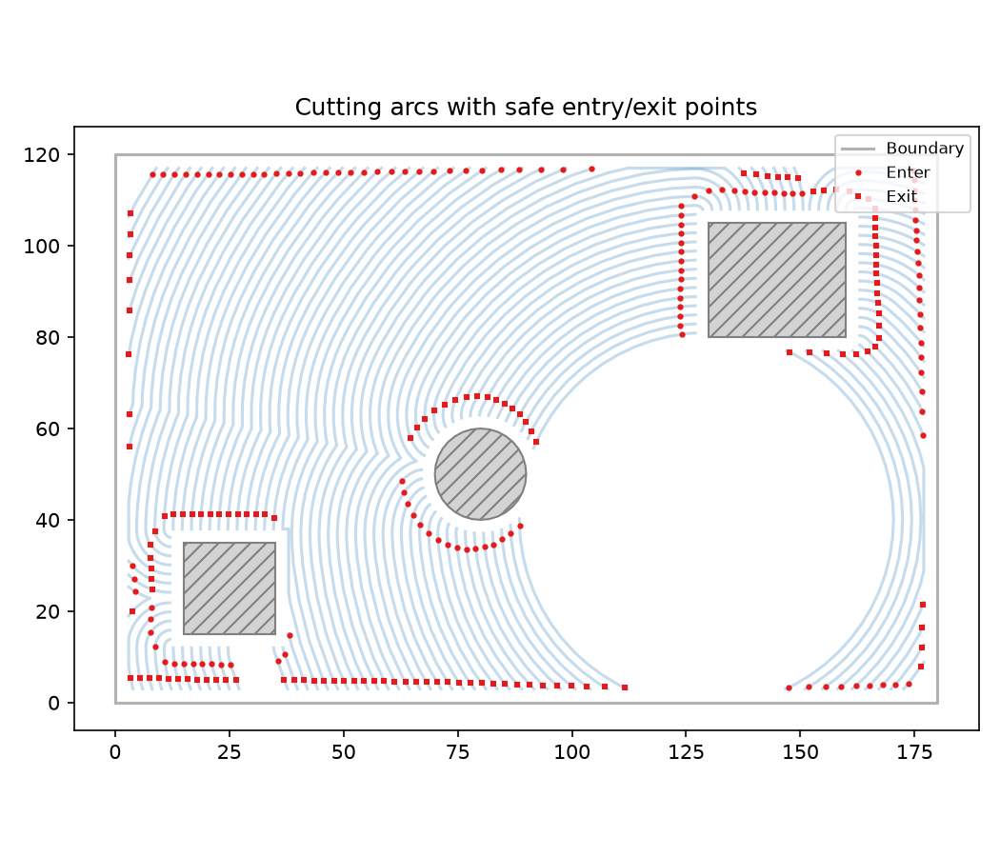

_Cutting arcs trimmed (red) by iterative sweep shortening until the tool sweep no longer collides
with the boundary or islands — original arc shown in blue_

### `link_filleted_arcs()`

```python
link_filleted_arcs(
    arcs: Sequence[Sequence[tuple[float, float]]],
    uncleared: Sequence[Sequence[tuple[float, float]]],
    z: float = 0,
    safe_z: float = 2,
    mat: tuple[list[tuple[float, float]], list[tuple[int, int]]] | None = None,
    safe_margin: float = 0,
) -> list[tuple[float, float, float]]
```

Link filleted arcs into a continuous 3-D polyline.

Consecutive arcs are joined by a straight segment at _safe_z_. When the direct line would cross (or
pass within _safe_margin_ of) any polygon in _uncleared_, the connection uses the Medial Axis to
route around obstacles.

| Parameter     | Type                                                                         | Description                                                                                                                                                  |
| ------------- | ---------------------------------------------------------------------------- | ------------------------------------------------------------------------------------------------------------------------------------------------------------ |
| `arcs`        | `Sequence[Sequence[tuple[float, float]]]`                                    | Sequence of filleted arcs (each a list of (x, y) points).                                                                                                    |
| `uncleared`   | `Sequence[Sequence[tuple[float, float]]]`                                    | Areas to avoid during travel.                                                                                                                                |
| `z`           | `float = 0`                                                                  | Cutting height (default 0).                                                                                                                                  |
| `safe_z`      | `float = 2`                                                                  | Safe (rapid) height (default 2).                                                                                                                             |
| `mat`         | `tuple[list[tuple[float, float]], list[tuple[int, int]]] &#124; None = None` | Optional `(nodes, edges)` tuple from `compute_medial_axis`. When provided, blocked travel segments are routed through the MAT graph.                         |
| `safe_margin` | `float = 0`                                                                  | Minimum distance from uncleared polygons for a direct travel line to be considered safe (default 0 = no check). Set to _tool_radius_ to prevent near-misses. |
| _Returns_     | `list[tuple[float, float, float]]`                                           | Single continuous 3-D polyline.                                                                                                                              |

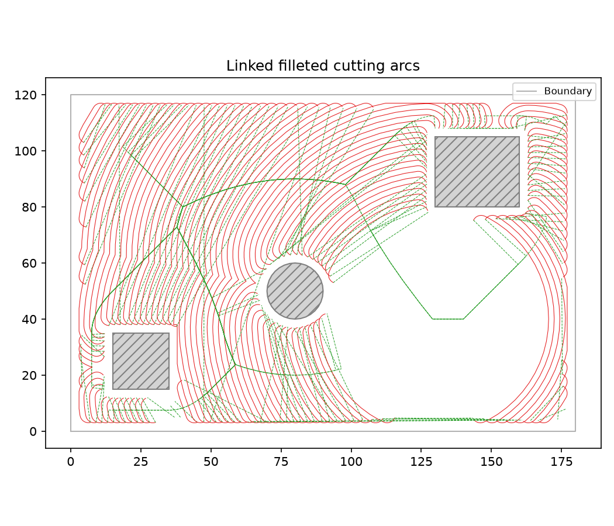

_Filleted cutting arcs linked end-to-start into a single continuous polyline_
