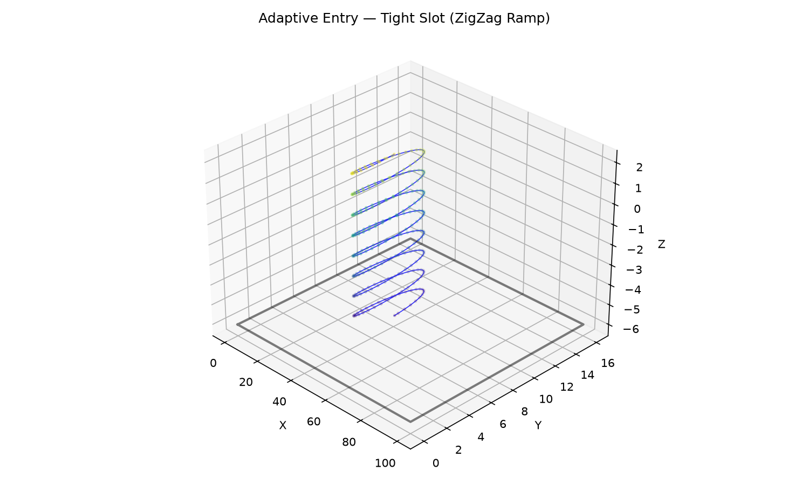

_Adaptive clearing — Helix → Spiral in a pocket with three islands_


_Adaptive clearing — Helix → Spiral in an L-shaped pocket_



_Adaptive clearing — ZigZag Ramp in a tight slot_ HSM (High-Speed Machining) adaptive clearing.

- `adaptive_entry` — find the optimal entry pole, then helix + spiral (wide area) or zigzag ramp
  (tight slot).

## Functions

### `adaptive_entry()`

```python
adaptive_entry(
    pocket_boundary: Sequence[tuple[float, float]],
    islands: Sequence[Sequence[tuple[float, float]]] = [],
    tool_radius: float = 3,
    step_over: float = 2,
    safe_z: float = 2,
    target_z: float = -5,
    plunge_pitch: float = 1,
    safe_margin: float = 1,
    angular_step: float = 0.1,
) -> tuple[list[tuple[float, float, float]], list[list[tuple[float, float]]]]
```

Fast central clearing entry.

Finds the optimal entry pole using `find_largest_circle`, then generates either a helix->spiral
(wide area) or zigzag ramp (tight slot).

The returned _cleared_polygons_ should be inserted into a `ClearedArea` via `add_cleared_polygons`.

             `find_largest_circle` where m is the polygon vertex count.

| Parameter         | Type                                                                       | Description                                                                                                                                                                                |
| ----------------- | -------------------------------------------------------------------------- | ------------------------------------------------------------------------------------------------------------------------------------------------------------------------------------------ |
| `pocket_boundary` | `Sequence[tuple[float, float]]`                                            | Outer boundary of the pocket.                                                                                                                                                              |
| `islands`         | `Sequence[Sequence[tuple[float, float]]] = []`                             | List of island (hole) polygons (default []).                                                                                                                                               |
| `tool_radius`     | `float = 3`                                                                | Tool radius in mm (default 3.0).                                                                                                                                                           |
| `step_over`       | `float = 2`                                                                | Radial step-over per spiral revolution (default 2.0).                                                                                                                                      |
| `safe_z`          | `float = 2`                                                                | Safe (retract) Z height (default 2.0).                                                                                                                                                     |
| `target_z`        | `float = -5`                                                               | Target cutting depth (default -5.0).                                                                                                                                                       |
| `plunge_pitch`    | `float = 1`                                                                | Vertical descent per helix revolution (default 1.0).                                                                                                                                       |
| `safe_margin`     | `float = 1`                                                                | Extra margin from tool edge to boundary (default 1.0).                                                                                                                                     |
| `angular_step`    | `float = 0.1`                                                              | Angular step in radians for path vertices (default 0.1).                                                                                                                                   |
| _Returns_         | `tuple[list[tuple[float, float, float]], list[list[tuple[float, float]]]]` | `(toolpath, cleared_polygons)` where \*toolpath\* is a list of (x, y, z) points and \*cleared_polygons\* is a list of polygons (each a list of (x, y) points) to add to the `ClearedArea`. |
| _Complexity_      |                                                                            | O(n) for the spiral/helix generation, O(m log m) for                                                                                                                                       |
