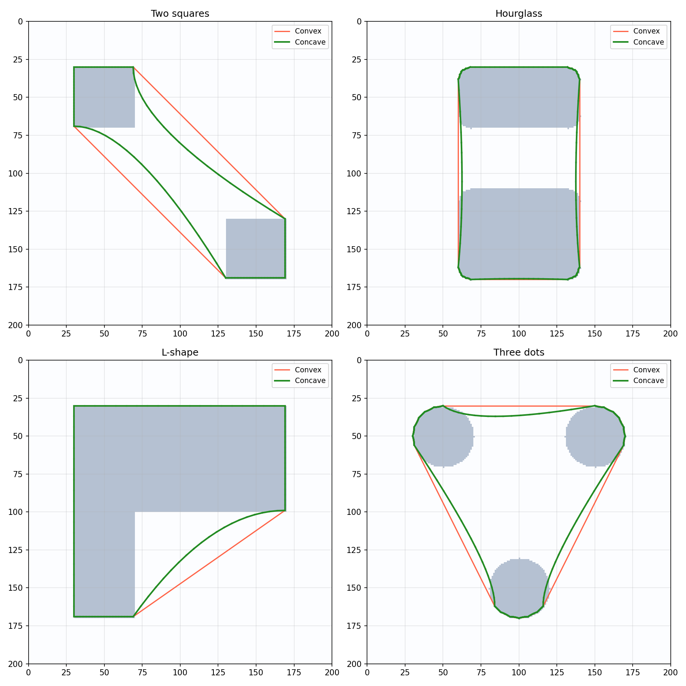

Hull computation from binary images.

Provides convex and concave (shrink-wrap) hull generation from boolean images, using contour tracing
and Bézier gravity attraction. Coordinates are returned in image pixel space (y increases downward).

## Functions

### `get_concave_hull()`

`get_concave_hull(boolean_image: numpy.ndarray, gravity: float = 0.1) -> Geometry | None`

Compute a concave (shrink-wrap) hull with Bézier gravity.

**Returns:** Concave hull as Geometry in pixel coords, or None.

| Parameter       | Type                   | Description                                                                                                                                    |
| --------------- | ---------------------- | ---------------------------------------------------------------------------------------------------------------------------------------------- |
| `boolean_image` | `numpy.ndarray`        | 2D boolean array.                                                                                                                              |
| `gravity`       | `float = 0.1`          | Shrink-wrap factor 0.0-1.0. 0 gives convex hull.                                                                                               |
| _Returns_       | `Geometry &#124; None` |                                                                                                                                                |
| _Complexity_    |                        | O(w*h + n log n + n * g) time, O(n) space where w\*h is the image size, n the number of contour points, and g the number of gravity iterations |

_Concave vs convex hull_

### `get_enclosing_hull()`

`get_enclosing_hull(boolean_image: numpy.ndarray) -> Geometry | None`

Compute a single convex hull enclosing all content.

**Returns:** Convex hull as Geometry in pixel coords, or None.

| Parameter       | Type                   | Description                                                                                      |
| --------------- | ---------------------- | ------------------------------------------------------------------------------------------------ |
| `boolean_image` | `numpy.ndarray`        | 2D boolean array.                                                                                |
| _Returns_       | `Geometry &#124; None` |                                                                                                  |
| _Complexity_    |                        | O(w*h + n log n) time, O(n) space where w*h is the image size and n the number of contour points |

### `get_hulls_from_image()`

`get_hulls_from_image(boolean_image: numpy.ndarray) -> list[Geometry]`

Compute a separate convex hull for each distinct component.

**Returns:** List of Geometry objects in pixel coords.

| Parameter       | Type             | Description                                                                                            |
| --------------- | ---------------- | ------------------------------------------------------------------------------------------------------ |
| `boolean_image` | `numpy.ndarray`  | 2D boolean array.                                                                                      |
| _Returns_       | `list[Geometry]` |                                                                                                        |
| _Complexity_    |                  | O(w*h + n log n) time, O(n) space where w*h is the image size and n the total number of contour points |
