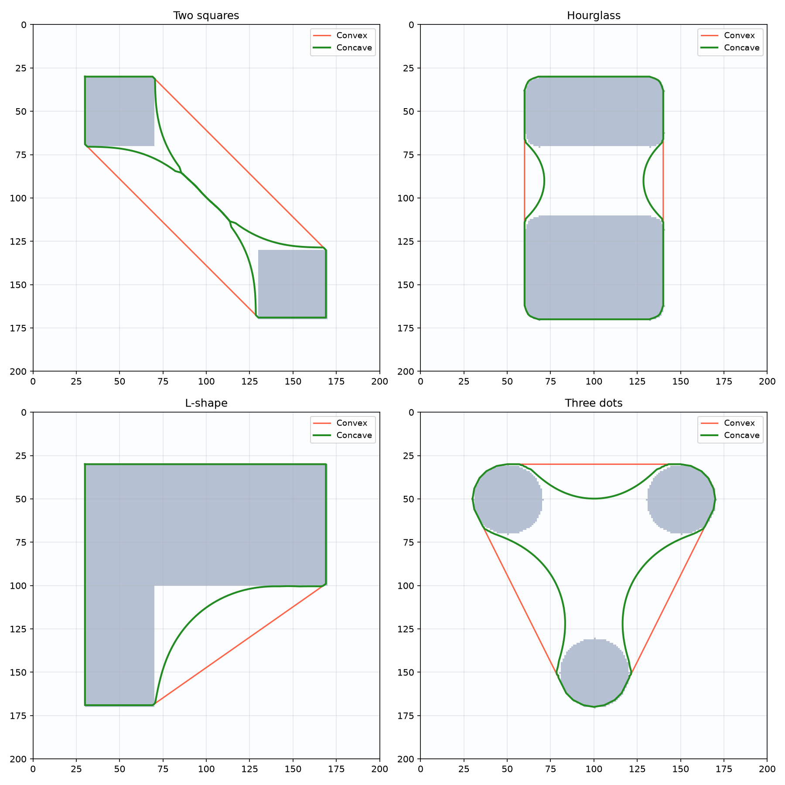

Hull computation from binary images.

Provides convex and concave (shrink-wrap) hull generation from boolean images, using contour tracing
and Bézier gravity attraction. Coordinates are returned in image pixel space (y increases downward).

## Functions

### `get_concave_hull()`

```python
get_concave_hull(
    boolean_image: numpy.ndarray,
    gravity: float = 0.1,
) -> geo.Geometry | None
```

Compute a concave (shrink-wrap) hull with Bézier gravity.

| Parameter       | Type                       | Description                                                                                                                                   |
| --------------- | -------------------------- | --------------------------------------------------------------------------------------------------------------------------------------------- |
| `boolean_image` | `numpy.ndarray`            | 2D boolean array.                                                                                                                             |
| `gravity`       | `float = 0.1`              | Shrink-wrap factor 0.0-1.0. 0 gives convex hull.                                                                                              |
| _Returns_       | `geo.Geometry &#124; None` | Concave hull as Geometry in pixel coords, or None.                                                                                            |
| _Complexity_    |                            | O(w*h + n log n + n * g) time, O(n) space where w*h is the image size, n the number of contour points, and g the number of gravity iterations |



*Concave vs convex hull*

### `get_enclosing_hull()`

```python
get_enclosing_hull(boolean_image: numpy.ndarray) -> geo.Geometry | None
```

Compute a single convex hull enclosing all content.

| Parameter       | Type                       | Description                                                                                      |
| --------------- | -------------------------- | ------------------------------------------------------------------------------------------------ |
| `boolean_image` | `numpy.ndarray`            | 2D boolean array.                                                                                |
| _Returns_       | `geo.Geometry &#124; None` | Convex hull as Geometry in pixel coords, or None.                                                |
| _Complexity_    |                            | O(w*h + n log n) time, O(n) space where w*h is the image size and n the number of contour points |

### `get_hulls_from_image()`

```python
get_hulls_from_image(boolean_image: numpy.ndarray) -> list[geo.Geometry]
```

Compute a separate convex hull for each distinct component.

| Parameter       | Type                 | Description                                                                                            |
| --------------- | -------------------- | ------------------------------------------------------------------------------------------------------ |
| `boolean_image` | `numpy.ndarray`      | 2D boolean array.                                                                                      |
| _Returns_       | `list[geo.Geometry]` | List of Geometry objects in pixel coords.                                                              |
| _Complexity_    |                      | O(w*h + n log n) time, O(n) space where w*h is the image size and n the total number of contour points |
