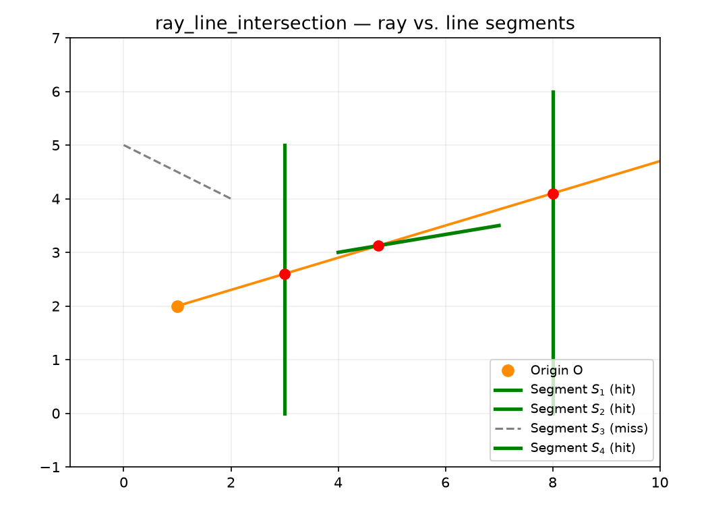

Geometry intersection utilities.

Low-level intersection primitives for ray-segment and segment-segment tests, plus higher-level
self-intersection and cross-intersection checks on geometry command arrays.

## Functions

### `ray_line_intersection()`

```python
ray_line_intersection(
    origin: tuple[float, float],
    direction: tuple[float, float],
    a: tuple[float, float],
    b: tuple[float, float],
) -> tuple[float, float] | None
```

Intersect a ray with a line segment.

Given a ray starting at origin in the given direction, and a line segment from a to b, returns the
intersection point if the ray hits the segment (including endpoints) in the forward direction, or
None if there is no intersection.

| Parameter    | Type                              | Description                         |
| ------------ | --------------------------------- | ----------------------------------- |
| `origin`     | `tuple[float, float]`             | Ray start point (x, y).             |
| `direction`  | `tuple[float, float]`             | Ray direction vector (dx, dy).      |
| `a`          | `tuple[float, float]`             | Line segment start point (x, y).    |
| `b`          | `tuple[float, float]`             | Line segment end point (x, y).      |
| _Returns_    | `tuple[float, float] &#124; None` | Intersection point (x, y), or None. |
| _Complexity_ |                                   | O(1) time, O(1) space               |



_Ray–line segment intersection: the ray from origin O hits segments S₁ and S₂ (marked), misses S₃_
