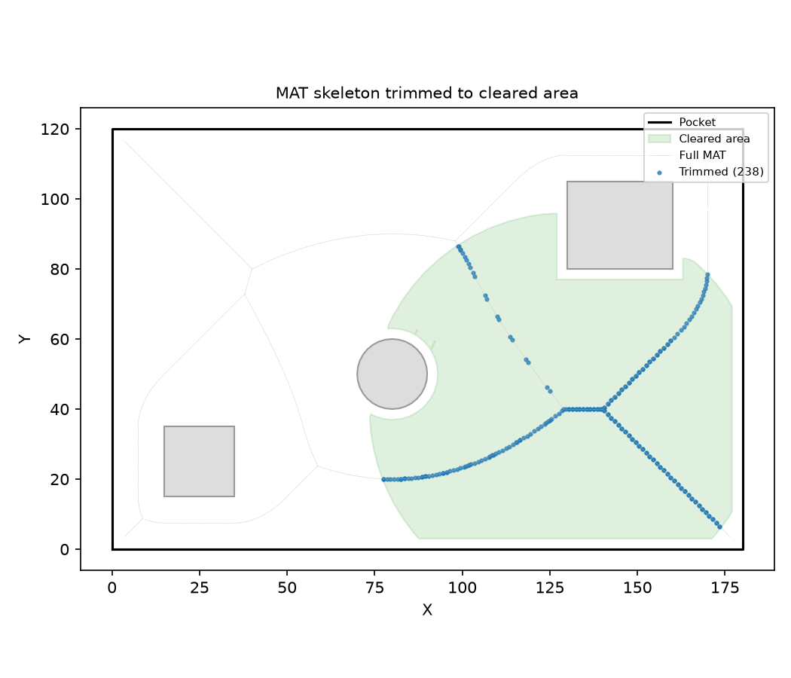

_Medial axis of a rectangular pocket — skeleton from center to corners._ Medial Axis Transform (MAT)
computation.

The MAT is the skeleton of a 2D domain — the set of points equidistant to two or more boundary
features. It is computed via Delaunay-circumcenter extraction from a constrained triangulation of
the domain boundary.

- `MedialAxis.compute` — compute the MAT of a domain (with optional holes).
- `MedialAxis.path_between` — find a path between two points along the skeleton.
- `MedialAxis.trim_to_polygons` — filter nodes to those inside given polygons.

## MedialAxis

Medial Axis Transform of a planar domain.

The MAT is the set of points equidistant to two or more boundary features, forming the skeleton of
the free space.

**Usage**:

.. code-block:: python

    axis = MedialAxis.compute(outer, holes)
    path = axis.path_between((x1, y1), (x2, y2))
    trimmed = axis.trim_to_polygons(polygons)
    nodes = axis.nodes
    clearances = axis.clearances
    edges = axis.edges
    root = axis.root
    branches = axis.branches

### `branches`

```python
branches: list[list[int]]
```

### `clearances`

```python
clearances: list[float]
```

### `edges`

```python
edges: list[tuple[int, int]]
```

### `nodes`

```python
nodes: list[tuple[float, float]]
```

### `root`

```python
root: int
```

### `compute()`

```python
compute(
    outer: Sequence[tuple[float, float]],
    holes: Optional[Sequence[Sequence[tuple[float, float]]]] = None,
    min_clearance: float = 1.0,
    sampling_spacing: float = 1.0,
) -> MedialAxis
```

Compute the Medial Axis Transform of a planar domain.

| Parameter          | Type                                                       | Description |
| ------------------ | ---------------------------------------------------------- | ----------- |
| `outer`            | `Sequence[tuple[float, float]]`                            |             |
| `holes`            | `Optional[Sequence[Sequence[tuple[float, float]]]] = None` |             |
| `min_clearance`    | `float = 1.0`                                              |             |
| `sampling_spacing` | `float = 1.0`                                              |             |
| _Returns_          | `MedialAxis`                                               |             |


_Medial axis with three rectangular islands — skeleton branches around each obstacle._


_Medial axis of a Y-shaped channel — skeleton follows the branching topology._

### `path_between()`

```python
path_between(
    from_pt: tuple[float, float],
    to_pt: tuple[float, float],
) -> Optional[list[tuple[float, float]]]
```

Find a path between two points along the medial axis skeleton.

| Parameter | Type                                  | Description |
| --------- | ------------------------------------- | ----------- |
| `from_pt` | `tuple[float, float]`                 |             |
| `to_pt`   | `tuple[float, float]`                 |             |
| _Returns_ | `Optional[list[tuple[float, float]]]` |             |


_MAT path routing: a path between two points (green) along the medial axis skeleton (red). The path
avoids the island by following the skeleton topology._

### `trim_to_polygons()`

```python
trim_to_polygons(
    polygons: Sequence[Sequence[tuple[float, float]]],
) -> MedialAxis
```

Return a new `MedialAxis` containing only nodes whose positions fall inside at least one of the
given polygons.

| Parameter  | Type                                      | Description |
| ---------- | ----------------------------------------- | ----------- |
| `polygons` | `Sequence[Sequence[tuple[float, float]]]` |             |
| _Returns_  | `MedialAxis`                              |             |



_MAT trimming to cleared area — left: original MAT over cleared fragments (green fill); right:
trimmed MAT with kept nodes (blue) and removed nodes (red x). Only 10 clearing passes were run, so
most MAT nodes lie outside the cleared area and are discarded._
