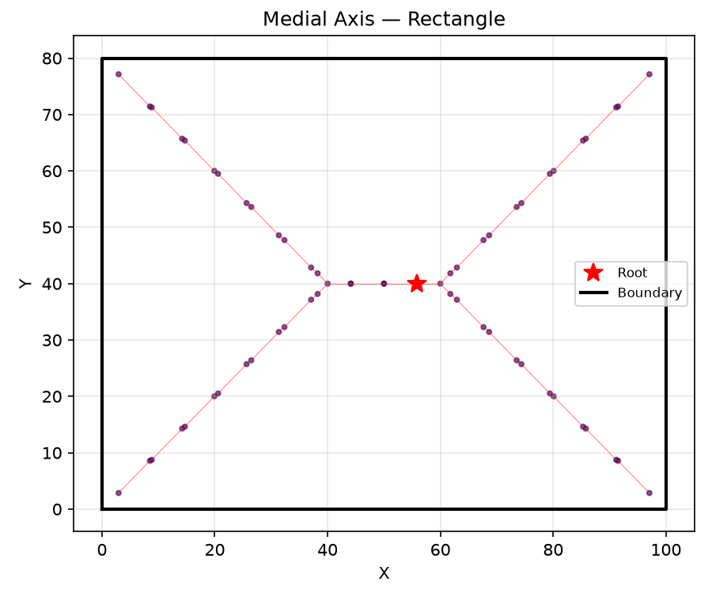
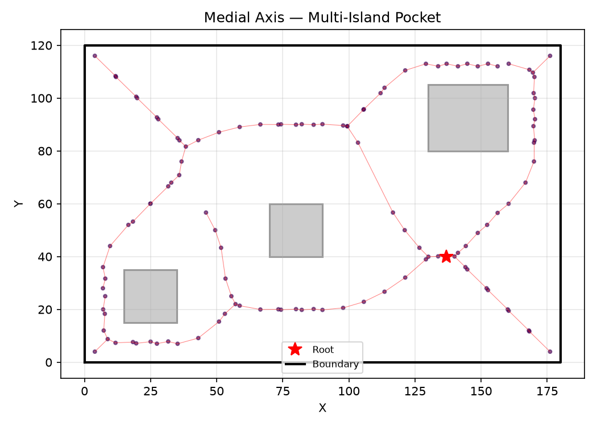
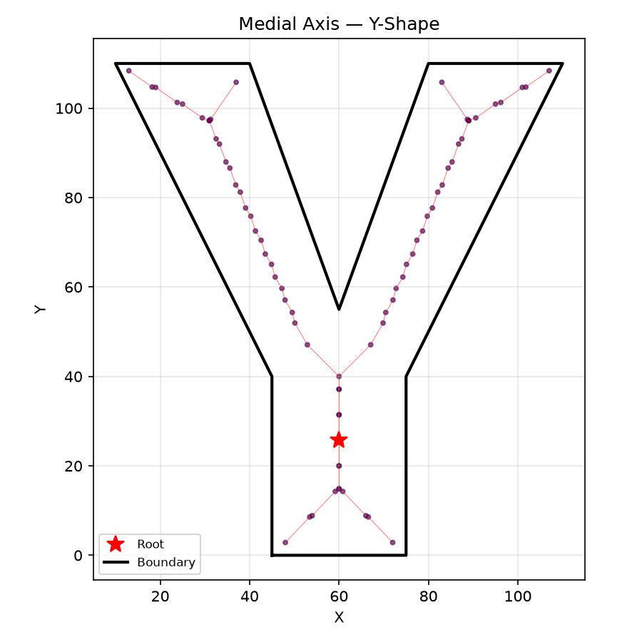
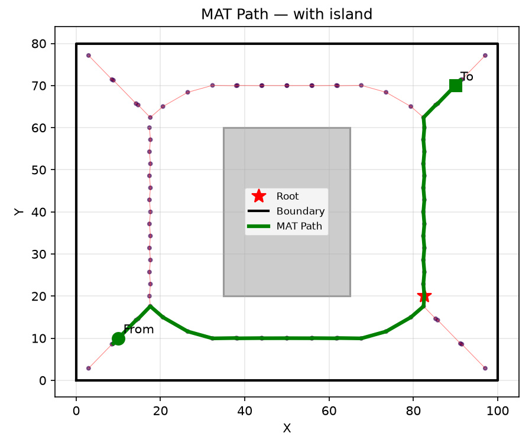

_Medial axis of a rectangular pocket — skeleton from center to corners._ Medial Axis Transform (MAT)
computation.

The MAT is the skeleton of a 2D domain — the set of points equidistant to two or more boundary
features. It is computed via Delaunay-circumcenter extraction from a constrained triangulation of
the pocket boundary.

- `compute_medial_axis` — compute the MAT of a pocket (with optional islands).

## Functions

### `compute_medial_axis()`

```python
compute_medial_axis(
    outer: Sequence[tuple[float, float]],
    holes: Sequence[Sequence[tuple[float, float]]] = [],
    tool_radius: float = 1,
    sampling_spacing: float = 1,
) -> tuple[list[tuple[float, float]], list[float], list[tuple[int, int]], int, list[list[int]]]
```

Compute the Medial Axis Transform of a planar domain.

Returns `(nodes, clearances, edges, root, branches)`.

    * **nodes** — `list[(x, y)]` of medial axis vertex positions.
    * **clearances** — `list[float]` inscribed circle radius per node.
    * **edges** — `list[(int, int)]` tree edges (parent, child).
    * **root** — `int` index of the maximum-clearance node.
    * **branches** — `list[list[int]]` each branch is a node-index path
      from a junction to another junction or leaf.

| Parameter          | Type                                                                                         | Description                                                        |
| ------------------ | -------------------------------------------------------------------------------------------- | ------------------------------------------------------------------ |
| `outer`            | `Sequence[tuple[float, float]]`                                                              | Outer boundary polygon (CCW).                                      |
| `holes`            | `Sequence[Sequence[tuple[float, float]]] = []`                                               | List of hole polygons (CW). Defaults to [].                        |
| `tool_radius`      | `float = 1`                                                                                  | Minimum clearance; narrower branches are pruned.                   |
| `sampling_spacing` | `float = 1`                                                                                  | Sampling density for boundary + Steiner grid. Smaller = finer MAT. |
| _Returns_          | `tuple[list[tuple[float, float]], list[float], list[tuple[int, int]], int, list[list[int]]]` | `(nodes, clearances, edges, root, branches)` where                 |



_Medial axis with three rectangular islands — skeleton branches around each obstacle._



_Medial axis of a Y-shaped channel — skeleton follows the branching topology._

### `mat_path()`

```python
mat_path(
    outer: Sequence[tuple[float, float]],
    from_pt: tuple[float, float],
    to_pt: tuple[float, float],
    holes: Sequence[Sequence[tuple[float, float]]] = [],
    tool_radius: float = 1,
    sampling_spacing: float = 1,
) -> list[tuple[float, float]] | None
```

Find a path between two points using the Medial Axis.

Computes the MAT of the pocket defined by _outer_ and _holes_, then finds the shortest-topology path
between _from_pt_ and _to_pt_ along the medial axis graph.

| Parameter          | Type                                           | Description                                       |
| ------------------ | ---------------------------------------------- | ------------------------------------------------- |
| `outer`            | `Sequence[tuple[float, float]]`                | Outer boundary polygon (CCW).                     |
| `from_pt`          | `tuple[float, float]`                          | Start point (x, y).                               |
| `to_pt`            | `tuple[float, float]`                          | End point (x, y).                                 |
| `holes`            | `Sequence[Sequence[tuple[float, float]]] = []` | List of hole polygons (CW). Defaults to [].       |
| `tool_radius`      | `float = 1`                                    | Minimum clearance for MAT pruning.                |
| `sampling_spacing` | `float = 1`                                    | Boundary sampling density.                        |
| _Returns_          | `list[tuple[float, float]] &#124; None`        | List of (x, y) waypoints along the path, or None. |



_MAT path routing: a path between two points (green) along the medial axis skeleton (red). The path
avoids the island by following the skeleton topology._
