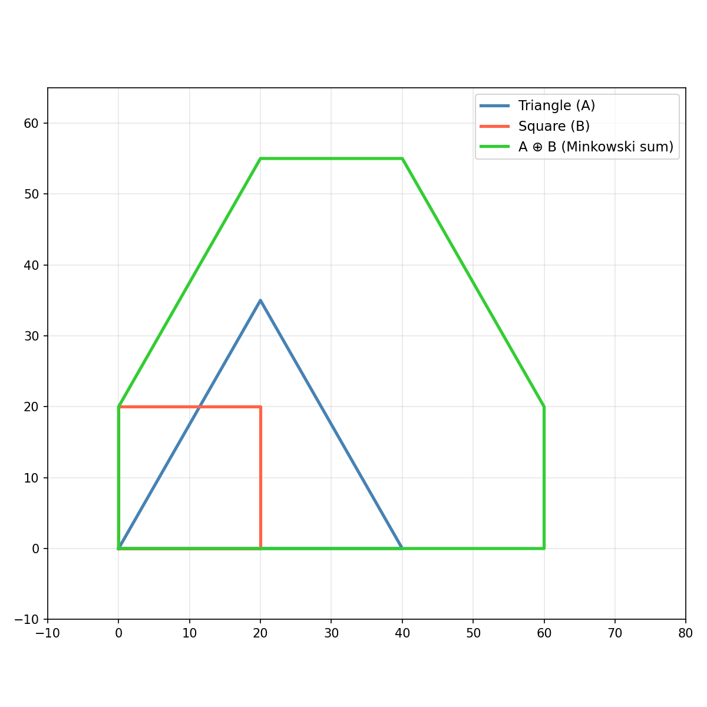

Minkowski sum operations for 2D polygon toolpath generation.

Provides convolution of point sequences and segments, Minkowski sums for convex polygons, and no-fit
polygon / inner fit polygon calculations used in nesting and packing algorithms.

## Functions

### `calculate_input_scale()`

```python
calculate_input_scale(
    polygons: Sequence[Sequence[types.Point]],
    max_int: int = 2147483647,
) -> float
```

Calculate the optimal input scale for clipper operations.

| Parameter    | Type                              | Description                        |
| ------------ | --------------------------------- | ---------------------------------- |
| `polygons`   | `Sequence[Sequence[types.Point]]` | List of polygons to scale.         |
| `max_int`    | `int = 2147483647`                | Maximum integer value for Clipper. |
| _Returns_    | `float`                           | Optimal scale factor.              |
| _Complexity_ |                                   | O(n) time, O(1) space              |

### `convolve_point_sequences()`

```python
convolve_point_sequences(
    seq_a: Sequence[tuple[float, float]],
    seq_b: Sequence[tuple[float, float]],
) -> list[list[tuple[float, float]]]
```

Convolve two sequences of points.

| Parameter    | Type                              | Description                     |
| ------------ | --------------------------------- | ------------------------------- |
| `seq_a`      | `Sequence[tuple[float, float]]`   | First sequence of points.       |
| `seq_b`      | `Sequence[tuple[float, float]]`   | Second sequence of points.      |
| _Returns_    | `list[list[tuple[float, float]]]` | Convolved point sequences.      |
| _Complexity_ |                                   | O(n \* m) time, O(n \* m) space |

### `convolve_two_segments()`

```python
convolve_two_segments(
    a1: tuple[float, float],
    a2: tuple[float, float],
    b1: tuple[float, float],
    b2: tuple[float, float],
) -> list[tuple[float, float]]
```

Convolve two line segments.

| Parameter    | Type                        | Description               |
| ------------ | --------------------------- | ------------------------- |
| `a1`         | `tuple[float, float]`       | Start point of segment A. |
| `a2`         | `tuple[float, float]`       | End point of segment A.   |
| `b1`         | `tuple[float, float]`       | Start point of segment B. |
| `b2`         | `tuple[float, float]`       | End point of segment B.   |
| _Returns_    | `list[tuple[float, float]]` | Convolved point sequence. |
| _Complexity_ |                             | O(1) time, O(1) space     |

### `get_inner_fit_polygon()`

```python
get_inner_fit_polygon(
    outer: Sequence[types.Point],
    inner: Sequence[types.Point],
) -> list[types.Polygon]
```

Compute the inner fit polygon (no-fit polygon for nesting).

| Parameter    | Type                    | Description                     |
| ------------ | ----------------------- | ------------------------------- |
| `outer`      | `Sequence[types.Point]` | Outer polygon as (x, y) points. |
| `inner`      | `Sequence[types.Point]` | Inner polygon as (x, y) points. |
| _Returns_    | `list[types.Polygon]`   | Inner fit polygon.              |
| _Complexity_ |                         | O(n \* m) time, O(n + m) space  |

### `get_no_fit_polygon()`

```python
get_no_fit_polygon(
    subject: Sequence[types.Point],
    tool: Sequence[types.Point],
) -> list[types.Polygon]
```

Compute the no-fit polygon for two 2D polygons.

| Parameter    | Type                    | Description                       |
| ------------ | ----------------------- | --------------------------------- |
| `subject`    | `Sequence[types.Point]` | Subject polygon as (x, y) points. |
| `tool`       | `Sequence[types.Point]` | Tool polygon as (x, y) points.    |
| _Returns_    | `list[types.Polygon]`   | No-fit polygon.                   |
| _Complexity_ |                         | O(n \* m) time, O(n + m) space    |

### `get_polygon_minkowski_sum_convex()`

```python
get_polygon_minkowski_sum_convex(
    poly_a: Sequence[tuple[float, float]],
    poly_b: Sequence[tuple[float, float]],
) -> list[list[tuple[float, float]]]
```

Compute the Minkowski sum of two convex polygons.

| Parameter    | Type                              | Description                        |
| ------------ | --------------------------------- | ---------------------------------- |
| `poly_a`     | `Sequence[tuple[float, float]]`   | First convex polygon as points.    |
| `poly_b`     | `Sequence[tuple[float, float]]`   | Second convex polygon as points.   |
| _Returns_    | `list[list[tuple[float, float]]]` | Minkowski sum as list of polygons. |
| _Complexity_ |                                   | O(n + m) time, O(n + m) space      |



_Minkowski sum of two convex polygons_
