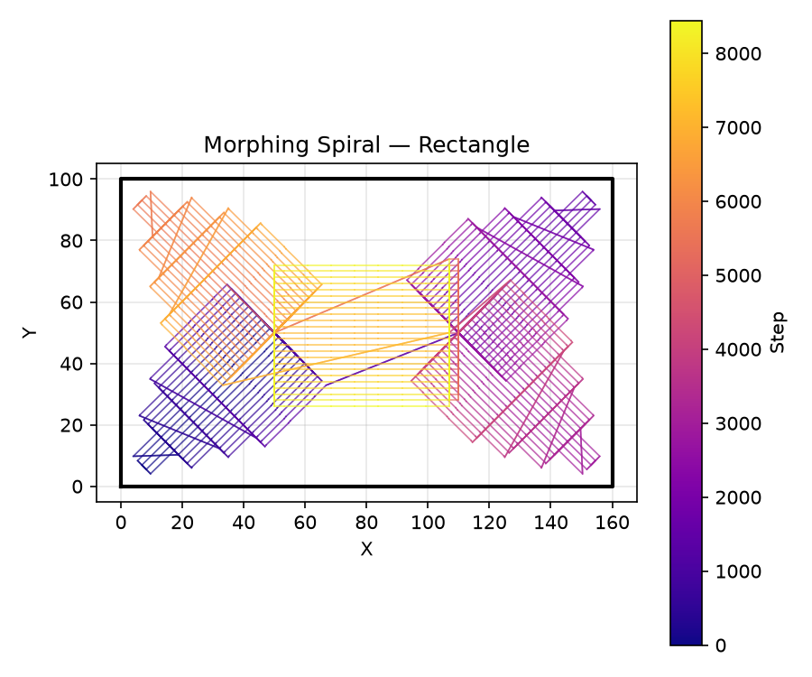
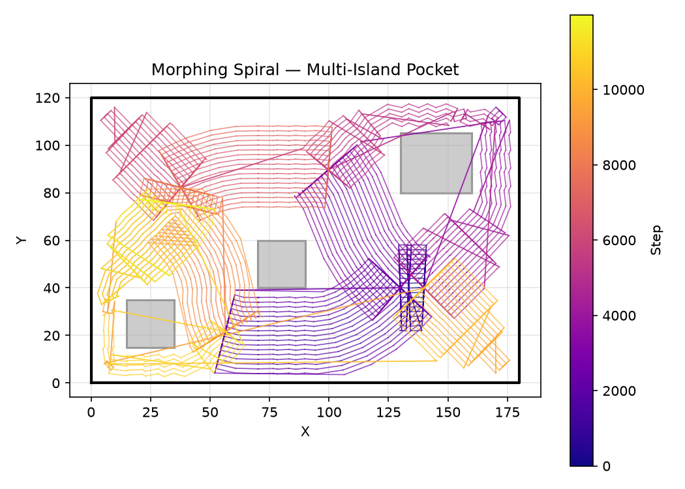
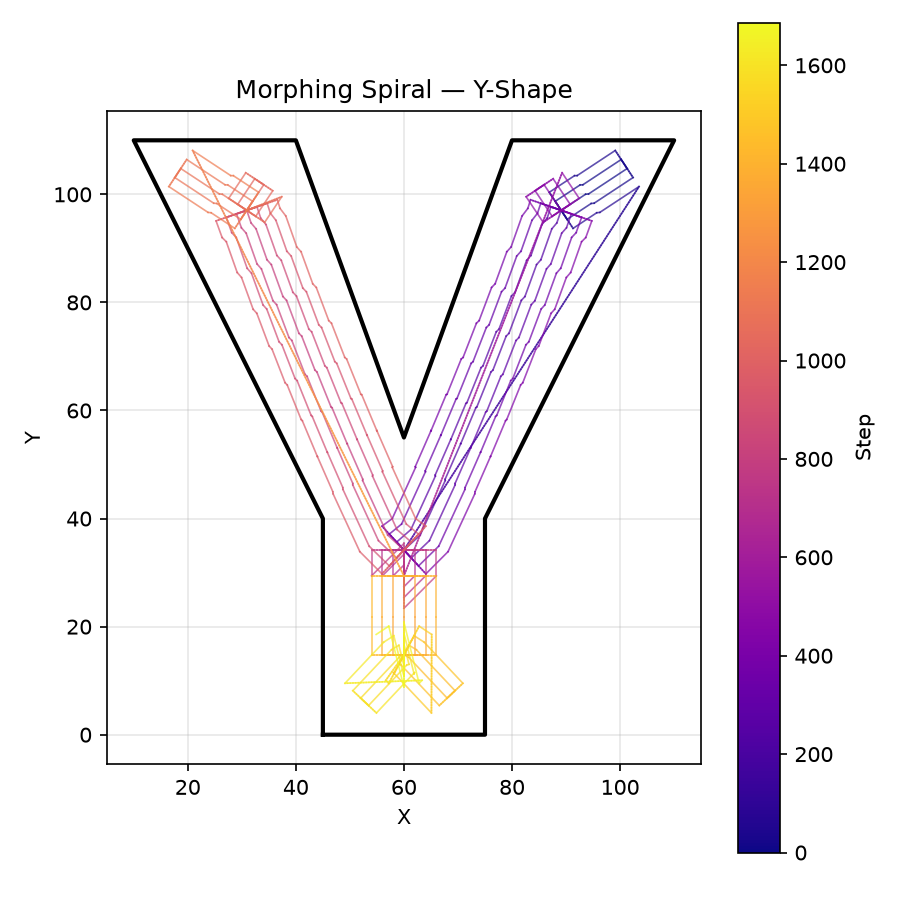
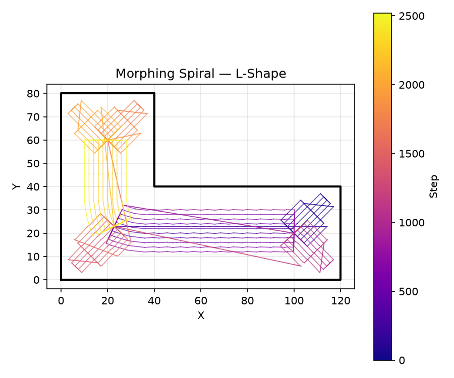
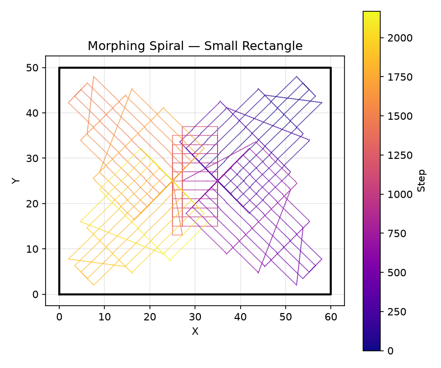
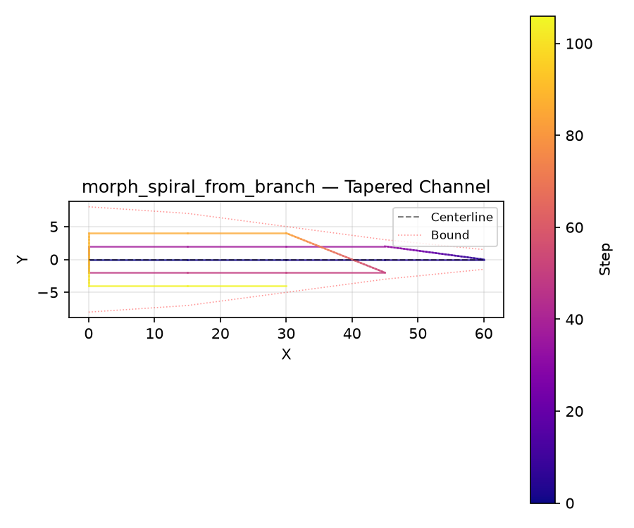

MAT-driven morphing spiral generation.

- `morph_spiral` — full pipeline: offset, MAT, per-branch spiral, linking.
- `morph_spiral_from_branch` — generate a boustrophedon spiral for a single MAT branch (centerline +
  clearance profile).

## Functions

### `morph_spiral()`

```python
morph_spiral(
    pocket_boundary: Sequence[tuple[float, float]],
    islands: Sequence[Sequence[tuple[float, float]]] = [],
    tool_radius: float = 3,
    step_over: float = 2,
    z: float = 0,
    sampling_spacing: float | None = None,
) -> tuple[list[tuple[float, float, float]], list[list[tuple[float, float, float]]]]
```

Full morphing-spiral pipeline.

Offsets the boundary by _tool_radius_, computes the medial axis transform, generates a boustrophedon
spiral per branch, and links all branches into a single continuous toolpath.

**Raises:** `RuntimeError` — If MAT computation or spiral generation fails.

| Parameter          | Type                                                                              | Description                                                                                                           |
| ------------------ | --------------------------------------------------------------------------------- | --------------------------------------------------------------------------------------------------------------------- |
| `pocket_boundary`  | `Sequence[tuple[float, float]]`                                                   | Outer boundary of the pocket.                                                                                         |
| `islands`          | `Sequence[Sequence[tuple[float, float]]] = []`                                    | List of island (hole) polygons (default []).                                                                          |
| `tool_radius`      | `float = 3`                                                                       | Tool radius in mm (default 3.0).                                                                                      |
| `step_over`        | `float = 2`                                                                       | Radial step-over between passes in mm (default 2.0).                                                                  |
| `z`                | `float = 0`                                                                       | Z height for generated toolpath points (default 0.0).                                                                 |
| `sampling_spacing` | `float &#124; None = None`                                                        | MAT sampling density (mm). Defaults to `step_over × 0.5`.                                                             |
| _Returns_          | `tuple[list[tuple[float, float, float]], list[list[tuple[float, float, float]]]]` | `(toolpath, branch_paths)` where \*toolpath\* is a single `list[(x, y, z)]` and \*branch_paths\* is per-branch paths. |



_MAT-driven morphing spiral in a rectangular pocket — continuous toolpath fills area with constant
step-over._



_Morphing spiral in a three-island pocket — wraps around each island following the medial axis._



_Morphing spiral in a Y-shaped channel — flows into both arms of the Y._



_Morphing spiral in an L-shaped pocket — fills the corner naturally._



_Morphing spiral in a small rectangle — boustrophedon pattern visible at branch level._

### `morph_spiral_from_branch()`

```python
morph_spiral_from_branch(
    points: Sequence[tuple[float, float]],
    clearances: Sequence[float],
    step_over: float,
    z: float = 0,
) -> list[tuple[float, float, float]]
```

Generate a boustrophedon spiral for a single MAT branch.

_points_ is the centerline polyline (root→leaf). _clearances[i]_ is the channel half-width at
_points[i]_.

| Parameter    | Type                               | Description                                                        |
| ------------ | ---------------------------------- | ------------------------------------------------------------------ |
| `points`     | `Sequence[tuple[float, float]]`    | Centerline polyline, root (high clearance) → leaf (low clearance). |
| `clearances` | `Sequence[float]`                  | Channel half-width at each point.                                  |
| `step_over`  | `float`                            | Radial step-over between passes.                                   |
| `z`          | `float = 0`                        | Z height for generated points.                                     |
| _Returns_    | `list[tuple[float, float, float]]` | `list[(x, y, z)]` — the continuous boustrophedon path.             |



_Boustrophedon spiral from a single MAT branch — the path weaves back and forth along the
centerline, with passes truncated as the channel narrows._
