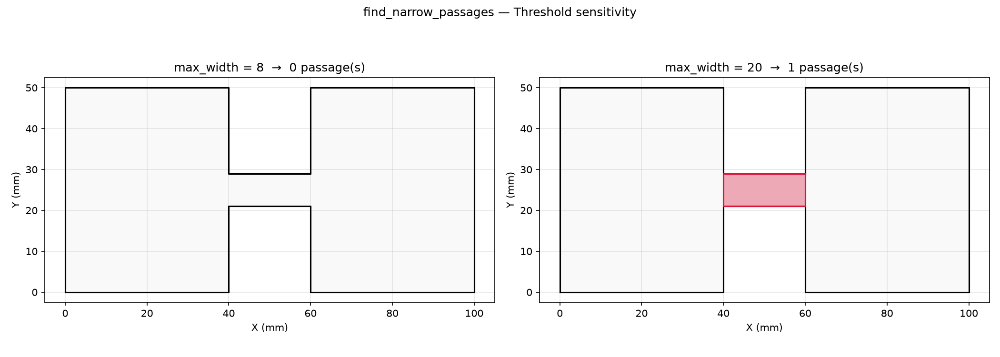
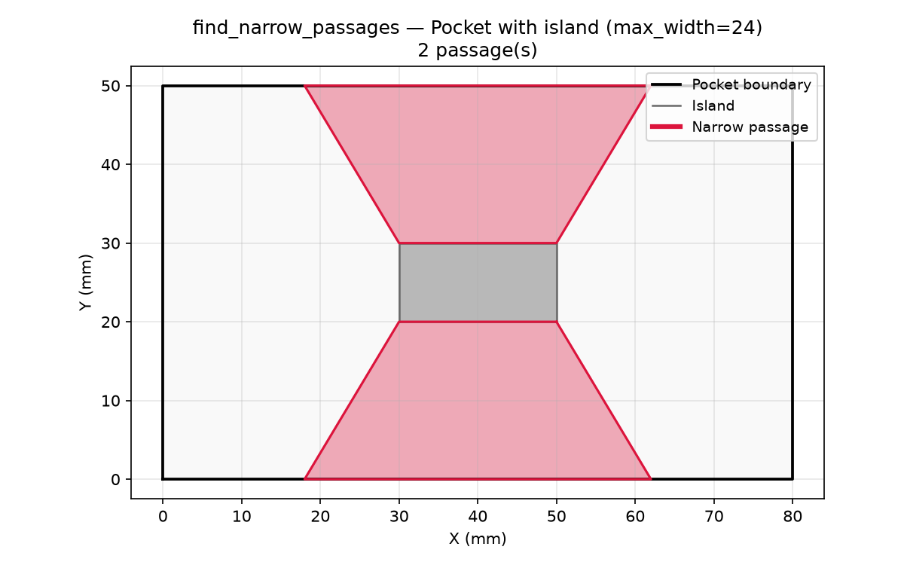
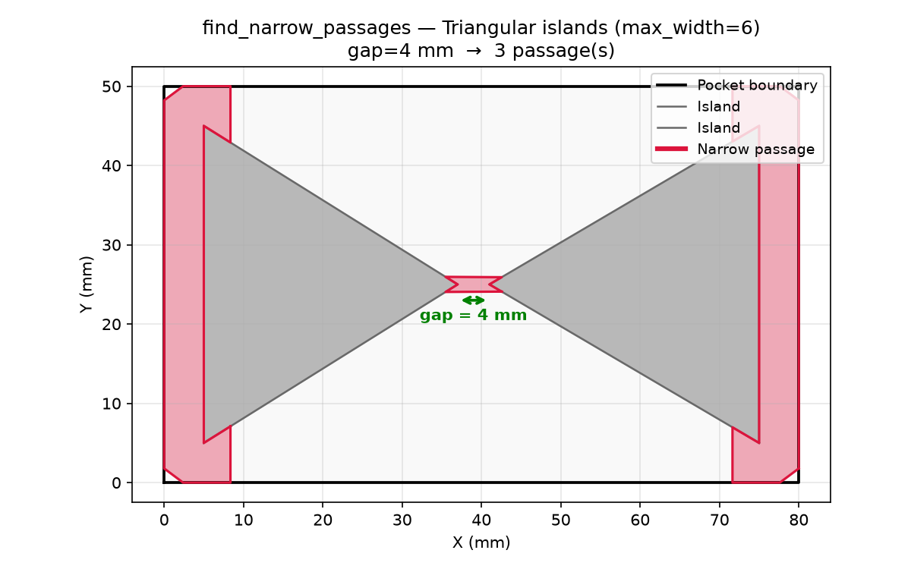

## Functions

### `find_narrow_passages()`

```python
find_narrow_passages(
    polygon: Sequence[tuple[float, float]],
    holes: Sequence[Sequence[tuple[float, float]]] | None = None,
    max_width: float = 10,
) -> list[Sequence[tuple[float, float]]]
```

Detect narrow passages in a polygon.

A passage is narrow when it is narrower than *max_width*. The detection evaluates every boundary
edge against every other boundary edge via an R-tree spatial index. Edges whose midpoints are within
*max_width* of a non-adjacent edge (on a different polygon or a distinct part of the same polygon)
produce a quadrilateral via convex hull of their four endpoints. All quadrilaterals are unioned and
clipped to the pocket.

**Raises:** `RuntimeError` — If the polygon cannot be analyzed.

| Parameter   | Type                                                         | Description                                          |
| ----------- | ------------------------------------------------------------ | ---------------------------------------------------- |
| `polygon`   | `Sequence[tuple[float, float]]`                              | Outer boundary polygon.                              |
| `holes`     | `Sequence[Sequence[tuple[float, float]]] &#124; None = None` | List of hole (island) polygons.                      |
| `max_width` | `float = 10`                                                 | Passage-width threshold in mm.                       |
| _Returns_   | `list[Sequence[tuple[float, float]]]`                        | List of polygons (each a list of `(x, y)` vertices). |



*Threshold sensitivity: at max_width=8 (left) the 8 mm channel is at the edge of detection; at
max_width=20 (right) more of the pocket qualifies as narrow.*



*Pocket with a central island: two narrow passages (crimson) form in the necks above and below the
island.*



*Two triangular islands pointing at each other with a 4 mm tip gap. With max_width=6 the narrow
passage (crimson) is the area between the islands where the morphological opening closed the gap.*
