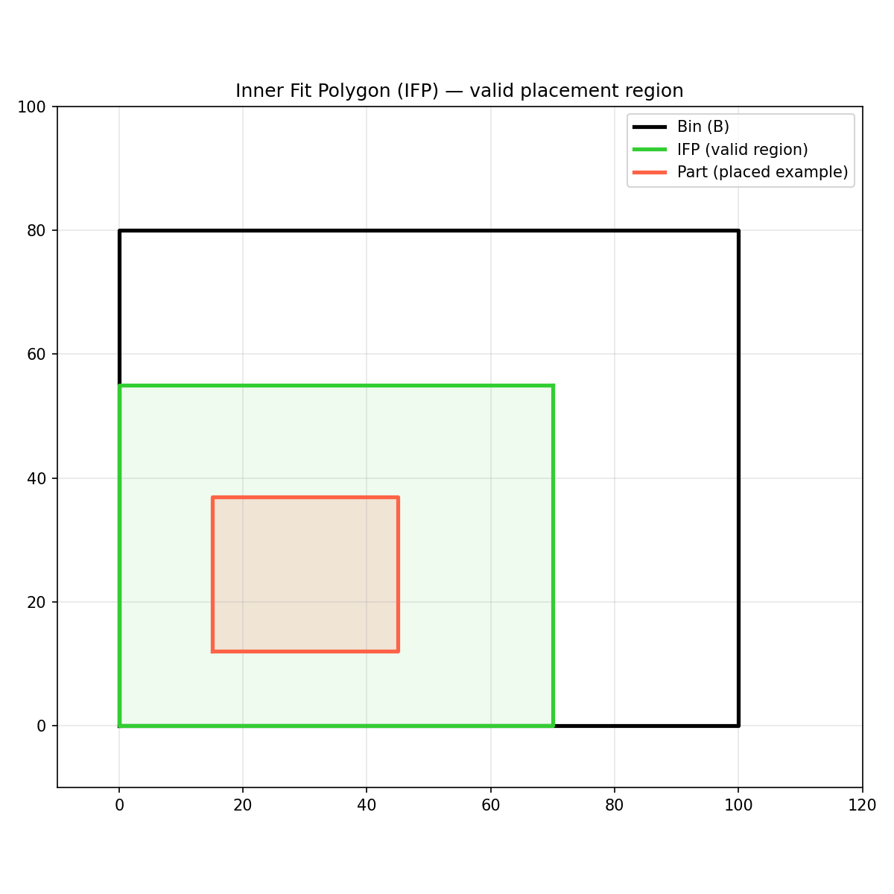

Inner-Fit Polygon (IFP) calculation for nesting algorithms.

Provides functions for computing Inner-Fit Polygons, which define the valid placement region for a
part inside a bin.

## Functions

### `build_no_go_zones()`

```python
build_no_go_zones(
    bin: Sequence[types.Point],
    part_neg: Sequence[types.Point],
) -> list[types.Polygon]
```

Build the no-go zones for a bin-part pair.

| Parameter    | Type                    | Description                                |
| ------------ | ----------------------- | ------------------------------------------ |
| `bin`        | `Sequence[types.Point]` | Bin polygon as (x, y) points.              |
| `part_neg`   | `Sequence[types.Point]` | Orbiting polygon negated as (x, y) points. |
| _Returns_    | `list[types.Polygon]`   | List of no-go zone polygons.               |
| _Complexity_ |                         | O(n \* m) where n, m = vertex counts.      |

### `inner_fit_polygon()`

```python
inner_fit_polygon(
    bin: Sequence[types.Point],
    part: Sequence[types.Point],
) -> list[types.Polygon]
```

Compute the Inner-Fit Polygon (IFP) for a part inside a bin.

| Parameter    | Type                    | Description                                           |
| ------------ | ----------------------- | ----------------------------------------------------- |
| `bin`        | `Sequence[types.Point]` | Bin polygon as (x, y) points.                         |
| `part`       | `Sequence[types.Point]` | Part polygon as (x, y) points.                        |
| _Returns_    | `list[types.Polygon]`   | List of IFP polygons.                                 |
| _Complexity_ |                         | O(n \* m) where n, m = vertex counts of bin and part. |



_Inner Fit Polygon showing valid placement region_

### `sweep_hull_for_edge()`

```python
sweep_hull_for_edge(
    p1: types.Point,
    p2: types.Point,
    part_neg: Sequence[types.Point],
) -> types.Polygon
```

Compute the convex hull sweep of part_neg along the edge p1->p2.

| Parameter    | Type                    | Description                                |
| ------------ | ----------------------- | ------------------------------------------ |
| `p1`         | `types.Point`           | First edge endpoint.                       |
| `p2`         | `types.Point`           | Second edge endpoint.                      |
| `part_neg`   | `Sequence[types.Point]` | Orbiting polygon negated as (x, y) points. |
| _Returns_    | `types.Polygon`         | Convex hull polygon.                       |
| _Complexity_ |                         | O(n log n) for convex hull computation.    |
