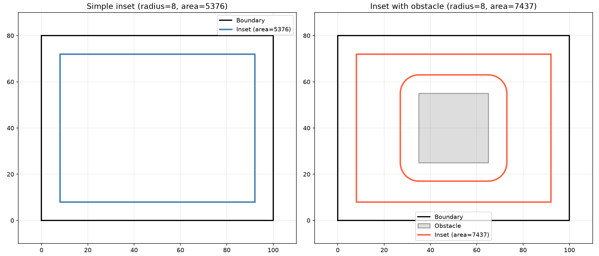
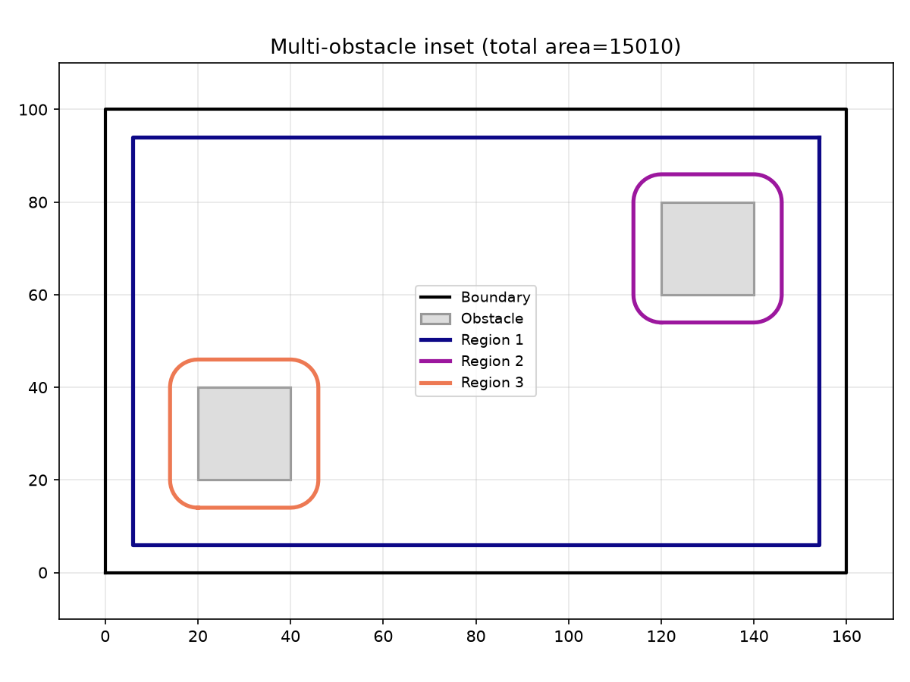
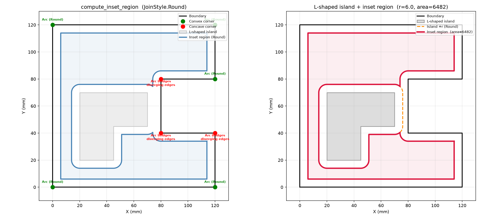
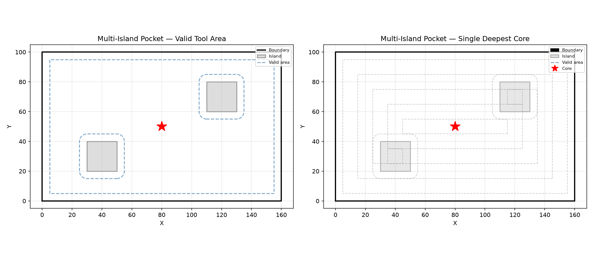

Polygon offsetting operations for geometry data.

Provides concentric inward offset generation for adaptive clearing and pocketing toolpath
generation.

## Functions

### `compute_inset_region()`

```python
compute_inset_region(
    boundary: Sequence[tuple[float, float]],
    radius: float,
    obstacles: Sequence[Sequence[tuple[float, float]]] = [],
) -> tuple[list[list[tuple[float, float]]], float]
```

Compute the inset region: boundary shrunk by *radius*, minus obstacle buffers (each obstacle
expanded by *radius*).

| Parameter    | Type                                            | Description                                                                |
| ------------ | ----------------------------------------------- | -------------------------------------------------------------------------- |
| `boundary`   | `Sequence[tuple[float, float]]`                 | Outer boundary polygon as a list of `(x, y)` points.                       |
| `radius`     | `float`                                         | Inset / expansion radius.                                                  |
| `obstacles`  | `Sequence[Sequence[tuple[float, float]]] = []`  | List of obstacle polygons (default []).                                    |
| _Returns_    | `tuple[list[list[tuple[float, float]]], float]` | `(region_polygons, total_area)`.                                           |
| _Complexity_ |                                                 | O((n + m) log(n + m)) where n and m are boundary and obstacle point counts |



*Inset region: boundary shrunk, obstacles removed. Left: simple. Right: with central obstacle.*



*Multi-obstacle inset: the region splits into multiple disconnected polygons.*



*Mixed convex/concave boundary + L-shaped island: verifies Round inset arcs at all joint types.*

### `concentric_offsets()`

```python
concentric_offsets(
    geom: Geometry,
    step: float,
    max_passes: int = 10,
    min_area: float = 1,
) -> list[Geometry]
```

Generate concentric inward offsets of a geometry.

Each successive offset shrinks the boundary by `step`. Stops early when the enclosed area drops
below `min_area` or `max_passes` is reached. Returns offsets outermost-first.

| Parameter    | Type             | Description                                                                                    |
| ------------ | ---------------- | ---------------------------------------------------------------------------------------------- |
| `geom`       | `Geometry`       | A closed geometry.                                                                             |
| `step`       | `float`          | Inward offset distance per pass.                                                               |
| `max_passes` | `int = 10`       | Maximum number of offset passes (default 10).                                                  |
| `min_area`   | `float = 1`      | Minimum area to stop at (default 1.0).                                                         |
| _Returns_    | `list[Geometry]` | List of offset geometries, outermost first.                                                    |
| _Complexity_ |                  | O(n * p) time, O(n) space where n is the number of contour vertices and p the number of passes |


*Concentric inward offsets for adaptive clearing / pocketing*

### `find_deepest_cores()`

```python
find_deepest_cores(
    regions: Sequence[geo.types.Polygon],
    step_over: float,
) -> list[geo.types.Point]
```

Find the deepest (most open) regions of a polygon set.

Iteratively offsets each polygon inward by step_over until all polygons collapse. Returns the
centroids of the final polygons.

| Parameter    | Type                          | Description                                  |
| ------------ | ----------------------------- | -------------------------------------------- |
| `regions`    | `Sequence[geo.types.Polygon]` | List of polygons to search.                  |
| `step_over`  | `float`                       | Inward offset distance per iteration.        |
| _Returns_    | `list[geo.types.Point]`       | List of (x, y) centroid points.              |
| _Complexity_ |                               | O(n * k) where k is the number of iterations |


*Deepest-core detection: finds max clearance in valid tool area — best helical-entry for the pocket*



*Multi-island pocket: clockwise contours are islands; core is deepest point in largest valid
region.*


*Central-island (annular): ring of valid tool area; deepest core is max clearance, never in island.*

### `offset_contour_group()`

```python
offset_contour_group(
    solid_path: Sequence[geo.types.Point],
    hole_paths: Sequence[Sequence[geo.types.Point]],
    offset: float,
    join_style: geo.shape.polygon.JoinStyle = raygeo.geo.shape.polygon.JoinStyle.Miter,
) -> list[geo.types.Polygon]
```

Offset a solid contour with its hole contours.

Offsets the solid outward (or inward for negative offset) while offsetting holes in the opposite
direction and subtracting them from the solid result.

| Parameter    | Type                                                                     | Description                                                 |
| ------------ | ------------------------------------------------------------------------ | ----------------------------------------------------------- |
| `solid_path` | `Sequence[geo.types.Point]`                                              | Outer boundary polygon as (x, y) points.                    |
| `hole_paths` | `Sequence[Sequence[geo.types.Point]]`                                    | List of hole polygons.                                      |
| `offset`     | `float`                                                                  | Offset distance (positive to inflate, negative to deflate). |
| `join_style` | `geo.shape.polygon.JoinStyle = raygeo.geo.shape.polygon.JoinStyle.Miter` | Corner join style (default: `JoinStyle.Miter`).             |
| _Returns_    | `list[geo.types.Polygon]`                                                | Offset polygon(s) with holes subtracted.                    |
| _Complexity_ |                                                                          | O(n log n)                                                  |
