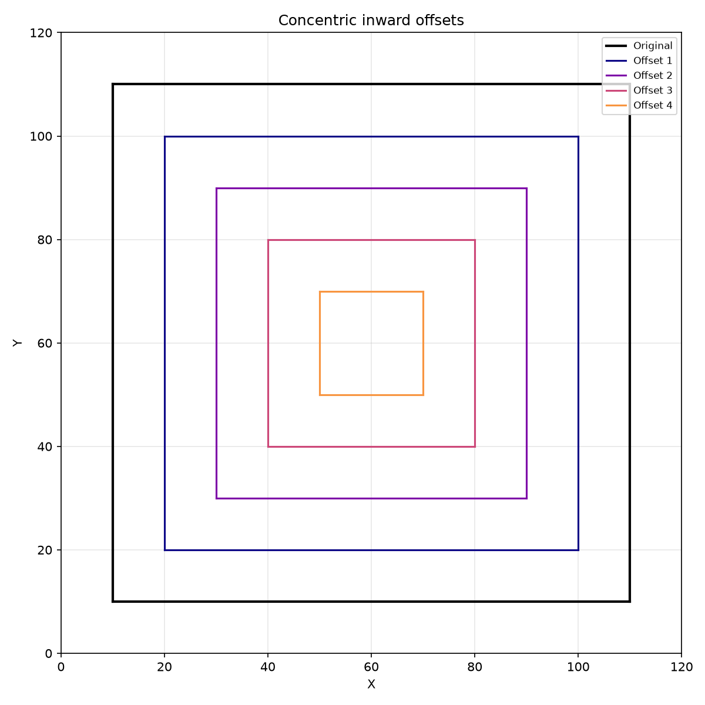
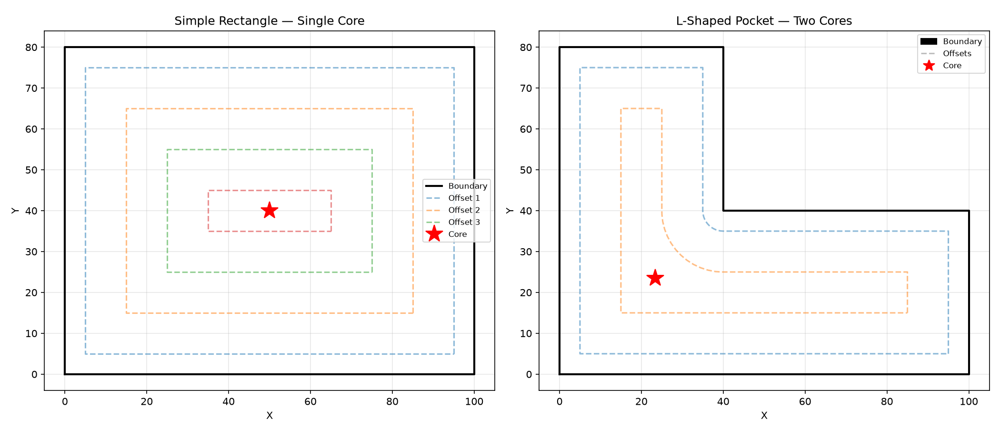
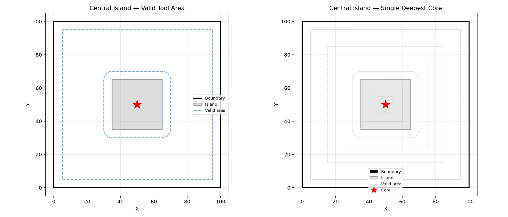

Polygon offsetting operations for geometry data.

Provides concentric inward offset generation for adaptive clearing and pocketing toolpath
generation.

## Functions

### `concentric_offsets()`

```python
concentric_offsets(
    geom: Geometry,
    step: float,
    max_passes: int = 10,
    min_area: float = 1,
) -> list[Geometry]
```

Generate concentric inward offsets of a geometry.

Each successive offset shrinks the boundary by `step`. Stops early when the enclosed area drops
below `min_area` or `max_passes` is reached. Returns offsets outermost-first.

| Parameter    | Type             | Description                                                                                     |
| ------------ | ---------------- | ----------------------------------------------------------------------------------------------- |
| `geom`       | `Geometry`       | A closed geometry.                                                                              |
| `step`       | `float`          | Inward offset distance per pass.                                                                |
| `max_passes` | `int = 10`       | Maximum number of offset passes (default 10).                                                   |
| `min_area`   | `float = 1`      | Minimum area to stop at (default 1.0).                                                          |
| _Returns_    | `list[Geometry]` | List of offset geometries, outermost first.                                                     |
| _Complexity_ |                  | O(n \* p) time, O(n) space where n is the number of contour vertices and p the number of passes |



_Concentric inward offsets for adaptive clearing / pocketing_

### `find_deepest_cores()`

```python
find_deepest_cores(
    valid_tool_area: Sequence[geo.types.Polygon],
    step_over: float,
) -> list[geo.types.Point]
```

Find the deepest (most open) regions of a pocket.

Iteratively offsets each polygon inward by step_over until all polygons collapse. Returns the
centroids of the final polygons — optimal points for helical entry in adaptive clearing.

| Parameter         | Type                          | Description                                           |
| ----------------- | ----------------------------- | ----------------------------------------------------- |
| `valid_tool_area` | `Sequence[geo.types.Polygon]` | List of polygons representing valid tool center area. |
| `step_over`       | `float`                       | Inward offset distance per iteration.                 |
| _Returns_         | `list[geo.types.Point]`       | List of (x, y) centroid points.                       |
| _Complexity_      |                               | O(n \* k) where k is the number of iterations         |



_Deepest-core detection: binary search finds the largest offset that does NOT collapse the pocket,
then returns the centroid of the largest surviving fragment_


_Multi-island pocket: the valid tool area splits into multiple regions; `find_deepest_cores` returns
the single centroid of the largest surviving fragment_



_Central-island pocket (annular): the island creates a ring of valid tool area; the deepest core
sits at the centre of the ring_

### `offset_contour_group()`

```python
offset_contour_group(
    solid_path: Sequence[geo.types.Point],
    hole_paths: Sequence[Sequence[geo.types.Point]],
    offset: float,
    join_style: str = 'miter',
) -> list[geo.types.Polygon]
```

Offset a solid contour with its hole contours.

Offsets the solid outward (or inward for negative offset) while offsetting holes in the opposite
direction and subtracting them from the solid result.

| Parameter    | Type                                  | Description                                                       |
| ------------ | ------------------------------------- | ----------------------------------------------------------------- |
| `solid_path` | `Sequence[geo.types.Point]`           | Outer boundary polygon as (x, y) points.                          |
| `hole_paths` | `Sequence[Sequence[geo.types.Point]]` | List of hole polygons.                                            |
| `offset`     | `float`                               | Offset distance (positive to inflate, negative to deflate).       |
| `join_style` | `str = 'miter'`                       | Corner join style: `"miter"` (default), `"round"`, or `"square"`. |
| _Returns_    | `list[geo.types.Polygon]`             | Offset polygon(s) with holes subtracted.                          |
| _Complexity_ |                                       | O(n log n)                                                        |
