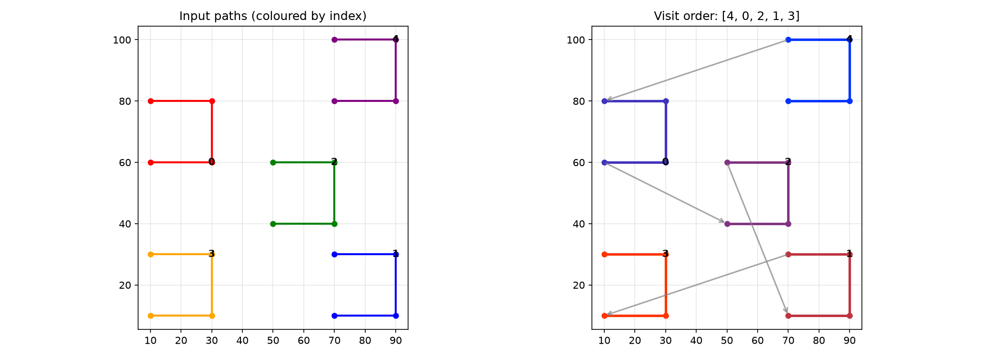

Path ordering algorithms.

Provides pure-geometry combinatorial optimizations for sequencing paths (polylines, arcs) with no
machining or CNC concepts.

## Functions

### `order_nearest_neighbor()`

```python
order_nearest_neighbor(
    paths: Sequence[Sequence[tuple[float, float]]],
) -> list[int]
```

Order paths by greedy nearest-neighbor starting from the longest path.

Starts with the longest input path (most vertices), then repeatedly selects the next unvisited path
whose first endpoint is closest to the current path's last endpoint.

| Parameter | Type                                      | Description                                  |
| --------- | ----------------------------------------- | -------------------------------------------- |
| `paths`   | `Sequence[Sequence[tuple[float, float]]]` | List of paths, each a list of (x, y) points. |
| _Returns_ | `list[int]`                               | Indices into \*paths\* in visit order.       |



_Nearest-neighbor ordering of arc-like paths — starts with the longest, then chains by proximity_
