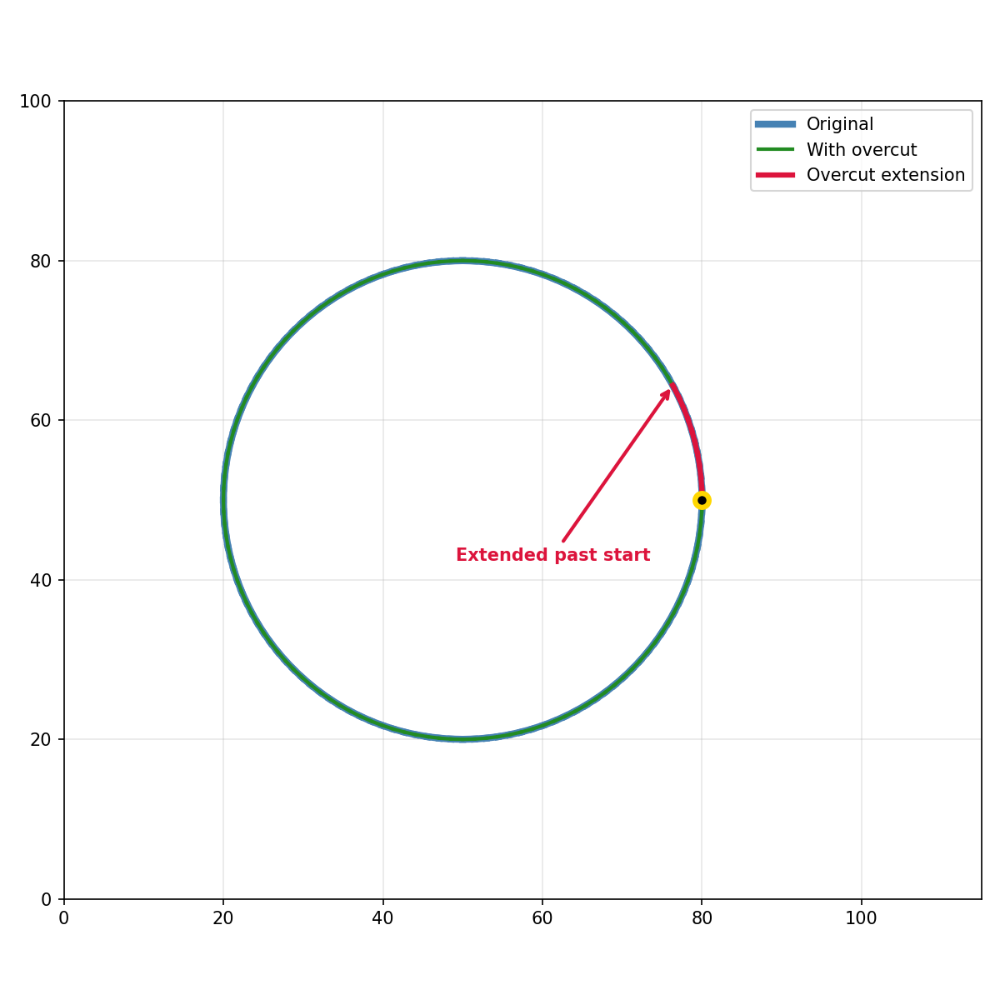

Overcut operations for closed contours.

Extends closed contours past their start point to ensure complete cuts through the material,
particularly useful in laser cutting where the laser may not fully penetrate at the start/end point.

## Functions

### `apply_overcut()`

`apply_overcut(geometry: geo.Geometry, overcut: float) -> geo.Geometry`

Extend a closed contour past its start point.

When laser-cutting closed contours, the laser slows down at corners and may not cut through
completely. This function extends the path by `overcut` distance past the start point to ensure a
clean cut.

If the geometry is not closed, empty, or overcut is <= 0, the geometry is returned unchanged.

**Returns:** A new geometry with the overcut applied.

| Parameter    | Type           | Description                              |
| ------------ | -------------- | ---------------------------------------- |
| `geometry`   | `geo.Geometry` | The input geometry (must be closed).     |
| `overcut`    | `float`        | Distance to extend past the start point. |
| _Returns_    | `geo.Geometry` |                                          |
| _Complexity_ |                | O(n) time, O(n) space                    |

_Overcut on closed contour_
