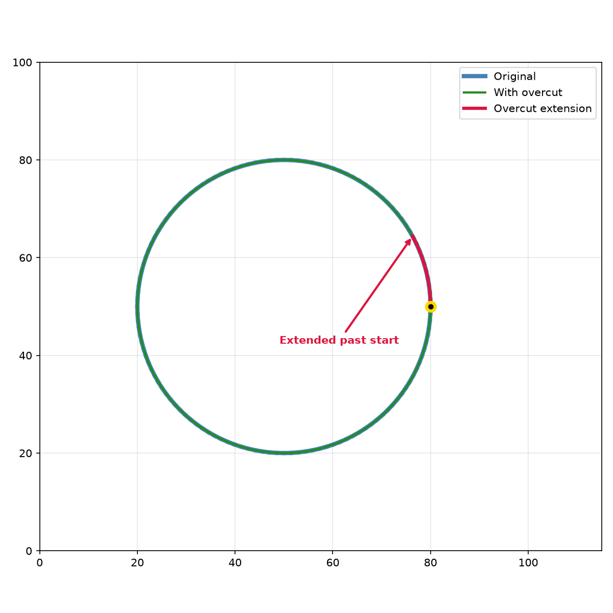

Overcut operations for closed contours.

Extends closed contours past their start point to ensure complete cuts through the material,
particularly useful in cutting applications where the tool may not fully penetrate at the start/end
point.

## Functions

### `apply_overcut()`

```python
apply_overcut(geometry: geo.Geometry, overcut: float) -> geo.Geometry
```

Extend a closed contour past its start point.

When cutting closed contours, the tool slows down at corners and may not cut through completely.
This function extends the path by `overcut` distance past the start point to ensure a clean cut.

If the geometry is not closed, empty, or overcut is <= 0, the geometry is returned unchanged.

| Parameter    | Type           | Description                              |
| ------------ | -------------- | ---------------------------------------- |
| `geometry`   | `geo.Geometry` | The input geometry (must be closed).     |
| `overcut`    | `float`        | Distance to extend past the start point. |
| _Returns_    | `geo.Geometry` | A new geometry with the overcut applied. |
| _Complexity_ |                | O(n) time, O(n) space                    |



_Overcut on closed contour_
