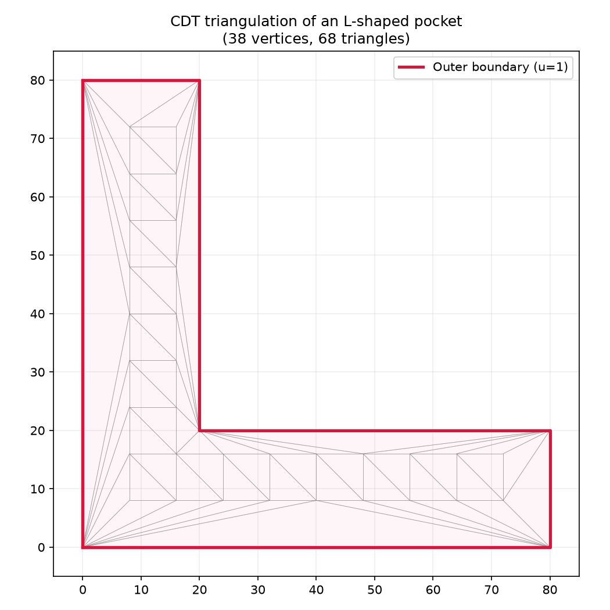

PDE mesh generation and Laplace solving for HSM toolpath planning.

Provides a TriangleMesh class for constrained Delaunay triangulation of 2D polygon domains, and a
solve_laplace function that solves the Laplace equation Δu=0 using linear finite elements.

Typical usage: from raygeo.geo.algo.pde_mesh import build_triangle_mesh, solve_laplace mesh =
build_triangle_mesh(outer, holes, tool_radius=0.0, min_angle=20.0) u = solve_laplace(mesh)

## TriangleMesh

### `adjacency`

```python
adjacency: list[int]
```

### `boundary_tags`

```python
boundary_tags: list[str]
```

### `triangles`

```python
triangles: list[tuple[int, int, int]]
```

### `vertices`

```python
vertices: list[tuple[float, float]]
```

## Functions

### `build_triangle_mesh()`

```python
build_triangle_mesh(
    outer: Sequence[types.Point],
    holes: Sequence[Sequence[types.Point]] = (),
    tool_radius: float = 0,
    min_angle: float = 20,
) -> TriangleMesh
```

Build a constrained Delaunay triangle mesh from polygon boundaries.

| Parameter     | Type                                   | Description                                            |
| ------------- | -------------------------------------- | ------------------------------------------------------ |
| `outer`       | `Sequence[types.Point]`                | Outer boundary polygon vertices as (x, y) tuples.      |
| `holes`       | `Sequence[Sequence[types.Point]] = ()` | Sequence of hole/island polygons.                      |
| `tool_radius` | `float = 0`                            | Tool radius for offsetting the outer boundary inwards. |
| `min_angle`   | `float = 20`                           | Minimum triangle angle for Steiner point refinement.   |
| _Returns_     | `TriangleMesh`                         | TriangleMesh with boundary tags.                       |
| _Complexity_  |                                        | O(n log n) time, O(n) space                            |


_CDT triangulation of a square pocket with centred hole_



_CDT triangulation of an L-shaped pocket_

### `solve_laplace()`

```python
solve_laplace(
    mesh: TriangleMesh,
    max_iter: int = 1000,
    tolerance: float = 1e-08,
) -> list[float]
```

Solve the Laplace equation Δu=0 on a triangle mesh.

Returns a scalar field with one value per vertex. Outer boundary vertices are fixed to u=1.0 and
inner boundary vertices to u=0.0.

| Parameter    | Type            | Description                                           |
| ------------ | --------------- | ----------------------------------------------------- |
| `mesh`       | `TriangleMesh`  | TriangleMesh with boundary tags.                      |
| `max_iter`   | `int = 1000`    | Maximum conjugate gradient iterations.                |
| `tolerance`  | `float = 1e-08` | Convergence tolerance for CG residual.                |
| _Returns_    | `list[float]`   | List of scalar u values, one per vertex.              |
| _Complexity_ |                 | O(k \* n) time where k is the number of CG iterations |


_Laplace solution — contours morph smoothly from hole to boundary_


_Laplace solution on an L-shaped domain_
