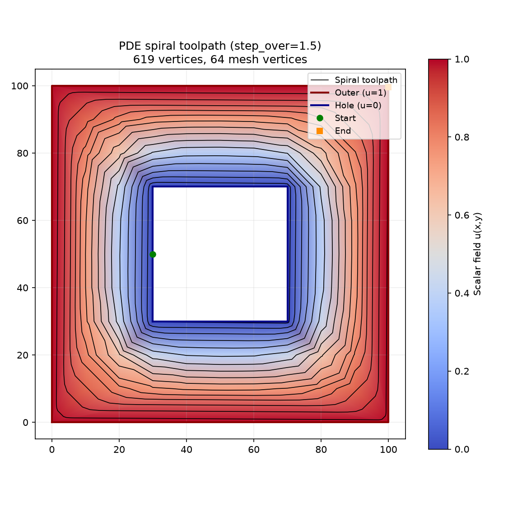

PDE-based spiral path tracing.

Given a triangle mesh with a Laplace solution (scalar field u), traces a spiral path from the inner
boundary (u=0) outward to the outer boundary (u≈1) by following the piecewise-constant vector field
∇u⊥ + α∇u.

Typical usage: from raygeo.geo.algo.pde_mesh import build_triangle_mesh, solve_laplace from
raygeo.geo.algo.pde_spiral import trace_spiral mesh = build_triangle_mesh(outer, [hole]) u =
solve_laplace(mesh) path = trace_spiral(mesh, u, step_over=1.0)

## Functions

### `trace_spiral()`

```python
trace_spiral(
    mesh: pde_mesh.TriangleMesh,
    u_field: Sequence[float],
    step_over: float,
) -> list[tuple[float, float, float]]
```

Trace a spiral toolpath from inner to outer boundary.

Uses the piecewise-constant gradient of the scalar field u to trace a smooth spiral that morphs from
the inner boundary (u=0) to the outer boundary (u=1) without self-intersections.

| Parameter    | Type                               | Description                                                                                       |
| ------------ | ---------------------------------- | ------------------------------------------------------------------------------------------------- |
| `mesh`       | `pde_mesh.TriangleMesh`            | TriangleMesh with boundary tags from build_triangle_mesh.                                         |
| `u_field`    | `Sequence[float]`                  | Scalar field from solve_laplace, one value per vertex.                                            |
| `step_over`  | `float`                            | Desired radial step-over distance between spiral turns. Larger values produce fewer, wider loops. |
| _Returns_    | `list[tuple[float, float, float]]` | List of (x, y, z) points forming the spiral polyline.                                             |
| _Complexity_ |                                    | O(t \* k) where t is the number of traversed triangles                                            |



_Spiral toolpath traced on the Laplace solution — path morphs smoothly from the inner hole outward_
