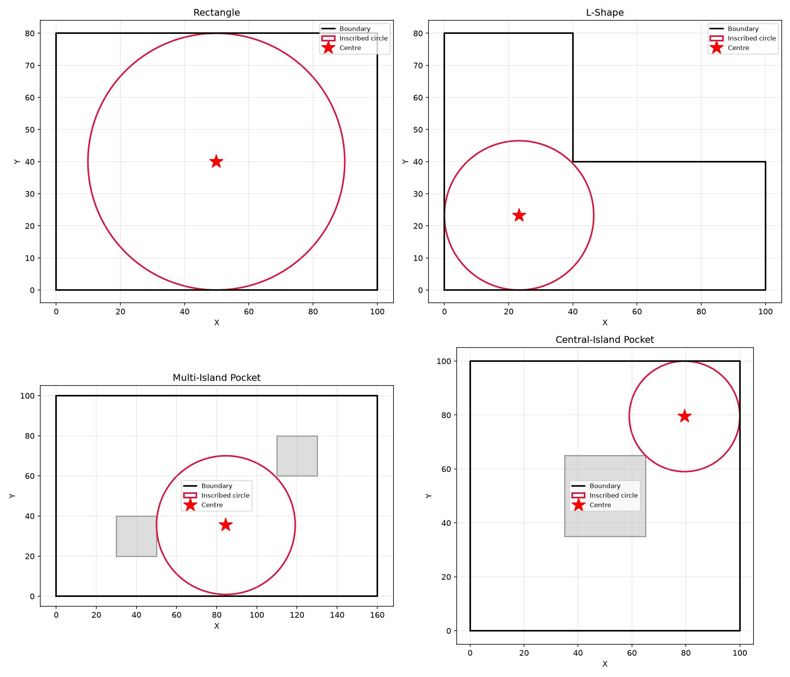
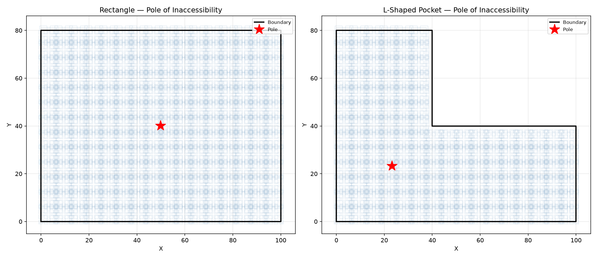
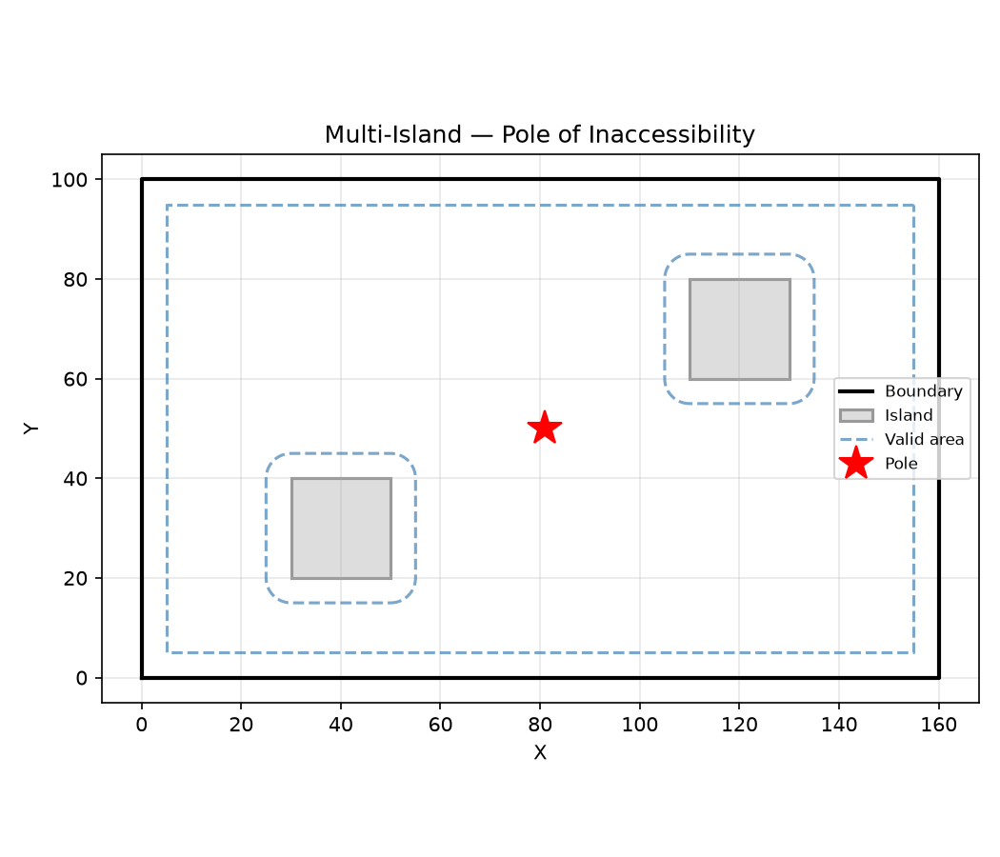
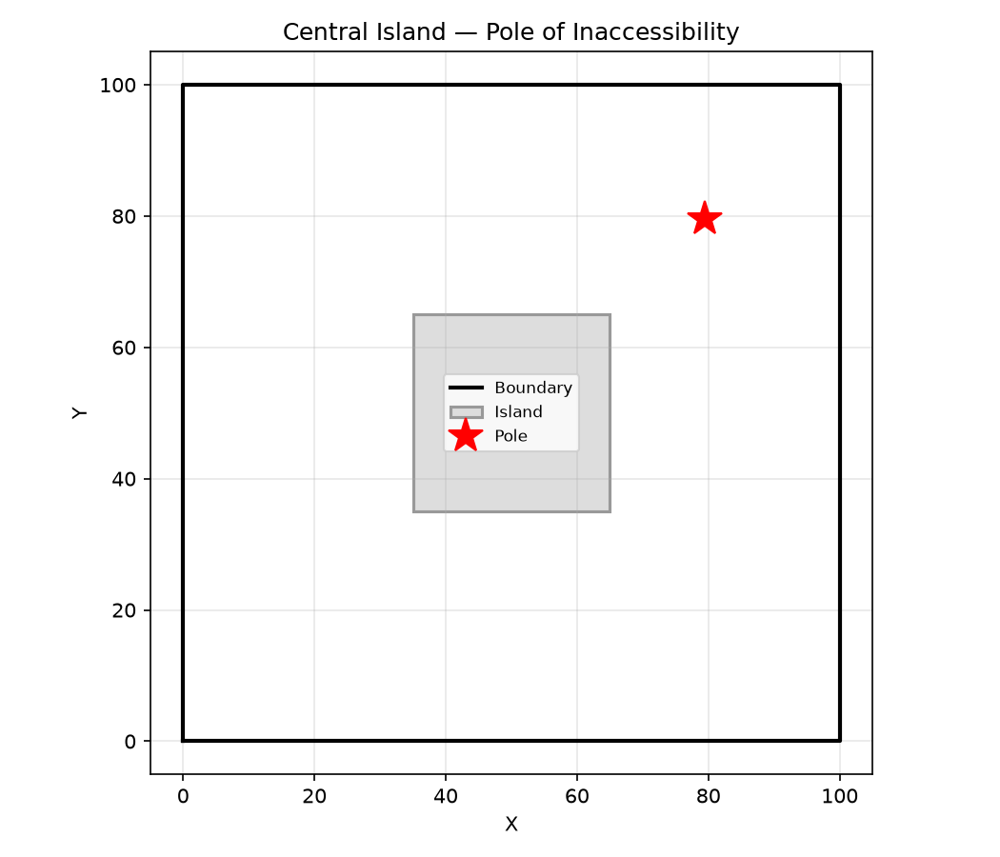

## Functions

### `find_largest_circle()`

```python
find_largest_circle(
    shell: Sequence[tuple[float, float]],
    holes: Sequence[Sequence[tuple[float, float]]] = [],
    precision: float = 0.5,
) -> tuple[tuple[float, float], float] | None
```

Find the centre and radius of the largest inscribed circle.

| Parameter   | Type                                            | Description                                       |
| ----------- | ----------------------------------------------- | ------------------------------------------------- |
| `shell`     | `Sequence[tuple[float, float]]`                 | Outer boundary polygon.                           |
| `holes`     | `Sequence[Sequence[tuple[float, float]]] = []`  | List of hole polygons to exclude (default []).    |
| `precision` | `float = 0.5`                                   | Desired precision (default 0.5).                  |
| _Returns_   | `tuple[tuple[float, float], float] &#124; None` | ((x, y), radius) or None for degenerate polygons. |



_find_largest_circle returns the centre and radius of the largest inscribed circle — the entry point
and its clearance for helical versus ramp decisions_

### `polylabel()`

```python
polylabel(
    shell: Sequence[tuple[float, float]],
    holes: Sequence[Sequence[tuple[float, float]]] = [],
    precision: float = 0.5,
) -> tuple[float, float] | None
```

Find the pole of inaccessibility of a polygon (with optional holes).

Uses the Polylabel algorithm (Mapbox): a priority-queue of grid cells repeatedly subdivided until
the cell radius drops below _precision_.

| Parameter    | Type                                           | Description                                                         |
| ------------ | ---------------------------------------------- | ------------------------------------------------------------------- |
| `shell`      | `Sequence[tuple[float, float]]`                | Outer boundary polygon.                                             |
| `holes`      | `Sequence[Sequence[tuple[float, float]]] = []` | List of hole polygons to exclude (default []).                      |
| `precision`  | `float = 0.5`                                  | Desired precision (default 0.5).                                    |
| _Returns_    | `tuple[float, float] &#124; None`              | (x, y) of the most interior point, or None for degenerate polygons. |
| _Complexity_ |                                                | O(n log n) where n is the number of cells explored.                 |



_Polylabel: priority-queue cell refinement finds the point farthest from the boundary — the pole of
inaccessibility_



_Multi-island pocket: the pole of inaccessibility sits in the largest valid region, farthest from
all boundaries_



_Central-island pocket (annular): the pole of inaccessibility sits at the centre of the ring_
