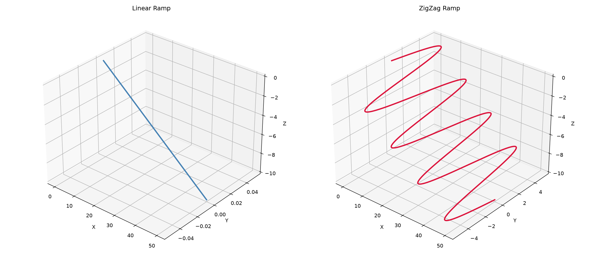

Ramp entry path generation for milling.

Provides linear and zig-zag ramp generation for tool entry into material, with automatic extension
when the ramp angle exceeds the maximum.

## RampStyle

## Functions

### `generate_ramp_3d()`

```python
generate_ramp_3d(
    start: tuple[float, float],
    end: tuple[float, float],
    z_start: float,
    z_end: float,
    max_ramp_angle_deg: float = 45,
    style: RampStyle = RampStyle.Linear,
    lateral_amplitude: float = 1,
) -> list[tuple[float, float, float]]
```

Generate a ramp entry polyline.

If the direct ramp angle exceeds max_ramp_angle_deg, the ramp is extended in both directions along
the same line.

| Parameter            | Type                               | Description                                                  |
| -------------------- | ---------------------------------- | ------------------------------------------------------------ |
| `start`              | `tuple[float, float]`              | Start XY position.                                           |
| `end`                | `tuple[float, float]`              | End XY position.                                             |
| `z_start`            | `float`                            | Starting Z height.                                           |
| `z_end`              | `float`                            | Ending Z height (must be lower than z_start).                |
| `max_ramp_angle_deg` | `float = 45`                       | Maximum allowed ramp angle in degrees (default 45).          |
| `style`              | `RampStyle = RampStyle.Linear`     | Ramp style — Linear or ZigZag (default Linear).              |
| `lateral_amplitude`  | `float = 1`                        | Lateral oscillation amplitude for ZigZag (default 1.0).      |
| _Returns_            | `list[tuple[float, float, float]]` | List of (x, y, z) points along the ramp.                     |
| _Complexity_         |                                    | O(n) time, O(n) space where n is proportional to path length |



*Linear (left) and ZigZag (right) ramp entry paths*
