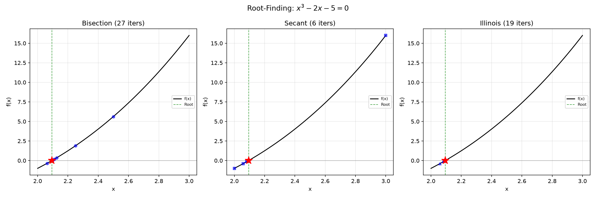
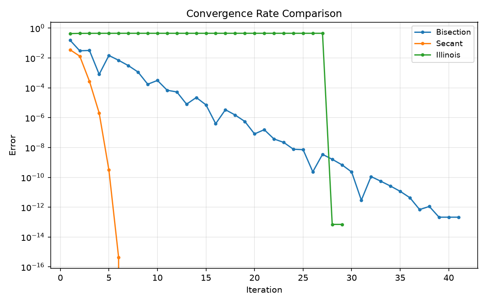
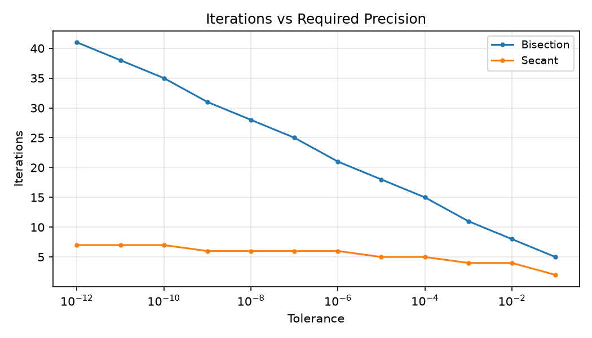
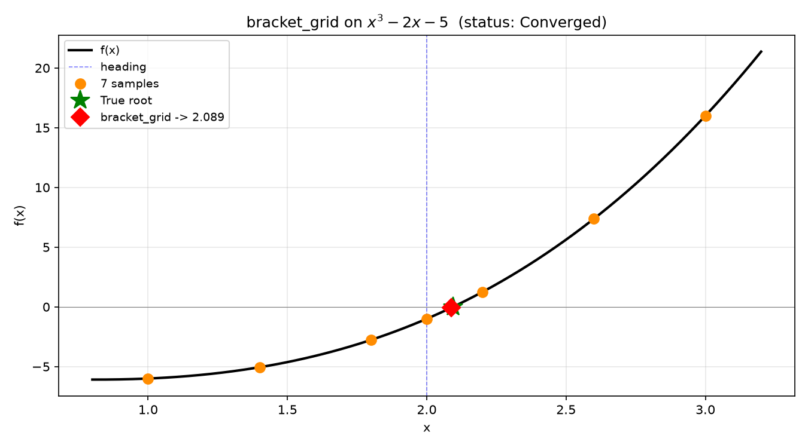

*Bisection, solve_secant, and Illinois on $x^3 - 2x - 5$.* 1D root-finding methods: bisection,
solve_secant, Illinois.

## Functions

### `bisect()`

```python
bisect(
    f: Callable[[float], float],
    lo: float,
    hi: float,
    tol: float = 1e-10,
    max_iter: int = 100,
) -> tuple[float, str, int]
```

Bisection root-finding.

| Parameter  | Type                       | Description                                                |
| ---------- | -------------------------- | ---------------------------------------------------------- |
| `f`        | `Callable[[float], float]` | Function to find the root of (takes float, returns float). |
| `lo`       | `float`                    | Lower bound of the search interval.                        |
| `hi`       | `float`                    | Upper bound of the search interval.                        |
| `tol`      | `float = 1e-10`            | Convergence tolerance (default 1e-10).                     |
| `max_iter` | `int = 100`                | Maximum iterations (default 100).                          |
| _Returns_  | `tuple[float, str, int]`   | `(root, status_string, iteration_count)`.                  |



*Error vs iteration count: solve_secant fastest, bisection slowest*



*Iterations to reach a given tolerance for sqrt(2): solve_secant needs far fewer than bisection.*

### `bisect_tracked()`

```python
bisect_tracked(
    f: Any,
    lo: float,
    hi: float,
    tol: float = 1e-10,
    max_iter: int = 100,
) -> tuple[float, str, int, list[float]]
```

Tracked bisection root-finding.

| Parameter  | Type                                  | Description                                        |
| ---------- | ------------------------------------- | -------------------------------------------------- |
| `f`        | `Any`                                 | Function to find the root of.                      |
| `lo`       | `float`                               | Lower bound of the search interval.                |
| `hi`       | `float`                               | Upper bound of the search interval.                |
| `tol`      | `float = 1e-10`                       | Convergence tolerance.                             |
| `max_iter` | `int = 100`                           | Maximum number of iterations.                      |
| _Returns_  | `tuple[float, str, int, list[float]]` | `(root, status_string, iteration_count, history)`. |

### `bracket_grid()`

```python
bracket_grid(
    f: Callable[[float], float],
    heading: float,
    max_deflection: float,
) -> tuple[float, str, int]
```

7-sample angular grid search with linear interpolation.

Samples *f* at `heading + max_deflection * ratio` for 7 ratios evenly spaced across
`[-1, -0.6, -0.2, 0, 0.2, 0.6, 1.0]`. When a sign change is found between adjacent samples the root
is linearly interpolated. Falls back to the sample with smallest absolute error.

| Parameter        | Type                       | Description                            |
| ---------------- | -------------------------- | -------------------------------------- |
| `f`              | `Callable[[float], float]` | Error function *f(angle) -> error*.    |
| `heading`        | `float`                    | Centre angle in radians.               |
| `max_deflection` | `float`                    | Maximum angular spread in radians.     |
| _Returns_        | `tuple[float, str, int]`   | `(root, status_string, sample_count)`. |



*7-sample grid search (linear interp): samples f(x) around heading and interpolates sign changes*

### `solve_illinois()`

```python
solve_illinois(
    f: Callable[[float], float],
    lo: float,
    hi: float,
    tol: float = 1e-10,
    max_iter: int = 100,
) -> tuple[float, str, int]
```

Illinois (safeguarded false-position) root-finding.

| Parameter  | Type                       | Description                                                |
| ---------- | -------------------------- | ---------------------------------------------------------- |
| `f`        | `Callable[[float], float]` | Function to find the root of (takes float, returns float). |
| `lo`       | `float`                    | Lower bound of the search interval.                        |
| `hi`       | `float`                    | Upper bound of the search interval.                        |
| `tol`      | `float = 1e-10`            | Convergence tolerance (default 1e-10).                     |
| `max_iter` | `int = 100`                | Maximum iterations (default 100).                          |
| _Returns_  | `tuple[float, str, int]`   | `(root, status_string, iteration_count)`.                  |

### `solve_illinois_tracked()`

```python
solve_illinois_tracked(
    f: Any,
    lo: float,
    hi: float,
    tol: float = 1e-10,
    max_iter: int = 100,
) -> tuple[float, str, int, list[float]]
```

Tracked Illinois method root-finding.

| Parameter  | Type                                  | Description                                        |
| ---------- | ------------------------------------- | -------------------------------------------------- |
| `f`        | `Any`                                 | Function to find the root of.                      |
| `lo`       | `float`                               | Lower bound of the search interval.                |
| `hi`       | `float`                               | Upper bound of the search interval.                |
| `tol`      | `float = 1e-10`                       | Convergence tolerance.                             |
| `max_iter` | `int = 100`                           | Maximum number of iterations.                      |
| _Returns_  | `tuple[float, str, int, list[float]]` | `(root, status_string, iteration_count, history)`. |

### `solve_secant()`

```python
solve_secant(
    f: Callable[[float], float],
    x0: float,
    x1: float,
    tol: float = 1e-10,
    max_iter: int = 100,
) -> tuple[float, str, int]
```

Secant root-finding.

| Parameter  | Type                       | Description                                                |
| ---------- | -------------------------- | ---------------------------------------------------------- |
| `f`        | `Callable[[float], float]` | Function to find the root of (takes float, returns float). |
| `x0`       | `float`                    | First initial guess.                                       |
| `x1`       | `float`                    | Second initial guess.                                      |
| `tol`      | `float = 1e-10`            | Convergence tolerance (default 1e-10).                     |
| `max_iter` | `int = 100`                | Maximum iterations (default 100).                          |
| _Returns_  | `tuple[float, str, int]`   | `(root, status_string, iteration_count)`.                  |

### `solve_secant_tracked()`

```python
solve_secant_tracked(
    f: Any,
    x0: float,
    x1: float,
    tol: float = 1e-10,
    max_iter: int = 100,
) -> tuple[float, str, int, list[float]]
```

Tracked solve_secant method root-finding.

| Parameter  | Type                                  | Description                                        |
| ---------- | ------------------------------------- | -------------------------------------------------- |
| `f`        | `Any`                                 | Function to find the root of.                      |
| `x0`       | `float`                               | First initial guess.                               |
| `x1`       | `float`                               | Second initial guess.                              |
| `tol`      | `float = 1e-10`                       | Convergence tolerance.                             |
| `max_iter` | `int = 100`                           | Maximum number of iterations.                      |
| _Returns_  | `tuple[float, str, int, list[float]]` | `(root, status_string, iteration_count, history)`. |
