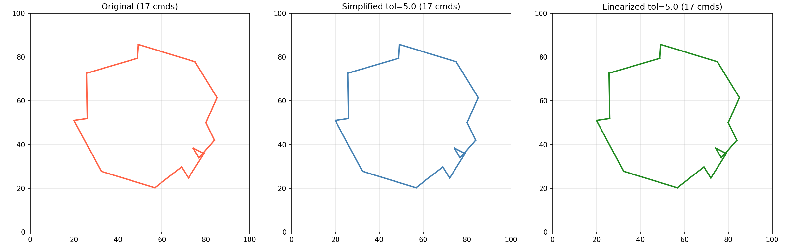
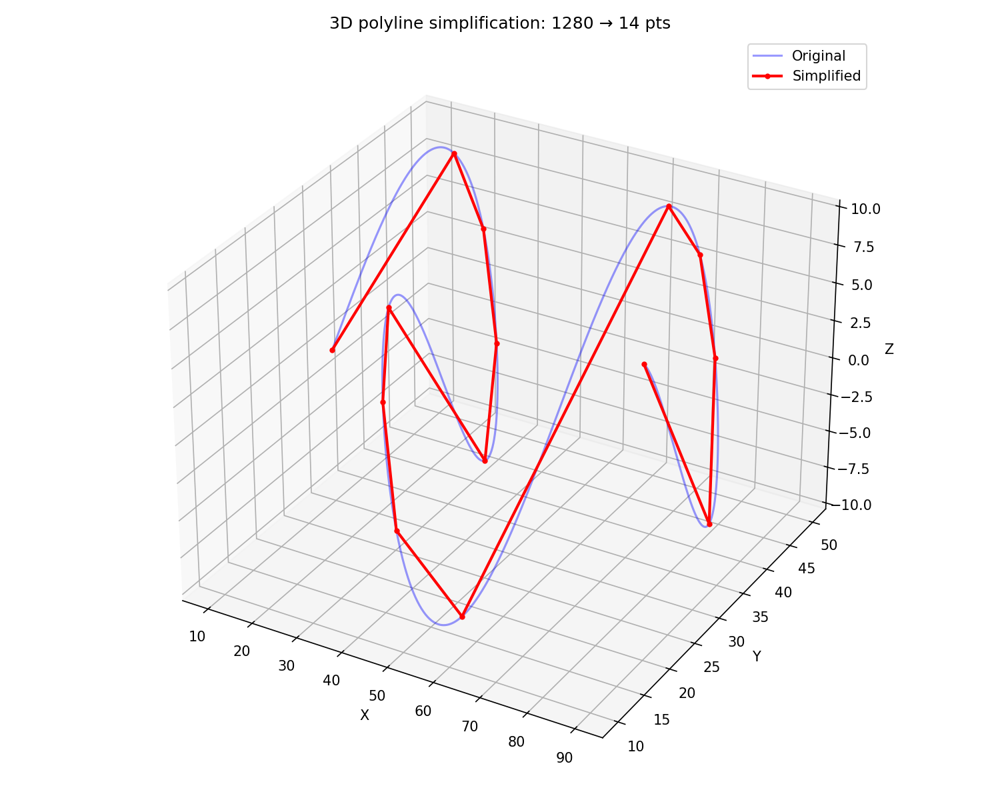

Polyline simplification using the Ramer-Douglas-Peucker algorithm.

Reduces the number of points in a polyline while preserving the overall shape within a given
tolerance.

## Functions

### `simplify_polyline()`

```python
simplify_polyline(
    points: Sequence[types.Point],
    tolerance: float,
) -> types.Polygon
```

Simplify a polyline using the Ramer-Douglas-Peucker algorithm.

| Parameter    | Type                    | Description                         |
| ------------ | ----------------------- | ----------------------------------- |
| `points`     | `Sequence[types.Point]` | Sequence of (x, y) points.          |
| `tolerance`  | `float`                 | Simplification tolerance.           |
| _Returns_    | `types.Polygon`         | Simplified point sequence.          |
| _Complexity_ |                         | O(n log n) average time, O(n) space |



_Simplify and linearize_

### `simplify_polyline_3d()`

```python
simplify_polyline_3d(
    points: Sequence[types.Point3D],
    tolerance: float,
) -> types.Polygon3D
```

Simplify a 3D polyline using the Ramer-Douglas-Peucker algorithm.

The simplification uses XY distance, but preserves Z coordinates of kept points.

| Parameter    | Type                      | Description                         |
| ------------ | ------------------------- | ----------------------------------- |
| `points`     | `Sequence[types.Point3D]` | Sequence of (x, y, z) points.       |
| `tolerance`  | `float`                   | Simplification tolerance.           |
| _Returns_    | `types.Polygon3D`         | Simplified 3D point sequence.       |
| _Complexity_ |                           | O(n log n) average time, O(n) space |



_3D polyline simplification preserving Z coordinates_
