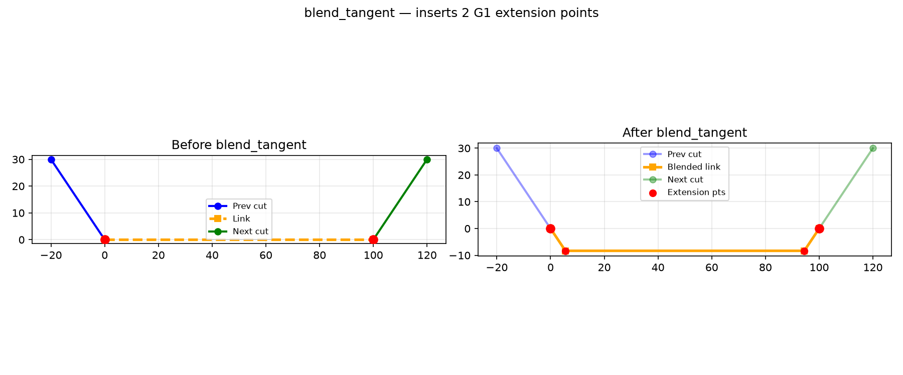
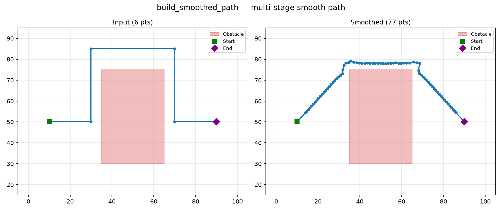
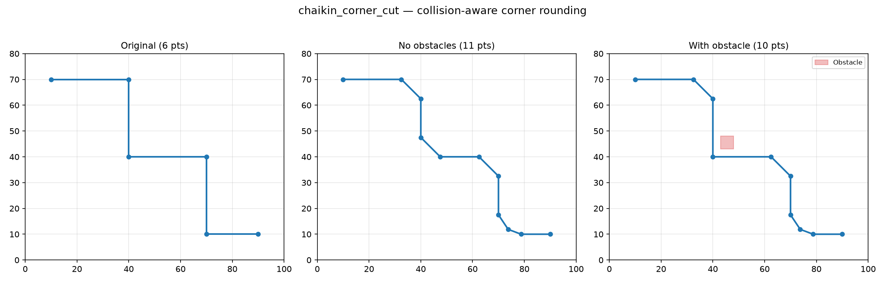
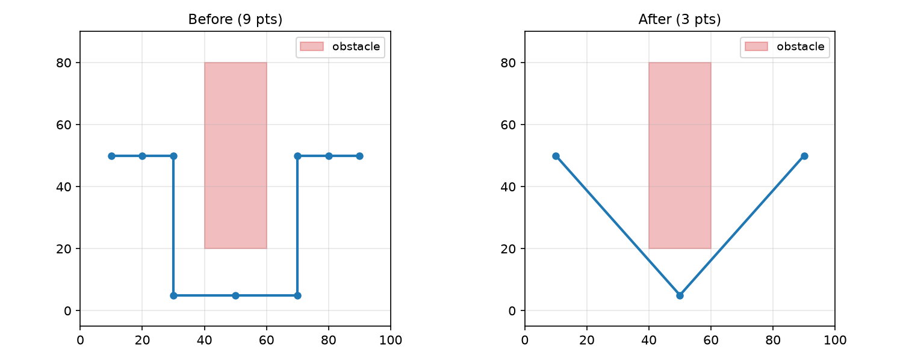
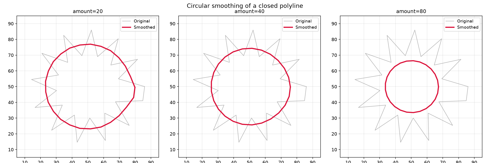
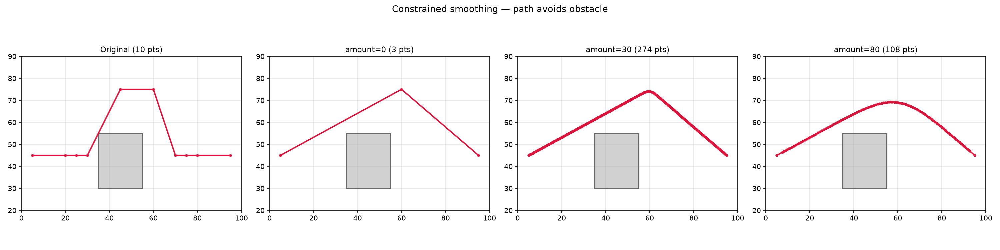
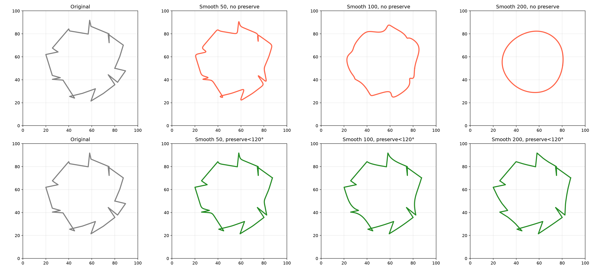
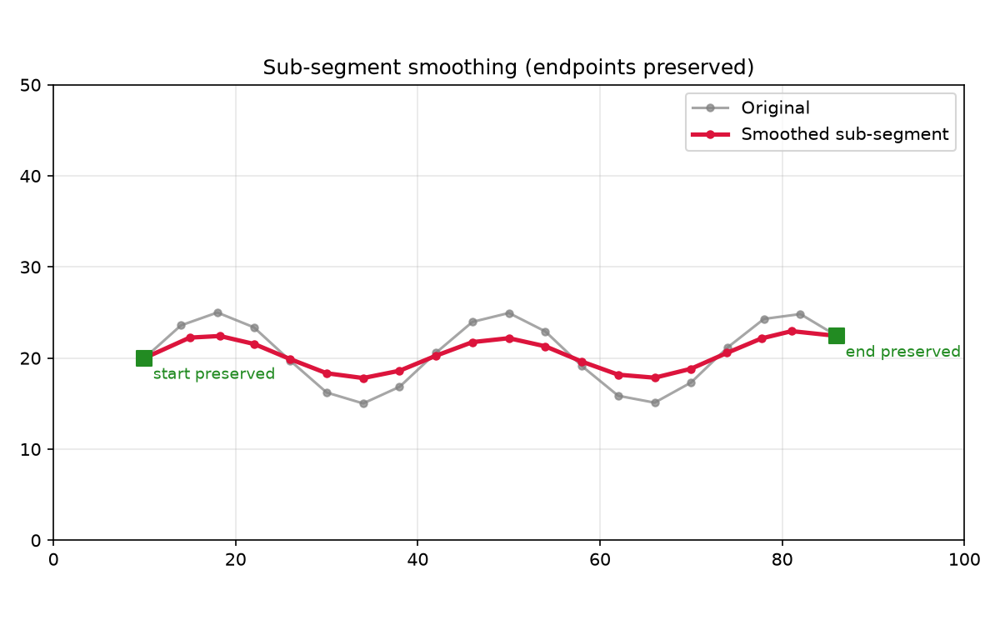

Polyline smoothing using Gaussian kernels.

Provides Gaussian kernel computation and circular/linear polyline smoothing with configurable corner
angle thresholds to preserve sharp features.

## Functions

### `blend_tangent()`

```python
blend_tangent(
    link: Sequence[tuple[float, float]],
    prev_tail: Sequence[tuple[float, float]],
    next_head: Sequence[tuple[float, float]],
    margin: float,
) -> list[tuple[float, float]]
```

Insert tangent extension points at both ends of a connecting polyline.

Returns a new polyline with points inserted to ensure it meets the adjacent polylines tangentially
(G1 continuity).

| Parameter   | Type                            | Description                                               |
| ----------- | ------------------------------- | --------------------------------------------------------- |
| `link`      | `Sequence[tuple[float, float]]` | Connecting polyline as a list of (x, y) tuples.           |
| `prev_tail` | `Sequence[tuple[float, float]]` | Last 2+ points of the preceding polyline.                 |
| `next_head` | `Sequence[tuple[float, float]]` | First 2+ points of the following polyline.                |
| `margin`    | `float`                         | Extension distance along the tangent direction.           |
| _Returns_   | `list[tuple[float, float]]`     | Modified polyline with tangent extension points inserted. |



*`blend_tangent` adds tangent points at travel-link ends for G1 continuity at cut–travel junctions*

### `build_smoothed_path()`

```python
build_smoothed_path(
    last: tuple[float, float],
    first: tuple[float, float],
    waypoints: Sequence[tuple[float, float]] = [],
    uncleared: Sequence[Sequence[tuple[float, float]]] = [],
    clearance: float = 1,
    smoothing_amount: int = 120,
) -> list[tuple[float, float]]
```

Build a smooth path between two points via multi-stage processing.

Pipeline:

1. Prepends *last* and appends *first* to *waypoints*.
1. Resamples for point density.
1. Iteratively shortcuts removable waypoints (collision-checked).
1. Applies aggressive Gaussian smoothing with per-point collision checking so points near obstacles
   are preserved while open areas are fully rounded.

| Parameter          | Type                                           | Description                                        |
| ------------------ | ---------------------------------------------- | -------------------------------------------------- |
| `last`             | `tuple[float, float]`                          | Start point (x, y).                                |
| `first`            | `tuple[float, float]`                          | End point (x, y).                                  |
| `waypoints`        | `Sequence[tuple[float, float]] = []`           | Intermediate waypoints between *last* and *first*. |
| `uncleared`        | `Sequence[Sequence[tuple[float, float]]] = []` | Obstacle polygons to avoid.                        |
| `clearance`        | `float = 1`                                    | Minimum distance from obstacles.                   |
| `smoothing_amount` | `int = 120`                                    | Gaussian smoothing amount (0-200, default 120).    |
| _Returns_          | `list[tuple[float, float]]`                    | Smoothed path as a list of (x, y) tuples.          |



*`build_smoothed_path` builds a smooth path via resample → shortcut → Gaussian relaxation*

### `chaikin_corner_cut()`

```python
chaikin_corner_cut(
    points: Sequence[tuple[float, float]],
    obstacles: Sequence[Sequence[tuple[float, float]]] = [],
    clearance: float = 1,
    iterations: int = 6,
) -> list[tuple[float, float]]
```

Round sharp corners using Chaikin corner cutting with collision checking.

Corners sharper than 45° are cut; gently curving sections are left untouched. Each cut point is
collision-tested against *obstacles* at *clearance* distance; if the cut would collide, the original
corner is preserved.

| Parameter    | Type                                           | Description                                          |
| ------------ | ---------------------------------------------- | ---------------------------------------------------- |
| `points`     | `Sequence[tuple[float, float]]`                | Polyline as a list of (x, y) tuples.                 |
| `obstacles`  | `Sequence[Sequence[tuple[float, float]]] = []` | List of obstacle polygons (each a list of (x, y)).   |
| `clearance`  | `float = 1`                                    | Minimum distance from obstacles (default 1.0).       |
| `iterations` | `int = 6`                                      | Number of Chaikin cutting passes (default 6).        |
| _Returns_    | `list[tuple[float, float]]`                    | Corner-smoothed polyline as a list of (x, y) tuples. |



*`chaikin_corner_cut` rounds sharp corners via Chaikin cut, respecting obstacle clearance*

### `compute_gaussian_kernel()`

```python
compute_gaussian_kernel(amount: int) -> tuple[list[float], float]
```

Compute a Gaussian kernel of the given size.

| Parameter    | Type                        | Description                      |
| ------------ | --------------------------- | -------------------------------- |
| `amount`     | `int`                       | Kernel size.                     |
| _Returns_    | `tuple[list[float], float]` | Tuple of (kernel_values, sigma). |
| _Complexity_ |                             | O(k) time, O(k) space            |


*Gaussian kernel weights*

### `shortcut_path()`

```python
shortcut_path(
    points: Sequence[tuple[float, float]],
    obstacles: Sequence[Sequence[tuple[float, float]]],
    clearance: float,
) -> list[tuple[float, float]]
```

Iteratively remove interior waypoints whose direct connection (prev → next) is collision-free,
repeating until no more points can be removed. Endpoints are always preserved.

| Parameter    | Type                                      | Description                                         |
| ------------ | ----------------------------------------- | --------------------------------------------------- |
| `points`     | `Sequence[tuple[float, float]]`           | Polyline as a list of (x, y) tuples.                |
| `obstacles`  | `Sequence[Sequence[tuple[float, float]]]` | List of obstacle polygons (each a list of (x, y)).  |
| `clearance`  | `float`                                   | Minimum distance the path must keep from obstacles. |
| _Returns_    | `list[tuple[float, float]]`               | Shortcutted polyline as a list of (x, y) tuples.    |
| _Complexity_ |                                           | O(n²) worst-case time, O(n) space                   |



*Iterative waypoint removal*

### `smooth_circularly()`

```python
smooth_circularly(
    points: Sequence[types.Point3D],
    kernel: Sequence[float],
) -> list[types.Point3D]
```

Smooth a closed polyline circularly.

| Parameter    | Type                      | Description                                                                     |
| ------------ | ------------------------- | ------------------------------------------------------------------------------- |
| `points`     | `Sequence[types.Point3D]` | Sequence of 3D points to smooth.                                                |
| `kernel`     | `Sequence[float]`         | Gaussian kernel values.                                                         |
| _Returns_    | `list[types.Point3D]`     | Smoothed points.                                                                |
| _Complexity_ |                           | O(n * k) time, O(n) space where k is the kernel size and n the number of points |



*Circular smoothing*

### `smooth_path()`

```python
smooth_path(
    points: Sequence[tuple[float, float]],
    obstacles: Sequence[Sequence[tuple[float, float]]],
    clearance: float,
    smoothing_amount: int = 50,
) -> list[tuple[float, float]]
```

Smooth a polyline while avoiding obstacles.

Two-phase constrained smoothing:

1. **Shortcut** – greedily removes intermediate waypoints whose direct connection stays clear of all
   *obstacles* by at least *clearance*.
1. **Gaussian relaxation** – iteratively applies Gaussian smoothing, reverting any point whose
   smoothed position would violate the clearance constraint.

Endpoints are always preserved.

| Parameter          | Type                                      | Description                                                            |
| ------------------ | ----------------------------------------- | ---------------------------------------------------------------------- |
| `points`           | `Sequence[tuple[float, float]]`           | Polyline as a list of (x, y) tuples.                                   |
| `obstacles`        | `Sequence[Sequence[tuple[float, float]]]` | List of obstacle polygons (each a list of (x, y)).                     |
| `clearance`        | `float`                                   | Minimum distance the path must keep from obstacles.                    |
| `smoothing_amount` | `int = 50`                                | Gaussian smoothing amount 0–200 (default 50). 0 applies shortcut only. |
| _Returns_          | `list[tuple[float, float]]`               | Smoothed polyline as a list of (x, y) tuples.                          |



*Constrained path smoothing*

### `smooth_polyline_3d()`

```python
smooth_polyline_3d(
    points: Sequence[types.Point3D],
    amount: int,
    corner_angle_threshold: float,
    is_closed: Optional[bool] = None,
) -> list[types.Point3D]
```

Smooth a 3D polyline using Gaussian smoothing.

| Parameter                | Type                      | Description                                                                     |
| ------------------------ | ------------------------- | ------------------------------------------------------------------------------- |
| `points`                 | `Sequence[types.Point3D]` | Sequence of 3D points to smooth.                                                |
| `amount`                 | `int`                     | Smoothing amount (kernel size).                                                 |
| `corner_angle_threshold` | `float`                   | Angle threshold for preserving corners.                                         |
| `is_closed`              | `Optional[bool] = None`   | Whether the polyline is closed.                                                 |
| _Returns_                | `list[types.Point3D]`     | Smoothed 3D points.                                                             |
| _Complexity_             |                           | O(n * k) time, O(n) space where k is the kernel size and n the number of points |



*Gaussian smoothing*

### `smooth_sub_segment()`

```python
smooth_sub_segment(
    points: Sequence[types.Point3D],
    kernel: Sequence[float],
) -> list[types.Point3D]
```

Smooth a sub-segment of a polyline.

| Parameter    | Type                      | Description                                                                     |
| ------------ | ------------------------- | ------------------------------------------------------------------------------- |
| `points`     | `Sequence[types.Point3D]` | Sequence of 3D points to smooth.                                                |
| `kernel`     | `Sequence[float]`         | Gaussian kernel values.                                                         |
| _Returns_    | `list[types.Point3D]`     | Smoothed points.                                                                |
| _Complexity_ |                           | O(n * k) time, O(n) space where k is the kernel size and n the number of points |



*Sub-segment smoothing*
