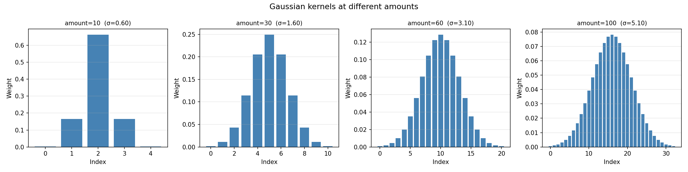
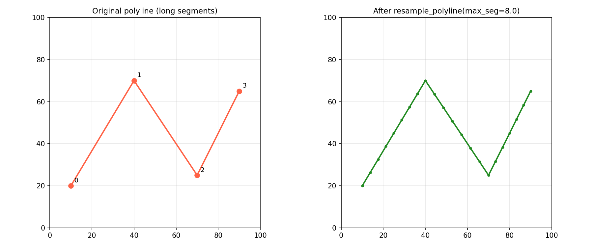
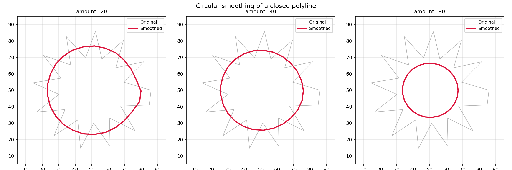
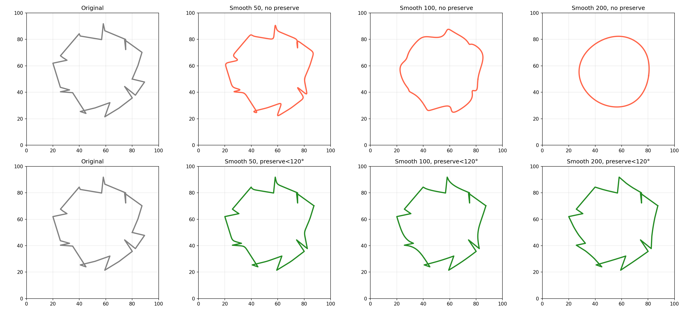

Polyline smoothing using Gaussian kernels.

Provides Gaussian kernel computation and circular/linear polyline smoothing with configurable corner
angle thresholds to preserve sharp features.

## Functions

### `compute_gaussian_kernel()`

`compute_gaussian_kernel(amount: int) -> tuple[list[float], float]`

Compute a Gaussian kernel of the given size.

**Returns:** Tuple of (kernel_values, sigma).

| Parameter    | Type                        | Description           |
| ------------ | --------------------------- | --------------------- |
| `amount`     | `int`                       | Kernel size.          |
| _Returns_    | `tuple[list[float], float]` |                       |
| _Complexity_ |                             | O(k) time, O(k) space |

_Gaussian kernel weights_

### `resample_polyline()`

`resample_polyline(points: collections.abc.Sequence[types.Point3D], max_segment_length: float, is_closed: bool) -> list[types.Point3D]`

Resample a polyline with a maximum segment length.

**Returns:** Resampled points.

| Parameter            | Type                                      | Description                     |
| -------------------- | ----------------------------------------- | ------------------------------- |
| `points`             | `collections.abc.Sequence[types.Point3D]` | Sequence of 3D points.          |
| `max_segment_length` | `float`                                   | Maximum allowed segment length. |
| `is_closed`          | `bool`                                    | Whether the polyline is closed. |
| _Returns_            | `list[types.Point3D]`                     |                                 |
| _Complexity_         |                                           | O(n) time, O(n) space           |

_Polyline resampling_

### `smooth_circularly()`

`smooth_circularly(points: collections.abc.Sequence[types.Point3D], kernel: collections.abc.Sequence[float]) -> list[types.Point3D]`

Smooth a closed polyline circularly.

**Returns:** Smoothed points.

| Parameter    | Type                                      | Description                                                                      |
| ------------ | ----------------------------------------- | -------------------------------------------------------------------------------- |
| `points`     | `collections.abc.Sequence[types.Point3D]` | Sequence of 3D points to smooth.                                                 |
| `kernel`     | `collections.abc.Sequence[float]`         | Gaussian kernel values.                                                          |
| _Returns_    | `list[types.Point3D]`                     |                                                                                  |
| _Complexity_ |                                           | O(n \* k) time, O(n) space where k is the kernel size and n the number of points |

_Circular smoothing_

### `smooth_polyline()`

`smooth_polyline(points: collections.abc.Sequence[types.Point3D], amount: int, corner_angle_threshold: float, is_closed: Optional[bool] = None) -> list[types.Point3D]`

Smooth a polyline using Gaussian smoothing.

**Returns:** Smoothed points.

| Parameter                | Type                                      | Description                                                                      |
| ------------------------ | ----------------------------------------- | -------------------------------------------------------------------------------- |
| `points`                 | `collections.abc.Sequence[types.Point3D]` | Sequence of 3D points to smooth.                                                 |
| `amount`                 | `int`                                     | Smoothing amount (kernel size).                                                  |
| `corner_angle_threshold` | `float`                                   | Angle threshold for preserving corners.                                          |
| `is_closed`              | `Optional[bool] = None`                   | Whether the polyline is closed.                                                  |
| _Returns_                | `list[types.Point3D]`                     |                                                                                  |
| _Complexity_             |                                           | O(n \* k) time, O(n) space where k is the kernel size and n the number of points |

_Gaussian smoothing_

### `smooth_sub_segment()`

`smooth_sub_segment(points: collections.abc.Sequence[types.Point3D], kernel: collections.abc.Sequence[float]) -> list[types.Point3D]`

Smooth a sub-segment of a polyline.

**Returns:** Smoothed points.

| Parameter    | Type                                      | Description                                                                      |
| ------------ | ----------------------------------------- | -------------------------------------------------------------------------------- |
| `points`     | `collections.abc.Sequence[types.Point3D]` | Sequence of 3D points to smooth.                                                 |
| `kernel`     | `collections.abc.Sequence[float]`         | Gaussian kernel values.                                                          |
| _Returns_    | `list[types.Point3D]`                     |                                                                                  |
| _Complexity_ |                                           | O(n \* k) time, O(n) space where k is the kernel size and n the number of points |

_Sub-segment smoothing_
