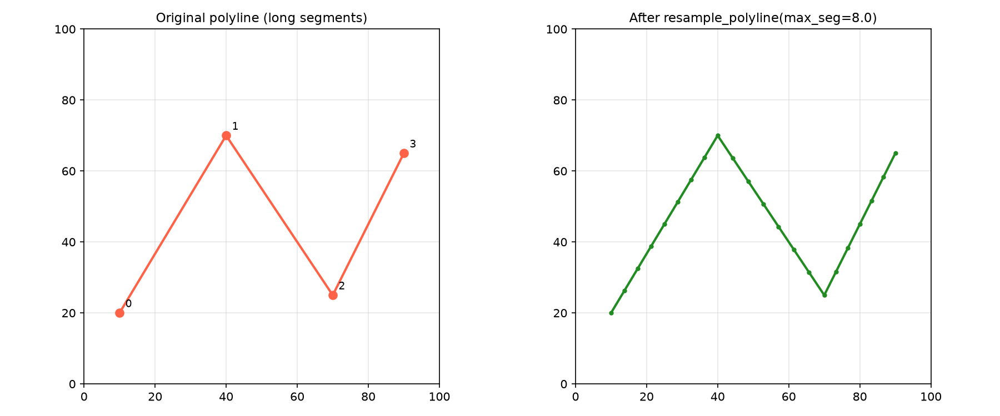

Polyline smoothing using Gaussian kernels.

Provides Gaussian kernel computation and circular/linear polyline smoothing with configurable corner
angle thresholds to preserve sharp features.

## Functions

### `compute_gaussian_kernel()`

```python
compute_gaussian_kernel(amount: int) -> tuple[list[float], float]
```

Compute a Gaussian kernel of the given size.

| Parameter    | Type                        | Description                      |
| ------------ | --------------------------- | -------------------------------- |
| `amount`     | `int`                       | Kernel size.                     |
| _Returns_    | `tuple[list[float], float]` | Tuple of (kernel_values, sigma). |
| _Complexity_ |                             | O(k) time, O(k) space            |


_Gaussian kernel weights_

### `resample_polyline()`

```python
resample_polyline(
    points: Sequence[types.Point3D],
    max_segment_length: float,
    is_closed: bool,
) -> list[types.Point3D]
```

Resample a polyline with a maximum segment length.

| Parameter            | Type                      | Description                     |
| -------------------- | ------------------------- | ------------------------------- |
| `points`             | `Sequence[types.Point3D]` | Sequence of 3D points.          |
| `max_segment_length` | `float`                   | Maximum allowed segment length. |
| `is_closed`          | `bool`                    | Whether the polyline is closed. |
| _Returns_            | `list[types.Point3D]`     | Resampled points.               |
| _Complexity_         |                           | O(n) time, O(n) space           |



_Polyline resampling_

### `smooth_circularly()`

```python
smooth_circularly(
    points: Sequence[types.Point3D],
    kernel: Sequence[float],
) -> list[types.Point3D]
```

Smooth a closed polyline circularly.

| Parameter    | Type                      | Description                                                                      |
| ------------ | ------------------------- | -------------------------------------------------------------------------------- |
| `points`     | `Sequence[types.Point3D]` | Sequence of 3D points to smooth.                                                 |
| `kernel`     | `Sequence[float]`         | Gaussian kernel values.                                                          |
| _Returns_    | `list[types.Point3D]`     | Smoothed points.                                                                 |
| _Complexity_ |                           | O(n \* k) time, O(n) space where k is the kernel size and n the number of points |


_Circular smoothing_

### `smooth_polyline()`

```python
smooth_polyline(
    points: Sequence[types.Point3D],
    amount: int,
    corner_angle_threshold: float,
    is_closed: Optional[bool] = None,
) -> list[types.Point3D]
```

Smooth a polyline using Gaussian smoothing.

| Parameter                | Type                      | Description                                                                      |
| ------------------------ | ------------------------- | -------------------------------------------------------------------------------- |
| `points`                 | `Sequence[types.Point3D]` | Sequence of 3D points to smooth.                                                 |
| `amount`                 | `int`                     | Smoothing amount (kernel size).                                                  |
| `corner_angle_threshold` | `float`                   | Angle threshold for preserving corners.                                          |
| `is_closed`              | `Optional[bool] = None`   | Whether the polyline is closed.                                                  |
| _Returns_                | `list[types.Point3D]`     | Smoothed points.                                                                 |
| _Complexity_             |                           | O(n \* k) time, O(n) space where k is the kernel size and n the number of points |


_Gaussian smoothing_

### `smooth_sub_segment()`

```python
smooth_sub_segment(
    points: Sequence[types.Point3D],
    kernel: Sequence[float],
) -> list[types.Point3D]
```

Smooth a sub-segment of a polyline.

| Parameter    | Type                      | Description                                                                      |
| ------------ | ------------------------- | -------------------------------------------------------------------------------- |
| `points`     | `Sequence[types.Point3D]` | Sequence of 3D points to smooth.                                                 |
| `kernel`     | `Sequence[float]`         | Gaussian kernel values.                                                          |
| _Returns_    | `list[types.Point3D]`     | Smoothed points.                                                                 |
| _Complexity_ |                           | O(n \* k) time, O(n) space where k is the kernel size and n the number of points |


_Sub-segment smoothing_
