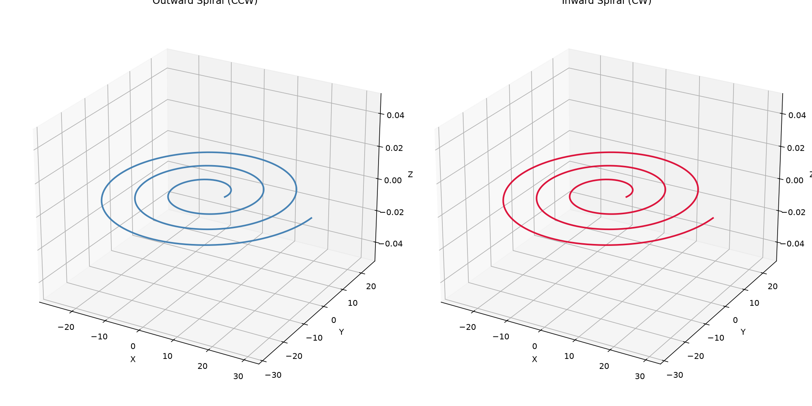

Flat Archimedean spiral path generation.

Produces a constant-Z spiral from a start radius to an end radius with configurable direction,
revolutions, and angular resolution. Used for widening after a helical entry (EntryStrategy.Helix
expand_to_diameter).

## Functions

### `generate_spiral()`

```python
generate_spiral(
    center: tuple[float, float],
    z: float,
    start_radius: float,
    end_radius: float,
    revolutions: float,
    direction: helix.HelixDirection,
    angular_step: float = 0.1,
) -> list[tuple[float, float, float]]
```

Generate a flat Archimedean spiral at constant Z.

The spiral sweeps linearly from `start_radius` to `end_radius` over the requested number of
revolutions.

| Parameter      | Type                               | Description                                                |
| -------------- | ---------------------------------- | ---------------------------------------------------------- |
| `center`       | `tuple[float, float]`              | Center (x, y) of the spiral.                               |
| `z`            | `float`                            | Constant Z height of the spiral.                           |
| `start_radius` | `float`                            | Starting radius.                                           |
| `end_radius`   | `float`                            | Ending radius.                                             |
| `revolutions`  | `float`                            | Total turns (may be fractional).                           |
| `direction`    | `helix.HelixDirection`             | CW or CCW revolution.                                      |
| `angular_step` | `float = 0.1`                      | Angular step in radians per vertex (default 0.1).          |
| _Returns_      | `list[tuple[float, float, float]]` | List of (x, y, z) points approximating the spiral.         |
| _Complexity_   |                                    | O(n) time, O(n) space where n = total_angle / angular_step |



_Outward (CCW) and inward (CW) flat Archimedean spirals_
