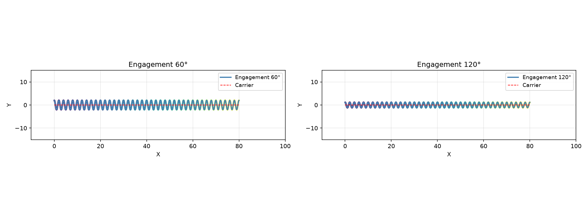
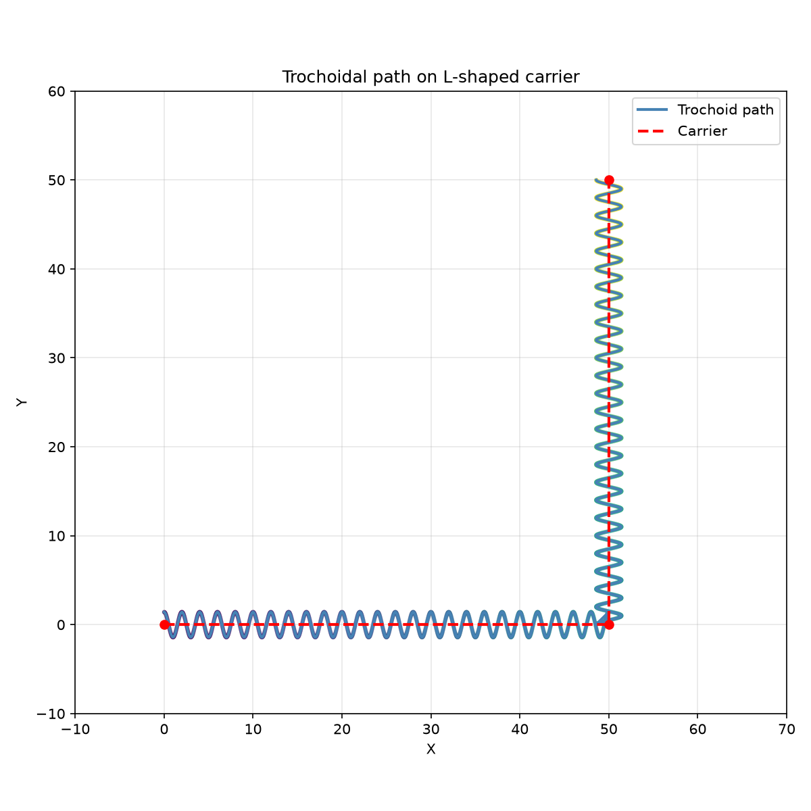

Trochoidal path generation for constant-engagement milling.

Provides generation of trochoidal toolpaths along a carrier polyline, with configurable tool
diameter, engagement angle, and step-over ratio.

## Functions

### `trochoid_along()`

```python
trochoid_along(
    carrier: Sequence[tuple[float, float]],
    tool_diameter: float,
    engagement_angle_deg: float = 90,
    step_over_ratio: float = 0.2,
    min_loop_radius: float = 0.5,
    z: float = 0,
) -> list[tuple[float, float, float]]
```

Generate a trochoidal cutting path along a carrier polyline.

| Parameter              | Type                               | Description                                                          |
| ---------------------- | ---------------------------------- | -------------------------------------------------------------------- |
| `carrier`              | `Sequence[tuple[float, float]]`    | Sequence of (x, y) points defining the centerline.                   |
| `tool_diameter`        | `float`                            | Tool diameter in mm.                                                 |
| `engagement_angle_deg` | `float = 90`                       | Target engagement angle in degrees (default 90).                     |
| `step_over_ratio`      | `float = 0.2`                      | Forward advance per loop as fraction of tool diameter (default 0.2). |
| `min_loop_radius`      | `float = 0.5`                      | Minimum trochoid loop radius in mm (default 0.5).                    |
| `z`                    | `float = 0`                        | Z height for all points (default 0.0).                               |
| _Returns_              | `list[tuple[float, float, float]]` | List of (x, y, z) points forming the trochoidal path.                |
| _Complexity_           |                                    | O(n) time, O(n) space where n is proportional to path length / step  |



_Trochoidal toolpath along a straight carrier — 60° vs 120°_



_Trochoidal toolpath around an L-shaped corner_
