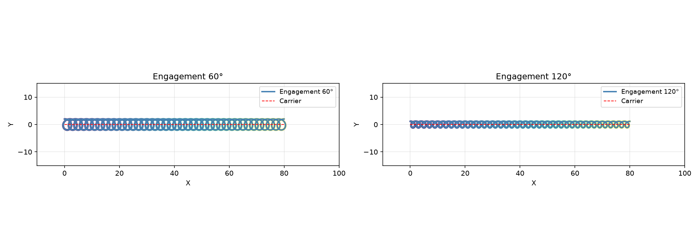
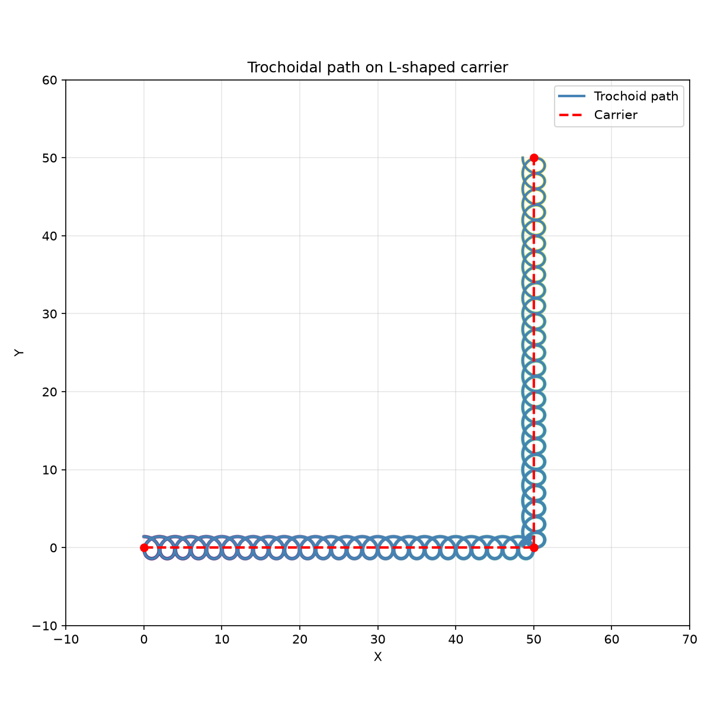

Trochoidal path generation along a carrier polyline.

Provides generation of trochoidal paths with configurable diameter, engagement angle, and step-over
ratio.

## Functions

### `get_trochoid_along_3d()`

```python
get_trochoid_along_3d(
    carrier: Sequence[tuple[float, float]],
    diameter: float,
    engagement_angle_deg: float = 90,
    step_over_ratio: float = 0.2,
    min_loop_radius: float = 0.5,
    z: float = 0,
) -> list[tuple[float, float, float]]
```

Generate a trochoidal path along a carrier polyline.

| Parameter              | Type                               | Description                                                         |
| ---------------------- | ---------------------------------- | ------------------------------------------------------------------- |
| `carrier`              | `Sequence[tuple[float, float]]`    | Sequence of (x, y) points defining the centerline.                  |
| `diameter`             | `float`                            | Trochoid generating circle diameter.                                |
| `engagement_angle_deg` | `float = 90`                       | Engagement angle in degrees (default 90).                           |
| `step_over_ratio`      | `float = 0.2`                      | Forward advance per loop as fraction of diameter (default 0.2).     |
| `min_loop_radius`      | `float = 0.5`                      | Minimum trochoid loop radius in mm (default 0.5).                   |
| `z`                    | `float = 0`                        | Z height for all points (default 0.0).                              |
| _Returns_              | `list[tuple[float, float, float]]` | List of (x, y, z) points forming the trochoidal path.               |
| _Complexity_           |                                    | O(n) time, O(n) space where n is proportional to path length / step |



*Trochoidal toolpath along a straight carrier — 60° vs 120°*



*Trochoidal toolpath around an L-shaped corner*
