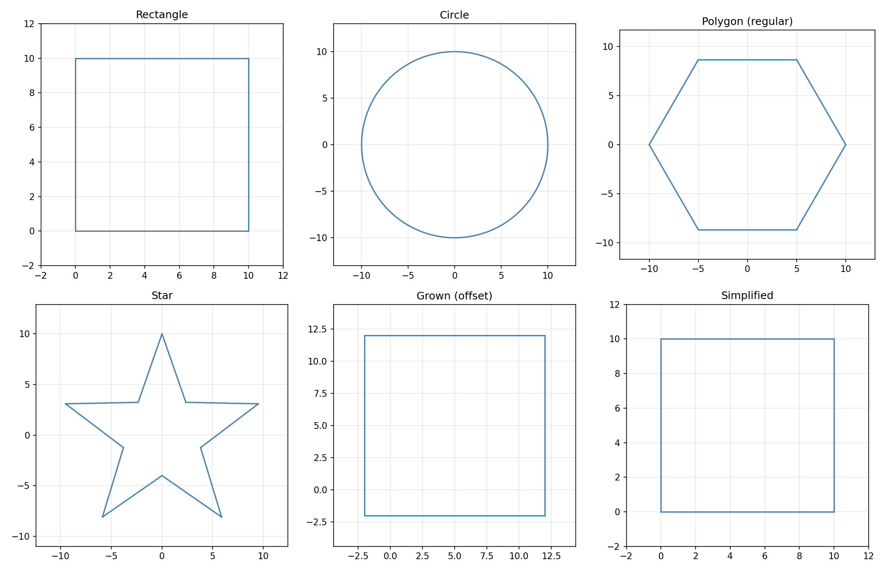

_Various geometry shapes and operations_ Geometry types and operations for 2D/3D path data.

The central type is Geometry — a mutable sequence of drawing commands (move, line, arc, bezier) that
represents one or more closed or open paths. Geometry supports construction (add_rect, add_circle,
etc.), analysis (area, distance, bounding rect), and manipulation (transform, simplify, linearize,
fit curves, grow/shrink, split, clip).

Shape sub-modules provide primitive-specific operations: arc bounding and intersection, bezier
splitting and flattening, circle containment tests, polygon boolean algebra and offsetting, and line
intersection.

Algorithm sub-modules provide higher-level geometric processing such as polyline simplification,
smoothing, curve fitting, and Minkowski sums for toolpath generation.

## Arc

### `center_offset`

`center_offset: tuple[float, float]`

### `clockwise`

`clockwise: bool`

### `end`

`end: tuple[float, float, float]`

## Bezier

### `control1`

`control1: tuple[float, float, float]`

### `control2`

`control2: tuple[float, float, float]`

### `end`

`end: tuple[float, float, float]`

## Geometry

### `data`

`data: list[Any]`

The commands as a list of typed command objects.

### `last_move_to`

`last_move_to: tuple[float, float, float]`

The coordinates of the last move-to command.

### `uniform_scalable`

`uniform_scalable: bool`

Whether the geometry uses uniform scalable arcs.

### `arc_to()`

`arc_to(x: float, y: float, i: float = 0.0, j: float = 0.0, clockwise: bool = True, z: float = 0.0) -> Geometry`

Draw an arc to the given coordinates.

| Parameter   | Type          | Description                            |
| ----------- | ------------- | -------------------------------------- |
| `x`         | `float`       | X coordinate.                          |
| `y`         | `float`       | Y coordinate.                          |
| `i`         | `float = 0.0` | I offset from current point to center. |
| `j`         | `float = 0.0` | J offset from current point to center. |
| `clockwise` | `bool = True` | Whether the arc is clockwise.          |
| `z`         | `float = 0.0` | Z coordinate (default 0.0).            |
| _Returns_   | `Geometry`    |                                        |

### `arc_to_as_bezier()`

`arc_to_as_bezier(x: float, y: float, i: float, j: float, clockwise: bool = True, z: float = 0.0) -> Geometry`

Draw an arc, converting it to bezier curves.

| Parameter   | Type          | Description         |
| ----------- | ------------- | ------------------- |
| `x`         | `float`       | End X coordinate.   |
| `y`         | `float`       | End Y coordinate.   |
| `i`         | `float`       | I offset to center. |
| `j`         | `float`       | J offset to center. |
| `clockwise` | `bool = True` | Arc direction.      |
| `z`         | `float = 0.0` | End Z coordinate.   |
| _Returns_   | `Geometry`    |                     |

### `area()`

`area() -> float`

Return the signed area of the geometry.

| Parameter | Type    | Description |
| --------- | ------- | ----------- |
| _Returns_ | `float` |             |

### `bezier_to()`

`bezier_to(x: float, y: float, c1x: float, c1y: float, c2x: float, c2y: float, *, c1z: float = 0.0, c2z: float = 0.0, z: float = 0.0) -> Geometry`

Draw a cubic bezier curve.

| Parameter | Type       | Description                           |
| --------- | ---------- | ------------------------------------- |
| `x`       | `float`    | End X coordinate.                     |
| `y`       | `float`    | End Y coordinate.                     |
| `c1x`     | `float`    | First control point X.                |
| `c1y`     | `float`    | First control point Y.                |
| `c2x`     | `float`    | Second control point X.               |
| `c2y`     | `float`    | Second control point Y.               |
| `c1z`     | `float`    | First control point Z (default 0.0).  |
| `c2z`     | `float`    | Second control point Z (default 0.0). |
| `z`       | `float`    | End Z coordinate (default 0.0).       |
| _Returns_ | `Geometry` |                                       |

### `cleanup()`

`cleanup(tolerance: float) -> Geometry`

Remove duplicate segments from the geometry.

| Parameter   | Type       | Description                     |
| ----------- | ---------- | ------------------------------- |
| `tolerance` | `float`    | Maximum deviation for equality. |
| _Returns_   | `Geometry` |                                 |

### `clear()`

`clear() -> Geometry`

Remove all commands from the geometry.

| Parameter | Type       | Description |
| --------- | ---------- | ----------- |
| _Returns_ | `Geometry` |             |

### `close_all_contours()`

`close_all_contours() -> Geometry`

Close all open contours in the geometry.

| Parameter | Type       | Description |
| --------- | ---------- | ----------- |
| _Returns_ | `Geometry` |             |

### `close_gaps()`

`close_gaps(tolerance: Optional[float] = None) -> Geometry`

Close gaps between sub-paths.

| Parameter   | Type                     | Description       |
| ----------- | ------------------------ | ----------------- |
| `tolerance` | `Optional[float] = None` | Max gap to close. |
| _Returns_   | `Geometry`               |                   |

### `close_path()`

`close_path() -> Geometry`

Close the current sub-path.

| Parameter | Type       | Description |
| --------- | ---------- | ----------- |
| _Returns_ | `Geometry` |             |

### `copy()`

`copy() -> Geometry`

Return a deep copy of this geometry.

| Parameter | Type       | Description |
| --------- | ---------- | ----------- |
| _Returns_ | `Geometry` |             |

### `distance()`

`distance() -> float`

Return the total path distance.

| Parameter | Type    | Description |
| --------- | ------- | ----------- |
| _Returns_ | `float` |             |

### `encloses()`

`encloses(other: Geometry) -> bool`

Check if this geometry encloses another.

| Parameter | Type       | Description                        |
| --------- | ---------- | ---------------------------------- |
| `other`   | `Geometry` | The potentially enclosed geometry. |
| _Returns_ | `bool`     |                                    |

### `extend()`

`extend(other: Geometry) -> Geometry`

Append another geometry's commands to this one.

| Parameter | Type       | Description             |
| --------- | ---------- | ----------------------- |
| `other`   | `Geometry` | The geometry to append. |
| _Returns_ | `Geometry` |                         |

### `filter()`

`filter(indices: set[int]) -> Geometry`

Return a new Geometry containing only commands at the given indices.

**Returns:** A new Geometry with the filtered commands.

| Parameter | Type       | Description                     |
| --------- | ---------- | ------------------------------- |
| `indices` | `set[int]` | Set of command indices to keep. |
| _Returns_ | `Geometry` |                                 |

### `filter_to_external_contours()`

`filter_to_external_contours() -> Geometry`

Filter to only external (outermost) contours.

| Parameter | Type       | Description |
| --------- | ---------- | ----------- |
| _Returns_ | `Geometry` |             |

### `find_closest_point()`

`find_closest_point(x: float, y: float) -> Optional[tuple[int, float, tuple[float, float]]]`

Find the closest point on the path to (x, y).

**Returns:** Tuple of (segment_index, t, point) or None.

| Parameter | Type                                               | Description   |
| --------- | -------------------------------------------------- | ------------- |
| `x`       | `float`                                            | X coordinate. |
| `y`       | `float`                                            | Y coordinate. |
| _Returns_ | `Optional[tuple[int, float, tuple[float, float]]]` |               |

### `fit_arcs()`

`fit_arcs(tolerance: float) -> Geometry`

Fit arcs only to the linearized geometry.

| Parameter   | Type       | Description        |
| ----------- | ---------- | ------------------ |
| `tolerance` | `float`    | Maximum deviation. |
| _Returns_   | `Geometry` |                    |

### `fit_curves()`

`fit_curves(tolerance: float, beziers: bool = True, arcs: bool = True, on_progress: Optional[Any] = None) -> Geometry`

Fit curves (beziers and arcs) to the linearized geometry.

| Parameter     | Type                   | Description                                                |
| ------------- | ---------------------- | ---------------------------------------------------------- |
| `tolerance`   | `float`                | Maximum deviation.                                         |
| `beziers`     | `bool = True`          | Whether to fit bezier curves.                              |
| `arcs`        | `bool = True`          | Whether to fit arcs.                                       |
| `on_progress` | `Optional[Any] = None` | Optional progress callback called with `(current, total)`. |
| _Returns_     | `Geometry`             |                                                            |

### `flip_x()`

`flip_x() -> Geometry`

Mirror the geometry along the X axis.

| Parameter | Type       | Description |
| --------- | ---------- | ----------- |
| _Returns_ | `Geometry` |             |

### `flip_y()`

`flip_y() -> Geometry`

Mirror the geometry along the Y axis.

| Parameter | Type       | Description |
| --------- | ---------- | ----------- |
| _Returns_ | `Geometry` |             |

### `from_dict()`

`@classmethod from_dict(data: dict) -> Geometry`

Create a Geometry from a dictionary.

    **to_dict**.

| Parameter | Type       | Description                 |
| --------- | ---------- | --------------------------- |
| `data`    | `dict`     | A dictionary as produced by |
| _Returns_ | `Geometry` |                             |

### `from_points()`

`@classmethod from_points(points: Any, close: bool = True) -> Geometry`

Create a Geometry from a sequence of points.

    (x, y, z) coordinate tuples.

| Parameter | Type          | Description                |
| --------- | ------------- | -------------------------- |
| `points`  | `Any`         | A sequence of (x, y) or    |
| `close`   | `bool = True` | Whether to close the path. |
| _Returns_ | `Geometry`    |                            |

### `get_command_at()`

`get_command_at(index: int) -> Optional[Any]`

Get the command at the given index as a typed command object.

| Parameter | Type            | Description                            |
| --------- | --------------- | -------------------------------------- |
| `index`   | `int`           | Command index (negative returns None). |
| _Returns_ | `Optional[Any]` |                                        |

### `get_last_point()`

`get_last_point() -> tuple[float, float, float]`

Get the last point in the geometry.

| Parameter | Type                         | Description |
| --------- | ---------------------------- | ----------- |
| _Returns_ | `tuple[float, float, float]` |             |

### `get_outward_normal_at()`

`get_outward_normal_at(segment_index: int, t: float) -> Optional[tuple[float, float]]`

Get the outward normal at parameter t on a segment.

**Returns:** Normal vector or None.

| Parameter       | Type                            | Description           |
| --------------- | ------------------------------- | --------------------- |
| `segment_index` | `int`                           | Index of the segment. |
| `t`             | `float`                         | Parameter in [0, 1].  |
| _Returns_       | `Optional[tuple[float, float]]` |                       |

### `get_point_at()`

`get_point_at(segment_index: int, t: float) -> Optional[tuple[float, float, float]]`

Get the point at parameter t on a segment.

**Returns:** The 3D point or None.

| Parameter       | Type                                   | Description           |
| --------------- | -------------------------------------- | --------------------- |
| `segment_index` | `int`                                  | Index of the segment. |
| `t`             | `float`                                | Parameter in [0, 1].  |
| _Returns_       | `Optional[tuple[float, float, float]]` |                       |

### `get_positions_at_distances()`

`get_positions_at_distances(distances: Sequence[float]) -> list[tuple[int, float, tuple[float, float]]]`

Given a list of distances along the path, returns the corresponding (segment_index, t, point) for
each distance.

Distances are clamped to [0, total_length].

**Returns:** List of (segment_index, t, (x, y)) tuples.

| Parameter   | Type                                           | Description                       |
| ----------- | ---------------------------------------------- | --------------------------------- |
| `distances` | `Sequence[float]`                              | List of distances along the path. |
| _Returns_   | `list[tuple[int, float, tuple[float, float]]]` |                                   |

### `get_tangent_at()`

`get_tangent_at(segment_index: int, t: float) -> Optional[tuple[float, float]]`

Get the tangent vector at parameter t on a segment.

**Returns:** The normalized tangent vector or None.

| Parameter       | Type                            | Description           |
| --------------- | ------------------------------- | --------------------- |
| `segment_index` | `int`                           | Index of the segment. |
| `t`             | `float`                         | Parameter in [0, 1].  |
| _Returns_       | `Optional[tuple[float, float]]` |                       |

### `get_typed_command_at()`

`get_typed_command_at(index: int) -> Move | Line | Arc | Bezier | None`

Get the typed command at the given index.

| Parameter | Type  | Description    |
| --------- | ----- | -------------- | --- | ------ | ----- | --- |
| `index`   | `int` | Command index. |
| _Returns_ | `Move | Line           | Arc | Bezier | None` |     |

### `get_valid_contours_data()`

`get_valid_contours_data() -> list[dict]`

Get valid contour data from the geometry's contours.

**Returns:** List of dicts with keys "geo", "vertices", "is_closed", "original_index".

| Parameter | Type         | Description |
| --------- | ------------ | ----------- |
| _Returns_ | `list[dict]` |             |

### `grow()`

`grow(amount: float) -> Geometry`

Offset (grow/shrink) the geometry by the given amount.

| Parameter | Type       | Description                           |
| --------- | ---------- | ------------------------------------- |
| `amount`  | `float`    | Positive to grow, negative to shrink. |
| _Returns_ | `Geometry` |                                       |

### `has_self_intersections()`

`has_self_intersections(fail_on_t_junction: bool = False) -> bool`

Check if the geometry has self-intersections.

| Parameter            | Type           | Description                     |
| -------------------- | -------------- | ------------------------------- |
| `fail_on_t_junction` | `bool = False` | Whether to fail on T-junctions. |
| _Returns_            | `bool`         |                                 |

### `intersects_with()`

`intersects_with(other: Geometry) -> bool`

Check if this geometry intersects with another.

| Parameter | Type       | Description         |
| --------- | ---------- | ------------------- |
| `other`   | `Geometry` | The other geometry. |
| _Returns_ | `bool`     |                     |

### `is_closed()`

`is_closed(tolerance: float = 1e-06) -> bool`

Check if the geometry forms a closed path.

| Parameter   | Type            | Description                          |
| ----------- | --------------- | ------------------------------------ |
| `tolerance` | `float = 1e-06` | Max gap between start and end point. |
| _Returns_   | `bool`          |                                      |

### `is_empty()`

`is_empty() -> bool`

Check if the geometry has no commands.

| Parameter | Type   | Description |
| --------- | ------ | ----------- |
| _Returns_ | `bool` |             |

### `iter_commands()`

`iter_commands() -> list[Any]`

Iterate over all commands as typed command objects.

| Parameter | Type        | Description |
| --------- | ----------- | ----------- |
| _Returns_ | `list[Any]` |             |

### `iter_typed_commands()`

`iter_typed_commands() -> list[Move | Line | Arc | Bezier]`

Iterate over all commands as typed command objects.

| Parameter | Type       | Description |
| --------- | ---------- | ----------- | --- | -------- | --- |
| _Returns_ | `list[Move | Line        | Arc | Bezier]` |     |

### `line_to()`

`line_to(x: float, y: float, z: float = 0.0) -> Geometry`

Draw a line to the given coordinates.

| Parameter | Type          | Description                 |
| --------- | ------------- | --------------------------- |
| `x`       | `float`       | X coordinate.               |
| `y`       | `float`       | Y coordinate.               |
| `z`       | `float = 0.0` | Z coordinate (default 0.0). |
| _Returns_ | `Geometry`    |                             |

### `linearize()`

`linearize(tolerance: float) -> Geometry`

Convert all curves to line segments.

**Returns:** A new linearized Geometry (original is not modified).

| Parameter   | Type       | Description                    |
| ----------- | ---------- | ------------------------------ |
| `tolerance` | `float`    | Maximum deviation from curves. |
| _Returns_   | `Geometry` |                                |

### `map_to_frame()`

`map_to_frame(origin: tuple[float, float], p_width: tuple[float, float], p_height: tuple[float, float], anchor_y: Optional[float] = None, stable_src_height: Optional[float] = None, anchor_x: Optional[float] = None, stable_src_width: Optional[float] = None) -> Geometry`

Map the geometry into a rectangular frame.

| Parameter           | Type                     | Description                         |
| ------------------- | ------------------------ | ----------------------------------- |
| `origin`            | `tuple[float, float]`    | Frame origin (x, y).                |
| `p_width`           | `tuple[float, float]`    | Frame width vector.                 |
| `p_height`          | `tuple[float, float]`    | Frame height vector.                |
| `anchor_y`          | `Optional[float] = None` | Y anchor position.                  |
| `stable_src_height` | `Optional[float] = None` | Stable source height for anchoring. |
| `anchor_x`          | `Optional[float] = None` | X anchor position.                  |
| `stable_src_width`  | `Optional[float] = None` | Stable source width for anchoring.  |
| _Returns_           | `Geometry`               |                                     |

### `move_to()`

`move_to(x: float, y: float, z: float = 0.0) -> Geometry`

Move the pen to the given coordinates.

| Parameter | Type          | Description                 |
| --------- | ------------- | --------------------------- |
| `x`       | `float`       | X coordinate.               |
| `y`       | `float`       | Y coordinate.               |
| `z`       | `float = 0.0` | Z coordinate (default 0.0). |
| _Returns_ | `Geometry`    |                             |

### `normalize_winding_orders()`

`normalize_winding_orders() -> Geometry`

Normalize winding orders (outer CCW, inner CW) of all contours.

| Parameter | Type       | Description |
| --------- | ---------- | ----------- |
| _Returns_ | `Geometry` |             |

### `rect()`

`rect() -> tuple[float, float, float, float]`

Return the bounding rectangle (x_min, y_min, x_max, y_max).

| Parameter | Type                                | Description |
| --------- | ----------------------------------- | ----------- |
| _Returns_ | `tuple[float, float, float, float]` |             |

### `remove_inner_edges()`

`remove_inner_edges() -> Geometry`

Remove inner edges (shared between contours).

| Parameter | Type       | Description |
| --------- | ---------- | ----------- |
| _Returns_ | `Geometry` |             |

### `reverse_contour()`

`reverse_contour() -> Geometry`

Reverse the winding direction of all contours.

| Parameter | Type       | Description |
| --------- | ---------- | ----------- |
| _Returns_ | `Geometry` |             |

### `segment_bounds()`

`segment_bounds(index: int) -> Optional[tuple[float, float, float, float]]`

Return the bounding box of a single segment at the given index. Returns None for Move commands or if
the index is out of bounds.

**Returns:** (x_min, y_min, x_max, y_max) or None.

| Parameter | Type                                          | Description    |
| --------- | --------------------------------------------- | -------------- |
| `index`   | `int`                                         | Segment index. |
| _Returns_ | `Optional[tuple[float, float, float, float]]` |                |

### `segments()`

`segments() -> list[list[tuple[float, float, float]]]`

Return the geometry split into segments of connected commands.

| Parameter | Type                                     | Description |
| --------- | ---------------------------------------- | ----------- |
| _Returns_ | `list[list[tuple[float, float, float]]]` |             |

### `segments_in_frame()`

`segments_in_frame(x1: float, y1: float, x2: float, y2: float) -> list[int]`

Return indices of all segments whose bounding box intersects the given rectangle. Excludes Move
commands.

**Returns:** List of segment indices.

| Parameter | Type        | Description      |
| --------- | ----------- | ---------------- |
| `x1`      | `float`     | First corner X.  |
| `y1`      | `float`     | First corner Y.  |
| `x2`      | `float`     | Second corner X. |
| `y2`      | `float`     | Second corner Y. |
| _Returns_ | `list[int]` |                  |

### `simplify()`

`simplify(tolerance: float) -> Geometry`

Simplify the geometry using Ramer-Douglas-Peucker.

**Returns:** A new simplified Geometry (original is not modified).

| Parameter   | Type       | Description                      |
| ----------- | ---------- | -------------------------------- |
| `tolerance` | `float`    | Maximum deviation from original. |
| _Returns_   | `Geometry` |                                  |

### `split_inner_and_outer_contours()`

`split_inner_and_outer_contours() -> tuple[list[Geometry], list[Geometry]]`

Split contours into inner and outer groups.

| Parameter | Type                                    | Description |
| --------- | --------------------------------------- | ----------- |
| _Returns_ | `tuple[list[Geometry], list[Geometry]]` |             |

### `split_into_components()`

`split_into_components() -> list[Geometry]`

Split the geometry into connected components.

| Parameter | Type             | Description |
| --------- | ---------------- | ----------- |
| _Returns_ | `list[Geometry]` |             |

### `split_into_contours()`

`split_into_contours() -> list[Geometry]`

Split the geometry into individual contours.

| Parameter | Type             | Description |
| --------- | ---------------- | ----------- |
| _Returns_ | `list[Geometry]` |             |

### `to_dict()`

`to_dict() -> dict`

Serialize the geometry to a dictionary.

| Parameter | Type   | Description |
| --------- | ------ | ----------- |
| _Returns_ | `dict` |             |

### `to_polygons()`

`to_polygons(tolerance: float = 0.01) -> list[list[tuple[float, float]]]`

Convert the geometry to a list of polygons.

| Parameter   | Type                              | Description                      |
| ----------- | --------------------------------- | -------------------------------- |
| `tolerance` | `float = 0.01`                    | Max deviation for linearization. |
| _Returns_   | `list[list[tuple[float, float]]]` |                                  |

### `transform()`

`transform(matrix: types.TransformMatrix) -> Geometry`

Apply a 4x4 affine transformation matrix.

See `raygeo.geo.types.TransformMatrix` for the matrix layout.

**Returns:** A new transformed Geometry.

| Parameter | Type                    | Description                         |
| --------- | ----------------------- | ----------------------------------- |
| `matrix`  | `types.TransformMatrix` | A 4x4 affine transformation matrix. |
| _Returns_ | `Geometry`              |                                     |

### `upgrade_to_scalable()`

`upgrade_to_scalable() -> Geometry`

Convert all arcs to bezier curves for uniform scaling.

| Parameter | Type       | Description |
| --------- | ---------- | ----------- |
| _Returns_ | `Geometry` |             |

## Line

### `end`

`end: tuple[float, float, float]`

## Move

### `end`

`end: tuple[float, float, float]`
