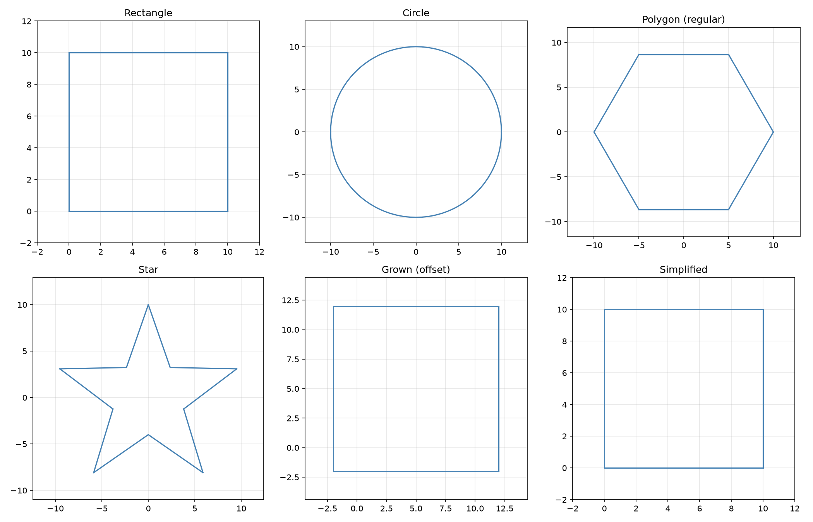
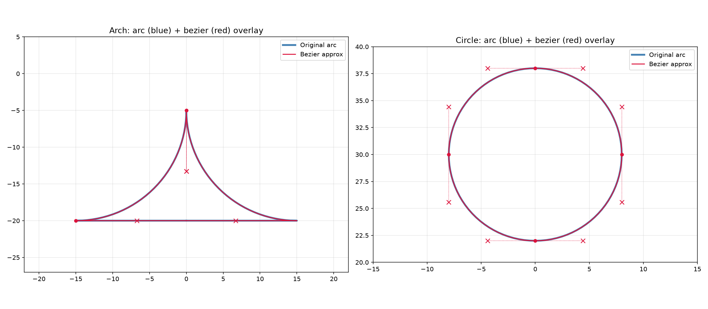

*Various geometry shapes and operations* Geometry types and operations for 2D/3D path data.

The central type is Geometry — a mutable sequence of drawing commands (move, line, arc, bezier) that
represents one or more closed or open paths. Geometry supports construction (add_rect, add_circle,
etc.), analysis (area, distance, bounding rect), and manipulation (transform, simplify, linearize,
fit curves, grow/shrink, split, clip).

Shape sub-modules provide primitive-specific operations: arc bounding and intersection, bezier
splitting and flattening, circle containment tests, polygon boolean algebra and offsetting, and line
intersection.

Algorithm sub-modules provide higher-level geometric processing such as polyline simplification,
smoothing, curve fitting, and Minkowski sums for toolpath generation.

## Arc

A circular-arc cutting command.

### `center_offset`

```python
center_offset: tuple[float, float, float]
```

Centre offset from the start point (3D).

### `clockwise`

```python
clockwise: bool
```

Whether the arc is clockwise (computed from the normal).

### `end`

```python
end: tuple[float, float, float]
```

Endpoint of the arc in 3D space.

### `normal`

```python
normal: tuple[float, float, float]
```

Plane normal of the arc. A positive Z component means CCW in XY.

## Bezier

A cubic-Bezier curve cutting command.

### `control1`

```python
control1: tuple[float, float, float]
```

First control point in 3D space.

### `control2`

```python
control2: tuple[float, float, float]
```

Second control point in 3D space.

### `end`

```python
end: tuple[float, float, float]
```

Endpoint of the curve in 3D space.

## Geometry

A sequence of geometric commands (Move, Line, Arc, Bezier).

The primary building block for vector geometry in raygeo. Geometry objects can be constructed
procedurally, parsed from SVG, or obtained by converting an **~raygeo.ops.Ops** sequence.

### `data`

```python
data: list[Any]
```

The commands as a list of typed command objects.

### `last_move_to`

```python
last_move_to: tuple[float, float, float]
```

The coordinates of the last move-to command.

### `uniform_scalable`

```python
uniform_scalable: bool
```

Whether the geometry uses uniform scalable arcs.

### `arc_to()`

```python
arc_to(
    x: float,
    y: float,
    i: float = 0.0,
    j: float = 0.0,
    clockwise: bool = True,
    z: float = 0.0,
) -> Geometry
```

Draw an arc to the given coordinates.

| Parameter    | Type          | Description                            |
| ------------ | ------------- | -------------------------------------- |
| `x`          | `float`       | X coordinate.                          |
| `y`          | `float`       | Y coordinate.                          |
| `i`          | `float = 0.0` | I offset from current point to center. |
| `j`          | `float = 0.0` | J offset from current point to center. |
| `clockwise`  | `bool = True` | Whether the arc is clockwise.          |
| `z`          | `float = 0.0` | Z coordinate (default 0.0).            |
| _Returns_    | `Geometry`    | The geometry (for method chaining).    |
| _Complexity_ |               | O(1) time, O(1) space                  |

### `arc_to_as_bezier()`

```python
arc_to_as_bezier(
    x: float,
    y: float,
    i: float,
    j: float,
    clockwise: bool = True,
    z: float = 0.0,
) -> Geometry
```

Draw an arc, converting it to bezier curves.

| Parameter    | Type          | Description                         |
| ------------ | ------------- | ----------------------------------- |
| `x`          | `float`       | End X coordinate.                   |
| `y`          | `float`       | End Y coordinate.                   |
| `i`          | `float`       | I offset to center.                 |
| `j`          | `float`       | J offset to center.                 |
| `clockwise`  | `bool = True` | Arc direction.                      |
| `z`          | `float = 0.0` | End Z coordinate.                   |
| _Returns_    | `Geometry`    | The geometry (for method chaining). |
| _Complexity_ |               | O(1) time, O(1) space               |

### `area()`

```python
area() -> float
```

Return the signed area of the geometry.

| Parameter    | Type    | Description             |
| ------------ | ------- | ----------------------- |
| _Returns_    | `float` | The signed area in mm². |
| _Complexity_ |         | O(n) time, O(1) space   |

### `bezier_to()`

```python
bezier_to(
    x: float,
    y: float,
    c1x: float,
    c1y: float,
    c2x: float,
    c2y: float,
    *,
    c1z: float = 0.0,
    c2z: float = 0.0,
    z: float = 0.0,
) -> Geometry
```

Draw a cubic bezier curve.

| Parameter    | Type       | Description                           |
| ------------ | ---------- | ------------------------------------- |
| `x`          | `float`    | End X coordinate.                     |
| `y`          | `float`    | End Y coordinate.                     |
| `c1x`        | `float`    | First control point X.                |
| `c1y`        | `float`    | First control point Y.                |
| `c2x`        | `float`    | Second control point X.               |
| `c2y`        | `float`    | Second control point Y.               |
| `c1z`        | `float`    | First control point Z (default 0.0).  |
| `c2z`        | `float`    | Second control point Z (default 0.0). |
| `z`          | `float`    | End Z coordinate (default 0.0).       |
| _Returns_    | `Geometry` | The geometry (for method chaining).   |
| _Complexity_ |            | O(1) time, O(1) space                 |

### `cleanup()`

```python
cleanup(tolerance: float) -> Geometry
```

Remove duplicate segments from the geometry.

| Parameter    | Type       | Description                         |
| ------------ | ---------- | ----------------------------------- |
| `tolerance`  | `float`    | Maximum deviation for equality.     |
| _Returns_    | `Geometry` | The geometry (for method chaining). |
| _Complexity_ |            | O(n log n) average time, O(n) space |

### `clear()`

```python
clear() -> Geometry
```

Remove all commands from the geometry.

| Parameter    | Type       | Description                         |
| ------------ | ---------- | ----------------------------------- |
| _Returns_    | `Geometry` | The geometry (for method chaining). |
| _Complexity_ |            | O(1) time, O(1) space               |

### `close_all_contours()`

```python
close_all_contours() -> Geometry
```

Close all open contours in the geometry.

| Parameter    | Type       | Description                         |
| ------------ | ---------- | ----------------------------------- |
| _Returns_    | `Geometry` | The geometry (for method chaining). |
| _Complexity_ |            | O(n) time, O(n) space               |

### `close_gaps()`

```python
close_gaps(tolerance: Optional[float] = None) -> Geometry
```

Close gaps between sub-paths.

| Parameter    | Type                     | Description                         |
| ------------ | ------------------------ | ----------------------------------- |
| `tolerance`  | `Optional[float] = None` | Max gap to close.                   |
| _Returns_    | `Geometry`               | The geometry (for method chaining). |
| _Complexity_ |                          | O(n) time, O(n) space               |

### `close_path()`

```python
close_path() -> Geometry
```

Close the current sub-path.

| Parameter    | Type       | Description                         |
| ------------ | ---------- | ----------------------------------- |
| _Returns_    | `Geometry` | The geometry (for method chaining). |
| _Complexity_ |            | O(1) time, O(1) space               |

### `convert_arcs_to_beziers()`

```python
convert_arcs_to_beziers() -> None
```

Convert all Arc commands to Bezier curve approximations in-place.

After this call, the geometry will only contain Move, Line, and Bezier commands.

| Parameter    | Type   | Description                                        |
| ------------ | ------ | -------------------------------------------------- |
| _Returns_    | `None` |                                                    |
| _Complexity_ |        | O(n) time, O(n) space where n = number of commands |



*Overlay showing Bezier curves (with control points) closely matching the original arcs*

### `copy()`

```python
copy() -> Geometry
```

Return a deep copy of this geometry.

| Parameter    | Type       | Description                  |
| ------------ | ---------- | ---------------------------- |
| _Returns_    | `Geometry` | A deep copy of the geometry. |
| _Complexity_ |            | O(n) time, O(n) space        |

### `distance()`

```python
distance() -> float
```

Return the total path distance.

| Parameter    | Type    | Description                    |
| ------------ | ------- | ------------------------------ |
| _Returns_    | `float` | The total path distance in mm. |
| _Complexity_ |         | O(n) time, O(1) space          |

### `encloses()`

```python
encloses(other: Geometry) -> bool
```

Check if this geometry encloses another.

| Parameter    | Type       | Description                                 |
| ------------ | ---------- | ------------------------------------------- |
| `other`      | `Geometry` | The potentially enclosed geometry.          |
| _Returns_    | `bool`     | `True` if this geometry encloses the other. |
| _Complexity_ |            | O(n log n) average time, O(n) space         |

### `extend()`

```python
extend(other: Geometry) -> Geometry
```

Append another geometry's commands to this one.

| Parameter    | Type       | Description                         |
| ------------ | ---------- | ----------------------------------- |
| `other`      | `Geometry` | The geometry to append.             |
| _Returns_    | `Geometry` | The geometry (for method chaining). |
| _Complexity_ |            | O(n) time, O(n) space               |

### `filter()`

```python
filter(indices: set[int]) -> Geometry
```

Return a new Geometry containing only commands at the given indices.

| Parameter    | Type       | Description                                |
| ------------ | ---------- | ------------------------------------------ |
| `indices`    | `set[int]` | Set of command indices to keep.            |
| _Returns_    | `Geometry` | A new Geometry with the filtered commands. |
| _Complexity_ |            | O(n) time, O(n) space                      |

### `filter_to_external_contours()`

```python
filter_to_external_contours() -> Geometry
```

Filter to only external (outermost) contours.

| Parameter    | Type       | Description                         |
| ------------ | ---------- | ----------------------------------- |
| _Returns_    | `Geometry` | The geometry (for method chaining). |
| _Complexity_ |            | O(n log n) average time, O(n) space |

### `find_closest_point()`

```python
find_closest_point(
    x: float,
    y: float,
) -> Optional[tuple[int, float, tuple[float, float]]]
```

Find the closest point on the path to (x, y).

| Parameter    | Type                                               | Description                                 |
| ------------ | -------------------------------------------------- | ------------------------------------------- |
| `x`          | `float`                                            | X coordinate.                               |
| `y`          | `float`                                            | Y coordinate.                               |
| _Returns_    | `Optional[tuple[int, float, tuple[float, float]]]` | Tuple of (segment_index, t, point) or None. |
| _Complexity_ |                                                    | O(n) time, O(1) space                       |

### `fit_arcs()`

```python
fit_arcs(tolerance: float) -> Geometry
```

Fit arcs only to the linearized geometry.

| Parameter    | Type       | Description                         |
| ------------ | ---------- | ----------------------------------- |
| `tolerance`  | `float`    | Maximum deviation.                  |
| _Returns_    | `Geometry` | The geometry (for method chaining). |
| _Complexity_ |            | O(n log n) average time, O(n) space |

### `fit_curves()`

```python
fit_curves(
    tolerance: float,
    beziers: bool = True,
    arcs: bool = True,
    on_progress: Optional[Any] = None,
) -> Geometry
```

Fit curves (beziers and arcs) to the linearized geometry.

| Parameter     | Type                   | Description                                                |
| ------------- | ---------------------- | ---------------------------------------------------------- |
| `tolerance`   | `float`                | Maximum deviation.                                         |
| `beziers`     | `bool = True`          | Whether to fit bezier curves.                              |
| `arcs`        | `bool = True`          | Whether to fit arcs.                                       |
| `on_progress` | `Optional[Any] = None` | Optional progress callback called with `(current, total)`. |
| _Returns_     | `Geometry`             | The geometry (for method chaining).                        |
| _Complexity_  |                        | O(n log n) average time, O(n) space                        |

### `flip_x()`

```python
flip_x() -> Geometry
```

Mirror the geometry along the X axis.

| Parameter    | Type       | Description                         |
| ------------ | ---------- | ----------------------------------- |
| _Returns_    | `Geometry` | The geometry (for method chaining). |
| _Complexity_ |            | O(n) time, O(1) space               |

### `flip_y()`

```python
flip_y() -> Geometry
```

Mirror the geometry along the Y axis.

| Parameter    | Type       | Description                         |
| ------------ | ---------- | ----------------------------------- |
| _Returns_    | `Geometry` | The geometry (for method chaining). |
| _Complexity_ |            | O(n) time, O(1) space               |

### `from_dict()`

```python
@classmethod from_dict(data: dict) -> Geometry
```

Create a Geometry from a dictionary.

| Parameter    | Type       | Description                              |
| ------------ | ---------- | ---------------------------------------- |
| `data`       | `dict`     | A dictionary as produced by **to_dict**. |
| _Returns_    | `Geometry` | A new `Geometry` instance.               |
| _Complexity_ |            | O(n) time, O(n) space                    |

### `from_points()`

```python
@classmethod from_points(points: Any, close: bool = True) -> Geometry
```

Create a Geometry from a sequence of points.

| Parameter    | Type          | Description                                          |
| ------------ | ------------- | ---------------------------------------------------- |
| `points`     | `Any`         | A sequence of (x, y) or (x, y, z) coordinate tuples. |
| `close`      | `bool = True` | Whether to close the path.                           |
| _Returns_    | `Geometry`    | A new `Geometry` instance.                           |
| _Complexity_ |               | O(n) time, O(n) space                                |

### `get_command_at()`

```python
get_command_at(index: int) -> Optional[Any]
```

Get the command at the given index as a typed command object.

| Parameter    | Type            | Description                            |
| ------------ | --------------- | -------------------------------------- |
| `index`      | `int`           | Command index (negative returns None). |
| _Returns_    | `Optional[Any]` | The typed command or `None`.           |
| _Complexity_ |                 | O(1) time, O(1) space                  |

### `get_last_point()`

```python
get_last_point() -> tuple[float, float, float]
```

Get the last point in the geometry.

| Parameter    | Type                         | Description                                             |
| ------------ | ---------------------------- | ------------------------------------------------------- |
| _Returns_    | `tuple[float, float, float]` | The last point as `(x, y, z)`, or `(0, 0, 0)` if empty. |
| _Complexity_ |                              | O(1) time, O(1) space                                   |

### `get_outward_normal_at()`

```python
get_outward_normal_at(
    segment_index: int,
    t: float,
) -> Optional[tuple[float, float]]
```

Get the outward normal at parameter t on a segment.

| Parameter       | Type                            | Description            |
| --------------- | ------------------------------- | ---------------------- |
| `segment_index` | `int`                           | Index of the segment.  |
| `t`             | `float`                         | Parameter in [0, 1].   |
| _Returns_       | `Optional[tuple[float, float]]` | Normal vector or None. |
| _Complexity_    |                                 | O(1) time, O(1) space  |

### `get_point_at()`

```python
get_point_at(
    segment_index: int,
    t: float,
) -> Optional[tuple[float, float, float]]
```

Get the point at parameter t on a segment.

| Parameter       | Type                                   | Description           |
| --------------- | -------------------------------------- | --------------------- |
| `segment_index` | `int`                                  | Index of the segment. |
| `t`             | `float`                                | Parameter in [0, 1].  |
| _Returns_       | `Optional[tuple[float, float, float]]` | The 3D point or None. |
| _Complexity_    |                                        | O(1) time, O(1) space |

### `get_positions_at_distances()`

```python
get_positions_at_distances(
    distances: Sequence[float],
) -> list[tuple[int, float, tuple[float, float]]]
```

Given a list of distances along the path, returns the corresponding (segment_index, t, point) for
each distance.

Distances are clamped to [0, total_length].

| Parameter    | Type                                           | Description                                                                               |
| ------------ | ---------------------------------------------- | ----------------------------------------------------------------------------------------- |
| `distances`  | `Sequence[float]`                              | List of distances along the path.                                                         |
| _Returns_    | `list[tuple[int, float, tuple[float, float]]]` | List of (segment_index, t, (x, y)) tuples.                                                |
| _Complexity_ |                                                | O(n + m) time, O(m) space where n is the number of segments and m the number of distances |

### `get_tangent_at()`

```python
get_tangent_at(segment_index: int, t: float) -> Optional[tuple[float, float]]
```

Get the tangent vector at parameter t on a segment.

| Parameter       | Type                            | Description                            |
| --------------- | ------------------------------- | -------------------------------------- |
| `segment_index` | `int`                           | Index of the segment.                  |
| `t`             | `float`                         | Parameter in [0, 1].                   |
| _Returns_       | `Optional[tuple[float, float]]` | The normalized tangent vector or None. |
| _Complexity_    |                                 | O(1) time, O(1) space                  |

### `get_typed_command_at()`

```python
get_typed_command_at(index: int) -> Move | Line | Arc | Bezier | None
```

Get the typed command at the given index.

| Parameter    | Type                                                    | Description           |
| ------------ | ------------------------------------------------------- | --------------------- |
| `index`      | `int`                                                   | Command index.        |
| _Returns_    | `Move &#124; Line &#124; Arc &#124; Bezier &#124; None` |                       |
| _Complexity_ |                                                         | O(1) time, O(1) space |

### `get_valid_contours_data()`

```python
get_valid_contours_data() -> list[dict]
```

Get valid contour data from the geometry's contours.

| Parameter    | Type         | Description                                                               |
| ------------ | ------------ | ------------------------------------------------------------------------- |
| _Returns_    | `list[dict]` | List of dicts with keys "geo", "vertices", "is_closed", "original_index". |
| _Complexity_ |              | O(n) time, O(n) space                                                     |

### `grow()`

```python
grow(amount: float) -> Geometry
```

Offset (grow/shrink) the geometry by the given amount.

| Parameter    | Type       | Description                           |
| ------------ | ---------- | ------------------------------------- |
| `amount`     | `float`    | Positive to grow, negative to shrink. |
| _Returns_    | `Geometry` | The geometry (for method chaining).   |
| _Complexity_ |            | O(n log n) average time, O(n) space   |

### `has_self_intersections()`

```python
has_self_intersections(fail_on_t_junction: bool = False) -> bool
```

Check if the geometry has self-intersections.

| Parameter            | Type           | Description                                    |
| -------------------- | -------------- | ---------------------------------------------- |
| `fail_on_t_junction` | `bool = False` | Whether to fail on T-junctions.                |
| _Returns_            | `bool`         | `True` if the geometry has self-intersections. |
| _Complexity_         |                | O(n²) worst-case time, O(1) space              |

### `intersects_with()`

```python
intersects_with(other: Geometry) -> bool
```

Check if this geometry intersects with another.

| Parameter    | Type       | Description                                                                                    |
| ------------ | ---------- | ---------------------------------------------------------------------------------------------- |
| `other`      | `Geometry` | The other geometry.                                                                            |
| _Returns_    | `bool`     | `True` if the geometries intersect.                                                            |
| _Complexity_ |            | O(n * m) worst-case time, O(1) space where n and m are the number of segments in each geometry |

### `is_closed()`

```python
is_closed(tolerance: float = 1e-06) -> bool
```

Check if the geometry forms a closed path.

| Parameter    | Type            | Description                                 |
| ------------ | --------------- | ------------------------------------------- |
| `tolerance`  | `float = 1e-06` | Max gap between start and end point.        |
| _Returns_    | `bool`          | `True` if the geometry forms a closed path. |
| _Complexity_ |                 | O(n) time, O(1) space                       |

### `is_empty()`

```python
is_empty() -> bool
```

Check if the geometry has no commands.

| Parameter    | Type   | Description                             |
| ------------ | ------ | --------------------------------------- |
| _Returns_    | `bool` | `True` if the geometry has no commands. |
| _Complexity_ |        | O(1) time, O(1) space                   |

### `iter_commands()`

```python
iter_commands() -> list[Any]
```

Iterate over all commands as typed command objects.

| Parameter    | Type        | Description                    |
| ------------ | ----------- | ------------------------------ |
| _Returns_    | `list[Any]` | List of typed command objects. |
| _Complexity_ |             | O(n) time, O(n) space          |

### `iter_typed_commands()`

```python
iter_typed_commands() -> list[Move | Line | Arc | Bezier]
```

Iterate over all commands as typed command objects.

| Parameter    | Type                                              | Description           |
| ------------ | ------------------------------------------------- | --------------------- |
| _Returns_    | `list[Move &#124; Line &#124; Arc &#124; Bezier]` |                       |
| _Complexity_ |                                                   | O(n) time, O(n) space |

### `line_to()`

```python
line_to(x: float, y: float, z: float = 0.0) -> Geometry
```

Draw a line to the given coordinates.

| Parameter    | Type          | Description                         |
| ------------ | ------------- | ----------------------------------- |
| `x`          | `float`       | X coordinate.                       |
| `y`          | `float`       | Y coordinate.                       |
| `z`          | `float = 0.0` | Z coordinate (default 0.0).         |
| _Returns_    | `Geometry`    | The geometry (for method chaining). |
| _Complexity_ |               | O(1) time, O(1) space               |

### `linearize()`

```python
linearize(tolerance: float) -> Geometry
```

Convert all curves to line segments.

| Parameter    | Type       | Description                         |
| ------------ | ---------- | ----------------------------------- |
| `tolerance`  | `float`    | Maximum deviation from curves.      |
| _Returns_    | `Geometry` | The geometry (for method chaining). |
| _Complexity_ |            | O(n) time, O(n) space               |

### `map_to_frame()`

```python
map_to_frame(
    origin: tuple[float, float],
    p_width: tuple[float, float],
    p_height: tuple[float, float],
    anchor_y: Optional[float] = None,
    stable_src_height: Optional[float] = None,
    anchor_x: Optional[float] = None,
    stable_src_width: Optional[float] = None,
) -> Geometry
```

Map the geometry into a rectangular frame.

| Parameter           | Type                     | Description                         |
| ------------------- | ------------------------ | ----------------------------------- |
| `origin`            | `tuple[float, float]`    | Frame origin (x, y).                |
| `p_width`           | `tuple[float, float]`    | Frame width vector.                 |
| `p_height`          | `tuple[float, float]`    | Frame height vector.                |
| `anchor_y`          | `Optional[float] = None` | Y anchor position.                  |
| `stable_src_height` | `Optional[float] = None` | Stable source height for anchoring. |
| `anchor_x`          | `Optional[float] = None` | X anchor position.                  |
| `stable_src_width`  | `Optional[float] = None` | Stable source width for anchoring.  |
| _Returns_           | `Geometry`               | The geometry (for method chaining). |
| _Complexity_        |                          | O(n) time, O(n) space               |

### `move_to()`

```python
move_to(x: float, y: float, z: float = 0.0) -> Geometry
```

Move the pen to the given coordinates.

| Parameter    | Type          | Description                         |
| ------------ | ------------- | ----------------------------------- |
| `x`          | `float`       | X coordinate.                       |
| `y`          | `float`       | Y coordinate.                       |
| `z`          | `float = 0.0` | Z coordinate (default 0.0).         |
| _Returns_    | `Geometry`    | The geometry (for method chaining). |
| _Complexity_ |               | O(1) time, O(1) space               |

### `normalize_winding_orders()`

```python
normalize_winding_orders() -> Geometry
```

Normalize winding orders (outer CCW, inner CW) of all contours.

| Parameter    | Type       | Description                         |
| ------------ | ---------- | ----------------------------------- |
| _Returns_    | `Geometry` | The geometry (for method chaining). |
| _Complexity_ |            | O(n log n) average time, O(n) space |

### `rect()`

```python
rect() -> tuple[float, float, float, float]
```

Return the bounding rectangle (x_min, y_min, x_max, y_max).

| Parameter    | Type                                | Description                   |
| ------------ | ----------------------------------- | ----------------------------- |
| _Returns_    | `tuple[float, float, float, float]` | (x_min, y_min, x_max, y_max). |
| _Complexity_ |                                     | O(n) time, O(1) space         |

### `remove_inner_edges()`

```python
remove_inner_edges() -> Geometry
```

Remove inner edges (shared between contours).

| Parameter    | Type       | Description                         |
| ------------ | ---------- | ----------------------------------- |
| _Returns_    | `Geometry` | The geometry (for method chaining). |
| _Complexity_ |            | O(n) time, O(n) space               |

### `reverse_contour()`

```python
reverse_contour() -> Geometry
```

Reverse the winding direction of all contours.

| Parameter    | Type       | Description                         |
| ------------ | ---------- | ----------------------------------- |
| _Returns_    | `Geometry` | The geometry (for method chaining). |
| _Complexity_ |            | O(n) time, O(n) space               |

### `segment_bounds()`

```python
segment_bounds(index: int) -> Optional[tuple[float, float, float, float]]
```

Return the bounding box of a single segment at the given index. Returns None for Move commands or if
the index is out of bounds.

| Parameter    | Type                                          | Description                           |
| ------------ | --------------------------------------------- | ------------------------------------- |
| `index`      | `int`                                         | Segment index.                        |
| _Returns_    | `Optional[tuple[float, float, float, float]]` | (x_min, y_min, x_max, y_max) or None. |
| _Complexity_ |                                               | O(1) time, O(1) space                 |

### `segments()`

```python
segments() -> list[list[tuple[float, float, float]]]
```

Return the geometry split into segments of connected commands.

| Parameter    | Type                                     | Description                                 |
| ------------ | ---------------------------------------- | ------------------------------------------- |
| _Returns_    | `list[list[tuple[float, float, float]]]` | List of segments, each a list of 3D points. |
| _Complexity_ |                                          | O(n) time, O(n) space                       |

### `segments_in_frame()`

```python
segments_in_frame(x1: float, y1: float, x2: float, y2: float) -> list[int]
```

Return indices of all segments whose bounding box intersects the given rectangle. Excludes Move
commands.

| Parameter    | Type        | Description              |
| ------------ | ----------- | ------------------------ |
| `x1`         | `float`     | First corner X.          |
| `y1`         | `float`     | First corner Y.          |
| `x2`         | `float`     | Second corner X.         |
| `y2`         | `float`     | Second corner Y.         |
| _Returns_    | `list[int]` | List of segment indices. |
| _Complexity_ |             | O(n) time, O(n) space    |

### `simplify()`

```python
simplify(tolerance: float) -> Geometry
```

Simplify the geometry using Ramer-Douglas-Peucker.

| Parameter    | Type       | Description                         |
| ------------ | ---------- | ----------------------------------- |
| `tolerance`  | `float`    | Maximum deviation from original.    |
| _Returns_    | `Geometry` | The geometry (for method chaining). |
| _Complexity_ |            | O(n log n) average time, O(n) space |

### `split_inner_and_outer_contours()`

```python
split_inner_and_outer_contours() -> tuple[list[Geometry], list[Geometry]]
```

Split contours into inner and outer groups.

| Parameter    | Type                                    | Description                                                           |
| ------------ | --------------------------------------- | --------------------------------------------------------------------- |
| _Returns_    | `tuple[list[Geometry], list[Geometry]]` | Tuple of `(inner_contours, outer_contours)`, each a list of Geometry. |
| _Complexity_ |                                         | O(n log n) average time, O(n) space                                   |

### `split_inner_and_outer_polygons()`

```python
split_inner_and_outer_polygons(
) -> tuple[list[list[tuple[float, float]]], list[list[tuple[float, float]]]]
```

Split the geometry into its closed contours, classified into outer boundaries and inner islands.

| Parameter    | Type                                                                      | Description                                                                    |
| ------------ | ------------------------------------------------------------------------- | ------------------------------------------------------------------------------ |
| _Returns_    | `tuple[list[list[tuple[float, float]]], list[list[tuple[float, float]]]]` | `(outers, islands)` — two lists of polygons, each a list of `(x, y)` vertices. |
| _Complexity_ |                                                                           | O(n) time, O(n) space                                                          |

### `split_into_components()`

```python
split_into_components() -> list[Geometry]
```

Split the geometry into connected components.

| Parameter    | Type             | Description                                            |
| ------------ | ---------------- | ------------------------------------------------------ |
| _Returns_    | `list[Geometry]` | List of Geometry objects, one per connected component. |
| _Complexity_ |                  | O(n log n) average time, O(n) space                    |

### `split_into_contours()`

```python
split_into_contours() -> list[Geometry]
```

Split the geometry into individual contours.

| Parameter    | Type             | Description                                |
| ------------ | ---------------- | ------------------------------------------ |
| _Returns_    | `list[Geometry]` | List of Geometry objects, one per contour. |
| _Complexity_ |                  | O(n) time, O(n) space                      |

### `to_dict()`

```python
to_dict() -> dict
```

Serialize the geometry to a dictionary.

| Parameter    | Type   | Description                                  |
| ------------ | ------ | -------------------------------------------- |
| _Returns_    | `dict` | A dictionary representation of the geometry. |
| _Complexity_ |        | O(n) time, O(n) space                        |

### `to_polygons()`

```python
to_polygons(tolerance: float = 0.01) -> list[list[tuple[float, float]]]
```

Convert the geometry to a list of polygons.

| Parameter    | Type                              | Description                                         |
| ------------ | --------------------------------- | --------------------------------------------------- |
| `tolerance`  | `float = 0.01`                    | Max deviation for linearization.                    |
| _Returns_    | `list[list[tuple[float, float]]]` | List of polygons, each a list of `(x, y)` vertices. |
| _Complexity_ |                                   | O(n) time, O(n) space                               |

### `transform()`

```python
transform(matrix: Matrix | types.TransformMatrix) -> Geometry
```

Apply an affine transformation matrix.

| Parameter    | Type                                  | Description                                                |
| ------------ | ------------------------------------- | ---------------------------------------------------------- |
| `matrix`     | `Matrix &#124; types.TransformMatrix` | A **~raygeo.geo.Matrix** or a 4x4 matrix as list of lists. |
| _Returns_    | `Geometry`                            | A new transformed Geometry.                                |
| _Complexity_ |                                       | O(n) time, O(n) space                                      |

### `upgrade_to_scalable()`

```python
upgrade_to_scalable() -> Geometry
```

Convert all arcs to bezier curves for uniform scaling.

| Parameter    | Type       | Description                         |
| ------------ | ---------- | ----------------------------------- |
| _Returns_    | `Geometry` | The geometry (for method chaining). |
| _Complexity_ |            | O(n) time, O(n) space               |

## Line

A straight-line cutting command.

### `end`

```python
end: tuple[float, float, float]
```

Endpoint of the line in 3D space.

## Matrix

A 3x3 affine transformation matrix for 2D graphics.

Provides an object-oriented interface for matrix operations, including translations, rotations, and
scaling.

### `compose()`

```python
@classmethod
compose(
    tx: float,
    ty: float,
    angle_deg: float,
    sx: float,
    sy: float,
    skew_angle_deg: float,
) -> Matrix
```

Compose a matrix from translation, rotation, scale, and skew.

| Parameter        | Type     | Description                |
| ---------------- | -------- | -------------------------- |
| `tx`             | `float`  | Translation x.             |
| `ty`             | `float`  | Translation y.             |
| `angle_deg`      | `float`  | Rotation angle in degrees. |
| `sx`             | `float`  | Scale x.                   |
| `sy`             | `float`  | Scale y.                   |
| `skew_angle_deg` | `float`  | Skew angle in degrees.     |
| _Returns_        | `Matrix` | A new Matrix.              |

### `copy()`

```python
copy() -> Matrix
```

Return a deep copy of this matrix.

| Parameter | Type     | Description |
| --------- | -------- | ----------- |
| _Returns_ | `Matrix` |             |

### `decompose()`

```python
decompose() -> tuple[float, float, float, float, float, float]
```

Decompose the matrix into translation, rotation, scale, and skew.

| Parameter | Type                                              | Description                                  |
| --------- | ------------------------------------------------- | -------------------------------------------- |
| _Returns_ | `tuple[float, float, float, float, float, float]` | (tx, ty, angle_deg, sx, sy, skew_angle_deg). |

### `flip_horizontal()`

```python
@classmethod
flip_horizontal(
    center: Optional[tuple[float, float]] = None,
) -> Matrix
```

Create a horizontal flip matrix.

| Parameter | Type                                   | Description |
| --------- | -------------------------------------- | ----------- |
| `center`  | `Optional[tuple[float, float]] = None` |             |
| _Returns_ | `Matrix`                               |             |

### `flip_vertical()`

```python
@classmethod
flip_vertical(
    center: Optional[tuple[float, float]] = None,
) -> Matrix
```

Create a vertical flip matrix.

| Parameter | Type                                   | Description |
| --------- | -------------------------------------- | ----------- |
| `center`  | `Optional[tuple[float, float]] = None` |             |
| _Returns_ | `Matrix`                               |             |

### `for_cairo()`

```python
for_cairo() -> tuple[float, float, float, float, float, float]
```

Returns the matrix components in Cairo order (xx, yx, xy, yy, x0, y0).

| Parameter | Type                                              | Description |
| --------- | ------------------------------------------------- | ----------- |
| _Returns_ | `tuple[float, float, float, float, float, float]` |             |

### `from_list()`

```python
@classmethod from_list(data: Sequence[Sequence[float]]) -> Matrix
```

Create a Matrix from a list of lists.

| Parameter | Type                        | Description |
| --------- | --------------------------- | ----------- |
| `data`    | `Sequence[Sequence[float]]` |             |
| _Returns_ | `Matrix`                    |             |

### `get()`

```python
get(row: int, col: int) -> float
```

Get a single element from the 3x3 matrix (row-major indexing).

| Parameter | Type    | Description |
| --------- | ------- | ----------- |
| `row`     | `int`   |             |
| `col`     | `int`   |             |
| _Returns_ | `float` |             |

### `get_abs_scale()`

```python
get_abs_scale() -> tuple[float, float]
```

Extract the absolute scale components (|sx|, |sy|).

| Parameter | Type                  | Description |
| --------- | --------------------- | ----------- |
| _Returns_ | `tuple[float, float]` |             |

### `get_determinant_2x2()`

```python
get_determinant_2x2() -> float
```

Calculate the determinant of the top-left 2x2 sub-matrix.

| Parameter | Type    | Description |
| --------- | ------- | ----------- |
| _Returns_ | `float` |             |

### `get_rotation()`

```python
get_rotation() -> float
```

Extract the rotation angle in degrees.

| Parameter | Type    | Description |
| --------- | ------- | ----------- |
| _Returns_ | `float` |             |

### `get_scale()`

```python
get_scale() -> tuple[float, float]
```

Extract the signed scale components (sx, sy).

| Parameter | Type                  | Description |
| --------- | --------------------- | ----------- |
| _Returns_ | `tuple[float, float]` |             |

### `get_translation()`

```python
get_translation() -> tuple[float, float]
```

Extract the translation component (tx, ty).

| Parameter | Type                  | Description |
| --------- | --------------------- | ----------- |
| _Returns_ | `tuple[float, float]` |             |

### `get_x_axis_angle()`

```python
get_x_axis_angle() -> float
```

Calculate the angle of the transformed X-axis in degrees.

| Parameter | Type    | Description |
| --------- | ------- | ----------- |
| _Returns_ | `float` |             |

### `get_y_axis_angle()`

```python
get_y_axis_angle() -> float
```

Calculate the angle of the transformed Y-axis in degrees.

| Parameter | Type    | Description |
| --------- | ------- | ----------- |
| _Returns_ | `float` |             |

### `has_zero_scale()`

```python
has_zero_scale(tolerance: float = 1e-06) -> bool
```

Check if the matrix has zero scale on any axis.

| Parameter   | Type            | Description                                       |
| ----------- | --------------- | ------------------------------------------------- |
| `tolerance` | `float = 1e-06` | Threshold below which a scale is considered zero. |
| _Returns_   | `bool`          |                                                   |

### `identity()`

```python
@classmethod identity() -> Matrix
```

Create an identity matrix.

| Parameter | Type     | Description |
| --------- | -------- | ----------- |
| _Returns_ | `Matrix` |             |

### `invert()`

```python
invert() -> Matrix
```

Compute the inverse of the matrix.

Will raise an error if the matrix is singular.

| Parameter | Type     | Description |
| --------- | -------- | ----------- |
| _Returns_ | `Matrix` |             |

### `is_close()`

```python
is_close(other: Matrix, tol: float = 1e-06) -> bool
```

Check if two matrices are effectively equal within tolerance.

| Parameter | Type            | Description                       |
| --------- | --------------- | --------------------------------- |
| `other`   | `Matrix`        | The matrix to compare against.    |
| `tol`     | `float = 1e-06` | The absolute tolerance parameter. |
| _Returns_ | `bool`          |                                   |

### `is_flipped()`

```python
is_flipped() -> bool
```

Check if the matrix includes a reflection (flip).

| Parameter | Type   | Description |
| --------- | ------ | ----------- |
| _Returns_ | `bool` |             |

### `is_identity()`

```python
is_identity() -> bool
```

Check if the matrix is an identity matrix.

| Parameter | Type   | Description |
| --------- | ------ | ----------- |
| _Returns_ | `bool` |             |

### `post_rotate()`

```python
post_rotate(
    angle_deg: float,
    center: Optional[tuple[float, float]] = None,
) -> Matrix
```

Apply a rotation after this matrix's transformation.

| Parameter   | Type                                   | Description                             |
| ----------- | -------------------------------------- | --------------------------------------- |
| `angle_deg` | `float`                                | Rotation angle in degrees.              |
| `center`    | `Optional[tuple[float, float]] = None` | Optional center point to rotate around. |
| _Returns_   | `Matrix`                               |                                         |

### `post_scale()`

```python
post_scale(
    sx: float,
    sy: float,
    center: Optional[tuple[float, float]] = None,
) -> Matrix
```

Apply a scale after this matrix's transformation.

| Parameter | Type                                   | Description                            |
| --------- | -------------------------------------- | -------------------------------------- |
| `sx`      | `float`                                | Scale factor for x-axis.               |
| `sy`      | `float`                                | Scale factor for y-axis.               |
| `center`  | `Optional[tuple[float, float]] = None` | Optional center point to scale around. |
| _Returns_ | `Matrix`                               |                                        |

### `post_shear()`

```python
post_shear(
    shx: float,
    shy: float,
    center: Optional[tuple[float, float]] = None,
) -> Matrix
```

Apply a shear after this matrix's transformation.

| Parameter | Type                                   | Description                            |
| --------- | -------------------------------------- | -------------------------------------- |
| `shx`     | `float`                                | Shear factor for x-axis.               |
| `shy`     | `float`                                | Shear factor for y-axis.               |
| `center`  | `Optional[tuple[float, float]] = None` | Optional center point to shear around. |
| _Returns_ | `Matrix`                               |                                        |

### `post_translate()`

```python
post_translate(tx: float, ty: float) -> Matrix
```

Apply a translation after this matrix's transformation.

| Parameter | Type     | Description |
| --------- | -------- | ----------- |
| `tx`      | `float`  |             |
| `ty`      | `float`  |             |
| _Returns_ | `Matrix` |             |

### `pre_rotate()`

```python
pre_rotate(
    angle_deg: float,
    center: Optional[tuple[float, float]] = None,
) -> Matrix
```

Apply a rotation before this matrix's transformation.

| Parameter   | Type                                   | Description                             |
| ----------- | -------------------------------------- | --------------------------------------- |
| `angle_deg` | `float`                                | Rotation angle in degrees.              |
| `center`    | `Optional[tuple[float, float]] = None` | Optional center point to rotate around. |
| _Returns_   | `Matrix`                               |                                         |

### `pre_scale()`

```python
pre_scale(
    sx: float,
    sy: float,
    center: Optional[tuple[float, float]] = None,
) -> Matrix
```

Apply a scale before this matrix's transformation.

| Parameter | Type                                   | Description                            |
| --------- | -------------------------------------- | -------------------------------------- |
| `sx`      | `float`                                | Scale factor for x-axis.               |
| `sy`      | `float`                                | Scale factor for y-axis.               |
| `center`  | `Optional[tuple[float, float]] = None` | Optional center point to scale around. |
| _Returns_ | `Matrix`                               |                                        |

### `pre_shear()`

```python
pre_shear(
    shx: float,
    shy: float,
    center: Optional[tuple[float, float]] = None,
) -> Matrix
```

Apply a shear before this matrix's transformation.

| Parameter | Type                                   | Description                            |
| --------- | -------------------------------------- | -------------------------------------- |
| `shx`     | `float`                                | Shear factor for x-axis.               |
| `shy`     | `float`                                | Shear factor for y-axis.               |
| `center`  | `Optional[tuple[float, float]] = None` | Optional center point to shear around. |
| _Returns_ | `Matrix`                               |                                        |

### `pre_translate()`

```python
pre_translate(tx: float, ty: float) -> Matrix
```

Apply a translation before this matrix's transformation.

| Parameter | Type     | Description |
| --------- | -------- | ----------- |
| `tx`      | `float`  |             |
| `ty`      | `float`  |             |
| _Returns_ | `Matrix` |             |

### `rotation()`

```python
@classmethod
rotation(
    angle_deg: float,
    center: Optional[tuple[float, float]] = None,
) -> Matrix
```

Create a rotation matrix.

| Parameter   | Type                                   | Description                                    |
| ----------- | -------------------------------------- | ---------------------------------------------- |
| `angle_deg` | `float`                                | Rotation angle in degrees.                     |
| `center`    | `Optional[tuple[float, float]] = None` | Optional (x, y) center point to rotate around. |
| _Returns_   | `Matrix`                               |                                                |

### `scale()`

```python
@classmethod
scale(
    sx: float,
    sy: float,
    center: Optional[tuple[float, float]] = None,
) -> Matrix
```

Create a scaling matrix.

| Parameter | Type                                   | Description                                   |
| --------- | -------------------------------------- | --------------------------------------------- |
| `sx`      | `float`                                | Scale factor for x-axis.                      |
| `sy`      | `float`                                | Scale factor for y-axis.                      |
| `center`  | `Optional[tuple[float, float]] = None` | Optional (x, y) center point to scale around. |
| _Returns_ | `Matrix`                               |                                               |

### `set_translation()`

```python
set_translation(tx: float, ty: float) -> Matrix
```

Returns a new matrix with the same rotation/scale/shear but new translation.

| Parameter | Type     | Description        |
| --------- | -------- | ------------------ |
| `tx`      | `float`  | New translation x. |
| `ty`      | `float`  | New translation y. |
| _Returns_ | `Matrix` |                    |

### `shear()`

```python
@classmethod
shear(
    shx: float,
    shy: float,
    center: Optional[tuple[float, float]] = None,
) -> Matrix
```

Create a shearing matrix.

| Parameter | Type                                   | Description                                   |
| --------- | -------------------------------------- | --------------------------------------------- |
| `shx`     | `float`                                | Shear factor for x-axis.                      |
| `shy`     | `float`                                | Shear factor for y-axis.                      |
| `center`  | `Optional[tuple[float, float]] = None` | Optional (x, y) center point to shear around. |
| _Returns_ | `Matrix`                               |                                               |

### `to_4x4_list()`

```python
to_4x4_list() -> list[list[float]]
```

Converts the matrix to a 4x4 list of lists (row-major). The 3x3 Matrix is placed in the top-left 2x2
of the 4x4, with translation in the last column, and Z preserved.

| Parameter | Type                | Description |
| --------- | ------------------- | ----------- |
| _Returns_ | `list[list[float]]` |             |

### `to_4x4_numpy()`

```python
to_4x4_numpy() -> numpy.NDArray[numpy.float64]
```

Return the matrix as a 4x4 numpy array (affine, Z-preserving).

| Parameter | Type                           | Description |
| --------- | ------------------------------ | ----------- |
| _Returns_ | `numpy.NDArray[numpy.float64]` |             |

### `to_graphene()`

```python
to_graphene() -> tuple[float, float, float, float, float, float]
```

Returns (xx, yx, xy, yy, x0, y0) for GTK/Graphene.

| Parameter | Type                                              | Description |
| --------- | ------------------------------------------------- | ----------- |
| _Returns_ | `tuple[float, float, float, float, float, float]` |             |

### `to_list()`

```python
to_list() -> list[list[float]]
```

Returns a copy of the matrix data as a list of lists.

| Parameter | Type                | Description |
| --------- | ------------------- | ----------- |
| _Returns_ | `list[list[float]]` |             |

### `to_numpy()`

```python
to_numpy() -> numpy.NDArray[numpy.float64]
```

Return the matrix as a 3x3 numpy array.

| Parameter | Type                           | Description |
| --------- | ------------------------------ | ----------- |
| _Returns_ | `numpy.NDArray[numpy.float64]` |             |

### `transform_point()`

```python
transform_point(*args: float | tuple[float, float]) -> tuple[float, float]
```

Apply the affine transformation to a 2D point.

| Parameter | Type                               | Description |
| --------- | ---------------------------------- | ----------- |
| `*args`   | `float &#124; tuple[float, float]` |             |
| _Returns_ | `tuple[float, float]`              |             |

### `transform_rectangle()`

```python
transform_rectangle(
    *args: float | tuple[float, float, float, float],
) -> tuple[float, float, float, float]
```

Transform a rectangle and return the new axis-aligned bounding box.

| Parameter | Type                                             | Description |
| --------- | ------------------------------------------------ | ----------- |
| `*args`   | `float &#124; tuple[float, float, float, float]` |             |
| _Returns_ | `tuple[float, float, float, float]`              |             |

### `transform_vector()`

```python
transform_vector(*args: float | tuple[float, float]) -> tuple[float, float]
```

Apply the transformation to a 2D vector, ignoring translation.

| Parameter | Type                               | Description |
| --------- | ---------------------------------- | ----------- |
| `*args`   | `float &#124; tuple[float, float]` |             |
| _Returns_ | `tuple[float, float]`              |             |

### `translation()`

```python
@classmethod translation(tx: float, ty: float) -> Matrix
```

Create a translation matrix.

| Parameter | Type     | Description       |
| --------- | -------- | ----------------- |
| `tx`      | `float`  | Translation in x. |
| `ty`      | `float`  | Translation in y. |
| _Returns_ | `Matrix` |                   |

### `without_translation()`

```python
without_translation() -> Matrix
```

Returns a new matrix with translation set to zero.

| Parameter | Type     | Description |
| --------- | -------- | ----------- |
| _Returns_ | `Matrix` |             |

## Move

A rapid-move command with an endpoint but no cutting.

### `end`

```python
end: tuple[float, float, float]
```

Endpoint of the move in 3D space.
