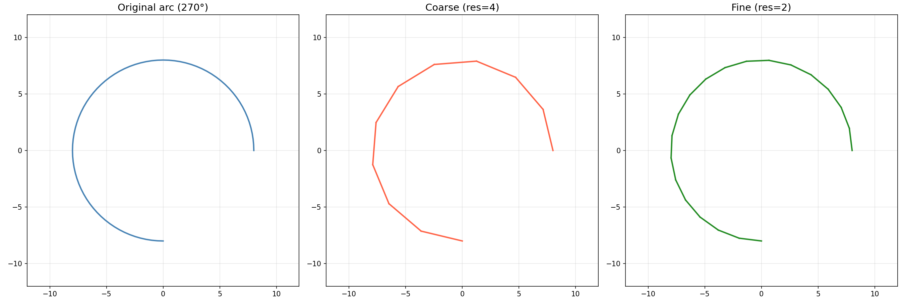

Arc geometry queries and conversions.

Provides bounding rectangle computation, intersection tests (arc-rect, arc-circle, arc-polygons),
arc linearization into line segments for rendering or further processing, angle utilities
(normalize, direction, containment), and arc midpoint / closest-point lookups.

## Functions

### `does_arc_intersect_circle()`

```python
does_arc_intersect_circle(
    arc_start: types.Point,
    arc_end: types.Point,
    arc_center: types.Point,
    clockwise: bool,
    circle_center: types.Point,
    circle_radius: float,
) -> bool
```

Check if an arc intersects a circle.

| Parameter       | Type          | Description                            |
| --------------- | ------------- | -------------------------------------- |
| `arc_start`     | `types.Point` | Arc start point (x, y).                |
| `arc_end`       | `types.Point` | Arc end point (x, y).                  |
| `arc_center`    | `types.Point` | Arc center point (x, y).               |
| `clockwise`     | `bool`        | Whether the arc is clockwise.          |
| `circle_center` | `types.Point` | Circle center (x, y).                  |
| `circle_radius` | `float`       | Circle radius.                         |
| _Returns_       | `bool`        | True if the arc intersects the circle. |
| _Complexity_    |               | O(n) time, O(1) space                  |

### `does_arc_intersect_rect()`

```python
does_arc_intersect_rect(
    arc_start: types.Point,
    arc_end: types.Point,
    arc_center: types.Point,
    clockwise: bool,
    rect: types.Rect,
) -> bool
```

Check if an arc intersects a rectangle.

| Parameter    | Type          | Description                               |
| ------------ | ------------- | ----------------------------------------- |
| `arc_start`  | `types.Point` | Arc start point (x, y).                   |
| `arc_end`    | `types.Point` | Arc end point (x, y).                     |
| `arc_center` | `types.Point` | Arc center point (x, y).                  |
| `clockwise`  | `bool`        | Whether the arc is clockwise.             |
| `rect`       | `types.Rect`  | Rectangle (x_min, y_min, x_max, y_max).   |
| _Returns_    | `bool`        | True if the arc intersects the rectangle. |
| _Complexity_ |               | O(n) time, O(1) space                     |

### `get_arc_angles()`

```python
get_arc_angles(
    start: types.Point,
    end: types.Point,
    center: types.Point,
    clockwise: bool,
) -> types.Point3D
```

Get the start, end, and sweep angles of an arc.

| Parameter    | Type            | Description                                                |
| ------------ | --------------- | ---------------------------------------------------------- |
| `start`      | `types.Point`   | Arc start point (x, y).                                    |
| `end`        | `types.Point`   | Arc end point (x, y).                                      |
| `center`     | `types.Point`   | Arc center point (x, y).                                   |
| `clockwise`  | `bool`          | Whether the arc is clockwise.                              |
| _Returns_    | `types.Point3D` | Tuple of (start_angle, end_angle, sweep_angle) in radians. |
| _Complexity_ |                 | O(1) time, O(1) space                                      |

### `get_arc_bounds()`

```python
get_arc_bounds(
    start: types.Point,
    end: types.Point,
    center: types.Point,
    clockwise: bool,
) -> types.Rect
```

Get the bounding rectangle of an arc.

| Parameter    | Type          | Description                                         |
| ------------ | ------------- | --------------------------------------------------- |
| `start`      | `types.Point` | Arc start point (x, y).                             |
| `end`        | `types.Point` | Arc end point (x, y).                               |
| `center`     | `types.Point` | Arc center point (x, y).                            |
| `clockwise`  | `bool`        | Whether the arc is clockwise.                       |
| _Returns_    | `types.Rect`  | Bounding rectangle as (x_min, y_min, x_max, y_max). |
| _Complexity_ |               | O(1) time, O(1) space                               |

### `get_arc_closest_point()`

```python
get_arc_closest_point(
    arc_cmd: Any,
    start_pos: types.Point3D,
    x: float,
    y: float,
) -> Optional[tuple[float, types.Point, float]]
```

Get the closest point on an arc to a given point.

| Parameter    | Type                                         | Description                                            |
| ------------ | -------------------------------------------- | ------------------------------------------------------ |
| `arc_cmd`    | `Any`                                        | Arc command row or MockArc-like object.                |
| `start_pos`  | `types.Point3D`                              | Start position (x, y, z).                              |
| `x`          | `float`                                      | X coordinate of target point.                          |
| `y`          | `float`                                      | Y coordinate of target point.                          |
| _Returns_    | `Optional[tuple[float, types.Point, float]]` | Tuple of (parameter, closest_point, distance) or None. |
| _Complexity_ |                                              | O(n) time, O(1) space                                  |

### `get_arc_direction()`

```python
get_arc_direction(
    center: types.Point,
    start: types.Point,
    mouse: types.Point,
) -> bool
```

Get the direction (CW/CCW) of an arc at a mouse point.

| Parameter    | Type          | Description                                    |
| ------------ | ------------- | ---------------------------------------------- |
| `center`     | `types.Point` | Arc center (x, y).                             |
| `start`      | `types.Point` | Arc start point (x, y).                        |
| `mouse`      | `types.Point` | Mouse point (x, y).                            |
| _Returns_    | `bool`        | True if clockwise, False if counter-clockwise. |
| _Complexity_ |               | O(1) time, O(1) space                          |

### `get_arc_length()`

```python
get_arc_length(
    start_pos: types.Point,
    end_pos: types.Point,
    center_offset: types.Point,
    clockwise: bool,
) -> float
```

Compute the arc length of a circular arc.

| Parameter       | Type          | Description                                      |
| --------------- | ------------- | ------------------------------------------------ |
| `start_pos`     | `types.Point` | Start point (x, y).                              |
| `end_pos`       | `types.Point` | End point (x, y).                                |
| `center_offset` | `types.Point` | Center offset (i, j) from start.                 |
| `clockwise`     | `bool`        | True for clockwise, False for counter-clockwise. |
| _Returns_       | `float`       | Arc length.                                      |
| _Complexity_    |               | O(1) time, O(1) space                            |

### `get_arc_midpoint()`

```python
get_arc_midpoint(
    start: types.Point,
    end: types.Point,
    center: types.Point,
    clockwise: bool,
) -> types.Point
```

Get the midpoint of an arc.

| Parameter    | Type          | Description                   |
| ------------ | ------------- | ----------------------------- |
| `start`      | `types.Point` | Arc start point (x, y).       |
| `end`        | `types.Point` | Arc end point (x, y).         |
| `center`     | `types.Point` | Arc center point (x, y).      |
| `clockwise`  | `bool`        | Whether the arc is clockwise. |
| _Returns_    | `types.Point` | Midpoint (x, y).              |
| _Complexity_ |               | O(1) time, O(1) space         |

### `get_arc_sweep()`

```python
get_arc_sweep(start_angle: float, end_angle: float, clockwise: bool) -> float
```

Compute the signed sweep angle for an arc.

Handles direction (CW/CCW) and full-circle detection.

| Parameter     | Type    | Description                    |
| ------------- | ------- | ------------------------------ |
| `start_angle` | `float` | Start angle in radians.        |
| `end_angle`   | `float` | End angle in radians.          |
| `clockwise`   | `bool`  | Whether the arc is clockwise.  |
| _Returns_     | `float` | Signed sweep angle in radians. |
| _Complexity_  |         | O(1) time, O(1) space          |

### `is_angle_between()`

```python
is_angle_between(
    angle: float,
    start: float,
    end: float,
    clockwise: bool,
) -> bool
```

Check if an angle is between two other angles.

| Parameter    | Type    | Description                             |
| ------------ | ------- | --------------------------------------- |
| `angle`      | `float` | Angle to test.                          |
| `start`      | `float` | Start angle.                            |
| `end`        | `float` | End angle.                              |
| `clockwise`  | `bool`  | Whether the arc is clockwise.           |
| _Returns_    | `bool`  | True if angle is between start and end. |
| _Complexity_ |         | O(1) time, O(1) space                   |

### `is_arc_clockwise()`

```python
is_arc_clockwise(
    points: Sequence[types.Point2DOr3D],
    center: types.Point2DOr3D,
) -> bool
```

Check if an arc is clockwise.

| Parameter    | Type                          | Description                           |
| ------------ | ----------------------------- | ------------------------------------- |
| `points`     | `Sequence[types.Point2DOr3D]` | Sequence of (x, y) points on the arc. |
| `center`     | `types.Point2DOr3D`           | Arc center (x, y).                    |
| _Returns_    | `bool`                        | True if the arc is clockwise.         |
| _Complexity_ |                               | O(n) time, O(1) space                 |

### `is_arc_inside_polygons()`

```python
is_arc_inside_polygons(
    arc_start: types.Point,
    arc_end: types.Point,
    arc_center: types.Point,
    clockwise: bool,
    polygons: Any,
) -> bool
```

Check if an arc is inside a set of polygons.

| Parameter    | Type          | Description                             |
| ------------ | ------------- | --------------------------------------- |
| `arc_start`  | `types.Point` | Arc start point (x, y).                 |
| `arc_end`    | `types.Point` | Arc end point (x, y).                   |
| `arc_center` | `types.Point` | Arc center point (x, y).                |
| `clockwise`  | `bool`        | Whether the arc is clockwise.           |
| `polygons`   | `Any`         | List of polygons to check against.      |
| _Returns_    | `bool`        | True if the arc is inside all polygons. |
| _Complexity_ |               | O(n \* m) time, O(1) space              |

### `linearize_arc()`

```python
linearize_arc(
    arc_cmd: Any,
    start_point: types.Point3D,
    resolution: float = 0.1,
) -> list[tuple[types.Point3D, types.Point3D]]
```

Linearize an arc into line segments.

| Parameter     | Type                                        | Description                             |
| ------------- | ------------------------------------------- | --------------------------------------- |
| `arc_cmd`     | `Any`                                       | Arc command row or MockArc-like object. |
| `start_point` | `types.Point3D`                             | Start point (x, y, z).                  |
| `resolution`  | `float = 0.1`                               | Maximum segment length.                 |
| _Returns_     | `list[tuple[types.Point3D, types.Point3D]]` | List of (p1, p2) segment pairs.         |
| _Complexity_  |                                             | O(n) time, O(n) space                   |



_Arc linearization: coarse and fine resolution_

### `normalize_angle()`

```python
normalize_angle(angle: float) -> float
```

Normalize an angle to the range [0, 2\*pi).

| Parameter    | Type    | Description                     |
| ------------ | ------- | ------------------------------- |
| `angle`      | `float` | Angle in radians.               |
| _Returns_    | `float` | Normalized angle in [0, 2\*pi). |
| _Complexity_ |         | O(1) time, O(1) space           |
