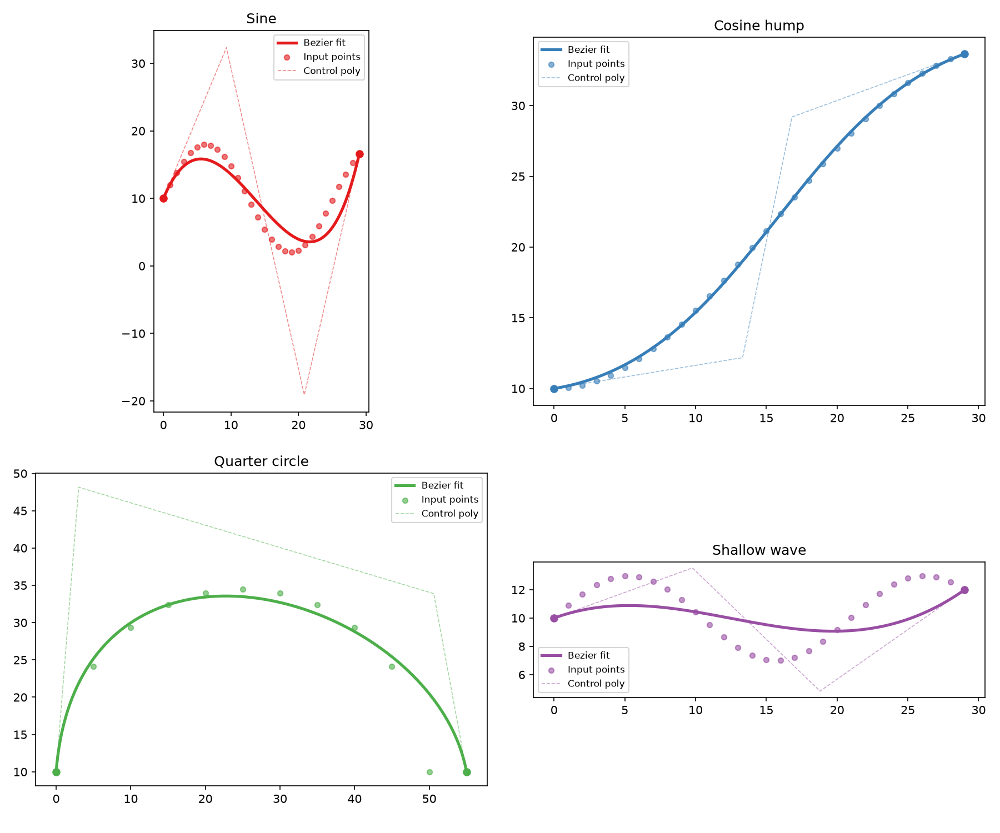
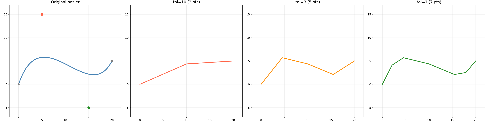
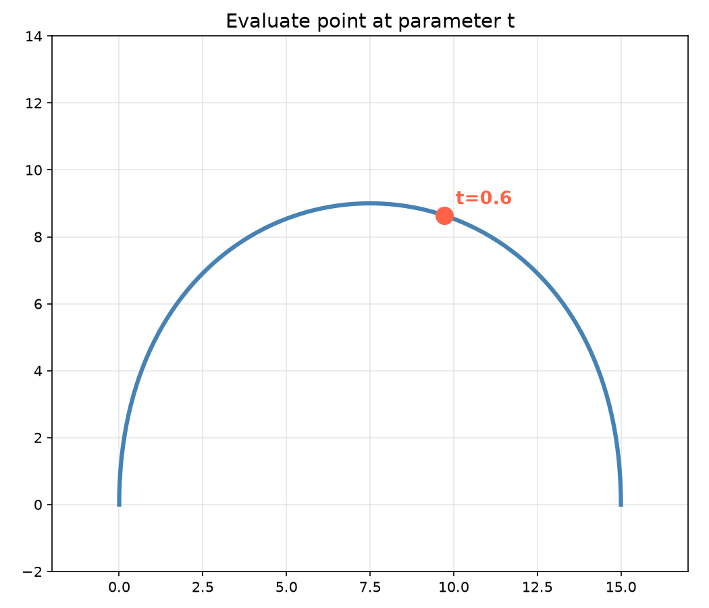
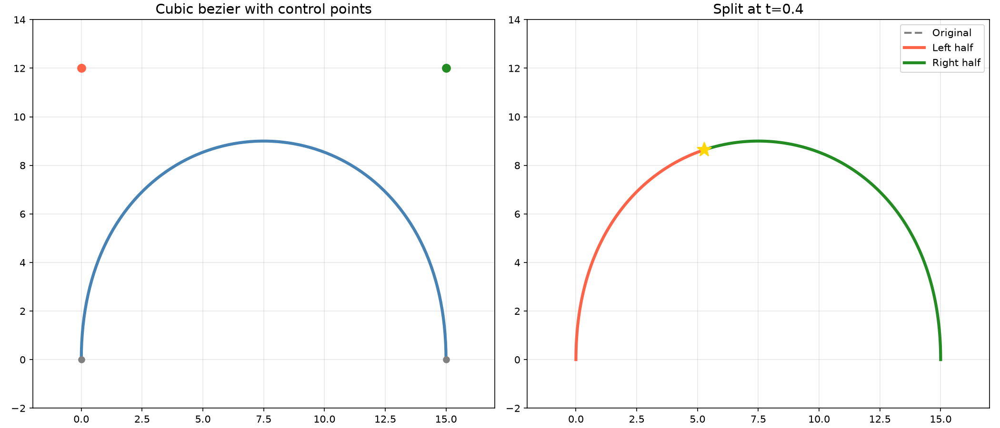

Cubic bezier curve queries and conversions.

Provides point evaluation at a parameter t, splitting into two halves, bounding rectangle
computation, flattening to line segments (both fixed-step and adaptive subdivision), rectangle
clipping, flatness testing, perpendicular distance measurement, and conversion from cubic to
quadratic form.

## Functions

### `clip_bezier_with_rect()`

```python
clip_bezier_with_rect(
    p0: types.Point,
    p1: types.Point,
    p2: types.Point,
    p3: types.Point,
    rect: types.Rect,
) -> list[tuple[types.Point, types.Point, types.Point, types.Point]]
```

Clip a cubic bezier with a rectangle.

| Parameter    | Type                                                              | Description                                      |
| ------------ | ----------------------------------------------------------------- | ------------------------------------------------ |
| `p0`         | `types.Point`                                                     | Start control point (x, y).                      |
| `p1`         | `types.Point`                                                     | First control point (x, y).                      |
| `p2`         | `types.Point`                                                     | Second control point (x, y).                     |
| `p3`         | `types.Point`                                                     | End control point (x, y).                        |
| `rect`       | `types.Rect`                                                      | Clipping rectangle (x_min, y_min, x_max, y_max). |
| _Returns_    | `list[tuple[types.Point, types.Point, types.Point, types.Point]]` | List of bezier segments inside the rectangle.    |
| _Complexity_ |                                                                   | O(n)                                             |

### `convert_cubic_bezier_to_quadratic()`

```python
convert_cubic_bezier_to_quadratic(
    p0: types.Point,
    p1: types.Point,
    p2: types.Point,
    p3: types.Point,
) -> tuple[types.Point, types.Point, types.Point]
```

Convert a cubic bezier to a quadratic bezier.

| Parameter    | Type                                           | Description                    |
| ------------ | ---------------------------------------------- | ------------------------------ |
| `p0`         | `types.Point`                                  | Start control point (x, y).    |
| `p1`         | `types.Point`                                  | First control point (x, y).    |
| `p2`         | `types.Point`                                  | Second control point (x, y).   |
| `p3`         | `types.Point`                                  | End control point (x, y).      |
| _Returns_    | `tuple[types.Point, types.Point, types.Point]` | Quadratic bezier (p0, p1, p2). |
| _Complexity_ |                                                | O(1)                           |

### `fit_cubic_bezier()`

```python
fit_cubic_bezier(
    points: list[tuple[float, float]],
) -> Optional[types.CubicBezier]
```

Fit a cubic Bezier curve to a sequence of points (least-squares).

| Parameter | Type                          | Description                                        |
| --------- | ----------------------------- | -------------------------------------------------- |
| `points`  | `list[tuple[float, float]]`   | List of (x, y) points.                             |
| _Returns_ | `Optional[types.CubicBezier]` | `(p0, c1, c2, p3)` or None if fewer than 2 points. |



_Cubic Bezier curves fitted to sample point sequences — sine, cosine hump, quarter-circle, and
shallow wave_

### `flatten_bezier()`

```python
flatten_bezier(
    p0: types.Point3D,
    p1: types.Point3D,
    p2: types.Point3D,
    p3: types.Point3D,
    tolerance: float,
    max_subdivisions: int,
    pts: list,
) -> None
```

Flatten a bezier curve into points.

| Parameter          | Type            | Description                      |
| ------------------ | --------------- | -------------------------------- |
| `p0`               | `types.Point3D` | Start control point (x, y, z).   |
| `p1`               | `types.Point3D` | First control point (x, y, z).   |
| `p2`               | `types.Point3D` | Second control point (x, y, z).  |
| `p3`               | `types.Point3D` | End control point (x, y, z).     |
| `tolerance`        | `float`         | Flattening tolerance.            |
| `max_subdivisions` | `int`           | Maximum recursion depth.         |
| `pts`              | `list`          | Output list to append points to. |
| _Returns_          | `None`          |                                  |
| _Complexity_       |                 | O(n)                             |



_Bezier flattening: adaptive subdivision at varied tolerances_

### `get_bezier_bounds()`

```python
get_bezier_bounds(
    p0: types.Point,
    p1: types.Point,
    p2: types.Point,
    p3: types.Point,
) -> types.Rect
```

Get the bounding rectangle of a cubic bezier.

| Parameter    | Type          | Description                                         |
| ------------ | ------------- | --------------------------------------------------- |
| `p0`         | `types.Point` | Start control point (x, y).                         |
| `p1`         | `types.Point` | First control point (x, y).                         |
| `p2`         | `types.Point` | Second control point (x, y).                        |
| `p3`         | `types.Point` | End control point (x, y).                           |
| _Returns_    | `types.Rect`  | Bounding rectangle as (x_min, y_min, x_max, y_max). |
| _Complexity_ |               | O(1)                                                |

### `get_bezier_flatness_sq()`

```python
get_bezier_flatness_sq(
    a: types.Point3D,
    b: types.Point3D,
    c: types.Point3D,
    d: types.Point3D,
) -> float
```

Compute the flatness squared of a cubic bezier.

| Parameter    | Type            | Description                     |
| ------------ | --------------- | ------------------------------- |
| `a`          | `types.Point3D` | Start point (x, y, z).          |
| `b`          | `types.Point3D` | First control point (x, y, z).  |
| `c`          | `types.Point3D` | Second control point (x, y, z). |
| `d`          | `types.Point3D` | End point (x, y, z).            |
| _Returns_    | `float`         | Flatness squared value.         |
| _Complexity_ |                 | O(1)                            |

### `get_bezier_length()`

```python
get_bezier_length(
    p0: types.Point,
    c1: types.Point,
    c2: types.Point,
    p1: types.Point,
) -> float
```

Compute the arc length of a cubic Bezier curve.

| Parameter    | Type          | Description                  |
| ------------ | ------------- | ---------------------------- |
| `p0`         | `types.Point` | Start point (x, y).          |
| `c1`         | `types.Point` | First control point (x, y).  |
| `c2`         | `types.Point` | Second control point (x, y). |
| `p1`         | `types.Point` | End point (x, y).            |
| _Returns_    | `float`       | Arc length.                  |
| _Complexity_ |               | O(n)                         |

### `get_bezier_point_at()`

```python
get_bezier_point_at(
    p0: types.Point,
    p1: types.Point,
    p2: types.Point,
    p3: types.Point,
    t: float,
) -> types.Point
```

Get a point on a cubic bezier at parameter t.

| Parameter    | Type          | Description                       |
| ------------ | ------------- | --------------------------------- |
| `p0`         | `types.Point` | Start control point (x, y).       |
| `p1`         | `types.Point` | First control point (x, y).       |
| `p2`         | `types.Point` | Second control point (x, y).      |
| `p3`         | `types.Point` | End control point (x, y).         |
| `t`          | `float`       | Parameter value (0..1).           |
| _Returns_    | `types.Point` | Point on the bezier curve (x, y). |
| _Complexity_ |               | O(1)                              |



_Bezier point evaluation at parameter t_

### `get_bezier_rect_intersections()`

```python
get_bezier_rect_intersections(
    p0: types.Point,
    p1: types.Point,
    p2: types.Point,
    p3: types.Point,
    rect: types.Rect,
) -> list[float]
```

Get intersection t-values of a bezier with a rectangle.

| Parameter    | Type          | Description                                   |
| ------------ | ------------- | --------------------------------------------- |
| `p0`         | `types.Point` | Start control point (x, y).                   |
| `p1`         | `types.Point` | First control point (x, y).                   |
| `p2`         | `types.Point` | Second control point (x, y).                  |
| `p3`         | `types.Point` | End control point (x, y).                     |
| `rect`       | `types.Rect`  | Rectangle (x_min, y_min, x_max, y_max).       |
| _Returns_    | `list[float]` | List of t-values where the bezier intersects. |
| _Complexity_ |               | O(n)                                          |

### `get_perpendicular_dist_sq()`

```python
get_perpendicular_dist_sq(
    pt: types.Point3D,
    origin: types.Point3D,
    vx: float,
    vy: float,
    vz: float = 0,
    norm_sq: float = 0,
) -> float
```

Compute the perpendicular distance squared.

| Parameter    | Type            | Description                          |
| ------------ | --------------- | ------------------------------------ |
| `pt`         | `types.Point3D` | Point to measure from.               |
| `origin`     | `types.Point3D` | Origin of the line.                  |
| `vx`         | `float`         | X component of line direction.       |
| `vy`         | `float`         | Y component of line direction.       |
| `vz`         | `float = 0`     | Z component of line direction.       |
| `norm_sq`    | `float = 0`     | Precomputed squared norm (optional). |
| _Returns_    | `float`         | Perpendicular distance squared.      |
| _Complexity_ |                 | O(1)                                 |

### `is_bezier_flat()`

```python
is_bezier_flat(
    p0: types.Point,
    p1: types.Point,
    p2: types.Point,
    p3: types.Point,
    tolerance_sq: float,
) -> bool
```

Test whether a cubic bezier curve is flat enough to approximate with a line segment.

Uses a chord-distance flatness test. For non-degenerate curves (p0 != p3) it checks whether both
control points lie within tolerance_sq of the chord line. For degenerate curves (p0 approx p3) it
checks the control point distances from the start point.

| Parameter      | Type          | Description                       |
| -------------- | ------------- | --------------------------------- |
| `p0`           | `types.Point` | Start control point (x, y).       |
| `p1`           | `types.Point` | First control point (x, y).       |
| `p2`           | `types.Point` | Second control point (x, y).      |
| `p3`           | `types.Point` | End control point (x, y).         |
| `tolerance_sq` | `float`       | Squared tolerance for flatness.   |
| _Returns_      | `bool`        | True if the curve is flat enough. |
| _Complexity_   |               | O(1)                              |

### `is_bezier_inside_polygons()`

```python
is_bezier_inside_polygons(
    p0: types.Point,
    p1: types.Point,
    p2: types.Point,
    p3: types.Point,
    polygons: Any,
) -> bool
```

Check if a bezier curve is inside a set of polygons.

| Parameter    | Type          | Description                                |
| ------------ | ------------- | ------------------------------------------ |
| `p0`         | `types.Point` | Start control point (x, y).                |
| `p1`         | `types.Point` | First control point (x, y).                |
| `p2`         | `types.Point` | Second control point (x, y).               |
| `p3`         | `types.Point` | End control point (x, y).                  |
| `polygons`   | `Any`         | List of polygons to check against.         |
| _Returns_    | `bool`        | True if the bezier is inside all polygons. |
| _Complexity_ |               | O(n \* m)                                  |

### `linearize_bezier()`

```python
linearize_bezier(
    p0: types.Point3D,
    p1: types.Point3D,
    p2: types.Point3D,
    p3: types.Point3D,
    num_steps: int,
) -> list[tuple[types.Point3D, types.Point3D]]
```

Linearize a bezier into line segments.

| Parameter    | Type                                        | Description                     |
| ------------ | ------------------------------------------- | ------------------------------- |
| `p0`         | `types.Point3D`                             | Start control point (x, y, z).  |
| `p1`         | `types.Point3D`                             | First control point (x, y, z).  |
| `p2`         | `types.Point3D`                             | Second control point (x, y, z). |
| `p3`         | `types.Point3D`                             | End control point (x, y, z).    |
| `num_steps`  | `int`                                       | Number of linearization steps.  |
| _Returns_    | `list[tuple[types.Point3D, types.Point3D]]` | List of (p1, p2) segment pairs. |
| _Complexity_ |                                             | O(n)                            |

### `linearize_bezier_adaptive()`

```python
linearize_bezier_adaptive(
    p0: types.Point,
    p1: types.Point,
    p2: types.Point,
    p3: types.Point,
    tolerance_sq: float,
    max_subdivisions: int = 20,
) -> types.Polygon
```

Adaptively linearize a bezier curve.

| Parameter          | Type            | Description                        |
| ------------------ | --------------- | ---------------------------------- |
| `p0`               | `types.Point`   | Start control point (x, y).        |
| `p1`               | `types.Point`   | First control point (x, y).        |
| `p2`               | `types.Point`   | Second control point (x, y).       |
| `p3`               | `types.Point`   | End control point (x, y).          |
| `tolerance_sq`     | `float`         | Squared tolerance for subdivision. |
| `max_subdivisions` | `int = 20`      | Maximum recursion depth.           |
| _Returns_          | `types.Polygon` | List of linearized points (x, y).  |
| _Complexity_       |                 | O(n)                               |

### `linearize_bezier_segment()`

```python
linearize_bezier_segment(
    p0: types.Point3D,
    p1: types.Point3D,
    p2: types.Point3D,
    p3: types.Point3D,
    tolerance: float = 0.1,
) -> list[types.Point3D]
```

Linearize a single bezier segment.

| Parameter    | Type                  | Description                          |
| ------------ | --------------------- | ------------------------------------ |
| `p0`         | `types.Point3D`       | Start control point (x, y, z).       |
| `p1`         | `types.Point3D`       | First control point (x, y, z).       |
| `p2`         | `types.Point3D`       | Second control point (x, y, z).      |
| `p3`         | `types.Point3D`       | End control point (x, y, z).         |
| `tolerance`  | `float = 0.1`         | Linearization tolerance.             |
| _Returns_    | `list[types.Point3D]` | List of linearized points (x, y, z). |
| _Complexity_ |                       | O(n)                                 |

### `nearest_tangent_circle_on_bezier()`

```python
nearest_tangent_circle_on_bezier(
    point: types.Point,
    bezier: types.CubicBezier,
    radius: float,
) -> Optional[tuple[types.Point, types.Point, float]]
```

Circle through _point_ tangent to a cubic Bezier.

| Parameter | Type                                               | Description                           |
| --------- | -------------------------------------------------- | ------------------------------------- |
| `point`   | `types.Point`                                      | Point the circle must pass through.   |
| `bezier`  | `types.CubicBezier`                                | `(p0, c1, c2, p3)` control points.    |
| `radius`  | `float`                                            | Circle radius.                        |
| _Returns_ | `Optional[tuple[types.Point, types.Point, float]]` | `(centre, tangent_point, t)` or None. |

### `split_bezier()`

```python
split_bezier(
    p0: types.Point,
    p1: types.Point,
    p2: types.Point,
    p3: types.Point,
    t: float,
) -> tuple[tuple[types.Point, types.Point, types.Point, types.Point], tuple[types.Point, types.Point, types.Point, types.Point]]
```

Split a cubic bezier at parameter t.

| Parameter    | Type                                                                                                                          | Description                      |
| ------------ | ----------------------------------------------------------------------------------------------------------------------------- | -------------------------------- |
| `p0`         | `types.Point`                                                                                                                 | Start control point (x, y).      |
| `p1`         | `types.Point`                                                                                                                 | First control point (x, y).      |
| `p2`         | `types.Point`                                                                                                                 | Second control point (x, y).     |
| `p3`         | `types.Point`                                                                                                                 | End control point (x, y).        |
| `t`          | `float`                                                                                                                       | Split parameter (0..1).          |
| _Returns_    | `tuple[tuple[types.Point, types.Point, types.Point, types.Point], tuple[types.Point, types.Point, types.Point, types.Point]]` | Two bezier curves (left, right). |
| _Complexity_ |                                                                                                                               | O(1)                             |



_Bezier split at parameter t_
