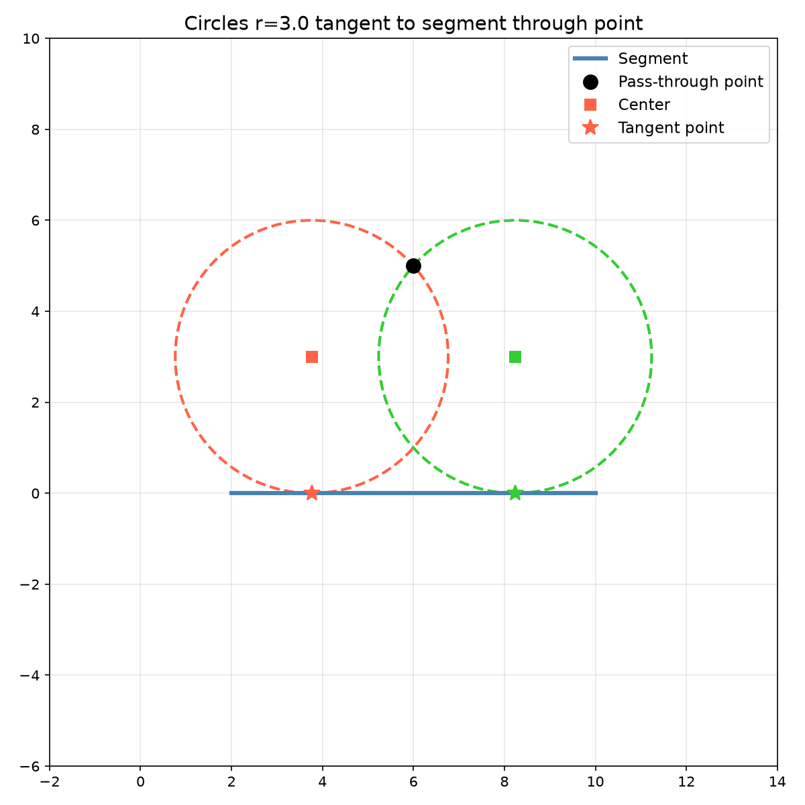
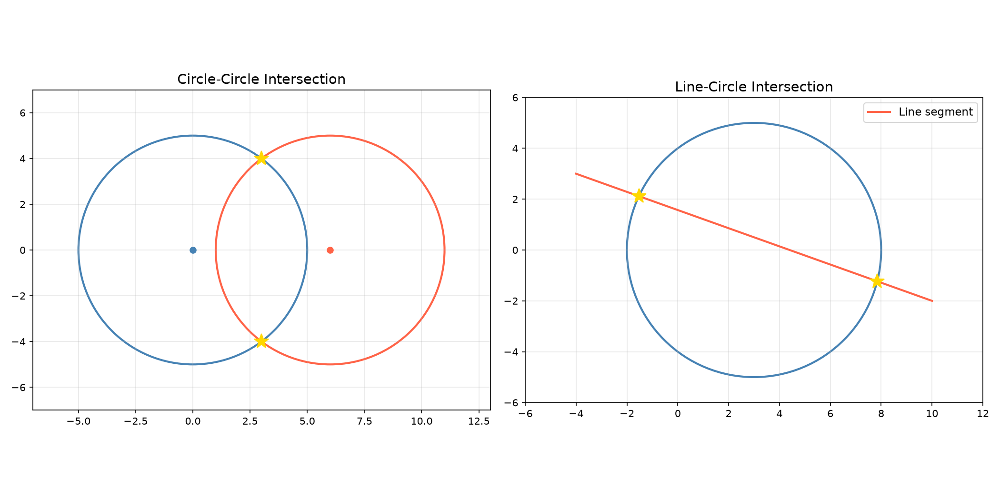
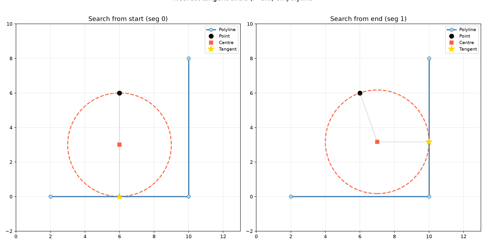

Circle geometry queries.

Provides circle-circle and circle-rectangle intersection detection, line-segment-vs-circle
intersection points, circle-rectangle full-containment checks, line-segment-vs-circle intersection,
and point projection onto a circle's circumference.

## Functions

### `does_circle_intersect_rect()`

```python
does_circle_intersect_rect(
    center: types.Point,
    radius: float,
    rect: types.Rect,
) -> bool
```

Check if a circle intersects a rectangle.

| Parameter    | Type          | Description                                  |
| ------------ | ------------- | -------------------------------------------- |
| `center`     | `types.Point` | Circle center (x, y).                        |
| `radius`     | `float`       | Circle radius.                               |
| `rect`       | `types.Rect`  | Rectangle (x_min, y_min, x_max, y_max).      |
| _Returns_    | `bool`        | True if the circle intersects the rectangle. |
| _Complexity_ |               | O(1) time, O(1) space                        |

### `find_tangent_circle_centers()`

```python
find_tangent_circle_centers(
    pass_through: types.Point,
    seg_a: types.Point,
    seg_b: types.Point,
    radius: float,
) -> list[tuple[types.Point, types.Point]]
```

Find circle centres that pass through a point and are tangent to a segment.

| Parameter      | Type                                    | Description                                |
| -------------- | --------------------------------------- | ------------------------------------------ |
| `pass_through` | `types.Point`                           | Point the circle must pass through (x, y). |
| `seg_a`        | `types.Point`                           | Start of the tangent segment (x, y).       |
| `seg_b`        | `types.Point`                           | End of the tangent segment (x, y).         |
| `radius`       | `float`                                 | Circle radius.                             |
| _Returns_      | `list[tuple[types.Point, types.Point]]` | List of (centre, tangent_point) pairs.     |
| _Complexity_   |                                         | O(1) time, O(1) space                      |



_Find circles tangent to a segment through a given point_

### `get_circle_circle_intersections()`

```python
get_circle_circle_intersections(
    c1: types.Point,
    r1: float,
    c2: types.Point,
    r2: float,
) -> types.Polygon
```

Get intersection points of two circles.

| Parameter    | Type            | Description                         |
| ------------ | --------------- | ----------------------------------- |
| `c1`         | `types.Point`   | Center of first circle (x, y).      |
| `r1`         | `float`         | Radius of first circle.             |
| `c2`         | `types.Point`   | Center of second circle (x, y).     |
| `r2`         | `float`         | Radius of second circle.            |
| _Returns_    | `types.Polygon` | List of intersection points (x, y). |
| _Complexity_ |                 | O(1) time, O(1) space               |



_Circle-circle and line-circle intersection points_

### `get_line_circle_intersections()`

```python
get_line_circle_intersections(
    p1: types.Point,
    p2: types.Point,
    center: types.Point,
    radius: float,
) -> types.Polygon
```

Get intersection points of a line segment with a circle.

| Parameter    | Type            | Description                             |
| ------------ | --------------- | --------------------------------------- |
| `p1`         | `types.Point`   | Start point of the line segment (x, y). |
| `p2`         | `types.Point`   | End point of the line segment (x, y).   |
| `center`     | `types.Point`   | Circle center (x, y).                   |
| `radius`     | `float`         | Circle radius.                          |
| _Returns_    | `types.Polygon` | List of intersection points (x, y).     |
| _Complexity_ |                 | O(1) time, O(1) space                   |

### `is_circle_inside_rect()`

```python
is_circle_inside_rect(
    center: types.Point,
    radius: float,
    rect: types.Rect,
) -> bool
```

Check if a circle is inside a rectangle.

| Parameter    | Type          | Description                                       |
| ------------ | ------------- | ------------------------------------------------- |
| `center`     | `types.Point` | Circle center (x, y).                             |
| `radius`     | `float`       | Circle radius.                                    |
| `rect`       | `types.Rect`  | Rectangle (x_min, y_min, x_max, y_max).           |
| _Returns_    | `bool`        | True if the circle is fully inside the rectangle. |
| _Complexity_ |               | O(1) time, O(1) space                             |

### `line_segment_intersects_circle()`

```python
line_segment_intersects_circle(
    p1: types.Point,
    p2: types.Point,
    circle_center: types.Point,
    circle_radius: float,
) -> bool
```

Check if a line segment intersects a circle.

| Parameter       | Type          | Description                                     |
| --------------- | ------------- | ----------------------------------------------- |
| `p1`            | `types.Point` | Start point of the line segment (x, y).         |
| `p2`            | `types.Point` | End point of the line segment (x, y).           |
| `circle_center` | `types.Point` | Circle center (x, y).                           |
| `circle_radius` | `float`       | Circle radius.                                  |
| _Returns_       | `bool`        | True if the line segment intersects the circle. |
| _Complexity_    |               | O(1) time, O(1) space                           |

### `nearest_tangent_circle_on_polyline()`

```python
nearest_tangent_circle_on_polyline(
    point: types.Point,
    polyline: types.Polygon,
    radius: float,
    from_end: bool,
    containment: types.Polygon,
) -> Optional[tuple[types.Point, types.Point, int]]
```

Find nearest circle through a point tangent to a polyline.

Searches segments of _polyline_ for a circle of _radius_ that passes through _point_, is tangent to
a segment, and has its centre inside _containment_. Returns the one whose tangent point is closest
to the searched end.

| Parameter     | Type                                             | Description                                        |
| ------------- | ------------------------------------------------ | -------------------------------------------------- |
| `point`       | `types.Point`                                    | Point the circle must pass through (x, y).         |
| `polyline`    | `types.Polygon`                                  | Polyline segments to search.                       |
| `radius`      | `float`                                          | Circle radius.                                     |
| `from_end`    | `bool`                                           | True to search from last vertex; False from first. |
| `containment` | `types.Polygon`                                  | Centre must be inside this polygon.                |
| _Returns_     | `Optional[tuple[types.Point, types.Point, int]]` | (centre, tangent_point, segment_index) or None.    |



_Nearest tangent circle on a polyline_

### `project_point_onto_circle()`

```python
project_point_onto_circle(
    point: types.Point,
    center: types.Point,
    radius: float,
) -> Optional[types.Point]
```

Project a point onto a circle.

| Parameter    | Type                    | Description                           |
| ------------ | ----------------------- | ------------------------------------- |
| `point`      | `types.Point`           | Point to project (x, y).              |
| `center`     | `types.Point`           | Circle center (x, y).                 |
| `radius`     | `float`                 | Circle radius.                        |
| _Returns_    | `Optional[types.Point]` | Projected point on the circle (x, y). |
| _Complexity_ |                         | O(1) time, O(1) space                 |
