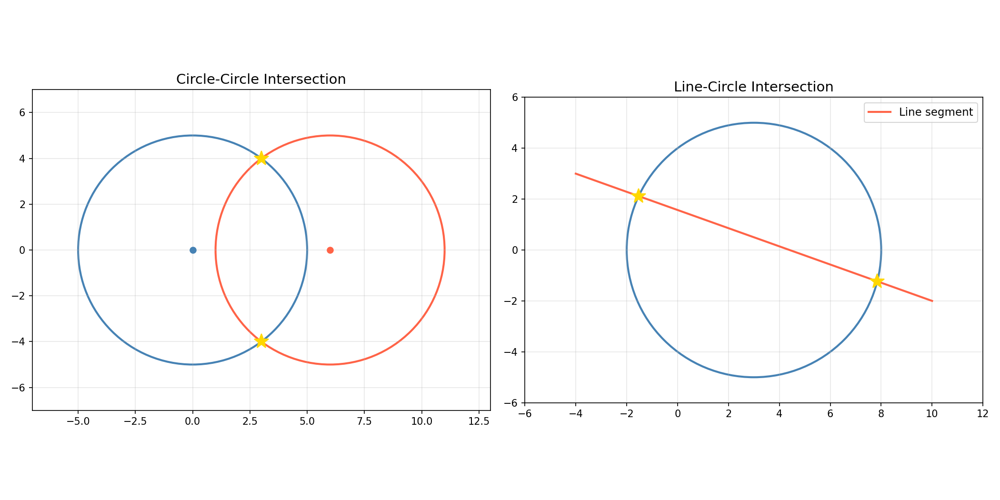

Circle geometry queries.

Provides circle-circle and circle-rectangle intersection detection, line-segment-vs-circle
intersection points, circle-rectangle full-containment checks, line-segment-vs-circle intersection,
and point projection onto a circle's circumference.

## Functions

### `does_circle_intersect_rect()`

`does_circle_intersect_rect(center: types.Point, radius: float, rect: types.Rect) -> bool`

Check if a circle intersects a rectangle.

**Returns:** True if the circle intersects the rectangle.

| Parameter    | Type          | Description                             |
| ------------ | ------------- | --------------------------------------- |
| `center`     | `types.Point` | Circle center (x, y).                   |
| `radius`     | `float`       | Circle radius.                          |
| `rect`       | `types.Rect`  | Rectangle (x_min, y_min, x_max, y_max). |
| _Returns_    | `bool`        |                                         |
| _Complexity_ |               | O(1) time, O(1) space                   |

### `get_circle_circle_intersections()`

`get_circle_circle_intersections(c1: types.Point, r1: float, c2: types.Point, r2: float) -> types.Polygon`

Get intersection points of two circles.

**Returns:** List of intersection points (x, y).

| Parameter    | Type            | Description                     |
| ------------ | --------------- | ------------------------------- |
| `c1`         | `types.Point`   | Center of first circle (x, y).  |
| `r1`         | `float`         | Radius of first circle.         |
| `c2`         | `types.Point`   | Center of second circle (x, y). |
| `r2`         | `float`         | Radius of second circle.        |
| _Returns_    | `types.Polygon` |                                 |
| _Complexity_ |                 | O(1) time, O(1) space           |

_Circle-circle and line-circle intersection points_

### `get_line_circle_intersections()`

`get_line_circle_intersections(p1: types.Point, p2: types.Point, center: types.Point, radius: float) -> types.Polygon`

Get intersection points of a line segment with a circle.

**Returns:** List of intersection points (x, y).

| Parameter    | Type            | Description                             |
| ------------ | --------------- | --------------------------------------- |
| `p1`         | `types.Point`   | Start point of the line segment (x, y). |
| `p2`         | `types.Point`   | End point of the line segment (x, y).   |
| `center`     | `types.Point`   | Circle center (x, y).                   |
| `radius`     | `float`         | Circle radius.                          |
| _Returns_    | `types.Polygon` |                                         |
| _Complexity_ |                 | O(1) time, O(1) space                   |

### `is_circle_inside_rect()`

`is_circle_inside_rect(center: types.Point, radius: float, rect: types.Rect) -> bool`

Check if a circle is inside a rectangle.

**Returns:** True if the circle is fully inside the rectangle.

| Parameter    | Type          | Description                             |
| ------------ | ------------- | --------------------------------------- |
| `center`     | `types.Point` | Circle center (x, y).                   |
| `radius`     | `float`       | Circle radius.                          |
| `rect`       | `types.Rect`  | Rectangle (x_min, y_min, x_max, y_max). |
| _Returns_    | `bool`        |                                         |
| _Complexity_ |               | O(1) time, O(1) space                   |

### `line_segment_intersects_circle()`

`line_segment_intersects_circle(p1: types.Point, p2: types.Point, circle_center: types.Point, circle_radius: float) -> bool`

Check if a line segment intersects a circle.

**Returns:** True if the line segment intersects the circle.

| Parameter       | Type          | Description                             |
| --------------- | ------------- | --------------------------------------- |
| `p1`            | `types.Point` | Start point of the line segment (x, y). |
| `p2`            | `types.Point` | End point of the line segment (x, y).   |
| `circle_center` | `types.Point` | Circle center (x, y).                   |
| `circle_radius` | `float`       | Circle radius.                          |
| _Returns_       | `bool`        |                                         |
| _Complexity_    |               | O(1) time, O(1) space                   |

### `project_point_onto_circle()`

`project_point_onto_circle(point: types.Point, center: types.Point, radius: float) -> Optional[types.Point]`

Project a point onto a circle.

**Returns:** Projected point on the circle (x, y).

| Parameter    | Type                    | Description              |
| ------------ | ----------------------- | ------------------------ |
| `point`      | `types.Point`           | Point to project (x, y). |
| `center`     | `types.Point`           | Circle center (x, y).    |
| `radius`     | `float`                 | Circle radius.           |
| _Returns_    | `Optional[types.Point]` |                          |
| _Complexity_ |                         | O(1) time, O(1) space    |
